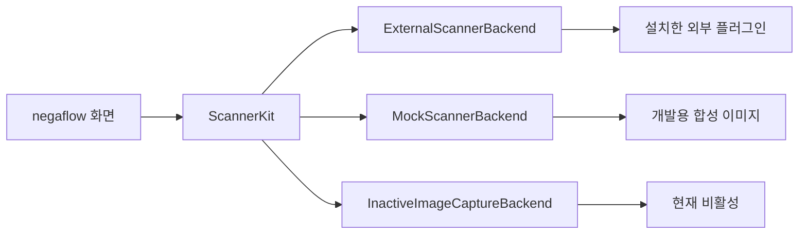
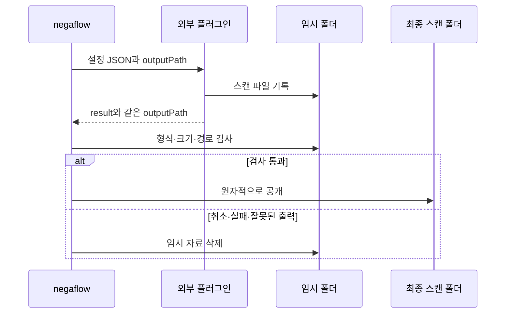

# 스캐너 플러그인 구조

[문서 홈](../README.md)

negaflow의 기본 입력은 이미지 가져오기입니다.
실제 스캐너는 외부 플러그인이 있을 때만 연결합니다.

> [!IMPORTANT]
> 앱은 스캐너 모델명으로 기능을 추측하지 않습니다. 플러그인이 보고한 기능만 화면과 요청에
> 사용하며, 데모 장치는 사용자가 직접 데모 모드를 골랐을 때만 나타납니다.

## 구성

| 구성 | 역할 |
|---|---|
| 이미지 가져오기 | RAW, DNG, TIFF, PNG, JPEG를 현상 경로로 보냅니다. |
| 외부 플러그인 | 별도 프로세스로 실제 장치를 다루고 JSON으로 통신합니다. |
| 데모 스캐너 | 개발용 `negaflow Scanner`와 `negaflow Flatbed Scanner`를 제공합니다. 직접 데모를 골라야 씁니다. |
| ImageCaptureCore 연결 | macOS Image Capture 장치를 위한 비활성 호환 코드입니다. |

이 저장소에는 SANE 구현이 없습니다. SANE 코드는 별도 GPL 프로젝트에 있습니다.

- <https://github.com/habinsong/negaflow-scanner-sane>

## 연결 구조

화면은 `ScannerBackend`만 봅니다.
플러그인의 장치 ID는 앱에서 `plugin:<pluginId>:<deviceId>`로 표시합니다.

플러그인을 실행할 때는 `plugin:<pluginId>:`를 떼고 플러그인 자체의 장치 ID만 보냅니다.

## 플러그인 찾기

기본 폴더는 `~/Library/Application Support/negaflow/Plugins/<id>/manifest.json`입니다.

테스트와 로컬 개발에서는 `NEGAFLOW_PLUGINS_DIR`로 다른 폴더를 지정할 수 있습니다.

| 필드 | 규칙 |
|---|---|
| `schemaVersion` | 현재 정확히 `1` |
| `protocolVersion` | 생략하면 `1`, 지원값은 `1`과 `2` |
| `id` | 플러그인 고유 ID |
| `name` | 화면에 표시할 이름 |
| `kind` | 플러그인 종류 |
| `license` | 배포 라이선스 |
| `homepage` | 프로젝트 주소 |
| `executable` | 실행 파일 경로 |

`id`는 1~64자의 ASCII 값입니다.
첫 글자는 영문자나 숫자, 나머지는 영문자, 숫자, `.`, `_`, `-`만 쓸 수 있습니다.
`:`는 장치 ID 구분자라 허용하지 않습니다.

목록과 실행 파일이 모두 맞아야 플러그인을 엽니다.
이전·미래 스키마나 모르는 프로토콜을 추측해 읽지 않습니다.

### 파일 안전 검사

> [!WARNING]
> 목록이나 실행 파일의 바이트가 바뀌면 이전 승인을 폐기합니다. 실행 직전에도 소유권, 권한,
> 심볼릭 링크 여부와 SHA-256을 다시 확인합니다.

- 플러그인 폴더, 목록, 실행 파일은 현재 사용자 소유여야 합니다.
- 그룹이나 다른 사용자가 쓸 수 있으면 거부합니다.
- 심볼릭 링크는 거부합니다.
- 목록과 실행 파일의 SHA-256을 기록합니다.
- 처음 쓸 때 사용자가 승인해야 합니다.
- 파일 바이트가 바뀌면 승인을 무효로 합니다.
- 실행 직전에 ID를 다시 계산합니다.

## 명령

플러그인은 별도 프로세스로 실행합니다.

| 명령 | 결과 |
|---|---|
| `detect` | JSON 장치 목록 |
| `capabilities <deviceId>` | JSON 기능 목록. `detect`가 보고한 장치 ID·제조사·모델 JSON을 stdin으로 받을 수 있음 |
| `scan` | stdin으로 설정 JSON, stdout으로 진행 NDJSON과 마지막 결과 |

## 스캔 프로토콜

### 버전 1

기존 호환 규격입니다. 요청과 NDJSON에 `protocolVersion`, `requestID`, `sequence`가 없습니다.
실제 적용 설정을 보고하지 못하므로 결과는 `.unknownLegacy(protocolVersion: 1)`로 기록합니다.
요청값을 검증된 적용값처럼 복사하지 않습니다.

### 버전 2

목록에 `"protocolVersion": 2`가 있을 때만 씁니다.

요청에 들어가는 값:

- `protocolVersion: 2`
- 앱이 만든 UUID `requestID`

`capabilities` 응답은 선택 필드 `capabilityToken`을 돌려줄 수 있습니다.
앱은 이 값을 해석하지 않고 같은 장치의 다음 v2 `scan` 요청에만 그대로 전달합니다.
v1 요청에는 넣지 않으며, 다른 장치의 토큰을 섞지 않습니다.
플러그인은 토큰의 형식과 유효성을 직접 검사해야 합니다.

앱은 같은 backend에 속한 다른 모델로 잘못 재연결되는 일을 막을 수 있도록, 직전 `detect`가 보고한
`deviceID`, `vendor`, `model`을 `capabilities`의 선택적 stdin JSON으로 다시 전달합니다.
기존 플러그인은 이 입력을 무시할 수 있으며, 장치 주소가 바뀔 수 있는 플러그인은 capability
스냅샷에 이 동일성을 묶어 다음 `scan`에서도 검증해야 합니다.

각 NDJSON 이벤트는 같은 버전과 요청 ID를 반복하고, 이전보다 큰 0 이상의 `sequence`를 가져야
합니다.
이벤트는 `progress`, `result`, `error`만 허용합니다.

`result`와 `error`는 마지막 이벤트입니다. 뒤에 이벤트가 오면 실패합니다.
오류로 끝나지 않은 스캔에는 `result`가 정확히 하나 있어야 합니다.

다음 문제는 모두 닫힌 상태로 실패합니다.

- 읽을 수 없는 이벤트
- 빠지거나 다른 버전·요청 ID
- 중복되거나 거꾸로 된 순서
- 모르는 이벤트
- 결과 중복
- 마지막 이벤트 뒤의 추가 출력
- 잘못된 UTF-8

v2 규격 위반은 일반 시간 제한을 기다리지 않고 플러그인을 바로 끝냅니다.

### 실제 적용 설정

v2 `result`에는 `appliedOptions`가 꼭 있어야 합니다.

- `deviceID`, `resolutionDPI`, `bitDepth`, `colorMode`, `filmType`
- `scanArea`: `originXMM`, `originYMM`, `widthMM`, `heightMM`
- `infrared`, `multiExposure`
- `hardwareExposureTime`, `brightnessAdjustment`, `contrastAdjustment`
- `outputRawTIFF`

마지막 세 조절값은 `null`이어도 키가 있어야 합니다.

`resolutionDPI: 0`은 미리보기라는 뜻입니다. 미리보기가 0이 아니거나 본 스캔이 0이면 거부합니다.
모르는 값, 다른 장치, 결과 상단과 `appliedOptions`가 다른 해상도·비트 심도·IR 상태도 거부합니다.

검사를 통과하면 플러그인 ID 대신 앱의 스캐너 ID와 요청 ID를 기록하고, 최종 출력 경로를 남깁니다.
이때만 `.verified(options)`로 표시합니다.

`ScanResult.resolution`과 `bitDepth`는 v1에서 요청값을 임시 동작값으로 쓸 수 있습니다.
출처를 나타내는 `reportedResolution`, `reportedBitDepth`는 결과가 직접 보고한 올바른 값만
넣습니다.

## 평판 스캔 영역

다음 기능을 플러그인이 함께 보고해야 위치를 고르는 평판 스캔을 켭니다.

- 미리보기
- `supportsPositionedScanArea`
- mm 단위 `scanOriginXRange`, `scanOriginYRange`
- mm 단위 `scanWidthRange`, `scanHeightRange`

앱은 고른 영역을 플러그인의 간격에 맞춰 바깥쪽으로 넓히고 영역마다 본 스캔 작업을 하나씩
만듭니다.
모델명으로 이 기능을 추측하지 않습니다.
선택 필드가 없는 이전 플러그인은 고정 프레임 흐름을 유지합니다.

## 프로세스 한계와 취소

- stdout 누적 상한: 4 MiB
- stderr 누적 상한: 1 MiB

상한을 넘으면 프로세스를 끝내고 실패합니다. 정리할 때는 이미 도착한 바이트만 읽습니다.
자식 프로세스가 파이프를 물려받았더라도 EOF를 기다리지 않습니다.

`cancelScan()`은 플러그인이 끝나고 파이프 처리기가 닫히며 다음 작업 자리가 비워진 뒤에야
돌아옵니다.

## 스캔 파일 공개

플러그인은 앱이 준 정확한 `outputPath`에 원본 이미지를 쓰고 결과에도 같은 경로를 돌려줘야
합니다.
이 경로는 최종 폴더와 같은 디스크의 임시 위치입니다.

앱은 다음을 확인합니다.

- 비어 있지 않은 일반 파일
- ImageIO로 읽을 수 있는 이미지
- 예상한 형식과 픽셀 크기
- 요청과 결과의 경로가 같음

모두 맞을 때만 최종 위치로 옮깁니다.
취소, 시간 초과, 잘못된 출력, 플러그인 실패 때는 임시 폴더를 지우고 일부 스캔을 공개하지
않습니다.

v2 IR 파일도 앱이 준 임시 폴더 안에 있어야 합니다. 파일 종류, 읽기, 픽셀 크기를 확인합니다.
v1은 이미 배포된 플러그인 호환을 위해 외부 IR 경로를 받을 수 있습니다.

## SANE 경계

SANE 구현, 의존성, 설정, 장치별 처리, 테스트, 배포 문서는 모두 별도
[`negaflow-scanner-sane`](https://github.com/habinsong/negaflow-scanner-sane) 저장소에 둡니다.

해당 프로젝트는 Homebrew 기본 SANE을 쓰는 macOS 14 이상 일반판과, 공식 SANE 1.4.0에
upstream `coolscan2`/`coolscan3` 할당 수정만 적용해 빌드하는 macOS 26 이상 Coolscan판을
따로 배포합니다. 일반판은 Coolscan을 강제로 차단하지 않지만 해당 수정은 포함하지 않습니다.

이 저장소는 장치와 무관한 외부 프로세스 규격만 문서화하고 검사합니다.
이미지 파일만 가져오는 사용자는 스캐너 플러그인이 없어도 됩니다.

negaflow 본체는 SANE 구현을 링크하거나 앱 배포물에 넣지 않습니다.
플러그인은 별도 저장소, 실행파일, 소스 배포물과 GPL 라이선스를 가집니다.
이 문서는 구조를 기록하며 파생 저작물 여부를 단정하지 않습니다.
실제 배포 전에는 두 산출물의 포함 파일과 통신 계약을 다시 검사합니다.

## 확인

본체 테스트는 가짜 외부 플러그인을 실제 프로세스로 실행해 다음을 확인합니다.

- 플러그인 찾기
- 장치 찾기
- 기능 연결
- 진행 이벤트
- 최종 결과
- 취소와 실패 정리

SANE 구현은 플러그인 저장소의 SwiftPM 테스트와 Release 빌드에서 따로 확인합니다.
