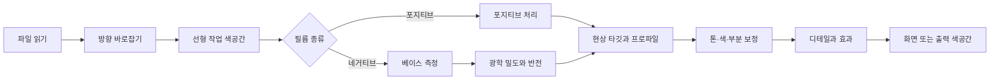

# 크로마 엔진

[문서 홈](../README.md)

크로마 엔진은 필름을 반전하고 현상합니다. 코드는 `Chromabase` 모듈에 있습니다.
앱과 CLI가 같은 모듈을 쓰므로 입력이 같으면 같은 처리 순서를 탑니다.

| 한눈에 | 내용 |
|---|---|
| 기본 현상 | `MAIN`, 수동 보정 |
| 필름 베이스 | 자동 측정, 스포이드, RGB 직접 입력 |
| 내부 색 처리 | 32-bit 부동소수점 선형 색공간 |
| 자동 기능 | 사용자가 실행했을 때만 적용 |
| 출력 색공간 | sRGB, Display P3, Adobe RGB, 사용자 RGB ICC |

> [!IMPORTANT]
> 자동 톤, 자동 화이트 밸런스, 자동 레벨, 자동 색상은 기본 현상에 몰래 들어가지 않습니다.

## 먼저 지키는 것

1. 필름 베이스를 측정할 수 있으면 이름으로 고른 기본값보다 측정값을 먼저 씁니다.
2. 필름 물성, 스캔 광원, 스캐너 스타일, 장면 자동 보정을 서로 섞지 않습니다.
3. 자동 톤과 자동 화이트 밸런스 같은 기능은 사용자가 실행했을 때만 켭니다.
4. 같은 원본, 편집 값, 프로파일 묶음에는 같은 처리 순서를 씁니다.
5. 합성 테스트와 실제 장치 검증을 같은 증거로 말하지 않습니다.

## 처리 순서



작업 이미지는 32-bit 부동소수점 선형 색공간에서 처리합니다.
감마가 필요한 연산만 정해진 단계에서 변환합니다.
화면이나 파일 형식에 맞춘 인코딩은 마지막에 합니다.

Apple의 Core Image 설명:

- [CIImage](https://developer.apple.com/documentation/coreimage/ciimage)
- [CIContext](https://developer.apple.com/documentation/coreimage/cicontext)
- [workingColorSpace](https://developer.apple.com/documentation/coreimage/cicontext/workingcolorspace)
- [Core Image 성능 지침](https://developer.apple.com/library/archive/documentation/GraphicsImaging/Conceptual/CoreImaging/ci_performance/ci_performance.html)

`CIContext`는 렌더마다 새로 만들지 않습니다. 표시, 분석, 내보내기 용도로 나눠 재사용합니다.
미리보기는 필요한 크기와 최신 편집 버전만 계산합니다. 내보내기는 원본 크기에서 다시 렌더합니다.

## 필름 베이스

### 왜 재는가

네거티브의 미노광 부분은 필름, 현상 공정, 스캔 광원이 합쳐진 기준점입니다.
컬러 네거티브의 오렌지 마스크도 여기에 들어 있습니다.
베이스가 틀리면 이후의 밀도와 채널 관계가 모두 틀어집니다.

Kodak Portra 400 자료도 최소 밀도, 특성 곡선, 염료의 분광 밀도를 따로 기록합니다.

- [Kodak Professional Portra 400 technical data](https://www.kodakprofessional.com/sites/default/files/wysiwyg/pro/resources/e4050_portra_400.pdf)

### 자동 측정

`FilmBaseEstimator`는 가장 밝은 픽셀 몇 개만 평균하지 않습니다.

- 필름 픽셀은 미노광 베이스보다 밝을 수 없습니다.
- 훨씬 밝은 곳은 백라이트, 퍼포레이션, 필름 밖일 수 있습니다.
- 실제 베이스는 프레임 가장자리에 넓게 이어지는 경향이 있습니다.
- 한 장에 필름 스트립이 여러 개면 떨어진 영역도 함께 볼 수 있습니다.
- 홀더와 필름이 섞인 경계는 내부보다 덜 믿습니다.

축소한 분석 이미지에서 밝기 분포를 찾고, 이어진 영역을 묶은 뒤 필름 밖 후보를 뺍니다.
조건을 통과한 스트립이 여러 개면 함께 계산합니다. 결과에는 선택한 방법과 신뢰도도 남깁니다.

### 선택 방법

| 모드 | 동작 |
|---|---|
| `Manual` | 입력한 RGB를 Dmin으로 사용합니다. 스포이드도 성공하면 이 모드가 됩니다. |
| `Film` | 측정값을 Dmin으로 쓰고 선택한 필름은 주로 `dmaxNorm`을 제공합니다. 측정 실패 때만 필름과 광원 기본값을 씁니다. |
| `Auto` | 공간 분석을 쓰고, 실패하면 가장자리 기준으로 내려갑니다. |

수동 값이 없거나 필름 ID가 잘못되면 다음 안전한 방법으로 넘어갑니다.
장면에서 가장 밝은 물체를 곧바로 필름 베이스로 쓰지는 않습니다.

## 광학 밀도와 반전

선형 투과율 `T`와 채널별 베이스 `Dmin`으로 밀도를 구합니다.

```math
D = \log_{10}\left(\frac{D_{\min}}{T}\right)
```

`D = 0`이면 입력이 미노광 베이스와 같습니다. 퍼포레이션이나 백라이트는 음수가 될 수 있습니다.
이 값도 유한하게 처리하며 바로 잘라내지 않습니다.

### 필름 종류 자료

현재 표에는 컬러 네거티브, 흑백, 영화용 네거티브 등 27개 필름 이름이 있습니다.

이 자료의 쓰임:

- 베이스를 못 잴 때의 Dmin 기본값
- 채널별 밀도 범위
- 대비가 낮아 자동 측정이 흔들릴 때의 안전 범위

일부 값은 공개 자료의 곡선을 읽어 근사했고 일부는 보수적으로 잡았습니다.
27개 이름이 27개의 검증된 색 프로파일을 뜻하지는 않습니다.
베이스를 쟀다면 실제 측정값이 우선입니다.

### 고정 인화 응답

`MAIN`은 베이스를 뺀 밀도를 단조 증가하는 곡선으로 바꿉니다.
계수는 숨겨 둔 프리셋이 아니라 네 기준점에서 계산합니다.

- 베이스의 검정점
- 18% 중간 회색
- 측정 밀도 범위의 흰색
- 반사광 여유

현재 곡선은 stretched exponential 형태이며 전 구간에 역함수가 있습니다.
합성 네거티브의 왕복 테스트도 이 역함수를 씁니다.
식과 수치는 [고정 인화 응답](../reference/PRINT_RESPONSE.md)에 있습니다.

기본 경로와 자동 기능의 경계:

- 고정 곡선은 장면 히스토그램으로 노출을 움직이지 않습니다.
- `applySceneRanged`는 채널별 사용 밀도 범위를 재지만 중간 노출을 옮기지 않습니다.
- 채도가 낮은 장면에만 제한된 `CIVibrance`가 들어갑니다.
- Auto Levels, Auto Color, Auto Tone, Auto White Balance는 따로 실행하는 기능입니다.
- 특정 인화지나 미니랩을 정확히 복제한다고 말하지 않습니다.

## 프로파일은 세 종류입니다

| 종류 | 답하는 질문 | 값 |
|---|---|---|
| Film stock | 필름의 베이스와 밀도 범위는 어떤가 | Dmin/Dmax, 필름 종류 |
| Light source | 스캔 광원이 각 채널에 어떤 영향을 줬는가 | 채널 gain, 베이스 기반 보정 |
| Scanner target | 결과의 톤과 색 스타일은 어떤가 | 직접 촬영한 스캔의 상대 통계 |

이 셋을 나눠야 필름 이름 하나가 유제 물성, 광원 색, 랩의 결과 스타일을 모두 뜻하는 실수를 막을
수 있습니다.
실제 베이스가 있으면 광원 기본값보다 측정값을 씁니다.
스캐너 통계도 장면의 절대 색행렬로 바로 쓰지 않습니다.

자세한 데이터는 [필름 프로파일](FILM_PROFILES.md)에 있습니다.

## 현상 타깃

### `MAIN`

일반 현상의 기본값입니다.
선택하지 않은 스캐너 스타일, 자동 레벨, 자동 색, 자동 톤, 자동 화이트 밸런스를 넣지 않습니다.
베이스·밀도 범위 측정과 제한된 저채도 장면 vibrance는 기본 반전 안에 들어 있습니다.

### `PRINT`

작업 이미지는 `MAIN`과 같습니다. 내보내기 마지막에 유효한 RGB printer ICC를 한 번 적용합니다.
프로파일이 없거나 잘못되면 sRGB나 임의의 종이 값으로 대신하지 않고 실패합니다.

### `HS`, `SP`

두 단계로 처리합니다.

1. `documentedCharacter`: `SP`는 SP-3000과 negaflow MAIN의 같은 네거티브 6쌍에서 얻은 제한된
기본 성격을 씁니다. `HS`는 공개된 방향과 프로젝트의 설계값으로 톤, 중립, 색 성격을 만듭니다.
2. `scannerSignature`: 두 장비에서 롤 이름과 이미지 수가 맞는 그룹의 상대 차이만 더합니다.

`HS`에는 밝기 채널 샤프닝이 들어갑니다. 실제 장비의 반경과 강도를 측정한 값은 아닙니다.
`SP`에는 넣지 않습니다.

현재 프로파일은 모두 `realOnly`입니다.

- 롤 이름과 이미지 수가 충분히 맞을 때만 상대 차이를 계산합니다.
- 방향이 뒤집히는 값은 적용하지 않습니다.
- 흑백에서는 색 성분을 뺍니다.
- 파일이나 목록의 SHA-256이 하나라도 틀리면 전체 프로파일 묶음을 거부합니다.

### `F135`, `HR`

실측 장비 복제 프로파일이 아니라 프로젝트가 만든 두 가지 미니랩 스타일입니다.
`F135`는 인화형 S-curve와 따뜻한 중간톤, `HR`은 깊은 검정과 차분한 중립·파랑 방향을 씁니다.
특정 장비를 검증해 복제했다고 주장하지 않습니다.

### `EXPIRED`

오래된 필름을 위한 복구 타깃입니다.
무조건 채도를 빼거나 범위를 늘리지 않고, 현재 근거 안에서 제한된 보정만 합니다.

## 디지털 소스의 필름 룩

좌측 Film 탭은 슬라이드와 컬러 네거티브를 제공합니다.
스캔본에서는 이것이 색 변환만으로 충분합니다. 필름의 관용도, 밀도 응답, 산란, 그레인이 이미
픽셀 안에 들어 있기 때문입니다.

디지털 사진에는 그중 아무것도 없습니다.
색 변환만 얹었을 때 무슨 일이 생기는지 측정했습니다. 카메라가 렌더한 입력에서 명부 계조
간격이 0.0031까지 무너졌고, 이는 같은 조건 플랫 입력의 1/14입니다. 그런데 채도는 오히려 더
올랐습니다. 결과가 필름이 아니라 필터로 읽히는 이유입니다.

그래서 `Digital Color`, `Digital B&W`로 표시한 소스는 필름이 하는 일을 순서대로 다시 하는 별도
경로를 지납니다.

1. 카메라가 씌운 디스플레이 렌더를 풀어 필름이 받을 노출을 추정합니다.
   클리핑으로 사라진 정보는 돌아오지 않습니다. 복원이 아니라 그럴듯한 재구성입니다.
2. 아직 선형 광 상태, 밀도가 생기기 전에 산란과 헐레이션을 얹습니다.
   되돌아온 빛이 적색 층을 먼저 때리므로 붉게 번지고, 광량을 더하지 않고 재분배합니다.
3. 가상 현상. 특성곡선으로 밀도를 만들고, DIR 커플러가 이웃 층을 억제하며, 네거티브는 RA-4
   인화까지 갑니다. 네거티브의 낮은 감마와 인화지의 높은 감마는 서로 다른 두 곡선이고,
   명부가 잘리지 않고 눕는 이유가 여기 있습니다.
4. 스톡 고유의 색 시그니처. 대비는 3단계에서 이미 만들어졌습니다.
5. 밀도를 따라가는 그레인과 데이터시트 MTF에 따른 엣지 응답.

스캔 소스는 이 경로를 지나지 않습니다.
분기는 소스 표시 하나로 갈리며, 스캔 경로는 그대로입니다.

노출은 유제의 관용도에 맞춰 다시 스케일합니다. 반전 필름은 중간 회색 위로 한 스톱 남짓이면
흰색이라, 6스톱짜리 디지털 장면을 그대로 밀어 넣으면 명부에 계조가 전혀 남지 않습니다.
이 스케일은 모든 필름을 같은 응답으로 만들지 않고 스톡별 대비 서열을 유지합니다.

스톡을 고르면 그레인과 헐레이션은 유제 물성이 됩니다. 그래서 텍스처 슬라이더는 별개의 효과를
더하지 않고 그 강도를 정합니다.

## 현상 조절

| 묶음 | 항목 |
|---|---|
| 톤 | 노출, 대비, 밝은 영역, 어두운 영역, 흰색, 검정, RGB·채널별 포인트 커브 |
| 색 | 온도, 틴트, 활기, 채도, HSL 8색, 3영역 컬러 그레이딩, 채널 보정, 흑백 변환과 토닝 |
| 디테일·효과 | 선명도, 명료도, 안개 제거, 필름 그레인, 비네팅, 할레이션, 노이즈 제거 |
| 부분 보정 | 원형, 선형, 다각형, 브러시 마스크와 닷지·번 |

이 값은 단계별 편집 기록으로 저장합니다.
GrainMend와 일반 부분 보정은 목적과 저장 방식이 다릅니다.

## 색상 관리

입력에 유효한 ICC가 있으면 그 색공간을 읽습니다.
내부 계산은 정한 선형 작업 색공간에서 하고, 화면, 소프트 프루프, 내보내기 단계에서 출력
색공간으로 바꿉니다.

지원하는 대표 출력:

- sRGB
- Display P3
- Adobe RGB
- 사용자가 고른 RGB printer/output ICC

프린터 프로파일의 이름, 바이트 수, SHA-256은 내보내기 시작 때 고정합니다.
렌더 중 파일이 바뀌면 중단합니다.

현재 Core Image와 ColorSync 경로가 모든 macOS에서 렌더링 의도와 black-point compensation을 비트
단위로 같게 만든다고 주장하지 않습니다.
그 보장이 필요하면 별도의 ColorSync 버퍼 경로와 대형 16-bit 이미지 메모리 검사가 먼저
필요합니다.

## 출력 인코딩

포맷 설정은 색 파이프라인 바깥에 있지만, 전달되는 파일에 무엇이 남는지를 결정합니다.

JPEG는 인코더의 서브샘플링 임계값을 넘기지 않으면 색을 휘도보다 낮은 해상도로 저장합니다.
그 아래에서는 색 해상도가 가로·세로 각각 절반이 되어, 휘도 디테일은 그대로인 채 채도 높은
경계가 뭉갭니다. 그래서 품질 95% 이상은 크로마 서브샘플링 없이 인코딩합니다. 그보다 낮은
설정은 고른 값을 그대로 씁니다 — 낮은 품질을 고른 의도는 파일을 줄이는 것이기 때문입니다.

PNG와 TIFF는 무손실이며 서브샘플링을 하지 않습니다. 화질을 정하는 값은 채널당 8bit 또는
16bit인 비트 심도뿐입니다. 디더링은 양자화 밴딩을 가리는 8bit에서만 적용합니다.

## 성능과 안전

- `CIContext`는 용도별로 재사용합니다.
- 조절 중에는 낮은 해상도의 미리보기를 쓰고, 내보내기는 원본에서 다시 만듭니다.
- 오래 걸린 결과는 적용 직전에 프레임 ID, 편집 버전, 세션을 다시 확인합니다.
- 메모리가 부족하면 썸네일과 미리보기 같은 캐시를 비웁니다.
- 원본과 편집 기록은 캐시와 분리해 보존합니다.

## 검증 수준

1. 수식 테스트: 곡선의 단조성, 기준점, 역함수
2. 합성 이미지: 알려진 입출력, 클리핑, 방향, 색공간
3. 합성 IT8: 264개 패치의 수학적 왕복
4. 실제 촬영 통계: `realOnly` 프로파일
5. REAL/TARGET 쌍: 별도 검증 자료가 있는 장치 품질 검사
6. 실기기 확인: 실제 스캐너, 필름, 화면, 출력물

합성 IT8 결과가 좋아도 실제 네거티브의 절대 정확도를 증명하지는 않습니다.
스캐너 프로파일의 품질 판단은 [프로파일 품질 검사](../reference/PROFILE_QUALITY_GATE.md)와
[IT8 색 검사](../reference/IT8_COLOR_VALIDATION.md)를 따릅니다.

## 코드 위치

- `Sources/Chromabase/Engine/`
- `Sources/Chromabase/Film/`
- `Sources/Chromabase/Develop/`
- `Sources/Chromabase/Adjustments/`
- `Sources/Chromabase/Profiles/`
- `Sources/Chromabase/Imaging/`
- `Sources/Chromabase/Export/`

현재 제품 버전은 `1.0.9`입니다.
편집 기록과 프로파일 스키마는 이후 버전에서도 검증 절차를 거쳐 바꿉니다.
