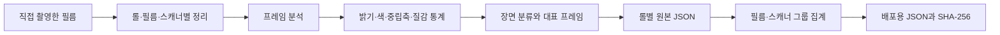

# 필름 프로파일

[문서 홈](../README.md)

번들 스캐너 프로파일은 내려받은 LUT나 이름만 붙인 프리셋이 아닙니다.
프로젝트 작성자가 직접 촬영하고 정리한 필름 스캔을 분석해 JSON으로 만들었습니다.

| 항목 | 현재 값 |
|---|---:|
| 필름 종류 기본값 | 27 |
| 창작 룩 | 6 |
| 스캐너 프로파일 | 15 |
| 롤 관측 | 25 |
| 이미지 관측 | 928 |
| 검증 상태 | 모두 `realOnly` |

> [!NOTE]
> `928`은 프로파일별 관측을 더한 값입니다. 서로 다른 사진 928장이라는 뜻은 아닙니다.

## 서로 다른 세 자료

| 자료 | 형식 | 쓰임 | 수 |
|---|---|---|---:|
| Film stock | Swift | Dmin/Dmax와 필름 종류 기본값 | 27 |
| Look preset | JSON | 사용자가 고르는 창작 룩 | 6 |
| Scanner profile | JSON | 실제 스캔에서 본 상대 톤·색 통계 | 15 |

필름 이름 27개가 색 정확도 프로파일 27개라는 뜻은 아닙니다. 룩 6개도 스캐너 프로파일과 다릅니다.
아래 내용은 세 번째 자료만 다룹니다.

## 현재 번들

`Sources/Chromabase/ScannerProfiles/`에 15개가 있습니다.

<details>
<summary>15개 프로파일 모두 보기</summary>

| 스캐너 | 필름 종류 | 필름 | 롤 관측 | 이미지 관측 | 상태 |
|---|---|---|---:|---:|---|
| NORITSU | color nega | Fuji C200 | 3 | 111 | `realOnly` |
| NORITSU | color nega | Kodak Ektar 100 | 2 | 76 | `realOnly` |
| NORITSU | color nega | Kodak Portra 160 | 1 | 37 | `realOnly` |
| NORITSU | color nega | Kodak Portra 400 | 2 | 75 | `realOnly` |
| NORITSU | color nega | Kodak Portra 800 | 1 | 38 | `realOnly` |
| NORITSU | color nega | Kodak Pro Image 100 | 1 | 37 | `realOnly` |
| NORITSU | color nega | Kodak UltraMax 400 | 1 | 38 | `realOnly` |
| NORITSU | color nega | Kodak Vision3 250D | 1 | 37 | `realOnly` |
| NORITSU | color nega | Kodak Vision3 50D | 1 | 38 | `realOnly` |
| NORITSU | color slide | Kodak Ektachrome 100 | 1 | 38 | `realOnly` |
| NORITSU | color slide | Kodak Ektachrome 100D | 5 | 181 | `realOnly` |
| SP-3000 | color nega | Kodak Ektar 100 | 2 | 76 | `realOnly` |
| SP-3000 | color nega | Kodak Portra 160 | 1 | 38 | `realOnly` |
| SP-3000 | color nega | Kodak Vision3 250D | 2 | 71 | `realOnly` |
| SP-3000 | color slide | Kodak Ektachrome 100D | 1 | 37 | `realOnly` |
| **합계** |  |  | **25** | **928** | **15개 `realOnly`** |

</details>

25와 928은 프로파일 그룹별 관측값의 합입니다.
같은 물리 롤이나 사진이 두 스캐너 그룹에 들어갈 수 있습니다.
고유한 롤 25개, 고유한 사진 928장이라는 뜻은 아닙니다.

## 만드는 순서



### 1. 촬영과 분류

원본은 스캐너, 필름 종류, 필름 이름, 롤 이름으로 나눕니다.
분석 전에 회전과 파일 해석을 확인합니다. 빈 파일이나 읽지 못하는 파일은 수에 넣지 않습니다.

### 2. 프레임 측정

각 프레임에서 다음 값을 잽니다.

- 밝기 백분위와 양끝 잘림
- 어두운·중간·밝은 영역의 채널 관계
- 채도와 색상 분포
- 낮은 채도 픽셀의 Lab 중립축
- 기울기, 선명도, 그레인 참고값

이 값은 장면 관측입니다. 한 장의 노출이나 피사체를 스캐너의 고정 성질로 단정하지 않습니다.

### 3. 장면 분류

밝기, 대비, 채도, 색상 범위로 장면을 나눕니다.
한 종류의 장면이 전체 프로파일을 끌고 가지 않도록 그룹별 수와 분포를 남깁니다.

### 4. 대표 프레임

사람이 원본을 다시 볼 수 있도록 다음 프레임을 따로 기록합니다.

- 대비가 가장 높은 프레임
- 디테일이 가장 선명한 프레임
- 그레인 참고값이 가장 높은 프레임
- 밝기와 채도 범위를 대표하는 프레임

### 5. 롤과 그룹 집계

`scripts/compile_scanner_profiles.py`가 롤별 자료를 필름·스캐너 그룹으로 묶습니다.
빈 구간을 관측값 0으로 꾸미지 않습니다. 모든 값이 유한한지와 실제 표본 수를 확인합니다.

### 6. JSON과 해시

최종 파일에는 스키마, ID, 원본 수, 원본 경로, 집계 통계, 검증 상태, `profileHash`가 들어갑니다.
검사기는 필드, 수, 유한값, 파일명과 ID, 원본 수, 해시를 확인합니다.

## JSON 모양

<details>
<summary>프로파일 JSON 예시</summary>

```json
{
  "schemaVersion": 2,
  "id": "noritsu__color-nega__kodak-portra-400",
  "displayName": "NORITSU · color nega · Kodak Portra 400",
  "scanner": "NORITSU",
  "kind": "color nega",
  "filmKey": "kodak portra 400",
  "validationStatus": "realOnly",
  "rollCount": 2,
  "imageCount": 75,
  "singleRollLimited": false,
  "sourceProfiles": [],
  "tone": {},
  "color": {},
  "neutralAxis": {},
  "neutralAxisBins": [],
  "hueResponse": [],
  "texture": {},
  "sceneBuckets": [],
  "coverageCandidates": [],
  "profileHash": "sha256:..."
}
```

</details>

## 주요 항목

| 항목 | 내용 | 주의할 점 |
|---|---|---|
| `tone` | 밝기 분포와 양끝 잘림 | 한 프레임의 노출을 장비 특성으로 보지 않음 |
| `color` | 어두운·중간·밝은 영역의 채널과 채도 | 절대 색행렬이 아닌 관측 분포 |
| `neutralAxis` | 낮은 채도 픽셀의 Lab `a*`, `b*` | 중립 물체가 없는 장면도 있어 표본 수를 함께 기록 |
| `hueResponse` | 색상 구간별 채도 변화와 색상 회전 | 두 장비 자료가 충분히 맞을 때만 상대 비교 |
| `texture` | 기울기, 선명도, 그레인 참고값 | 장비 샤프닝 값으로 바로 쓰지 않음 |
| `sceneBuckets` | 장면별 통계와 대표 프레임 | 사람이 출처를 다시 확인할 수 있게 함 |

`HS` 타깃의 밝기 채널 샤프닝은 `texture`에서 측정한 장비 상수가 아닙니다.
실제 그레인을 새로 만들지도 않습니다. `SP`, `MAIN`, `PRINT`에는 이 샤프닝을 넣지 않습니다.

## 증거 상태

| 상태 | 뜻 | 사용 범위 |
|---|---|---|
| `draft` | 자료나 스키마가 덜 만들어짐 | 번들·자동 사용 금지 |
| `realOnly` | 실제 스캔은 있으나 별도 기준 자료가 없음 | 수동 선택만, 정확도 주장 금지 |
| `pairedSmoke` | 쌍 자료로 처리 경로만 확인 | 품질 증거로 사용 금지 |
| `pairedValidated` | 보정·검증 자료와 회귀 검사를 통과 | 정책이 허용할 때 자동 선택 가능 |

현재 15개는 모두 `realOnly`입니다. 실제 자료에서 나온 관측이라는 점은 확인할 수 있지만,
장비와 같은 결과를 낸다고 말할 수는 없습니다.

장비 정확도를 말하려면 다음 자료가 더 필요합니다.

- 같은 물리 프레임을 확인할 ID
- 보정 자료와 분리한 검증 자료
- 기준 이미지의 생성 조건
- 스캐너 설정과 작업자의 선택
- 타깃 batch, 조명, 측정 방법
- 이미지별 합격 기준

## 앱에서 쓰는 방법

### 수동 선택

현재는 모델명이나 파일 정보만 보고 자동 선택하지 않습니다.
사용자가 `HS` 또는 `SP` 타깃과 프로파일을 직접 고릅니다.
자동 매칭은 `pairedValidated`만 허용하므로 현재 번들에는 적용되지 않습니다.

### 두 스캐너의 상대 차이

장면의 절대 통계를 그대로 쓰지 않고, 두 장비에 대응하는 그룹의 차이만 제한적으로 씁니다.

- 정리한 롤 이름 묶음이 같아야 합니다.
- 이미지 수 차이는 15% 이하여야 합니다.
- 색상 구간은 양쪽 표본 수가 기준을 넘어야 합니다.
- 방향이 뒤집히는 값은 적용하지 않습니다.
- 서로 반대인 gain 사이의 값은 로그 영역에서 계산합니다.
- 톤은 Rec.709 감마 밝기에 한 번 적용하고 Lab 색 성분은 보존합니다.

원본 프로파일에는 프레임별 SHA-256이 없습니다.
롤 이름이 같아도 정확히 같은 프레임을 짝지었다는 증거는 아닙니다.

### 흑백과 포지티브

흑백에서는 색 성분을 빼고 상대 톤만 씁니다.
포지티브는 한 롤의 절대 밝기를 다른 사진에 옮기지 않습니다.
다만 `HS` 와 `SP` 의 기본 스타일은 포지티브에서 절반 강도로 들어가므로 언제나 `MAIN` 과 같은
결과는 아닙니다.

### 질감

같은 프레임의 쌍 자료가 없으면 `texture`를 장비 고유 샤프닝이나 그레인 값으로 쓰지 않습니다.
초점, 피사체, JPEG 처리, 랩 작업자의 선택이 값에 섞여 있기 때문입니다.

## 파일 무결성

`ScannerProfileRegistry`는 15개 중 일부만 열지 않습니다.

1. 목록 스키마를 읽습니다.
2. 모든 파일의 존재와 SHA-256을 확인합니다.
3. 각 JSON의 `profileHash`를 다시 계산합니다.
4. ID, 파일명, 스키마, 상태, 수, 유한값을 확인합니다.
5. 하나라도 틀리면 전체 묶음을 거부합니다.
6. 모두 맞는 읽기 전용 스냅샷만 캐시합니다.

내보내기 기록에는 실제로 쓴 프로파일 ID와 SHA-256을 남깁니다.

## 확인 명령

프로파일 규격 검사:

```bash
python3 scripts/validate_scanner_profiles.py \
  --mode profile-contract \
  --profiles Sources/Chromabase/ScannerProfiles
```

다시 만들기:

```bash
python3 scripts/compile_scanner_profiles.py \
  --source LUT_target/SOURCE \
  --out LUT_target/PROFILES \
  --resource-out Sources/Chromabase/ScannerProfiles
```

REAL/TARGET 품질 검사:

```bash
python3 scripts/evaluate_profile_quality.py \
  --manifest LUT_target/quality/corpus-v1.json \
  --candidate-summary LUT_target/SOURCE/summary.json \
  --baseline-summary LUT_target/quality/accepted-summary-v1.json \
  --data-root LUT_target \
  --verify-files all \
  --report build/profile-quality-report.json
```

현재 저장소에는 출시 주장에 쓸 REAL/TARGET 목록과 승인 기준이 없습니다.
합성 테스트는 검사 코드의 실패 조건만 확인하며 프로파일 정확도를 증명하지 않습니다.

## 참고 자료

- [Kodak Professional Portra 400 technical data](https://www.kodakprofessional.com/sites/default/files/wysiwyg/pro/resources/e4050_portra_400.pdf)
- [darktable negadoctor](https://docs.darktable.org/usermanual/4.6/en/module-reference/processing-modules/negadoctor/)

위 자료에서 프로파일 숫자를 가져오지는 않았습니다.
필름 베이스, 장면 톤, 장비 스타일을 따로 다뤄야 한다는 배경을 확인할 때만 참고했습니다.
JSON 값은 직접 촬영한 원본과 저장소의 분석 코드로 만듭니다.

## 코드와 관련 문서

- `Sources/Chromabase/ScannerProfiles/`
- `Sources/Chromabase/Profiles/ScannerProfile/`
- `Sources/Chromabase/Profiles/ScannerTargetGrade/`
- `scripts/compile_scanner_profiles.py`
- `scripts/validate_scanner_profiles.py`
- `scripts/evaluate_profile_quality.py`
- [프로파일 품질 검사](../reference/PROFILE_QUALITY_GATE.md)
- [IT8 색 검사](../reference/IT8_COLOR_VALIDATION.md)
- [크로마 엔진](CHROMA_ENGINE.md)
