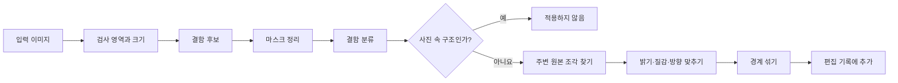

# GrainMend

[문서 홈](../README.md)

GrainMend는 필름의 먼지, 핀홀, 스크래치와 유제 손상을 복원합니다.
결과는 원본에 굽지 않고 순서가 있는 편집 기록으로 남깁니다.

| 도구 | 어디를 보는가 | 복원 방법 |
|---|---|---|
| 자동 | 사진 전체 | 확신이 높은 결함만 보수적으로 복원 |
| 가이드 | 사용자가 고른 영역 | 작은 점과 옅은 결함까지 자세히 검사 |
| 브러시 | 직접 칠한 자리 | 주변 구조와 질감을 이어 붙임 |
| 복제 도장 | 직접 고른 원본 지점 | 실제 원본 픽셀을 일정한 간격으로 복제 |
| IR | 스캐너의 적외선 채널 | IR로 위치를 찾고 RGB로 픽셀을 복원 |

현상 화면에는 자동, 가이드, 브러시, 복제 도장이 나옵니다.
IR은 플러그인이 기능을 보고했을 때 스캔 단계에서 켤 수 있습니다.
스캔이 끝나면 결과는 같은 GrainMend 레이어 목록에 들어갑니다.

> [!CAUTION]
> GrainMend RGB는 하드웨어 IR 청소와 다른 방식입니다. GrainMend IR도 Digital ICE, iSRD,
> SRDx의 구현이나 호환 모드가 아닙니다.

## 무엇이 어려운가

필름 결함과 사진 속 구조는 같은 픽셀에 있습니다.

- 먼지는 작고 불규칙한 밝거나 어두운 얼룩으로 보입니다.
- 핀홀은 고립된 강한 점으로 보일 수 있습니다.
- 스크래치는 길고 가늘지만 전선, 창틀, 글자도 비슷합니다.
- 유제 손상은 색과 질감을 함께 바꿉니다.
- 고해상도 필름 그레인은 작은 결함과 비슷한 크기입니다.

고주파를 통째로 지우면 먼지와 함께 그레인과 가장자리도 사라집니다.
GrainMend는 검출, 분류, 복원, 저장을 나눠 처리합니다.

## 처리 순서



검출 마스크와 복원 결과는 따로 둡니다.
그래서 마스크를 확인하고, 일부 결함만 적용하거나, 복원을 다시 만들 수 있습니다.

## 도구

### 자동

사진 전체에서 확신이 높은 결함만 찾습니다.
큰 구조를 잘못 지우는 것보다 작은 결함을 놓치는 쪽을 택합니다.
기본 현상에 몰래 들어가지 않으며 사용자가 실행해야 결과가 추가됩니다.

### 가이드

사용자가 사각 영역을 고르면 그 안과 주변만 분석합니다.
결함 위치를 알려 준 상태라 자동보다 작은 점, 옅은 결함, 밀집 결함을 더 적극적으로 봅니다.

복원에 쓸 주변 픽셀이 영역 끝에서 잘리지 않도록 실제 결과보다 넓게 읽습니다.
현재 최대 주변 반경은 264픽셀입니다.

### 브러시

사용자가 복원할 자리를 직접 칠합니다. 칠한 색을 덮는 방식이 아닙니다.
마스크 주변에서 맞는 원본 조각을 찾아 구조와 질감을 이어 붙입니다.
맞는 조각이 없으면 검출 기반 경로를 제한적으로 쓸 수 있습니다.

### 복제 도장

`⌥` 클릭으로 원본 지점을 고르고 대상에 그립니다.
자동 검출을 쓰지 않고 두 지점 사이의 오프셋을 유지해 실제 픽셀을 복제합니다.

편집 기록에는 지름, 경도, 좌표, 오프셋이 들어갑니다.
회전, 반전, 자르기 뒤에도 같은 원본 좌표에 적용할 수 있습니다.
오프셋은 정수 픽셀에 맞추며 이미지 밖은 적용하지 않습니다.

### IR

플러그인이 실제 IR 채널을 주고 RGB와 크기·영역이 맞는지 확인했을 때만 씁니다.
IR은 결함 위치를 찾는 자료입니다. 최종 픽셀은 RGB와 같은 복원기로 만듭니다.

## RGB에서 결함을 찾는 법

### 주변과의 차이

사진마다 밝기가 달라 전역 임계값 하나를 쓰지 않습니다.
주변 밝기와의 차이, 국소 분산, 방향을 보고 밝은 먼지와 어두운 결함 후보를 만듭니다.

### 마스크 정리

고립된 잡음을 빼고 끊어진 결함을 이은 뒤 8방향으로 맞닿은 픽셀을 한 덩어리로 묶습니다.
큰 영역을 타일로 나눠도 경계에 걸린 덩어리는 전체 좌표에서 다시 합칩니다.

### 해상도 차이

같은 먼지도 1200dpi와 7200dpi에서 픽셀 크기가 다릅니다.
믿을 만한 해상도 정보가 있으면 실제 크기에 맞춰 한계를 조절합니다.
정보가 없으면 스캐너 모델을 추측하지 않고 보수적인 픽셀 기준을 씁니다.

### 분류

각 덩어리에서 다음 값을 봅니다.

- 면적과 테두리 상자
- 긴 축과 짧은 축의 비율
- 수평, 수직, 대각 방향
- 선형성, 밀집도, 주변 대비
- 주변 가장자리와 이어지는지
- 다른 덩어리와의 관계

결과는 먼지, 핀홀, 방향별 스크래치, 유제 손상, 미세 이물로 나뉘며 신뢰도를 가집니다.

### 사진 속 선을 지우지 않기

전선, 난간, 건물 모서리, 창틀, 글자를 스크래치로 보면 안 됩니다.
평행선, 격자, 가장자리의 연속성, 장면 구조에 붙은 선을 따로 검사합니다.
자동은 오검출을 더 세게 막고, 가이드는 사용자가 위치를 고른 사실을 함께 봅니다.

## 복원

1. 결함 주변에서 마스크와 겹치지 않고 구조가 맞는 원본 조각을 찾습니다.
2. 원본 조각과 대상의 낮은 주파수 밝기·색 차이를 맞춥니다.
3. 원본 조각의 고주파 질감을 살려 필름 그레인을 옮깁니다.
4. 긴 스크래치는 양쪽에서 이어지는 방향을 먼저 봅니다.
5. 마스크 가장자리에서는 원본과 복원 조각을 부드럽게 섞습니다.

강도는 완성한 복원 조각과 원본 사이의 혼합 비율입니다.

자동 복원으로 원래 내용을 알아낼 수 없는 경우도 있습니다.
쓸 만한 주변 질감이 없거나 결함이 중요한 구조 전체를 덮었다면 브러시, 복제 도장, 별도 정밀
보정이 필요합니다.

## IR 처리

### 입력 조건

- 플러그인이 IR 기능을 명시적으로 보고합니다.
- RGB와 IR이 같은 스캔 세션에 속합니다.
- 두 이미지의 픽셀 크기와 예상 영역이 같습니다.
- 파일을 읽을 수 있고 원본 ID 검사를 통과합니다.

모델명에 IR 기능이 알려져 있어도 플러그인이 보고하지 않으면 화면과 요청에서 쓰지 않습니다.

### 정렬

광학계와 센서 읽기 차이로 RGB와 IR이 몇 픽셀 어긋날 수 있습니다.
먼저 넓게 찾고, 다음에 좁게 찾아 오프셋을 정합니다.
최고점의 신뢰도와 검색 경계 도달 여부를 기록합니다.

신뢰도가 낮거나 최적점이 검색 끝에 걸리면 성공으로 보지 않습니다.

### 장면 무늬 빼기

필름 염료와 농도는 IR에도 일부 보일 수 있습니다.
적색 채널의 로그 밝기를 64개 구간으로 나누고, 각 구간에서 IR 값의 위아래 10%를 뺀 평균을
구합니다.
빈 구간은 이웃 값으로 보간하고 짧은 대칭 커널로 평활합니다.
이 비모수 곡선을 빼서 장면 무늬를 줄이며, 희소한 어두운 먼지는 구간 통계에 들어가지 않게 합니다.

남은 값은 주변 평균에 대한 상대 대비로 바꿉니다.
큰 결함이 자기 주변의 노이즈 기준을 끌어올리지 않도록 노이즈 입력을 최소 검출 대비에서 자른 뒤
적응 임계값을 계산합니다.
홀더와 필름 가장자리의 이어진 어두운 부분은 마스크에서 뺍니다.

### 안전 조건

- 마스크가 비정상적으로 넓으면 적용하지 않습니다.
- 정렬을 확인하지 못하면 적용하지 않습니다.
- 은염 흑백에는 자동 적용하지 않습니다.
- 컬러 포지티브와 특수 유제는 실측 없이 안전하다고 보지 않습니다.

상용 IR 도구도 일반 흑백과 Kodachrome에 별도 제한을 둡니다.

- [SilverFast: iSRD dust and scratch removal](https://www.silverfast.com/about-silverfast-why-scanning-basics-of-scanning/why-silverfast/silverfast-feature-highlights/isrd-dust-scratches-removal-eliminate-defects-with-infrared-channel/)

GrainMend IR은 이 상용 도구의 복제나 호환 모드가 아닙니다.

## 편집 기록과 저장

자동, 가이드, 브러시, 복제 도장, IR은 순서가 있는 편집 목록을 함께 씁니다.

각 항목에 들어가는 값:

- ID와 종류
- 적용 순서
- 켜짐 여부와 강도
- 영역, 마스크, 복제 원본 오프셋
- 결함 분류와 진단값
- 원본 프레임과 편집 버전
- 복원 조각 또는 다시 만들 때 필요한 값

앞의 복원이 뒤의 입력을 바꾸므로 목록 순서도 편집 기록의 일부입니다.

원본은 수정하지 않습니다. GrainMend 기록은 앱이 관리하는 사이드카에 저장합니다.
원본 SHA-256, 편집 버전, 기록 지문으로 입력을 묶습니다.
사이드카가 없거나 깨졌다면 캐시를 원본처럼 쓰지 않습니다.

GrainMend 캐시는 빠른 표시와 다시 렌더하기 위한 파생 파일입니다.
없거나 검사에 실패하면 원본과 편집 기록으로 다시 만듭니다.
내보내기에 필요한 결과를 만들 수 없다면 원본으로 대신하지 않고 실패합니다.

## 성능

- 작은 수정은 결함과 주변 문맥만 다시 계산합니다.
- 큰 영역은 겹치는 타일로 나누고 경계용 여백을 둡니다.
- 결과는 겹치지 않는 타일 중심부에서만 모읍니다.
- 동시에 처리하는 타일은 최대 4개입니다.
- `CleanedRawCanvas`는 수정한 사각형만 복사합니다.
- 되돌리기용 사본은 실제 변경 전까지 저장 공간을 함께 씁니다.
- 메모리가 부족하면 다시 만들 수 있는 이미지와 복원 조각 캐시를 비웁니다.

실제 시간은 해상도, 결함 수, 영역 크기, Mac에 따라 다릅니다.

2026-07-25, Mac14,3, arm64, 메모리 24 GiB, macOS 26.5의 Release 빌드에서 측정한 값입니다.

| 경로 | 입력 | 결과 |
|---|---|---:|
| 가이드 검출 | 1600×1600, 먼지 25개 | 0.35초, 25개 검출 |
| 부분 ROI 검출 | 1600×1600 | 0.38초 |
| 가이드 밀집 스트레스 | 1280×960, 8장×3회 | 중앙 0.423초, p95 0.488초, 최대 0.526초 |
| IR 검출 | 6000×4000, 24MP | 1.042초, 최대 메모리 증가 249.2 MiB |

밀집 스트레스 24회에서 결함 지점 마스크 범위 최저값은 99.80%, 평균 잔여 오차 최댓값은
2.70/255였습니다.
이 값은 합성 입력의 회귀 측정이며 다른 Mac이나 실제 필름의 처리 시간을 보장하지 않습니다.

## 벤치마크

`defect-bench`는 다음 파일과 값을 만들 수 있습니다.

- before, after, diff, mask
- 100% 크롭
- 검출 수와 신뢰도
- 처리 시간
- 기준 이미지가 있을 때 PSNR과 절대 오차

```bash
swift run -c release negaflow defect-bench <input-dir> \
  --reference-dir <reference-dir> \
  --out <report-dir>
```

RGB 회귀에는 FILM-R v2의 손상본과 전문가 복원본 44쌍을 씁니다.

- DOI: <https://doi.org/10.6084/m9.figshare.21803304.v2>
- 라이선스: CC BY 4.0
- 쌍: 44
- 전체 크기: 437,570,872바이트

2026-07-25 출시 자동 경로는 민감도 0.7과 과검출 안전선을 적용했습니다.
직전 3.0 기준과 비교하면 FILM-R 44장 중 개선된 사진은 11장에서 34장으로 늘고, 악화된 사진은
33장에서 6장으로 줄었습니다.
평균 PSNR 변화는 -1.688 dB에서 +0.466 dB, 최악 사례는 -18.952 dB에서
-1.338 dB로 바뀌었습니다. 가중 악화 픽셀은 0.792%에서 0.017%로 줄었습니다.

자동은 고밀도 후보를 만나면 적용을 중지하고 가이드 사용을 안내합니다.
이 안전선은 사용자가 범위를 지정하는 가이드, 직접 칠하는 브러시, 복제 도장, IR에는 적용하지
않습니다.
결과가 좋아졌어도 6장은 전문가 복원본보다 PSNR이 낮습니다.
모든 사진의 개선, RGB와 IR의 동등함, 실제 스캐너 IR 품질을 증명하지 않습니다.

전체 표와 명령은 [GrainMend 실제 스캔 비교](../validation/GRAINMEND_CORPUS.md)에 있습니다.

필름별 IR 제한과 정렬 실패 조건은
[GrainMend IR이 피해야 할 필름](../reference/INFRARED_LIMITS.md)에 정리했습니다.

## 테스트 범위

- 8방향 연결과 마스크
- 형태학 연산
- 먼지, 스크래치, 미세 이물 검출
- 선과 격자 오검출 거부
- 큰 영역의 타일 경계
- 방향별 스크래치 복원
- 주변 질감과 밝기 맞춤
- 브러시 마스크
- 복제 도장의 오프셋, 경도, 조각 합성
- IR 정렬, 기준점, 덩어리, 메모리 한계
- 원본 단계 적용과 앱 편집 기록 렌더
- 연속 추가와 되돌리기
- 화면 이동 중 프레임 소유권

일부 성능 테스트는 환경 변수를 켜야 실행됩니다.
테스트 파일이 있다는 것만으로 모든 환경에서 실행했다고 말하지 않습니다.

## 이름과 상표

`GrainMend`는 negaflow의 자체 기능명입니다.

- `Digital ICE`는 Eastman Kodak Company 또는 관련 권리자의 상표일 수 있습니다.
- `iSRD`, `SRDx`, `SilverFast`는 LaserSoft Imaging의 상표입니다.
- 이 이름은 기술 비교와 제품 식별에만 씁니다.
- GrainMend는 제3자 기술과의 제휴, 호환, 동등함을 주장하지 않습니다.

## 코드 위치

- `Sources/Chromabase/DefectRemoval/`
- `Sources/negaflowApp/Features/Defects/`
- `Sources/negaflowApp/Features/Develop/Inspector/Tools/DefectControlsSection.swift`
- `Sources/negaflowCLI/Commands/CLI+DefectBenchCommand.swift`
- `Tests/ChromabaseTests/Defect*.swift`
- `Tests/negaflowAppTests/Defect*.swift`
- `Config/defect-corpus-film-r-v2.json`
- `scripts/defect-corpus/`
