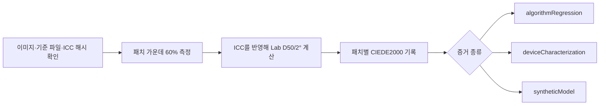

# IT8 색 검사

[문서 홈](../README.md)

화면으로 보고 색 정확도를 합격시키지 않습니다. IT8 이미지와 그 물리 타깃에 맞는 기준 파일을 한 쌍으로 고정하고, 패치마다 수치를 기록합니다.

> [!IMPORTANT]
> 공개 IT8 자료로 검사기와 색 계산의 회귀는 확인할 수 있지만, 실제 스캐너나 컬러 네거티브의 정확도까지 증명할 수는 없습니다. 장치 판정에는 확인된 물리 타깃과 그 장치의 실제 측정이 필요합니다.

## 증거 종류

| 이름 | 확인하는 것 | 확인하지 못하는 것 |
|---|---|---|
| `algorithmRegression` | 파일 해석, ICC 변환, 패치 영역, Lab, CIEDE2000 계산 | 실제 스캐너 정확도 |
| `deviceCharacterization` | 확인된 물리 타깃과 실제 장치 측정 | 다른 타깃·장치의 정확도 |
| `syntheticModel` | 독립 합성 모델의 수학적 왕복 | 실제 필름이나 장치 정확도 |

`deviceCharacterization`에는 물리 타깃의 제조사, 재료, 일련번호, 배치 정보가 필요합니다. 기준 파일 머리말과 하나라도 다르면 평가하지 않습니다.

IT8.7/1과 ISO 12641-1 투과 타깃은 포지티브 투과 원고용입니다. 이 결과로 컬러 네거티브의 오렌지 마스크, 염료 간섭, C-41 편차, NORITSU/FUJI 출력 정확도를 말할 수 없습니다. 그 주장은 같은 컬러 네거티브를 두 경로에서 처리한 쌍 자료와 별도 검증 묶음이 필요합니다.

## 공개된 회귀 검사 자료

FADGI/OpenDICE의 다음 두 파일을 한 쌍으로 씁니다.

- 안내: <https://www.digitizationguidelines.gov/guidelines/digitize-OpenDice.html>
- 이미지: <https://www.digitizationguidelines.gov/guidelines/OpenDICE/IT8-7.1.tif>
  - SHA-256: `c62ee73f26390a2ad90e7e28280cbd1efb4f18834425bb7112ff1f8016832ffd`
  - 크기: `6255 x 4170`
  - 형식: 16-bit RGB, `Adobe RGB (1998)` 내장
- 기준 파일: <https://www.digitizationguidelines.gov/guidelines/OpenDICE/Profile_IT8-7.1.txt>
  - SHA-256: `19337b85f213eb4397e91c91298201f421ef3ca33b0ef6da3d752a0880491840`
  - 패치: `A1`부터 `L22`까지 Lab 264개
  - 16열: density

재배포 권한을 확인하지 못했기 때문에 파일을 저장소나 앱에 넣지 않습니다. 사용자가 직접 받은 파일을 [예제 목록](../../reference/IT8_FADGI_OPENDICE.example.json)에 연결합니다. 이 예제의 등급은 `algorithmRegression`입니다. 이름만 `deviceCharacterization`으로 바꾸면 검사기가 거부합니다.

```bash
swift run negaflow it8-bench docs/reference/IT8_FADGI_OPENDICE.example.json \
  --image /path/to/IT8-7.1.tif \
  --reference /path/to/Profile_IT8-7.1.txt \
  --out /path/to/it8-report.json
```

## 측정 규칙

- 이미지, 기준 파일, 선택한 ICC의 SHA-256이 목록과 다르면 중단합니다.
- 보고서 v2는 목록 원문의 SHA-256도 기록합니다.
- `A01`과 `A1`은 같은 좌표로 읽되 원래 ID는 보고서에 남깁니다.
- 22열 x 12행 패치의 가운데 60%를 원본 해상도 부동소수점으로 읽습니다.
- 패치 순서는 행 `A`–`L`, 열 `1`–`22`입니다.
- 내장 ICC를 존중합니다.
- linear sRGB D65에서 XYZ, Bradford D50 적응, Lab D50/2° 순서로 계산합니다.
- 각 패치에 영역, 픽셀 수, RGB 평균·표준편차, 양끝 비율, 비유한값 수, 기준·측정 Lab, L/a/b 차이, CIEDE2000을 기록합니다.
- median, p95, max는 관측값일 뿐 합격선이 아닙니다.
- 근거 없는 평균 임계값을 만들지 않으며 `qualityDecision`은 `notEvaluated`입니다.
- 프로파일을 맞추는 데 쓴 타깃을 독립 검증에 다시 쓰지 않습니다.

### 물리 타깃 정보

실제 장치 측정에는 다음 정보를 작업자가 타깃 라벨에서 읽어 적습니다.

<details>
<summary>측정 정보 예시</summary>

```json
{
  "measurement": {
    "samplerVersion": "center-mean-v1",
    "renderingIntent": "relativeColorimetric",
    "physicalTargetIdentity": {
      "manufacturer": "target label manufacturer",
      "material": "target label material",
      "serial": "target label serial",
      "batchMetadataKey": "PROD_DATE",
      "batchValue": "reference header production date"
    }
  }
}
```

</details>

`MANUFACTURER`, `MATERIAL`, `SERIAL`, 배치 머리말(`BATCH`, `BATCH_ID`, `PROD_DATE` 중 하나)이 기준 파일과 글자까지 같아야 합니다. 최상위 `targetID`는 `serial`, `batchID`는 `batchValue`와 같아야 합니다.

이 기록은 작업자가 적은 값과 기준 파일이 맞는다는 것만 보여 줍니다. 이미지에서 라벨을 알아내거나 작업자의 입력을 독립 인증하지는 않습니다. 정보가 없으면 가장 가까운 날짜나 범용 기준 파일로 대신하지 않습니다.

기준 파일에 조명 또는 관찰자 정보가 있으면 D50/2° 계약과 맞는지 확인합니다. 모순되면 중단합니다. `measurement.renderingIntent`는 현재 Core Image 변환을 직접 고정하지 못하므로 보고서에 `manifestDeclarationNotControlledByEvaluator`라고 남깁니다.

## `PRINT` 출력

IT8.7/1은 입력 장치용입니다. 프린터 출력은 `printer + paper + ink/chemistry + driver/process condition` 조합을 실제로 측정해 만든 RGB printer ICC를 써야 합니다.

검사와 적용 순서:

1. ICC의 크기, `prtr` 장치 종류, `RGB ` 자료 공간, Lab/XYZ PCS, `acsp` 표시를 확인합니다.
2. 양방향 ColorSync 변환이 가능한지 확인합니다.
3. 선택 시 프로파일 이름, 바이트, SHA-256을 고정합니다.
4. `MAIN` 작업 이미지와 페이지 배치를 끝낸 뒤 최종 출력에 한 번만 적용합니다.
5. `rawScanTIFF`와 `-main-flat`에는 적용하지 않습니다.
6. 프로파일이 없거나 틀리면 임시 출력 전에 실패합니다. sRGB로 대신하지 않습니다.

현재 Core Image와 ColorSync 경로가 렌더링 의도와 black-point compensation을 모든 macOS에서 비트 단위로 고정한다고 주장하지 않습니다.

## `MAIN` 합성 패치 회귀

컬러 네거티브 기본 경로는 `shoulder-print-response-v4`를 씁니다.

```math
\log_{10}(P) =
y_{\mathrm{ceil}} -
\mathrm{amplitude}\,
\exp\left(-(\mathrm{rate}\,d)^{\mathrm{shape}}\right)
```

`d`는 Dmin을 뺀 뒤 정규화한 광학 밀도입니다. 계수는 저장된 프리셋이 아니라 다음 네 기준점에서 계산합니다.

| 기준점 | 값 |
|---|---:|
| 베이스 검정점 | `0.001` |
| 중간 회색 | `0.18` |
| 측정한 최농부의 흰색 | `0.70` |
| 반사광 여유 | `0.90` |

이 곡선에서 `0D`는 linear `0.001`, `0.6D`는 `0.18`, `3D`는 `0.882836683855`입니다. 출력이 열린 구간 안에 있어 정상 범위의 검정과 흰색이 8-bit `0/255`로 바로 잘리지 않습니다.

장면 히스토그램으로 노출을 자동 조정하는 식이 아니며, 특정 필름이나 장비의 정확도를 뜻하지 않습니다. 수식은 [고정 인화 응답](PRINT_RESPONSE.md)에 있습니다.

`MainSyntheticIT8RoundTripTests`는 264개 기준 패치를 역함수로 네거티브화한 뒤 전체 `MAIN` 경로로 되돌립니다. Lab D50/2°와 `DeltaE00`을 패치마다 검사합니다. 이는 `syntheticModel` 회귀입니다.

## NORITSU/FUJI 상대 스타일 회귀

`A1`부터 `L22`까지 Lab D50 패치 264개가 있는 기준 파일을 SHA-256으로 고정합니다. 각 패치를 합성 네거티브로 바꾼 뒤 `MAIN`, `NORITSU`, `FUJI` 경로를 두 번씩 실행합니다.

```bash
swift run negaflow scanner-relative-it8-bench \
  /path/to/Profile_IT8-7.1.txt \
  --sha256 sha256:19337b85f213eb4397e91c91298201f421ef3ca33b0ef6da3d752a0880491840 \
  --out /path/to/scanner-relative-it8-report.json
```

보고서에는 패치별 RGB와 Lab, 기준 대비 `DeltaE00`, 타깃끼리의 상대 `DeltaE00`, 잘림과 비유한값 표시를 넣습니다. 중립 계조의 단조성은 `A16...L16` 밀도열에서 봅니다.

linear sRGB로 바꿨을 때 0...1 밖인 색은 합성 네거티브로 정확히 만들 수 없어 표시 가능한 범위로 제한합니다. 따라서 넓은 범위 통계는 관측값일 뿐 합격 기준이 아닙니다.

증거 등급에는 늘 `syntheticModel`이 들어갑니다. 판정은 늘 `notEvaluated`로 남습니다. 프로파일 목록과 각 파일의 SHA-256이 하나라도 틀리면 중단합니다. 실제 장비 정확도에는 같은 물리 네거티브의 양쪽 장비 스캔과 별도 검증 자료가 필요합니다.

기준 파일 머리말에서 D50/2°를 확인한 것은 아닙니다. Lab 값을 D50/2°로 읽는 벤치 자체의 계약이므로 `colorimetryInterpretationProvenance`는 `benchmarkContractNotVerifiedFromReferenceHeader`입니다.

`shoulder-print-response-v4` 이전 결과는 현재 알고리즘의 결과로 재사용하지 않습니다.

## 측정 흐름


