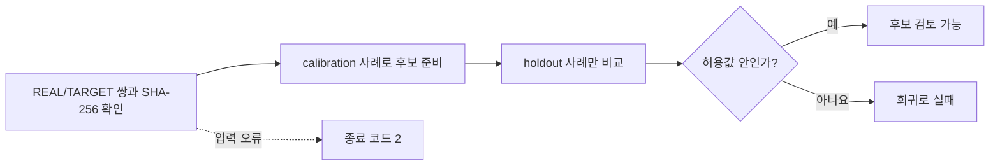

# 스캐너 프로파일 품질 검사

[문서 홈](../README.md)

`scripts/evaluate_profile_quality.py`는 스캐너 프로파일 변경이 승인된 기준보다 나빠지지 않았는지
검사합니다.
`LUT_target/analyze_lut_target.py`가 만든 `SOURCE/summary.json` 두 개를 비교하며, 프로파일
조정에 쓰지 않은 검증 사례만 판정에 사용합니다.

이 도구가 “좋은 색”을 정해 주지는 않습니다.
어떤 수치를 낮춰야 하는지, 높여야 하는지, 얼마까지 변해도 되는지는 자료 목록에 사람이 직접
적어야 합니다.
기본 합격값을 임의로 제공하지 않습니다.

현재 저장소에는 REAL/TARGET 이미지 쌍이 없습니다.
그래서 실제 자료 목록, 승인 기준, 실제 장치의 합격 결과도 없습니다.
합성 테스트는 검사기 코드만 확인합니다.

> [!WARNING]
> 현재 저장소만으로 스캐너 색 정확도를 승인할 수 없습니다. 실제 출시 판정에는 고정된
> REAL/TARGET 쌍, 보정에 쓰지 않은 검증 사례, 사람이 정한 허용값이 필요합니다.

## 현재 프로파일을 앱에서 쓰는 범위

사용자가 `NORITSU`나 `FUJI` 타깃을 직접 고르면 번들의 `realOnly` 그룹에서 제한된 상대 차이를 쓸
수 있습니다.

필요한 조건:

- 필름 종류와 필름 이름이 같습니다.
- 정리한 원본 롤 이름 묶음이 같습니다.
- 이미지 수 차이가 15% 이하입니다.

원본 프로파일에는 프레임별 ID나 SHA-256이 없습니다.
롤 이름이 같아도 정확히 같은 프레임을 짝지었다는 증거는 아닙니다.
따라서 실제 장비와 같은 결과라고 말할 수 없습니다.

적용 규칙:

- 두 그룹에서 방향이 반대인 값은 적용하지 않습니다.
- 흑백은 색 성분을 모두 빼고 상대 톤만 남깁니다.
- 대응하는 롤이 없는 슬라이드 프로파일의 NORITSU/FUJI 상대 보정은 적용하지 않습니다.
- 같은 위치의 쌍 자료가 없으면 스캐너 질감이나 샤프닝을 적용하지 않습니다.
- 톤은 Rec.709 감마 밝기에 한 번 적용하고 Lab `a*`, `b*`는 보존합니다.
- 색 gain은 로그 영역에서 보간해 서로 반대인 기준점 사이의 관계를 지킵니다.
- 파일이나 목록의 SHA-256이 하나라도 틀리면 전체 프로파일 묶음을 거부합니다.

## 제조사 자료로 확인할 수 있는 범위

- [Fujifilm Frontier 570/SP-3000 안내서](https://www.photolabdigital.com/fuji_frontier570_en%5B1%5D.pdf)는
area CCD와 Hyper-tone, Hyper-sharpness 같은 기능 이름을 공개하지만 전달 함수와 설정값은 공개하지
않습니다.
- [Noritsu HS-1800 제품 정보](https://www.noritsu.eu/hardware/noritsu-film-scanner.html)는
지원 형식, 해상도, 처리량을 공개하지만 고정 색 전달 함수는 제공하지 않습니다.
- [Noritsu 특허 US 7,589,863](https://patents.google.com/patent/US7589863/en)는 미니랩에서
작업자가 농도, 계조, 샤프닝을 고르는 흐름을 설명합니다.

이 자료는 장면과 작업자에 따라 처리가 달라진다는 점을 보여 줍니다.
HS-1800이나 SP-3000을 복제할 고정 상수를 주지는 않습니다.
negaflow는 제품 이름에서 이런 값을 추측하지 않습니다.

## 자료 목록 스키마 v1

목록은 바뀌지 않는 입력 자료와 함께 둡니다.
예: `LUT_target/quality/corpus-v1.json`. 경로는 목록 파일의 위치를 기준으로 합니다.
`--data-root`를 주면 그 경로가 기준이 됩니다.

<details>
<summary>자료 목록 예시</summary>

```json
{
  "schemaVersion": 1,
  "corpusVersion": "scanner-corpus-2026-07-10.1",
  "acceptedBaselineSHA256": "sha256:<64 lowercase hex>",
  "cases": [
    {
      "role": "calibration",
      "stem": "NORITSU/color nega/Portra 400/calibration-01",
      "real": {
        "path": "REAL/NORITSU/color nega/Portra 400/calibration-01.tif",
        "sha256": "sha256:<64 lowercase hex>"
      },
      "target": {
        "path": "TARGET/NORITSU/color nega/Portra 400/calibration-01.tif",
        "sha256": "sha256:<64 lowercase hex>"
      }
    },
    {
      "role": "holdout",
      "stem": "NORITSU/color nega/Portra 400/holdout-01",
      "real": {
        "path": "REAL/NORITSU/color nega/Portra 400/holdout-01.tif",
        "sha256": "sha256:<64 lowercase hex>"
      },
      "target": {
        "path": "TARGET/NORITSU/color nega/Portra 400/holdout-01.tif",
        "sha256": "sha256:<64 lowercase hex>"
      }
    }
  ],
  "metrics": [
    {
      "name": "mean_delta_e2000",
      "direction": "lowerIsBetter",
      "allowedRegression": 0.0
    },
    {
      "name": "similarity_score_0_100",
      "direction": "higherIsBetter",
      "allowedRegression": 0.0
    },
    {
      "name": "neutral_a_shift",
      "direction": "absoluteLowerIsBetter",
      "allowedRegression": 0.0
    }
  ]
}
```

</details>

예시의 `0.0`은 권장값이 아닙니다.
실제 측정 방법과 출시 정책에 맞춰 항목과 허용값을 정해야 합니다.

## 목록 규칙

- `schemaVersion`은 정확히 `1`이어야 합니다.
- 모르는 버전과 모르는 필드는 거부합니다.
- `corpusVersion`은 바뀌지 않는 자료 선택과 분할을 가리킵니다.
- `acceptedBaselineSHA256`은 승인된 `summary.json` 파일의 정확한 바이트를 고정합니다.
- 각 사례는 `calibration` 또는 `holdout` 중 하나입니다.
- 이름은 겹치면 안 됩니다.
- 자료가 비어 있으면 안 되며 두 역할이 적어도 하나씩 있어야 합니다.
- REAL과 TARGET 파일은 모두 `sha256:<64 lowercase hex>`로 고정합니다.
- 수치 이름은 겹치면 안 됩니다.
- `allowedRegression`은 0 이상인 유한 숫자여야 합니다. 불리언은 받지 않습니다.
- 방향은 `lowerIsBetter`, `higherIsBetter`, `absoluteLowerIsBetter`만 받습니다.

`absoluteLowerIsBetter`는 0에서 떨어진 절댓값을 비교합니다. 0이 검토된 기준일 때만 씁니다.

## 후보와 승인 기준 준비

```bash
python3 LUT_target/analyze_lut_target.py
```

출시를 승인하기 전, 후보의 `SOURCE/summary.json` 전체를 다음 승인 기준 파일로 보존합니다.
후보가 검토를 통과하기 전에는 기존 승인 파일을 덮어쓰지 않습니다.
승인 파일의 정확한 SHA-256을 `acceptedBaselineSHA256`에 넣습니다.

후보와 기준 요약에는 목록에 적은 사례가 정확히 한 번씩 있어야 합니다.
빠짐, 중복, 처리 실패, 목록 밖 사례가 있으면 입력 오류입니다.

`calibration` 사례는 프로파일을 맞추는 데 쓸 수 있습니다. 판정에는 쓰지 않습니다.
`holdout` 사례는 조정과 선택에서 빼둡니다.
검증 수치는 사례마다 비교하므로 평균 개선으로 한 장의 악화를 숨길 수 없습니다.



## 실행

<details open>
<summary>품질 검사 명령</summary>

```bash
python3 scripts/evaluate_profile_quality.py \
  --manifest LUT_target/quality/corpus-v1.json \
  --candidate-summary LUT_target/SOURCE/summary.json \
  --baseline-summary LUT_target/quality/accepted-summary-v1.json \
  --data-root LUT_target \
  --verify-files all \
  --report build/profile-quality-report.json
```

</details>

파일 확인 모드:

| 값 | 동작 | 출시 근거로 사용 |
|---|---|---|
| `all` | 모든 REAL/TARGET 파일의 경로와 SHA-256 확인 | 예 |
| `holdout` | 검증 파일만 확인 | 빠른 진단용 |
| `none` | 이미지 파일 확인 안 함 | 아니요 |

기본값은 `all`입니다.
보고서에는 사용한 모드, 목록과 요약 파일의 해시, 파일 확인 결과, 검증 사례별 비교와 수를
기록합니다.
stdout과 `--report` 파일에 같은 JSON을 씁니다. 파일은 원자적으로 저장합니다.

종료 코드:

- `0`: 입력이 맞고 허용값을 넘은 악화가 없음
- `1`: 입력은 맞지만 하나 이상의 검증 값이 허용 범위를 넘음
- `2`: 스키마, 자료, 해시, 경로, 수치가 잘못되거나 빠짐

## 검사기 테스트

```bash
python3 -m unittest scripts/tests/test_evaluate_profile_quality.py
```

테스트는 임시 합성 파일로 정상 비교, 악화, 해시 변경, 잘못된 스키마와 숫자, 중복·누락·실패 사례,
빈 자료를 확인합니다.
실제 스캐너 출력의 품질을 증명하지 않습니다.
