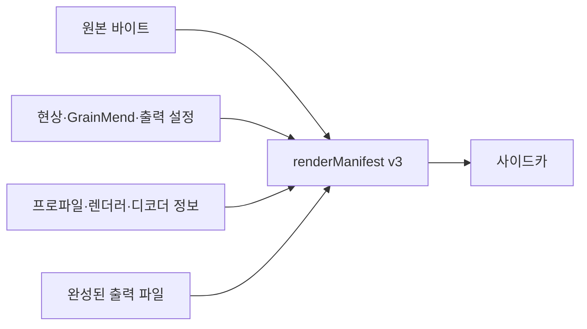

# 렌더 기록

[문서 홈](../README.md)

사이드카의 `renderManifest`는 원본, 편집 값, 최종 파일을 SHA-256으로 잇습니다. 파일 경로는
기록하지 않습니다.

> [!IMPORTANT]
> `renderManifest`는 파일과 설정 사이의 해시 관계를 남기는 기록입니다. 디지털 서명이나
> 인증서가 없으므로 C2PA Content Credentials라고 부르지 않습니다.

v3에 들어가는 값:

- 원본 바이트 수, SHA-256, `sha-256` 알고리즘 이름
- 실제 렌더 입력 종류
- GrainMend 캐시 파일 또는 메모리 입력의 확인 범위
- 현상, GrainMend, 출력 설정의 SHA-256
- 스캐너 프로파일 SHA-256
- 디코더 출처와 크로마 엔진 렌더러 버전
- 최종 파일의 SHA-256, 바이트 수, 픽셀 크기, 형식

인코더가 파일 쓰기를 끝내면 ImageIO로 다시 열어 픽셀 크기를 확인하고 파일 전체의 해시를
계산합니다. 그 뒤에 사이드카를 씁니다. v3 검사가 실패하면 완성된 출력 묶음으로 공개하지
않습니다.

## GrainMend 입력

- `cleanedMemory`: 메모리 픽셀의 표준 해시가 없으므로 확인 범위를
  `sourceAndDevelopRecipe`로 기록합니다. GrainMend 편집 기록의 SHA-256은 꼭 넣습니다.
- `cleanedFile`: GrainMend 캐시 파일 전체와 편집 기록을 모두 해시합니다.

이전 v1과 v2 파일도 읽을 수 있습니다. 당시 없었던 출력 해시나 GrainMend 기록 해시를 나중에
추측해 채우지는 않습니다.

## C2PA와 다른 점

이 기록에는 디지털 서명, 인증서, 신뢰 체인, 내장 claim store가 없습니다. 따라서 C2PA
Content Credentials라고 부르지 않습니다. C2PA의 hard binding과 처리 이력 원칙, PREMIS의
무결성 개념을 참고했지만 실제로 확인할 수 있는 SHA-256 값만 담습니다.

참고 자료:

- [C2PA Content Credentials 2.2](https://spec.c2pa.org/specifications/specifications/2.2/specs/C2PA_Specification.html)
- [C2PA hard-binding guidance](https://spec.c2pa.org/specifications/specifications/2.4/guidance/Guidance.html)
- [PREMIS preservation metadata](https://www.loc.gov/standards/premis/)
- [Apple Image I/O orientation and image properties](https://developer.apple.com/documentation/imageio/cgimagepropertyorientation)
