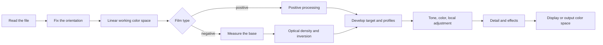

# Chroma Engine

[Docs home](../README.md)

Chroma Engine inverts and develops film. The code sits in the `Chromabase` module.
The app and the CLI use the same module, so the same input goes through the same order of steps.

| At a glance | Detail |
|---|---|
| Default develop | `MAIN`, manual correction |
| Film base | Automatic measurement, eyedropper, direct RGB entry |
| Internal color | 32-bit floating point linear color space |
| Automatic features | Applied only when you run them |
| Output color space | sRGB, Display P3, Adobe RGB, custom RGB ICC |

> [!IMPORTANT]
> Auto Tone, Auto White Balance, Auto Levels, and Auto Color never slip into the default
> develop.

## What comes first

1. If the film base can be measured, the measurement wins over the default picked by name.
2. Film properties, scan light source, scanner style, and scene auto-correction are kept apart.
3. Features like Auto Tone and Auto White Balance turn on only when you run them.
4. The same source, edit values, and profile bundle go through the same order of steps.
5. Synthetic tests and real device validation are never presented as the same evidence.

## Order of steps



The working image is processed in a 32-bit floating point linear color space.
Only the operations that need gamma convert at their fixed step.
Encoding for a screen or a file format happens at the end.

Apple's Core Image documentation:

- [CIImage](https://developer.apple.com/documentation/coreimage/ciimage)
- [CIContext](https://developer.apple.com/documentation/coreimage/cicontext)
- [workingColorSpace](https://developer.apple.com/documentation/coreimage/cicontext/workingcolorspace)
- [Core Image performance guide](https://developer.apple.com/library/archive/documentation/GraphicsImaging/Conceptual/CoreImaging/ci_performance/ci_performance.html)

`CIContext` is not rebuilt for every render.
It is reused, split by purpose: display, analysis, export.
The preview computes only the size it needs and the latest edit version.
Export renders again at source size.

## Film base

### Why measure it

The unexposed part of a negative is a reference point that combines film, development, and the scan
light source.
The orange mask of color negative is in there too.
Get the base wrong and every density and channel relationship after it goes wrong.

Kodak's Portra 400 data also records minimum density, characteristic curves, and dye spectral
density separately.

- [Kodak Professional Portra 400 technical data](https://www.kodakprofessional.com/sites/default/files/wysiwyg/pro/resources/e4050_portra_400.pdf)

### Automatic measurement

`FilmBaseEstimator` does not just average the few brightest pixels.

- A film pixel cannot be brighter than the unexposed base.
- Anything much brighter may be backlight, perforation, or outside the film.
- A real base tends to run in a wide band along the frame edge.
- With several film strips on one sheet, separated areas can be read together.
- A boundary where holder and film mix is trusted less than the interior.

It finds the brightness distribution on a downscaled analysis image, groups connected areas, then
removes candidates that lie outside the film.
When several strips pass the conditions, they are computed together.
The result also records which method was chosen and how confident it is.

### Choosing the method

| Mode | Behavior |
|---|---|
| `Manual` | Uses the RGB you entered as Dmin. A successful eyedropper pick lands here too. |
| `Film` | Uses the measurement as Dmin, and the chosen film mainly supplies `dmaxNorm`. Film and light source defaults come in only when the measurement fails. |
| `Auto` | Uses spatial analysis, and falls back to the edge-based method on failure. |

Without a manual value, or with a wrong film ID, it moves to the next safe method.
The brightest object in the scene is never taken straight as the film base.

## Optical density and inversion

Density comes from linear transmittance `T` and the per-channel base `Dmin`.

```math
D = \log_{10}\left(\frac{D_{\min}}{T}\right)
```

`D = 0` means the input equals the unexposed base. Perforation or backlight can go negative.
Those values stay finite and are not clipped on the spot.

### Film type data

The current table holds 27 film names, covering color negative, black and white, and motion picture
negative.

What the data is for:

- The Dmin default when the base cannot be measured
- Per-channel density range
- A safe range when low contrast makes automatic measurement wobble

Some values were approximated by reading curves in public material, and some were set
conservatively. 27 names do not mean 27 validated color profiles.
Once the base is measured, the measurement wins.

### Fixed print response

`MAIN` turns base-subtracted density into a monotonically rising curve.
The coefficients are not a hidden preset; they are computed from four anchors.

- The black point of the base
- 18% mid gray
- White at the measured density range
- Headroom for reflected light

The current curve is a stretched exponential and has an inverse across the whole range.
The round-trip test on synthetic negatives uses that inverse.
The equations and numbers are in [fixed print response](../reference/PRINT_RESPONSE.md).

Where the default path ends and automatic features begin:

- The fixed curve does not move exposure from a scene histogram.
- `applySceneRanged` measures the per-channel density range in use, but does not move mid exposure.
- A limited `CIVibrance` applies only to low-saturation scenes.
- Auto Levels, Auto Color, Auto Tone, and Auto White Balance are features you run yourself.
- No claim is made about exactly reproducing a particular paper or minilab.

## Profiles come in three kinds

| Kind | The question it answers | Values |
|---|---|---|
| Film stock | What is the film's base and density range | Dmin/Dmax, film type |
| Light source | How did the scan light source affect each channel | Channel gain, base-driven correction |
| Scanner target | What tone and color style does the result have | Relative statistics from scans shot for this project |

Keeping these three apart avoids the mistake of letting one film name stand for emulsion properties,
light source color, and a lab's output style at once.
When a real base exists, the measurement wins over light source defaults.
Scanner statistics are not used directly as an absolute color matrix for a scene.

The data is described in [film profiles](FILM_PROFILES.md).

## Develop targets

### `MAIN`

The default for ordinary development.
It does not fold in an unselected scanner style, Auto Levels, Auto Color, Auto Tone, or Auto White
Balance.
Base and density range measurement and the limited low-saturation vibrance are part of the basic
inversion.

### `PRINT`

The working image matches `MAIN`. A valid RGB printer ICC is applied once, at the end of export.
A missing or invalid profile fails instead of falling back to sRGB or some arbitrary paper values.

### `HS`, `SP`

Two stages.

1. `documentedCharacter`: `SP` uses a limited base character taken from six pairs of the same
negative through SP-3000 and negaflow MAIN.
`HS` builds its tone, neutral, and color character from published direction plus this project's
design values.
2. `scannerSignature`: only the relative difference from groups whose roll names and image counts
match across both machines is added.

`HS` includes sharpening on the brightness channel.
That radius and strength were not measured from the real machine. `SP` does not include it.

Every profile today is `realOnly`.

- The relative difference is computed only when roll names and image counts match closely enough.
- Values whose direction flips are not applied.
- Color components are dropped for black and white.
- If the SHA-256 of any file or manifest is off, the whole profile bundle is refused.

### `F135`, `HR`

These are two minilab styles built by the project, not measured machine clones.
`F135` uses a print-like S-curve with warm midtones; `HR` uses deep blacks and a calm neutral and
blue direction.
No claim is made of validating and cloning a specific machine.

### `EXPIRED`

A recovery target for old film.
It does not blanket-desaturate or stretch the range, and stays within limited correction that the
current evidence supports.

## Develop controls

| Group | Items |
|---|---|
| Tone | Exposure, contrast, highlights, shadows, whites, blacks, RGB and per-channel point curves |
| Color | Temperature, tint, vibrance, saturation, 8-color HSL, three-zone color grading, channel correction, black and white conversion and toning |
| Detail and effects | Sharpness, clarity, dehaze, film grain, vignette, halation, noise reduction |
| Local adjustment | Radial, linear, polygon, brush masks, dodge and burn |

These values are stored as a step-by-step edit history.
GrainMend and ordinary local adjustment differ in purpose and in how they are stored.

## Color management

If the input carries a valid ICC, that color space is read.
Internal math runs in the fixed linear working space, and the switch to an output space happens at
display, soft proof, and export.

Main supported outputs:

- sRGB
- Display P3
- Adobe RGB
- A user-selected RGB printer/output ICC

The printer profile's name, byte count, and SHA-256 are pinned when export starts.
If the file changes during the render, the run stops.

No claim is made that the current Core Image and ColorSync path produces bit-identical rendering
intent and black-point compensation on every macOS version.
That guarantee would need a separate ColorSync buffer path and memory checks for large 16-bit images
first.

## Performance and safety

- `CIContext` is reused per purpose.
- Adjustments use a lower-resolution preview; export rebuilds from the source.
- A result that took a while re-checks the frame ID, edit version, and session right before it is applied.
- When memory runs low, caches such as thumbnails and previews are dropped.
- Originals and edit history are kept apart from caches.

## Levels of validation

1. Formula tests: monotonicity of the curve, the anchors, the inverse
2. Synthetic images: known input and output, clipping, orientation, color space
3. Synthetic IT8: the mathematical round trip over 264 patches
4. Real shooting statistics: the `realOnly` profiles
5. REAL/TARGET pairs: a device quality gate with separate validation material
6. Real hardware: an actual scanner, film, display, and print

A good synthetic IT8 result does not prove absolute accuracy on real negatives.
Judging scanner profile quality follows [profile quality gate](../reference/PROFILE_QUALITY_GATE.md)
and [IT8 color validation](../reference/IT8_COLOR_VALIDATION.md).

## Where the code lives

- `Sources/Chromabase/Engine/`
- `Sources/Chromabase/Film/`
- `Sources/Chromabase/Develop/`
- `Sources/Chromabase/Adjustments/`
- `Sources/Chromabase/Profiles/`
- `Sources/Chromabase/Imaging/`
- `Sources/Chromabase/Export/`

The current product version is `1.0.4`.
The edit history and profile schemas will keep going through a validation process before they change
in later versions.
