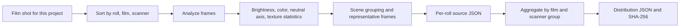

# Film profiles

[Docs home](../README.md)

The bundled scanner profiles are not downloaded LUTs or presets with a name slapped on.
The project author shot and sorted the film scans, analyzed them, and turned the result into JSON.

| Item | Current value |
|---|---:|
| Film type defaults | 27 |
| Creative looks | 6 |
| Scanner profiles | 15 |
| Roll observations | 25 |
| Image observations | 928 |
| Validation status | all `realOnly` |

> [!NOTE]
> `928` is the sum of observations per profile. It does not mean 928 different photographs.

## Three separate kinds of data

| Data | Format | Used for | Count |
|---|---|---|---:|
| Film stock | Swift | Dmin/Dmax and film type defaults | 27 |
| Look preset | JSON | Creative looks you pick | 6 |
| Scanner profile | JSON | Relative tone and color statistics seen in real scans | 15 |

27 film names do not mean 27 color accuracy profiles.
The 6 looks are a different thing from scanner profiles. What follows is about the third kind only.

## What is bundled today

`Sources/Chromabase/ScannerProfiles/` holds 15 of them.

<details>
<summary>See all 15 profiles</summary>

| Scanner | Film type | Film | Roll observations | Image observations | Status |
|---|---|---|---:|---:|---|
| NORITSU | color nega | Fuji C200 | 3 | 111 | `realOnly` |
| NORITSU | color nega | Kodak Ektar 100 | 2 | 76 | `realOnly` |
| NORITSU | color nega | Kodak Portra 160 | 1 | 37 | `realOnly` |
| NORITSU | color nega | Kodak Portra 400 | 2 | 75 | `realOnly` |
| NORITSU | color nega | Kodak Portra 800 | 1 | 38 | `realOnly` |
| NORITSU | color nega | Kodak Pro Image 100 | 1 | 37 | `realOnly` |
| NORITSU | color nega | Kodak UltraMax 400 | 1 | 38 | `realOnly` |
| NORITSU | color nega | Kodak Vision3 250D | 1 | 37 | `realOnly` |
| NORITSU | color nega | Kodak Vision3 50D | 1 | 38 | `realOnly` |
| NORITSU | color slide | Kodak Ektachrome 100 | 1 | 38 | `realOnly` |
| NORITSU | color slide | Kodak Ektachrome 100D | 5 | 181 | `realOnly` |
| SP-3000 | color nega | Kodak Ektar 100 | 2 | 76 | `realOnly` |
| SP-3000 | color nega | Kodak Portra 160 | 1 | 38 | `realOnly` |
| SP-3000 | color nega | Kodak Vision3 250D | 2 | 71 | `realOnly` |
| SP-3000 | color slide | Kodak Ektachrome 100D | 1 | 37 | `realOnly` |
| **Total** |  |  | **25** | **928** | **15 `realOnly`** |

</details>

25 and 928 are sums of observations per profile group.
The same physical roll or photograph can land in two scanner groups.
They do not mean 25 unique rolls or 928 unique photographs.

## How they are built



### 1. Shooting and sorting

Sources are split by scanner, film type, film name, and roll name.
Rotation and file parsing are confirmed before analysis. Empty or unreadable files do not count.

### 2. Frame measurement

These values are measured on each frame.

- Brightness percentiles and clipping at both ends
- Channel relationships in shadows, midtones, and highlights
- Saturation and hue distribution
- The Lab neutral axis of low-saturation pixels
- Gradient, sharpness, and a grain reference value

These are scene observations.
One frame's exposure or subject is never declared a fixed property of the scanner.

### 3. Scene grouping

Scenes are grouped by brightness, contrast, saturation, and hue range.
The count and distribution per group are recorded so one kind of scene cannot drag the whole
profile.

### 4. Representative frames

These frames are recorded separately so a person can go back to the source.

- The highest contrast frame
- The sharpest frame
- The frame with the highest grain reference value
- Frames that represent the brightness and saturation range

### 5. Roll and group aggregation

`scripts/compile_scanner_profiles.py` groups per-roll data into film and scanner groups.
Empty bins are not dressed up as zero observations.
It confirms that every value is finite and that the sample counts are real.

### 6. JSON and hashes

The final file carries the schema, ID, source counts, source paths, aggregate statistics,
validation status, and `profileHash`.
The checker verifies fields, counts, finite values, file name against ID, source counts,
and the hash.

## Shape of the JSON

<details>
<summary>Example profile JSON</summary>

```json
{
  "schemaVersion": 2,
  "id": "noritsu__color-nega__kodak-portra-400",
  "displayName": "NORITSU · color nega · Kodak Portra 400",
  "scanner": "NORITSU",
  "kind": "color nega",
  "filmKey": "kodak portra 400",
  "validationStatus": "realOnly",
  "rollCount": 2,
  "imageCount": 75,
  "singleRollLimited": false,
  "sourceProfiles": [],
  "tone": {},
  "color": {},
  "neutralAxis": {},
  "neutralAxisBins": [],
  "hueResponse": [],
  "texture": {},
  "sceneBuckets": [],
  "coverageCandidates": [],
  "profileHash": "sha256:..."
}
```

</details>

## Main entries

| Entry | Content | Watch out for |
|---|---|---|
| `tone` | Brightness distribution and clipping at both ends | One frame's exposure is not a machine property |
| `color` | Channels and saturation in shadows, midtones, highlights | An observed distribution, not an absolute color matrix |
| `neutralAxis` | Lab `a*` and `b*` of low-saturation pixels | Some scenes have no neutral object, so sample counts go with it |
| `hueResponse` | Saturation change and hue rotation per hue bin | Relative comparison only when both machines' data lines up |
| `texture` | Gradient, sharpness, grain reference value | Not used directly as a machine sharpening value |
| `sceneBuckets` | Per-scene statistics and representative frames | Lets a person trace the source again |

The brightness channel sharpening in the `HS` target is not a machine constant measured from
`texture` .
It does not synthesize new grain either. `SP`, `MAIN`, and `PRINT` do not include that sharpening.

## Evidence status

| Status | Meaning | Where it can be used |
|---|---|---|
| `draft` | Data or schema is unfinished | Not for bundling or automatic use |
| `realOnly` | Real scans exist, but there is no separate reference material | Manual selection only, no accuracy claims |
| `pairedSmoke` | Paired material confirms the processing path only | Not usable as quality evidence |
| `pairedValidated` | Passed calibration and validation material plus regression checks | Automatic selection allowed if policy permits |

All 15 today are `realOnly`. You can confirm they came from observations of real material,
but not that they produce the same result as the machine.

Claiming machine accuracy needs more material.

- An ID that confirms the same physical frame
- Validation material kept apart from calibration
- The conditions under which reference images were produced
- Scanner settings and operator choices
- Target batch, illumination, measurement method
- A per-image pass criterion

## How the app uses them

### Manual selection

Nothing is selected automatically today from a model name or file information.
You pick the `HS` or `SP` target and the profile yourself.
Automatic matching is allowed only for `pairedValidated`,
so it does not apply to the current bundle.

### The relative difference between two scanners

Absolute scene statistics are not used as-is.
Only the difference between matching groups from the two machines is used, and in a limited way.

- The tidied set of roll names has to match.
- The image count has to differ by 15% or less.
- A hue bin needs sample counts above the threshold on both sides.
- Values whose direction flips are not applied.
- Values between opposing gains are computed in the log domain.
- Tone is applied once to Rec.709 gamma brightness, and the Lab color components are preserved.

The source profiles carry no per-frame SHA-256.
Matching roll names are not evidence that the exact same frames were paired.

### Black and white, and positive

For black and white, the color components are dropped and only relative tone is used.
For positive, the absolute brightness of one roll is not carried onto another photograph.
That said, the base styles of `HS` and `SP` do apply to positives at half strength,
so the result is not always the same as `MAIN`.

### Texture

Without paired material from the same frame,
`texture` is not used as a machine-specific sharpening or grain value.
Focus, subject, JPEG processing, and the lab operator's choices are all mixed into those numbers.

## File integrity

`ScannerProfileRegistry` never opens just some of the 15.

1. Read the manifest schema.
2. Confirm that every file exists and check its SHA-256.
3. Recompute `profileHash` in each JSON.
4. Check the ID, file name, schema, status, counts, and finite values.
5. If any of it is off, refuse the whole bundle.
6. Cache only a read-only snapshot where everything matched.

The export record keeps the profile ID and SHA-256 that were actually used.

## Commands to check

Profile contract check:

```bash
python3 scripts/validate_scanner_profiles.py \
  --mode profile-contract \
  --profiles Sources/Chromabase/ScannerProfiles
```

Rebuilding:

```bash
python3 scripts/compile_scanner_profiles.py \
  --source LUT_target/SOURCE \
  --out LUT_target/PROFILES \
  --resource-out Sources/Chromabase/ScannerProfiles
```

REAL/TARGET quality gate:

```bash
python3 scripts/evaluate_profile_quality.py \
  --manifest LUT_target/quality/corpus-v1.json \
  --candidate-summary LUT_target/SOURCE/summary.json \
  --baseline-summary LUT_target/quality/accepted-summary-v1.json \
  --data-root LUT_target \
  --verify-files all \
  --report build/profile-quality-report.json
```

The repository currently has no REAL/TARGET manifest or accepted baseline to back a release claim.
The synthetic tests only confirm the failure conditions of the checking code;
they do not prove profile accuracy.

## References

- [Kodak Professional Portra 400 technical data](https://www.kodakprofessional.com/sites/default/files/wysiwyg/pro/resources/e4050_portra_400.pdf)
- [darktable negadoctor](https://docs.darktable.org/usermanual/4.6/en/module-reference/processing-modules/negadoctor/)

No profile numbers were taken from those sources.
They were read as background for why film base, scene tone,
and machine style have to be handled separately.
The JSON values come from material shot for this project and the analysis code in the repository.

## Code and related documents

- `Sources/Chromabase/ScannerProfiles/`
- `Sources/Chromabase/Profiles/ScannerProfile/`
- `Sources/Chromabase/Profiles/ScannerTargetGrade/`
- `scripts/compile_scanner_profiles.py`
- `scripts/validate_scanner_profiles.py`
- `scripts/evaluate_profile_quality.py`
- [Scanner profile quality gate](../reference/PROFILE_QUALITY_GATE.md)
- [IT8 color validation](../reference/IT8_COLOR_VALIDATION.md)
- [Chroma Engine](CHROMA_ENGINE.md)
