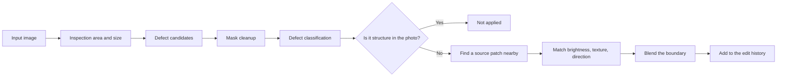

# GrainMend

[Docs home](../README.md)

GrainMend repairs dust, pinholes, scratches, and emulsion damage on film.
Nothing is baked into the original; the result is kept as an ordered edit history.

| Tool | Where it looks | How it repairs |
|---|---|---|
| Automatic | The whole photograph | Conservative, only defects it is confident about |
| Guided | An area you choose | Looks closely, down to small specks and faint defects |
| Brush | The spot you paint | Carries surrounding structure and texture across |
| Clone stamp | A source point you choose | Copies real source pixels at a fixed offset |
| IR | The scanner's infrared channel | IR finds the location, RGB rebuilds the pixels |

The develop screen has automatic, guided, brush, and clone stamp.
IR can be turned on at the scan step when the plugin reports the capability.
Once the scan is done, its result joins the same GrainMend layer list.

> [!CAUTION]
> GrainMend RGB works differently from hardware IR cleaning. GrainMend IR is not an implementation
> of, or a compatibility mode for, Digital ICE, iSRD, or SRDx.

## What makes it hard

Film defects and the structure of the photograph sit in the same pixels.

- Dust shows up as small, irregular bright or dark blotches.
- A pinhole can look like an isolated, strong dot.
- Scratches are long and thin, but so are wires, window frames, and lettering.
- Emulsion damage changes color and texture together.
- At high resolution, film grain is the same size as a small defect.

Wiping out high frequency as a whole takes grain and edges along with the dust.
GrainMend splits the work into detection, classification, repair, and storage.

## Order of work



The detection mask and the repaired result are kept apart.
That is what lets you inspect the mask, apply only some of the defects, or rebuild the repair.

## Tools

### Automatic

Across the whole photograph, it finds only defects it is confident about.
Missing a small defect is preferred over wrongly erasing a large structure.
It never slips into the default develop; you have to run it before anything is added.

### Guided

You pick a rectangle, and only that area and its surroundings are analyzed.
Since you have already pointed at the defect, it goes after small specks, faint defects, and dense
clusters more aggressively than automatic does.

It reads wider than the result it produces, so the surrounding pixels used for the repair are not
cut off at the edge of the area.
The current maximum context radius is 264 pixels.

### Brush

You paint the spot to repair yourself. It does not cover what you painted with a color.
It finds a matching source patch near the mask and carries the structure and texture across.
When no patch matches, it can fall back to the detection path in a limited way.

### Clone stamp

`⌥` click picks the source point, then you draw on the target.
It uses no automatic detection; it holds the offset between the two points and copies the real
pixels.

The edit history keeps diameter, hardness, coordinates, and offset.
It still applies to the same original coordinates after a rotation, a flip, or a crop.
Offsets snap to whole pixels, and nothing outside the image is applied.

### IR

Used only when the plugin hands over a real IR channel and the size and area line up with the RGB.
IR is the material that locates the defect. The final pixels come from the same repairer as RGB.

## Finding defects in RGB

### Difference from the surroundings

Brightness differs from photograph to photograph, so there is no single global threshold.
The difference from surrounding brightness, local variance, and direction produce bright dust and
dark defect candidates.

### Mask cleanup

Isolated noise is dropped, broken defects are joined, and pixels touching in any of 8 directions
become one blob.
A large area can be split into tiles, but a blob that straddles a boundary is merged again in
whole-image coordinates.

### Resolution differences

The same speck of dust is a different number of pixels at 1200 dpi and at 7200 dpi.
When resolution information can be trusted, the limits follow real size.
Without it, the scanner model is not guessed and a conservative pixel-based rule is used.

### Classification

Each blob is measured for:

- Area and bounding box
- Ratio of the long axis to the short axis
- Horizontal, vertical, diagonal direction
- Linearity, density, surrounding contrast
- Whether it continues into a nearby edge
- Its relationship with other blobs

The result is split into dust, pinhole, scratches by direction, emulsion damage, and micro specks,
each with a confidence.

### Not erasing lines that belong to the photo

Wires, railings, building corners, window frames, and lettering must not be read as scratches.
Parallel lines, grids, continuity of edges, and lines attached to scene structure get their own
check.
Automatic blocks false positives harder; guided also weighs the fact that you chose the location.

## Repair

1. Find a source patch near the defect that does not overlap the mask and whose structure matches.
2. Match the low-frequency brightness and color difference between the patch and the target.
3. Keep the patch's high-frequency texture so film grain carries across.
4. For a long scratch, look first at the direction that continues from both ends.
5. At the mask edge, blend the original and the repaired patch smoothly.

Strength is the blend ratio between the finished patch and the original.

Sometimes an automatic repair cannot know what was underneath.
If there is no usable surrounding texture, or the defect covered a whole important structure, it
needs the brush, the clone stamp, or separate precise work.

## IR handling

### Input conditions

- The plugin explicitly reports the IR capability.
- RGB and IR belong to the same scan session.
- Both images have the same pixel size and the same expected area.
- The files can be read and pass the original ID check.

Even when a model name is known to have IR, it is not used on screen or in a request unless the
plugin reports it.

### Alignment

Optics and sensor readout can leave RGB and IR a few pixels apart.
A wide search runs first, then a narrow one, to settle the offset.
The confidence of the peak, and whether it landed on the edge of the search range, are both
recorded.

Low confidence, or a best point stuck at the end of the search, does not count as success.

### Subtracting the scene pattern

Film dye and density can show through into IR.
The log brightness of the red channel is split into 64 bins, and in each bin the mean is taken after
dropping the top and bottom 10% of IR values.
Empty bins are interpolated from their neighbors and smoothed with a short symmetric kernel.
Subtracting this non-parametric curve reduces the scene pattern, and sparse dark dust is kept out of
the bin statistics.

What is left is converted to contrast relative to the local mean.
So a large defect cannot raise the noise floor around itself, the noise input is clipped at the
minimum detection contrast before the adaptive threshold is computed.
Connected dark regions at the holder and the film edge are removed from the mask.

### Safety conditions

- An abnormally wide mask is not applied.
- An alignment that could not be confirmed is not applied.
- It is not applied automatically to silver black and white.
- Color positive and special emulsions are not assumed safe without measurement.

Commercial IR tools place their own limits on ordinary black and white and on Kodachrome.

- [SilverFast: iSRD dust and scratch removal](https://www.silverfast.com/about-silverfast-why-scanning-basics-of-scanning/why-silverfast/silverfast-feature-highlights/isrd-dust-scratches-removal-eliminate-defects-with-infrared-channel/)

GrainMend IR is not a copy of, or a compatibility mode for, those commercial tools.

## Edit history and storage

Automatic, guided, brush, clone stamp, and IR share one ordered edit list.

What each entry carries:

- ID and kind
- Order of application
- Whether it is on, and its strength
- Area, mask, clone source offset
- Defect classification and diagnostic values
- Original frame and edit version
- The repaired patch, or the values needed to rebuild it

An earlier repair changes the input to a later one, so the order of the list is part of the edit
history too.

The original is not modified. GrainMend history is stored in a sidecar the app manages.
Original SHA-256, edit version, and a history fingerprint tie the input together.
If the sidecar is missing or broken, the cache is not treated as an original.

The GrainMend cache is a derived file, there for fast display and re-rendering.
If it is missing or fails its check, it is rebuilt from the original and the edit history.
If the result an export needs cannot be produced, the export fails instead of substituting the
original.

## Performance

- A small edit recomputes only the defect and its surrounding context.
- A large area is split into overlapping tiles with margin for the boundary.
- Results are collected only from the non-overlapping centers of the tiles.
- At most 4 tiles are processed at once.
- `CleanedRawCanvas` copies only the rectangle that changed.
- Copies for undo share storage until something actually changes.
- Under memory pressure, rebuildable images and the patch cache are dropped.

Real times depend on resolution, defect count, area size, and the Mac.

Measured 2026-07-25 on a Release build, Mac14,3, arm64, 24 GiB of memory, macOS 26.5.

| Path | Input | Result |
|---|---|---:|
| Guided detection | 1600×1600, 25 specks of dust | 0.35 s, 25 detected |
| Partial ROI detection | 1600×1600 | 0.38 s |
| Guided dense stress | 1280×960, 8 images × 3 runs | median 0.423 s, p95 0.488 s, max 0.526 s |
| IR detection | 6000×4000, 24MP | 1.042 s, peak memory growth 249.2 MiB |

Across 24 dense stress runs, the lowest mask coverage at defect sites was 99.80%, and the highest
mean residual error was 2.70/255.
These are regression measurements on synthetic input.
They do not promise processing times on another Mac or on real film.

## Benchmark

`defect-bench` can produce these files and values.

- before, after, diff, mask
- 100% crops
- Detection count and confidence
- Processing time
- PSNR and absolute error when reference images exist

```bash
swift run -c release negaflow defect-bench <input-dir> \
  --reference-dir <reference-dir> \
  --out <report-dir>
```

RGB regression uses the 44 damaged/expert-restored pairs from FILM-R v2.

- DOI: <https://doi.org/10.6084/m9.figshare.21803304.v2>
- License: CC BY 4.0
- Pairs: 44
- Total size: 437,570,872 bytes

The automatic path shipped on 2026-07-25 applies sensitivity 0.7 and an over-detection safety line.
Against the previous 3.0 baseline, of the 44 FILM-R images the ones that improved went from 11 to
34, and the ones that got worse went from 33 to 6.
Mean PSNR change moved from -1.688 dB to
+0.466 dB, and the worst case from -18.952 dB to -1.338 dB. Weighted worsened pixels dropped from
0.792% to 0.017%.

When automatic meets a high density of candidates it stops applying and points you at guided.
That safety line does not apply to guided, where you set the range, nor to the brush, the clone
stamp, or IR.
Even with better results, 6 images still have lower PSNR than the expert restoration.
None of this proves every photograph improves, that RGB and IR are equivalent, or anything about IR
quality on a real scanner.

The full table and the commands are in
[GrainMend real scan comparison](../validation/GRAINMEND_CORPUS.md).

Per-film IR limits and the conditions where alignment fails are collected in
[Film GrainMend IR should avoid](../reference/INFRARED_LIMITS.md).

## Test coverage

- 8-direction connectivity and masks
- Morphological operations
- Dust, scratch, and micro speck detection
- Rejecting lines and grids as false positives
- Tile boundaries in a large area
- Scratch repair by direction
- Matching surrounding texture and brightness
- Brush masks
- Clone stamp offset, hardness, patch composition
- IR alignment, anchors, blobs, memory limits
- Applying at the original stage and rendering the app's edit history
- Adding repeatedly, and undo
- Frame ownership while moving around the screen

Some performance tests run only when an environment variable is set.
The presence of a test file is not a claim that it ran in every environment.

## Names and trademarks

`GrainMend` is negaflow's own feature name.

- `Digital ICE` may be a trademark of Eastman Kodak Company or a related rights holder.
- `iSRD`, `SRDx`, and `SilverFast` are trademarks of LaserSoft Imaging.
- These names are used only for technical comparison and product identification.
- GrainMend claims no affiliation, compatibility, or equivalence with third-party technology.

## Where the code is

- `Sources/Chromabase/DefectRemoval/`
- `Sources/negaflowApp/Features/Defects/`
- `Sources/negaflowApp/Features/Develop/Inspector/Tools/DefectControlsSection.swift`
- `Sources/negaflowCLI/Commands/CLI+DefectBenchCommand.swift`
- `Tests/ChromabaseTests/Defect*.swift`
- `Tests/negaflowAppTests/Defect*.swift`
- `Config/defect-corpus-film-r-v2.json`
- `scripts/defect-corpus/`
