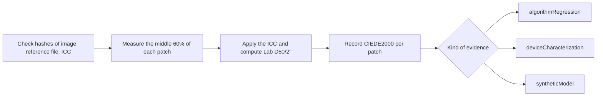

# IT8 color validation

[Docs home](../README.md)

Color accuracy is not passed by looking at a screen.
An IT8 image and the reference file that belongs to its physical target are pinned as a pair,
and every patch is written down as numbers.

> [!IMPORTANT]
> Public IT8 material can confirm regressions in the checker and the color math. It cannot prove
> the accuracy of a real scanner or of color negative film. Judging a device needs a confirmed
> physical target and real measurements from that device.

## Kinds of evidence

| Name | What it confirms | What it does not |
|---|---|---|
| `algorithmRegression` | File parsing, ICC conversion, patch areas, Lab, CIEDE2000 | Real scanner accuracy |
| `deviceCharacterization` | A confirmed physical target measured on a real device | Accuracy of another target or device |
| `syntheticModel` | The mathematical round trip of an independent synthetic model | Real film or device accuracy |

`deviceCharacterization` needs the manufacturer, material, serial, and batch of the physical target.
If even one of them differs from the reference file header, nothing is evaluated.

IT8.7/1 and ISO 12641-1 transmissive targets are for positive transmissive originals.
These results say nothing about the orange mask of color negative, dye interaction, C-41 variation,
or NORITSU/FUJI output accuracy.
Those claims need paired material of the same color negative run through both paths,
plus a separate validation set.

## Public regression material

These two FADGI/OpenDICE files are used as a pair.

- Guide: <https://www.digitizationguidelines.gov/guidelines/digitize-OpenDice.html>
- Image: <https://www.digitizationguidelines.gov/guidelines/OpenDICE/IT8-7.1.tif>
  - SHA-256: `c62ee73f26390a2ad90e7e28280cbd1efb4f18834425bb7112ff1f8016832ffd`
  - Size: `6255 x 4170`
  - Format: 16-bit RGB with `Adobe RGB (1998)` embedded
- Reference file: <https://www.digitizationguidelines.gov/guidelines/OpenDICE/Profile_IT8-7.1.txt>
  - SHA-256: `19337b85f213eb4397e91c91298201f421ef3ca33b0ef6da3d752a0880491840`
  - Patches: 264 Lab values from `A1` to `L22`
  - Column 16: density

Redistribution rights are not confirmed, so the files stay out of the repository and the app.
You download them yourself and point the [example manifest](IT8_FADGI_OPENDICE.example.json) at
them.
The grade in that example is `algorithmRegression`.
Renaming it to `deviceCharacterization` gets it refused by the checker.

```bash
swift run negaflow it8-bench docs/reference/IT8_FADGI_OPENDICE.example.json \
  --image /path/to/IT8-7.1.tif \
  --reference /path/to/Profile_IT8-7.1.txt \
  --out /path/to/it8-report.json
```

## Measurement rules

- If the SHA-256 of the image, the reference file, or the chosen ICC differs from the manifest, it stops.
- Report v2 also records the SHA-256 of the manifest text itself.
- `A01` and `A1` read the same coordinates, and the original ID stays in the report.
- The middle 60% of each patch in the 22 by 12 grid is read at source resolution in floating point.
- Patch order is rows `A`–`L`, columns `1`–`22`.
- The embedded ICC is respected.
- The math runs linear sRGB D65 to XYZ, Bradford D50 adaptation, then Lab D50/2°.
- Each patch records its area, pixel count, RGB mean and standard deviation, clipped ratio at both ends, non-finite count, reference and measured Lab, L/a/b differences, and CIEDE2000.
- Median, p95, and max are observations, not a pass mark.
- No average threshold is invented without grounds, and `qualityDecision` stays `notEvaluated`.
- A target used to fit a profile is not reused for independent validation.

### Physical target details

For a real device measurement, the operator reads these off the target label and writes them down.

<details>
<summary>Example measurement block</summary>

```json
{
  "measurement": {
    "samplerVersion": "center-mean-v1",
    "renderingIntent": "relativeColorimetric",
    "physicalTargetIdentity": {
      "manufacturer": "target label manufacturer",
      "material": "target label material",
      "serial": "target label serial",
      "batchMetadataKey": "PROD_DATE",
      "batchValue": "reference header production date"
    }
  }
}
```

</details>

`MANUFACTURER`, `MATERIAL`, `SERIAL`, and the batch header (one of `BATCH`, `BATCH_ID`,
`PROD_DATE`) have to match the reference file character for character.
The top-level `targetID` has to equal `serial`, and `batchID` has to equal `batchValue`.

This record only shows that what the operator wrote and the reference file agree.
It does not read the label from the image or independently certify the operator's input.
When the details are missing, the nearest date or a generic reference file is not substituted.

If the reference file carries illuminant or observer information,
it is checked against the D50/2° contract. A contradiction stops the run.
`measurement.renderingIntent` cannot pin the Core Image conversion directly today,
so the report says `manifestDeclarationNotControlledByEvaluator`.

## `PRINT` output

IT8.7/1 is for input devices.
Printer output needs an RGB printer ICC built from real measurements of the
`printer + paper + ink/chemistry + driver/process condition` combination.

Order of checks and use:

1. Confirm the ICC size, `prtr` device class, `RGB ` data space, Lab/XYZ PCS, and the `acsp` signature.
2. Confirm that ColorSync can convert in both directions.
3. On selection, pin the profile name, bytes, and SHA-256.
4. Apply it once, to the final output, after the `MAIN` working image and page layout are done.
5. Do not apply it to `rawScanTIFF` or `-main-flat`.
6. A missing or wrong profile fails before any temporary output. sRGB does not stand in.

No claim is made that the current Core Image and ColorSync path pins rendering intent and
black-point compensation bit for bit across every macOS version.

## `MAIN` synthetic patch regression

The default color negative path uses `shoulder-print-response-v4`.

```math
\log_{10}(P) =
y_{\mathrm{ceil}} -
\mathrm{amplitude}\,
\exp\left(-(\mathrm{rate}\,d)^{\mathrm{shape}}\right)
```

`d` is optical density with Dmin removed, then normalized.
The coefficients are not stored presets; they are computed from these four anchors.

| Anchor | Value |
|---|---:|
| Base black point | `0.001` |
| Mid gray | `0.18` |
| White at the measured densest area | `0.70` |
| Reflected light headroom | `0.90` |

On this curve `0D` is linear `0.001`, `0.6D` is `0.18`, and `3D` is `0.882836683855`.
The output stays inside an open interval,
so black and white in the normal range do not clip straight to 8-bit `0/255`.

It is not an exposure auto-adjustment from a scene histogram,
and it does not stand for the accuracy of any particular film or machine.
The equations are in [fixed print response](PRINT_RESPONSE.md).

`MainSyntheticIT8RoundTripTests` turns the 264 reference patches into negatives with the inverse
function,
then brings them back through the whole `MAIN` path.
Lab D50/2° and `DeltaE00` are checked per patch. This is a `syntheticModel` regression.

## NORITSU/FUJI relative style regression

A reference file with 264 Lab D50 patches from `A1` to `L22` is pinned by SHA-256.
Each patch becomes a synthetic negative, then the `MAIN`, `NORITSU`,
and `FUJI` paths each run twice.

```bash
swift run negaflow scanner-relative-it8-bench \
  /path/to/Profile_IT8-7.1.txt \
  --sha256 sha256:19337b85f213eb4397e91c91298201f421ef3ca33b0ef6da3d752a0880491840 \
  --out /path/to/scanner-relative-it8-report.json
```

The report carries RGB and Lab per patch, `DeltaE00` against the reference,
relative `DeltaE00` between targets, and flags for clipping and non-finite values.
Monotonicity of the neutral ramp is read from the `A16...L16` density column.

Colors that fall outside 0...1 once converted to linear sRGB cannot be built exactly as a synthetic
negative,
so they are limited to the displayable range.
Wide-range statistics are therefore observations, not a pass mark.

The evidence grade is always `syntheticModel` and the decision is always `notEvaluated`.
If the profile manifest or the SHA-256 of any file is off, the run stops.
Real machine accuracy needs scans of the same physical negative on both machines plus separate
validation material.

D50/2° was not confirmed from the reference file header.
It is the bench's own contract for reading Lab as D50/2°,
so `colorimetryInterpretationProvenance` is `benchmarkContractNotVerifiedFromReferenceHeader`.

Results from before `shoulder-print-response-v4` are not reused as results of the current algorithm.

## Measurement flow


