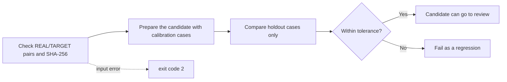

# Scanner profile quality gate

[Docs home](../README.md)

`scripts/evaluate_profile_quality.py` checks that a change to a scanner profile did not come out worse than the accepted baseline. It compares two `SOURCE/summary.json` files produced by `LUT_target/analyze_lut_target.py`, and only the validation cases that were kept out of profile tuning count toward the decision.

The tool does not decide what "good color" is. Which numbers should go down, which should go up, and how much movement is acceptable are written into the corpus manifest by a person. No default pass values are handed out.

There is no REAL/TARGET image pair in this repository today. So there is no real corpus manifest, no accepted baseline, and no pass result from a real device either. The synthetic tests check the checker's code and nothing else.

> [!WARNING]
> Scanner color accuracy cannot be approved from this repository alone. A real release decision needs pinned REAL/TARGET pairs, validation cases that were not used for tuning, and tolerances set by a person.

## How far the app uses the current profiles

When you pick the `NORITSU` or `FUJI` target yourself, a limited relative difference from the bundled `realOnly` group can be used.

Conditions:

- Film type and film name match.
- The tidied set of source roll names matches.
- The image count differs by 15% or less.

The source profiles carry no per-frame ID or SHA-256. Matching roll names are not evidence that the exact same frames were paired. So this cannot be called the same result as the real machine.

Rules for applying it:

- Values that point in opposite directions across the two groups are not applied.
- For black and white, all color components are dropped and only the relative tone stays.
- The NORITSU/FUJI relative correction is not applied to a slide profile with no matching roll.
- Without paired material from the same position, scanner texture and sharpening are not applied.
- Tone is applied once to Rec.709 gamma brightness, and Lab `a*` and `b*` are preserved.
- Color gain is interpolated in the log domain so the relationship between opposing anchors holds.
- If the SHA-256 of any file or manifest is off, the whole profile bundle is refused.

## What manufacturer material can confirm

- The [Fujifilm Frontier 570/SP-3000 guide](https://www.photolabdigital.com/fuji_frontier570_en%5B1%5D.pdf) names features like the area CCD, Hyper-tone, and Hyper-sharpness, but publishes no transfer function or setting values.
- [Noritsu HS-1800 product information](https://www.noritsu.eu/hardware/noritsu-film-scanner.html) lists supported formats, resolution, and throughput, but gives no fixed color transfer function.
- [Noritsu patent US 7,589,863](https://patents.google.com/patent/US7589863/en) describes the minilab flow where an operator chooses density, gradation, and sharpening.

This material shows that processing changes with the scene and the operator. It does not hand over constants for reproducing an HS-1800 or an SP-3000. negaflow does not guess such values from a product name.

## Corpus manifest schema v1

The manifest sits next to the input material it pins, for example `LUT_target/quality/corpus-v1.json`. Paths are relative to the manifest file. With `--data-root`, that path becomes the base instead.

<details>
<summary>Example manifest</summary>

```json
{
  "schemaVersion": 1,
  "corpusVersion": "scanner-corpus-2026-07-10.1",
  "acceptedBaselineSHA256": "sha256:<64 lowercase hex>",
  "cases": [
    {
      "role": "calibration",
      "stem": "NORITSU/color nega/Portra 400/calibration-01",
      "real": {
        "path": "REAL/NORITSU/color nega/Portra 400/calibration-01.tif",
        "sha256": "sha256:<64 lowercase hex>"
      },
      "target": {
        "path": "TARGET/NORITSU/color nega/Portra 400/calibration-01.tif",
        "sha256": "sha256:<64 lowercase hex>"
      }
    },
    {
      "role": "holdout",
      "stem": "NORITSU/color nega/Portra 400/holdout-01",
      "real": {
        "path": "REAL/NORITSU/color nega/Portra 400/holdout-01.tif",
        "sha256": "sha256:<64 lowercase hex>"
      },
      "target": {
        "path": "TARGET/NORITSU/color nega/Portra 400/holdout-01.tif",
        "sha256": "sha256:<64 lowercase hex>"
      }
    }
  ],
  "metrics": [
    {
      "name": "mean_delta_e2000",
      "direction": "lowerIsBetter",
      "allowedRegression": 0.0
    },
    {
      "name": "similarity_score_0_100",
      "direction": "higherIsBetter",
      "allowedRegression": 0.0
    },
    {
      "name": "neutral_a_shift",
      "direction": "absoluteLowerIsBetter",
      "allowedRegression": 0.0
    }
  ]
}
```

</details>

The `0.0` in the example is not a recommendation. Set the entries and tolerances to match how you measure and what your release policy is.

## Manifest rules

- `schemaVersion` has to be exactly `1`.
- Unknown versions and unknown fields are refused.
- `corpusVersion` names a fixed selection and split of the material.
- `acceptedBaselineSHA256` pins the exact bytes of the accepted `summary.json`.
- Each case is either `calibration` or `holdout`.
- Names cannot repeat.
- The material cannot be empty, and both roles need at least one case.
- REAL and TARGET files are both pinned as `sha256:<64 lowercase hex>`.
- Metric names cannot repeat.
- `allowedRegression` has to be a finite number of zero or more. Booleans are refused.
- Only `lowerIsBetter`, `higherIsBetter`, and `absoluteLowerIsBetter` are accepted directions.

`absoluteLowerIsBetter` compares distance from zero. Use it only when zero is the reviewed reference.

## Preparing the candidate and the accepted baseline

```bash
python3 LUT_target/analyze_lut_target.py
```

Before approving a release, keep the candidate's whole `SOURCE/summary.json` as the next accepted baseline file. The existing accepted file is not overwritten until the candidate has passed review. Put the exact SHA-256 of the accepted file into `acceptedBaselineSHA256`.

The candidate and baseline summaries have to contain each case from the manifest exactly once. A missing case, a duplicate, a processing failure, or a case outside the manifest is an input error.

`calibration` cases can be used to fit the profile. They do not count toward the decision. `holdout` cases stay out of tuning and selection. Validation numbers are compared case by case, so an average improvement cannot hide one image getting worse.



## Running it

<details open>
<summary>Quality gate command</summary>

```bash
python3 scripts/evaluate_profile_quality.py \
  --manifest LUT_target/quality/corpus-v1.json \
  --candidate-summary LUT_target/SOURCE/summary.json \
  --baseline-summary LUT_target/quality/accepted-summary-v1.json \
  --data-root LUT_target \
  --verify-files all \
  --report build/profile-quality-report.json
```

</details>

File verification modes:

| Value | What it does | Usable as release evidence |
|---|---|---|
| `all` | Checks path and SHA-256 of every REAL/TARGET file | Yes |
| `holdout` | Checks the validation files only | For quick diagnosis |
| `none` | Does not check image files | No |

The default is `all`. The report records the mode that was used, the hashes of the manifest and summary files, the file verification result, and the per-case comparison and counts for the validation set. The same JSON goes to stdout and to the `--report` file. The file is saved atomically.

Exit codes:

- `0`: input is valid and nothing regressed beyond tolerance
- `1`: input is valid but at least one validation value went out of range
- `2`: schema, material, hash, path, or metric is wrong or missing

## Testing the checker

```bash
python3 -m unittest scripts/tests/test_evaluate_profile_quality.py
```

The tests use temporary synthetic files to cover a normal comparison, a regression, a changed hash, a bad schema and bad numbers, duplicate, missing, and failed cases, and empty material. They do not prove the quality of real scanner output.
