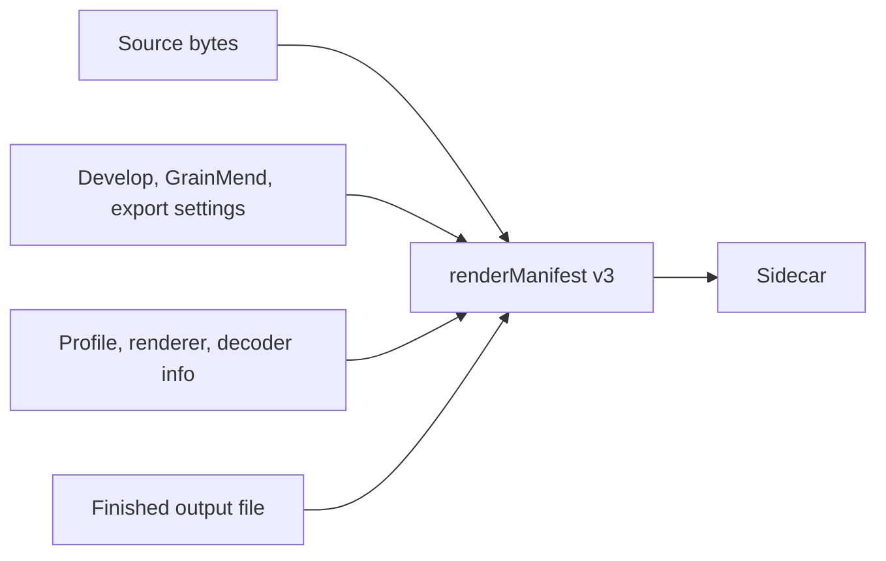

# Render manifest

[Docs home](../README.md)

`renderManifest` in the sidecar links the source, the edit values, and the final file with SHA-256.
File paths are not recorded.

> [!IMPORTANT]
> `renderManifest` is a record of hash relationships between files and settings. There is no
> digital signature and no certificate, so it is not called C2PA Content Credentials.

What v3 holds:

- Source byte count, SHA-256, and the algorithm name `sha-256`
- Which render input was actually used
- The checked scope of the GrainMend cache file or memory input
- SHA-256 of the develop, GrainMend, and export settings
- SHA-256 of the scanner profile
- Decoder origin and chroma engine renderer version
- SHA-256, byte count, pixel size, and format of the final file

After the encoder finishes writing, the file is opened again with ImageIO to confirm the pixel size,
and the whole file is hashed.
The sidecar is written after that.
If the v3 check fails, the result is not published as a finished output set.

## GrainMend input

- `cleanedMemory`: pixels in memory have no standard hash, so the checked scope is recorded as
`sourceAndDevelopRecipe`. The SHA-256 of the GrainMend edit history is always included.
- `cleanedFile`: the whole GrainMend cache file and the edit history are both hashed.

Old v1 and v2 files still open.
Output hashes or GrainMend history hashes that did not exist back then are not filled in later by
guessing.

## How this differs from C2PA

There is no digital signature, certificate, trust chain, or embedded claim store here.
That is why it is not called C2PA Content Credentials.
The hard binding and processing history ideas of C2PA and the integrity idea of PREMIS were useful
as references, but only SHA-256 values that can be checked go in.

Sources:

- [C2PA Content Credentials 2.2](https://spec.c2pa.org/specifications/specifications/2.2/specs/C2PA_Specification.html)
- [C2PA hard-binding guidance](https://spec.c2pa.org/specifications/specifications/2.4/guidance/Guidance.html)
- [PREMIS preservation metadata](https://www.loc.gov/standards/premis/)
- [Apple Image I/O orientation and image properties](https://developer.apple.com/documentation/imageio/cgimagepropertyorientation)
