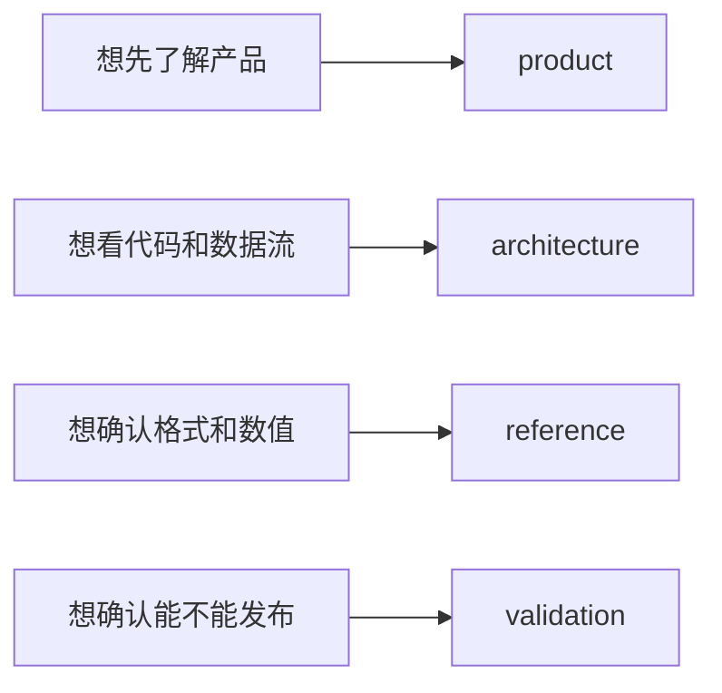

# negaflow 文档

按内容分开，方便直接打开需要的那一份。

[English](../README.md) · [한국어](../ko/README.md) · [日本語](../ja/README.md) · 简体中文 ·
[Français](../fr/README.md) · [Deutsch](../de/README.md)

> [!NOTE]
> 当前版本是 `1.0.2`。做了什么、实际验证到哪一步，都记在
> [项目状态](product/PROJECT_STATUS.md)里。

## 产品

| 文档 | 什么时候看 |
|---|---|
| [色彩引擎](product/CHROMA_ENGINE.md) | 想了解胶片反转和显影顺序时 |
| [GrainMend](product/GRAINMEND.md) | 想看灰尘和划痕怎么修复时 |
| [胶片配置文件](product/FILM_PROFILES.md) | 想确认内置配置文件的来源和限制时 |
| [项目状态](product/PROJECT_STATUS.md) | 想确认实现、测量和发布状态时 |

## 结构

| 文档 | 内容 |
|---|---|
| [产品结构](architecture/PRODUCT_ARCHITECTURE.md) | 应用、引擎、存储、导出之间的数据流 |
| [目录存储结构](architecture/CATALOG_STORAGE.md) | 为什么用 SQLite、旧格式、实测数值 |
| [扫描仪插件结构](architecture/SCANNER_PLUGINS.md) | 外部进程、批准、扫描文件的公开 |
| [图库保存归档](architecture/LIBRARY_ARCHIVE.md) | 原件和编辑记录如何一起保存 |

## 规格

| 文档 | 内容 |
|---|---|
| [扫描仪 CLI JSON](reference/CLI_JSON.md) | `detect --json` 和 `capabilities --json` 的输出形式 |
| [渲染记录](reference/RENDER_MANIFEST.md) | 原件、编辑值、输出文件之间的 SHA-256 关系 |
| [固定印相响应](reference/PRINT_RESPONSE.md) | `shoulder-print-response-v4` 的公式和基准点 |
| [扫描仪配置文件质量判定](reference/PROFILE_QUALITY_GATE.md) | REAL/TARGET 配对素材的发布判定 |
| [扫描仪噪声配置文件](reference/SCANNER_NOISE_PROFILES.md) | 重复扫描测量与自动应用的条件 |
| [GrainMend IR 要避开的胶片](reference/INFRARED_LIMITS.md) | 黑白、Kodachrome、RGB/IR 对齐的限制 |
| [IT8 色彩检验](reference/IT8_COLOR_VALIDATION.md) | 色块测量、证据等级、合成回归 |

## 验证

| 文档 | 什么时候用 |
|---|---|
| [实机检查表](validation/REAL_QA_CHECKLIST.md) | 检查真实 Mac、显示器、扫描仪和胶片时 |
| [GrainMend 实际扫描比较](validation/GRAINMEND_CORPUS.md) | 重新测量 FILM-R v2 的 44 对样本时 |

## 来源与分发

| 文档 | 什么时候用 |
|---|---|
| [代码与资源来源](legal/PROVENANCE.md) | 确认 Apache/GPL 边界和内置资源哈希时 |
| [`TRADEMARKS.md`](../../TRADEMARKS.md) | 确认胶片、扫描仪和产品名称的用法时 |

## 写法

- 产品说明只写用户现在看得到的行为。
- 结构文档写职责范围和数据流向。
- 规格文档里的代码值、字段名和哈希保持原样。
- 验证文档把通过的和还没确认的分开写。
