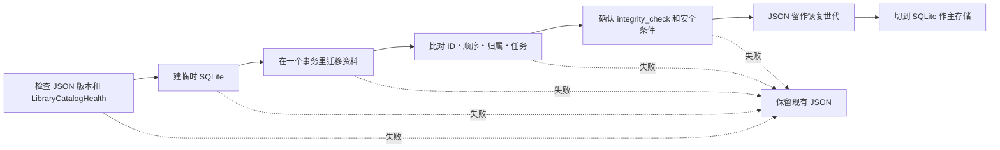

# 目录存储结构

[文档首页](../README.md)

主存储是 `library.sqlite`。旧的 `library.json` 只在迁移旧资料和生成诊断文件时用。 没有同时更新两个文件的做法，所以也没有 `dual-write`。

备份和保存归档里放的是可以在设备之间迁移的 JSON 表示，正在运行的 SQLite 文件不放进去。

| 类别 | 格式 | 用途 |
|---|---|---|
| 主目录 | SQLite | 应用运行、检索、保存、恢复 |
| 旧资料 | JSON | 导入已有目录 |
| 备份・保存归档 | JSON 表示 | 迁到别的设备、还原 |

> [!IMPORTANT]
> 目录缺失或损坏时不会以空图库启动。在找到正常世代之前，原目录和照片文件都不动。

## 实测

在同一台 Mac 上用下面的命令比较了 JSON 和 SQLite。

<details>
<summary>测量命令</summary>

```bash
DEVELOPER_DIR=/Applications/Xcode.app/Contents/Developer \
  NEGAFLOW_CATALOG_PERF_REPORT="$PWD/build/performance/catalog.json" \
  bash scripts/performance/run-catalog.sh

DEVELOPER_DIR=/Applications/Xcode.app/Contents/Developer \
  NEGAFLOW_LIBRARY_QUERY_PERF_REPORT="$PWD/build/performance/library-query.json" \
  bash scripts/run-library-query-performance.sh

DEVELOPER_DIR=/Applications/Xcode.app/Contents/Developer \
  NEGAFLOW_SQLITE_CATALOG_PERF_REPORT="$PWD/build/performance/catalog-sqlite.json" \
  bash scripts/performance/run-sqlite-catalog.sh
```

</details>

测量时间 2026-07-12，环境是 Mac14,3、arm64、8 核、24 GiB 内存、macOS 26.5、Swift Release 构建。 这些数字说明不了别的 Mac 有多快，只是在同样环境里发现回退用的基准。

| 画面数 | JSON 大小 | 编码 p50 | 解码 p50 | 读文件 p50 |
|---:|---:|---:|---:|---:|
| 1,000 | 2,192,671 字节 | 98 ms | 241 ms | 231 ms |
| 10,000 | 21,934,841 字节 | 811 ms | 2,301 ms | 2,299 ms |
| 50,000 | 109,721,335 字节 | 2,746 ms | 7,353 ms | 7,397 ms |

把 50,000 画面编码成 JSON 时，resident memory 涨了约 191 MiB，max RSS 涨了约 107 MiB。 同一批资料里，内存检索准备用 32.86 ms，全部名称排序 86.01 ms，过滤后名称排序 158.37 ms。 连着做四次过滤投影，p50 是 512.80 ms。

当前 SQLite 行存储，50,000 画面的 Release p95：

| 操作 | p95 |
|---|---:|
| 新提交 | 3,714 ms |
| 读主文件 | 7,446 ms |
| 无变更的提交 | 3,856 ms |
| 每画面大小 | 约 4,211 字节 |

备份不会把整个数据库读进 `Data`。它先做一份支持复制的临时副本，再原子替换。 备份前的检查也不解码所有画面，只看 SQLite 完整性和表结构。 这一改，无变更提交的 p95 从 11,245 ms 降到 3,856 ms。

## 为什么选 SQLite

- 多行改动能装进一个事务。
- 借助行和索引，只读需要的画面。
- 用 macOS 自带的 SQLite C API，不用加新依赖。
- 能守住现在的恢复规则：损坏的存储绝不当成空图库。

目前用 `journal_mode=DELETE` 和 `synchronous=FULL`。 用 WAL 就得把数据库和 `-wal` 文件当成一个整体来处理。 正在运行的数据库不会随手复制，只有关闭连接后确认过的主文件才会做成恢复副本。

## 代码各自负责什么

- `CatalogStore`：连接、事务、表结构版本、完整性检查
- `CatalogMigration`：只读的 JSON 导入和按版本转换
- 实体表：画面、原件、排序、胶卷、文件夹、收藏、检索、扫描任务
- `LibraryBackupStore`：可迁移的 JSON 备份、还原前检查、恢复信息

显影数值和按版本的编辑记录，按实体存成 JSON BLOB。原始像素、缩略图和 GrainMend 缓存不进数据库。

检索和排序用的列和索引还不够，所以启动时会把整个目录读进内存。 这就是现在 SQLite 读取时间和 JSON 差不多的原因。下一步是只读所需列和画面的索引查询。

## 迁移旧 JSON 的步骤



哪一步失败，都把现有 JSON 原样留下，不会以空目录启动。 就算残留了中间文件和标记，也要等原始 SHA-256 和两份目录对得上才继续。

迁完之后不会自动退回 JSON。 为了防止旧版本应用改动 JSON、把存储劈成两份，会检查最低读取版本和迁移标记。

## 没选的做法

- **整个目录放一个 JSON：** 简单，但读 50,000 画面要约 7.4 秒，每次保存都重写整份文件。
- **每个画面一个 JSON：** 部分写入变小，但要自己写一次保存多个实体并校验关系的代码。
- **现在就换 Core Data：** 可以，但等于一口气重做现有的 Codable 转换和恢复约定。等真实原型测得比 raw SQLite 更好，再重新考虑。

## 参考

- [Apple: Tuning for Performance and Responsiveness](https://developer.apple.com/library/archive/documentation/General/Conceptual/MOSXAppProgrammingGuide/Performance/Performance.html)
- [Apple: Reducing disk writes](https://developer.apple.com/documentation/xcode/reducing-disk-writes)
- [SQLite: Atomic Commit](https://sqlite.org/atomiccommit.html)
- [SQLite: Write-Ahead Logging](https://sqlite.org/wal.html)
