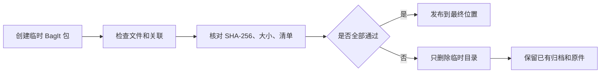

# 图库保存归档

[文档首页](../README.md)

目录备份是为了让应用尽快恢复，所以不放原始照片。
`.negaflowarchive` 归档把下面这些资料打包在一起。

| 放进去 | 不放 |
|---|---|
| 可迁移的目录 JSON | 正在运行的 SQLite 文件 |
| 被引用的原件和留下的 IR 原件 | 缩略图和预览 |
| 还需要的 GrainMend 编辑记录 | 可以重新生成的 GrainMend 缓存 |
| 虚拟副本和共享原件的关系 | 导出的文件 |

正在运行的 SQLite 文件不放进去。
缩略图、预览、GrainMend 缓存、导出文件这些能重新生成的东西也不放。

> [!WARNING]
> 归档创建失败时不会覆盖已有归档，也不会动原件、第三方 XMP 和正在运行的目录。

## 文件结构和检查

包按 [RFC 8493 BagIt](https://www.rfc-editor.org/rfc/rfc8493.html) 的目录结构组织，内容文件和管
理文件的 SHA-256 清单分开记录。
`negaflow-archive.json` 把画面 ID 和保存文件 ID 连起来。
多个虚拟副本用同一个原件时，原件字节只存一份。

下面几项全部通过后，临时目录才移到最终位置。

1. 当前应用能安全读取目录。
2. 原件和 IR 输入是普通文件，复制过程中大小和修改时间不变。
3. 需要的 GrainMend 记录都能读到。
4. SHA-256、字节数、文件清单和 `Payload-Oxum` 一致。
5. 画面与原件、IR、GrainMend 记录的关联和目录一致。

失败时已有归档原样保留，只删掉没做完的临时目录。原件、第三方 XMP 和正在运行的目录都不动。

## 限制

原件格式按原样保存。不会为了长期兼容去转换格式。
PREMIS 的保存事件与责任人记录、向推荐格式的迁移，都不在 v1 范围内。

一份归档不等于长期保存。请在其他介质和异地另存副本，并定期重新校验哈希。

参考：

- [RFC 8493: The BagIt File Packaging Format](https://www.rfc-editor.org/rfc/rfc8493.html)
- [Library of Congress PREMIS](https://www.loc.gov/standards/premis/)
- [Library of Congress Recommended Formats Statement](https://www.loc.gov/preservation/resources/rfs/)
