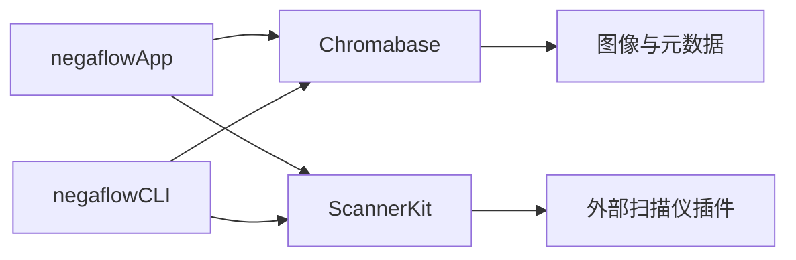
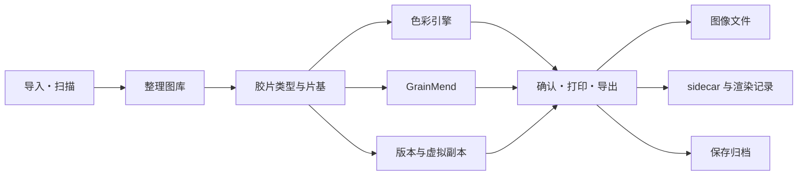

# 产品结构

[文档首页](../README.md)

negaflow 是一个 macOS 应用。导入或扫描胶片图像之后，接着是反转、显影、GrainMend、输出和保存。 所有编辑都和原始文件分开存放。

> [!IMPORTANT]
> 原始文件、编辑记录、缓存、输出文件是各自不同的资料。缓存没了，原始文件和编辑记录也得留着； 需要的结果做不出来时，导出就让它失败。

## 不改变的安全规则

1. 不自动覆盖原始图像和第三方 sidecar。
2. 从图库移除和把原始文件放进废纸篓，是两件事。
3. 扫描仪界面只显示插件报告过的功能。
4. 除非自己选了演示，否则不用假扫描仪顶替。
5. 编辑结果做不出来时，不拿原始文件代替导出。
6. 耗时长的任务，在应用结果之前会重新确认帧、编辑版本和会话。
7. 缓存必须能从原始文件和编辑记录重新生成。
8. 验证不足的配置文件、输出成组文件和归档，不当作成功的结果公开。

## 模块



### `Chromabase`

色彩引擎和图像处理核心。

- 读取图像和处理方向
- 胶片片基测量
- 负片和正片的显影
- 色调、颜色、局部校正
- 胶片、外观、扫描仪配置文件
- GrainMend RGB 和 IR
- 直方图和颜色测量
- 输出编码和元数据

细节见：

- [色彩引擎](../product/CHROMA_ENGINE.md)
- [GrainMend](../product/GRAINMEND.md)

### `ScannerKit`

它不是真正的扫描仪驱动，负责的是连接外部插件的规格。

- 扫描仪 ID 和功能
- 请求与响应的 JSON
- 外部进程的执行、超时、取消
- 插件的所有者、权限、批准、哈希
- 检查临时输出，再公开最终文件
- 扫描会话和作业记录
- 需要自己打开的演示扫描仪

SANE 实现在另一个 GPL 项目 [`negaflow-scanner-sane`](https://github.com/habinsong/negaflow-scanner-sane) 里。 主体和插件只通过 JSON 和 CLI 通信。

### `negaflowCLI`

和 GUI 用同一个引擎与 `ScannerKit`。

- 查找扫描仪、确认功能、扫描
- 批量显影多张图像
- 列出扫描仪配置文件
- GrainMend 的 `defect-bench`
- IT8 和扫描仪之间的相对比较
- 自检和 JSON 自动化

### `negaflowApp`

用 SwiftUI 和 AppKit 做的用户应用。

- 图库、显影、打印、画布
- 扫描、GrainMend、导出
- 版本、设置、快捷键
- 目录、缓存、备份、保存归档
- 显示共享版本资源的多语言“关于 negaflow”窗口

## 用户流程



每一步都不改原始文件，只往目录和编辑记录里添东西。

## 输入与原始文件

### 导入文件

默认的输入方式。处理 TIFF、JPEG、PNG，以及 macOS Image I/O 能读的相机 RAW。 读取内嵌的 ICC 和方向信息，并把原始文件 ID 记进目录。

### 扫描

装好的插件可以报告下面这些功能。

- 分辨率和位深
- 扫描范围和预览
- 曝光
- IR
- 批量和片夹动作

应用不会照着型号名表格自己编出功能。扫描结束后，还会重新确认插件实际应用的设置和输出文件。

### 原始文件 ID

不只凭文件路径判断原始文件。 会保留当前规格需要的值：文件观测值、字节数、修改时间、SHA-256、persistent bookmark。

文件被移动过时，只有用户重新链接，或者 bookmark 恢复成功，才会改路径。

## 目录

主要存储是 `library.sqlite`。 以前的 `library.json` 只在迁移确认过的旧资料，或者做可携带备份时才用。两个存储不会同时更新。

放进 SQLite 的：

- 帧和原始文件
- 胶卷、文件夹、收藏集、搜索
- 顺序和扫描作业
- 显影值和每个版本的编辑记录

不放进 SQLite 的：

- 原始像素
- 缩略图和预览
- GrainMend 缓存

### 从 JSON 迁移

1. 确认现有 JSON 的 schema 和健康状态。
2. 留一份恢复用的副本。
3. 用一个事务写进临时 SQLite。
4. 比较迁移前后的目录。
5. 确认 SQLite 完整性和应用的安全条件。
6. 全部对得上，才把主存储切过去。

失败的 JSON 不会被当成空目录。具体数值和判断在[目录存储结构](CATALOG_STORAGE.md)里。

## 图库

整理功能：

- 文件夹、胶卷、手动收藏集、智能收藏集、保存的搜索、堆叠
- 星级、选取与排除、颜色标签
- 网格、比较、筛选
- 确认重复候选

按文件夹查看时，每个文件夹都有一条带：三角、文件夹、名称、张数、显影流程、目标、应用。 三角用来折叠其下的缩略图。折叠状态在下次启动时保留，并与侧栏文件列表的折叠分开记忆。

按文件夹查看是**一个**网格，文件夹是分区，带是该分区的表头。请保持这个结构。给每个文件夹单独一个网格再纵向堆叠会失去惰性。堆叠方需要整块知道一个文件夹的高度，因此文件夹一进入画面就会把它的卡片全部创建出来。只有一个网格时，惰性的单位是一行，这正是数百张的图库仍能顺畅滚动的原因。

多个虚拟副本可以共用一个原始文件。删除原始文件前，先确认引用关系。 从图库移除只改目录里的引用，移到废纸篓是单独执行的操作。

外接硬盘断开，编辑也还在。原始文件会标为离线，可以按文件或按文件夹重新链接。 ID 和预期的不一样时，不会自动替换。

每个已登记的物理源文件夹只使用一个文件系统监视器。变更通知会短暂合并，之后只重新扫描发生变化的文件夹。Finder 移动或重命名源文件后，书签重连会保留原来的目录文件夹 ID；直接新增到该文件夹下的图像也会自动导入，不需要轮询或重新扫描整个图库。

## 显影与 GrainMend

每一帧都带着这些值。

- 原始文件 ID 和胶片类型
- 胶片片基
- 显影值
- GrainMend 编辑记录
- 版本记录
- 导出状态

调整过程中用的是低分辨率预览。结果做完后，只有帧 ID 和编辑版本跟当前选择一致时，才显示到画面上。

导出不会保存屏幕上的预览位图。它用原始文件和固定下来的编辑值，重新生成全分辨率图像。

GrainMend 把自动、引导、画笔、仿制图章、IR 存成一个有顺序的列表。缓存是派生文件。 要是没法从原始文件和编辑记录重新生成，就让导出失败。

细节在 [GrainMend](../product/GRAINMEND.md) 里。

## 版本

- **History 和 Snapshot：** 自己记录显影状态，然后比较或者回退。
- **Virtual Copy：** 不复制原始文件，另开一条编辑分支。
- **Copy/Paste：** 按色调、颜色、细节、几何这样的范围来粘贴。需要原始坐标的蒙版会先确认安全条件。

## 导出

开始时，把下面这些值固定成一组。

- 原始文件 ID
- 显影和 GrainMend 的编辑记录
- 扫描仪配置文件的字节和 SHA-256
- 输出设置和元数据策略
- 文件名和保存位置

中断后接着导出，用的也是同一组。

### 多个输出文件

一次导出可能同时产生 JPEG/TIFF、sidecar、XMP、`-main-flat` 等。

1. 先确认保存位置和文件名冲突。
2. 把所有文件写进临时文件夹。
3. 重新打开图像，确认像素尺寸。
4. 计算字节数和 SHA-256。
5. 生成 sidecar 和渲染记录。
6. 留下提交记录。
7. 把整组文件移到最终位置。
8. 失败就回滚，或者在下一次运行时清理。

不会只留下一部分文件却标成成功。

### 渲染记录 v3

不记路径，记的是下面这些值的 SHA-256 关系。

- 原始文件字节
- 实际的渲染输入
- 显影和 GrainMend 记录
- 扫描仪配置文件
- 解码器和渲染器版本
- 输出字节、像素尺寸、格式

因为没有数字签名和证书，所以不叫它 C2PA Content Credentials。 细节在 [渲染记录](../reference/RENDER_MANIFEST.md) 里。

## 打印与软打样

支持的排版：

- 单张
- 印样表
- 照片套版
- 自定义套版
- 蓝晒
- 玻璃干版
- 明胶银盐

单张和三种历史布局会为每张选中照片生成一页，并纵向排列显示。接触印相表、照片套版和自定义套版则显示并导出成品页数。选择 39 张时，6 × 7 接触印相表为 1 页，每页 4 张的照片套版为 10 页，默认自定义套版为 1 页，逐张布局为 39 个文件。

套版预览会复用已有缩略图和显影图像，仅在缺失时生成小尺寸快速预览。最终导出根据元数据计算位置，只显影每个单元格所需的像素，并一次准备 2 至 4 个唯一原图。Core Image 处理图会保持到成品页写出，每页原图栅格预算限制为 512 MiB。

照片套装的每个位置都会单独观察分配给它的帧。页面排版完成后，对完整成品页面应用一次打印机输出 ICC，因此重复同一照片和混合多张照片的套装都遵循同一输出规则。该配置文件不会影响图库或显影预览。原始扫描 TIFF 和 `-main-flat` 里不放打印机配置文件。

没有有效的 RGB 打印机 ICC 时，不拿别的配置文件顶替。 选中配置文件的字节和 SHA-256 会记进输出记录。

## 保存归档

放进 `.negaflowarchive` 的：

- 可携带的目录 JSON
- 原始文件
- IR 原始文件
- 需要的 GrainMend 记录
- 虚拟副本和共享原始文件之间的关系

能重新生成的缩略图、预览、GrainMend 缓存、导出过的文件都不放。 用的是 RFC 8493 的 BagIt 结构和 SHA-256 清单，确认过所有文件和关系之后，才移到最终位置。

- [图库保存归档](LIBRARY_ARCHIVE.md)
- [RFC 8493](https://www.rfc-editor.org/info/rfc8493/)
- [PREMIS](https://www.loc.gov/standards/premis/)

长期保存还需要别的介质、异地副本和定期的哈希确认。

## 扫描仪插件安全

找到插件后，会确认这些。

- 是不是当前用户所有
- 组或者其他用户能不能写
- 是不是符号链接
- 清单和可执行文件的 ID 与 SHA-256
- 用户批准过的 ID 和现在的 ID 是否一致

文件变了，就不再沿用之前的批准。

协议 v2 使用请求 ID 和序号，并且要求最终结果正好一个。 输出大小有上限，超时和取消之后会清理进程和管道。

插件不会自己往最终位置发布文件。 应用给它一个临时位置，确认格式、大小、ID 和实际应用的设置之后，再移进应用的存储。

完整规格在[扫描仪插件结构](SCANNER_PLUGINS.md)里。

## 性能边界

图像：

- 共享的 `CIContext`
- 需要时才计算的图像图
- 低分辨率调整和原分辨率输出分开
- 取消，以及拒绝过期的结果
- GrainMend 的区域、瓦片、补丁处理
- 内存压力大时清空缓存

目录：

- SQLite 事务和按实体存行
- 利用复制做备份
- 完整性检查
- 50,000 帧的测量

现在启动时会把整个目录读进内存。在同一台 Mac 上，SQLite 读取约 7.4 秒，和 JSON 差不多。 只读需要的行的索引查询是下一步。

仓库里的性能上限值是为了抓住大幅退步而设的宽上限，不是保证所有支持的 Mac 都用得舒服。

## 确认范围

```bash
DEVELOPER_DIR=/Applications/Xcode.app/Contents/Developer swift test
bash scripts/run-app.sh build
```

自动检查覆盖不到的项目：

- 真实的扫描仪和插件
- 真实的 RGB/IR 对齐和胶片兼容性
- 100% 放大下的 GrainMend 画质
- 包含屏幕尺寸和辅助功能的 UI
- Developer ID、公证、Gatekeeper
- 在干净的 Mac 上安装
- 别的 Mac 上的性能

## 文档指引

| 想了解的内容 | 文档 |
|---|---|
| 当前实现和确认状态 | 项目状态 |
| 反转和显影 | [色彩引擎](../product/CHROMA_ENGINE.md) |
| 缺陷修复 | [GrainMend](../product/GRAINMEND.md) |
| 胶片配置文件 | [胶片配置文件](../product/FILM_PROFILES.md) |
| 连接扫描仪 | [扫描仪插件结构](SCANNER_PLUGINS.md) |
| 配置文件的发布标准 | [扫描仪配置文件质量判定](../reference/PROFILE_QUALITY_GATE.md) |
| 真实设备和屏幕确认 | 实机检查表 |
| 保存归档 | [图库保存归档](LIBRARY_ARCHIVE.md) |
| 输出文件的哈希关系 | [渲染记录](../reference/RENDER_MANIFEST.md) |
