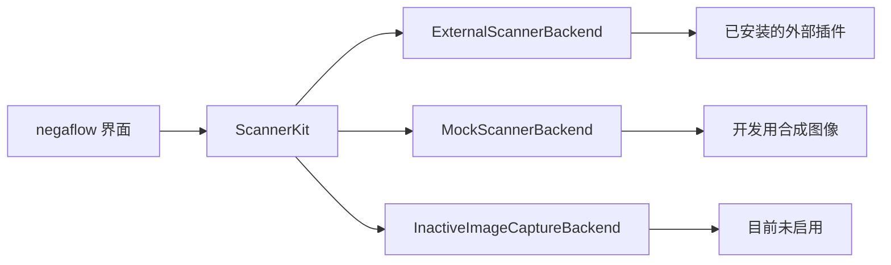
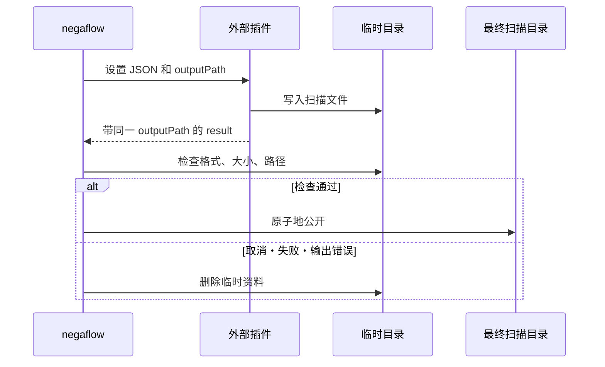

# 扫描仪插件结构

[文档首页](../README.md)

negaflow 默认的输入是导入图像。只有存在外部插件时，才连接真实扫描仪。

> [!IMPORTANT]
> 应用不会根据扫描仪型号名去猜功能。界面和请求只用插件报告的功能，演示设备也只有在用户自己
> 选了演示模式时才出现。

## 组成

| 组成 | 作用 |
|---|---|
| 图像导入 | 把 RAW、DNG、TIFF、PNG、JPEG 送进显影路径。 |
| 外部插件 | 以独立进程驱动真实设备，用 JSON 通信。 |
| 演示扫描仪 | 提供开发用的 `negaflow Scanner` 和 `negaflow Flatbed Scanner`，要自己选演示才会用到。 |
| ImageCaptureCore 连接 | 面向 macOS Image Capture 设备、目前未启用的兼容代码。 |

本仓库里没有 SANE 实现。SANE 代码在独立的 GPL 项目里。

- <https://github.com/habinsong/negaflow-scanner-sane>

## 连接方式

界面只看 `ScannerBackend`。插件的设备 ID 在应用里显示为 `plugin:<pluginId>:<deviceId>`。

运行插件时会去掉 `plugin:<pluginId>:`，只发送插件自己的设备 ID。

## 查找插件

默认目录是 `~/Library/Application Support/negaflow/Plugins/<id>/manifest.json`。

在测试和本地开发中，可以用 `NEGAFLOW_PLUGINS_DIR` 指向别的目录。

| 字段 | 规则 |
|---|---|
| `schemaVersion` | 目前必须正好是 `1` |
| `protocolVersion` | 省略即 `1`，支持 `1` 和 `2` |
| `id` | 插件唯一 ID |
| `name` | 界面上显示的名称 |
| `kind` | 插件种类 |
| `license` | 分发许可 |
| `homepage` | 项目地址 |
| `executable` | 可执行文件路径 |

`id` 是 1～64 个 ASCII 字符。首字符是字母或数字，其余只能是字母、数字、`.`、`_`、`-`。
`:` 是设备 ID 的分隔符，不允许使用。

只有清单和可执行文件都通过，才会打开插件。不会靠猜去读旧的、未来的 schema 或不认识的协议。

### 文件安全检查

> [!WARNING]
> 清单或可执行文件的字节一旦变化，就作废之前的批准。运行前还会再确认属主、权限、是否符号
> 链接以及 SHA-256。

- 插件目录、清单和可执行文件必须属于当前用户。
- 组或其他用户可写的，一律拒绝。
- 符号链接一律拒绝。
- 记录清单和可执行文件的 SHA-256。
- 第一次使用需要用户批准。
- 文件字节变了，批准即失效。
- 运行前重新计算 ID。

## 命令

插件以独立进程运行。

| 命令 | 结果 |
|---|---|
| `detect` | JSON 设备列表 |
| `capabilities <deviceId>` | JSON 功能列表。可通过 stdin 接收 `detect` 报告的设备 ID、厂商、型号 JSON |
| `scan` | stdin 收设置 JSON，stdout 输出进度 NDJSON 和最后的结果 |

## 扫描协议

### 版本 1

沿用的兼容规格。请求和 NDJSON 里没有 `protocolVersion`、`requestID`、`sequence`。
它报告不了实际生效的设置，因此结果记为 `.unknownLegacy(protocolVersion: 1)`。
不会把请求值当成已验证的生效值复制过去。

### 版本 2

只有清单里带 `"protocolVersion": 2` 时才用。

请求里包含：

- `protocolVersion: 2`
- 应用生成的 UUID `requestID`

`capabilities` 的响应可以返回可选字段 `capabilityToken`。
应用不解释这个值，只把它原样传给同一设备的下一次 v2 `scan` 请求。
v1 请求里不放，也不会把不同设备的 token 混用。token 的格式和有效性由插件自己检查。

为了避免误连到同一 backend 下的其他型号，应用会把上一次 `detect` 报告的 `deviceID`、`vendor`、
`model`，作为 `capabilities` 的可选 stdin JSON 再传一次。
既有插件可以忽略这个输入；设备地址可能变化的插件，应把这份同一性绑进 capability 快照，并在下一次
`scan` 时再次校验。

每个 NDJSON 事件都要重复相同的版本和请求 ID，并带一个比前一个更大、且不小于 0 的 `sequence`。
事件只允许 `progress`、`result`、`error`。

`result` 和 `error` 是最后的事件。后面再来事件就算失败。
没有以错误结束的扫描，必须恰好有一个 `result`。

下面这些一律以关闭状态失败。

- 读不了的事件
- 缺失或不同的版本、请求 ID
- 重复或倒序的序号
- 不认识的事件
- 结果重复
- 最后事件之后还有输出
- 非法 UTF-8

违反 v2 规格时，不等常规超时就立即结束插件。

### 实际生效的设置

v2 的 `result` 必须带 `appliedOptions`。

- `deviceID`、`resolutionDPI`、`bitDepth`、`colorMode`、`filmType`
- `scanArea`：`originXMM`、`originYMM`、`widthMM`、`heightMM`
- `infrared`、`multiExposure`
- `hardwareExposureTime`、`brightnessAdjustment`、`contrastAdjustment`
- `outputRawTIFF`

最后三个调整值即使是 `null`，键也必须存在。

`resolutionDPI: 0` 表示预览。预览不为 0，或正式扫描为 0，都会被拒绝。
不认识的值、不同的设备，以及结果头部与 `appliedOptions` 之间对不上的分辨率、位深、IR 状态，同样
拒绝。

检查通过后，记录的是应用自己的扫描仪 ID 和请求 ID，而不是插件 ID，并保留最终输出路径。
只有这时才标记为 `.verified(options)`。

`ScanResult.resolution` 和 `bitDepth` 在 v1 下可以先用请求值作为临时工作值。
表示来源的 `reportedResolution`、`reportedBitDepth` 只填结果自己报告的正确值。

## 平板扫描区域

该流程的预览不会把分辨率交给设备决定，而是明确请求最接近 300 dpi 的受支持值。设备默认值可能低至 25 dpi，这样的尺寸既无法用于放置和选择画幅，也无法用于检测。带分辨率的预览属于普通扫描，因此不走插件的预览路径。

只有插件同时报告下面这些功能，才会开启可选位置的平板扫描。

- 预览
- `supportsPositionedScanArea`
- 以 mm 为单位的 `scanOriginXRange`、`scanOriginYRange`
- 以 mm 为单位的 `scanWidthRange`、`scanHeightRange`

应用会把选中的区域按插件的步长向外扩展，并为每个区域建立一个正式扫描任务。
不会根据型号名去猜这项功能。没有这些可选字段的旧插件，保持固定画幅的流程。

## 进程上限与取消

- stdout 累计上限：4 MiB
- stderr 累计上限：1 MiB

超过上限就结束进程并判为失败。清理时只读已经到达的字节。即使子进程继承了管道，也不会等 EOF。

`cancelScan()` 要等插件结束、管道处理器关闭、下一个任务的位置腾空之后才返回。

## 扫描文件的公开

插件必须把原始图像写到应用给出的那个确切 `outputPath`，并在结果里返回同一路径。
这个路径是与最终目录同一磁盘上的临时位置。

应用会确认：

- 非空的普通文件
- ImageIO 能读的图像
- 预期的格式和像素尺寸
- 请求与结果里的路径一致

全部符合才移动到最终位置。取消、超时、输出错误、插件失败时，删除临时目录，不公开半截的扫描结果。

v2 的 IR 文件同样要在应用给出的临时目录里。会检查文件类型、能否读取和像素尺寸。
为了兼容已经发出去的插件，v1 可以接受外部 IR 路径。

## SANE 边界

SANE 的实现、依赖、配置、按设备的处理、测试和分发文档，全部放在独立仓库
[`negaflow-scanner-sane`](https://github.com/habinsong/negaflow-scanner-sane)。

该项目分别发布使用 Homebrew 标准 SANE 的 macOS 14+ 标准版，以及在官方 SANE 1.4.0
上只应用 upstream `coolscan2`/`coolscan3` 分配修复的 macOS 26+ Coolscan 版。
标准版不会主动阻止 Coolscan，但不包含该修复。

本仓库只记录和检查与设备无关的外部进程规格。只导入图像文件的用户不需要扫描仪插件。

negaflow 主体不链接 SANE 实现，也不把它放进应用分发物。
插件有自己的仓库、可执行文件、源码分发和 GPL 许可。本文档记录结构，不断定是否构成衍生作品。
实际发布前，会再检查两边产物包含的文件与通信约定。

## 验证

主体测试会把一个假的外部插件作为真实进程运行，确认：

- 查找插件
- 查找设备
- 功能对接
- 进度事件
- 最终结果
- 取消与失败后的清理

SANE 实现在插件仓库的 SwiftPM 测试和 Release 构建里单独验证。
