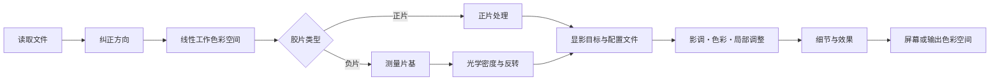

# 色彩引擎

[文档首页](../README.md)

色彩引擎负责反转和显影胶片。代码在 `Chromabase` 模块里。
应用和 CLI 用的是同一个模块，所以输入相同时走的处理顺序也相同。

| 一览 | 内容 |
|---|---|
| 默认显影 | `MAIN`，手动校正 |
| 片基 | 自动测量、吸管、直接输入 RGB |
| 内部色彩处理 | 32-bit 浮点线性色彩空间 |
| 自动功能 | 只有执行时才应用 |
| 输出色彩空间 | sRGB、Display P3、Adobe RGB、用户 RGB ICC |

> [!IMPORTANT]
> 自动影调、自动白平衡、自动色阶、自动色彩不会偷偷混进默认显影。

## 先守住的原则

1. 只要片基能测出来，就优先用测量值，而不是按名字选的默认值。
2. 胶片物性、扫描光源、扫描仪风格、场景自动校正互不混用。
3. 自动影调、自动白平衡这类功能，只有执行时才生效。
4. 相同的原件、编辑值和配置文件组合，走相同的处理顺序。
5. 合成测试和真实设备验证，不会当成同一种证据来说。

## 处理顺序



工作图像在 32-bit 浮点线性色彩空间里处理。只有需要伽马的运算，才在规定的步骤上转换。
面向屏幕或文件格式的编码放在最后。

Apple 的 Core Image 说明：

- [CIImage](https://developer.apple.com/documentation/coreimage/ciimage)
- [CIContext](https://developer.apple.com/documentation/coreimage/cicontext)
- [workingColorSpace](https://developer.apple.com/documentation/coreimage/cicontext/workingcolorspace)
- [Core Image 性能指南](https://developer.apple.com/library/archive/documentation/GraphicsImaging/Conceptual/CoreImaging/ci_performance/ci_performance.html)

`CIContext` 不会每次渲染都新建，而是按显示、分析、导出的用途分开复用。
预览只算需要的尺寸和最新的编辑版本，导出则在原始尺寸上重新渲染。

## 片基

### 为什么要测

负片的未曝光部分，是胶片、冲洗工艺和扫描光源共同构成的基准点。彩色负片的橙色片基也在其中。
片基错了，之后的密度和通道关系就会全都跑偏。

Kodak Portra 400 的资料也分别记录最小密度、特性曲线和染料的分光密度。

- [Kodak Professional Portra 400 technical data](https://www.kodakprofessional.com/sites/default/files/wysiwyg/pro/resources/e4050_portra_400.pdf)

### 自动测量

`FilmBaseEstimator` 不是只把最亮的几个像素平均一下。

- 胶片像素不可能比未曝光片基更亮。
- 亮得多的地方，可能是背光、齿孔或胶片之外。
- 真实片基往往沿画幅边缘连成较宽的一片。
- 一张里有多条胶片时，分离的区域也能一起看。
- 片夹和胶片交界处，可信度低于内部区域。

先在缩小的分析图上找亮度分布，把相连的区域归并，再排除胶片之外的候选。
通过条件的胶条不止一条时，会一起计算。结果里还会留下所选方法和置信度。

### 方法的选择

| 模式 | 行为 |
|---|---|
| `Manual` | 用输入的 RGB 作为 Dmin。吸管取样成功时也会进入这个模式。 |
| `Film` | 用测量值作 Dmin，所选胶片主要提供 `dmaxNorm`。只有测量失败时才用胶片和光源的默认值。 |
| `Auto` | 使用空间分析，失败时退回基于边缘的方法。 |

没有手动值，或胶片 ID 有误时，会转到下一个安全的方法。绝不会直接把场景里最亮的物体当作片基。

## 光学密度与反转

由线性透过率 `T` 和各通道片基 `Dmin` 求密度。

```math
D = \log_{10}\left(\frac{D_{\min}}{T}\right)
```

`D = 0` 表示输入与未曝光片基相同。齿孔或背光可能为负值。这些值也按有限值处理，不会当场截断。

### 胶片种类资料

当前表里有 27 个胶片名称，涵盖彩色负片、黑白和电影负片。

这份资料的用途：

- 测不到片基时的 Dmin 默认值
- 各通道的密度范围
- 对比度低、自动测量不稳时的安全范围

一部分数值是读公开资料的曲线近似得到的，一部分取得比较保守。
27 个名字不等于 27 份经过验证的色彩配置文件。只要测到了片基，实测值优先。

### 固定印相响应

`MAIN` 把扣掉片基的密度变成单调上升的曲线。系数不是藏起来的预设，而是由四个基准点算出来的。

- 片基的黑点
- 18% 中灰
- 实测密度范围处的白
- 反射光余量

当前曲线是 stretched exponential 形式，全区间都有反函数。合成负片的往返测试也用这个反函数。
公式和数值见[固定印相响应](../reference/PRINT_RESPONSE.md)。

默认路径和自动功能的界线：

- 固定曲线不会根据场景直方图去动曝光。
- `applySceneRanged` 测各通道实际用到的密度范围，但不移动中间曝光。
- 只有低饱和场景才会加入受限的 `CIVibrance`。
- Auto Levels、Auto Color、Auto Tone、Auto White Balance 都是要自己执行的功能。
- 不宣称精确复刻某种相纸或某台迷你冲扩机。

## 配置文件分三类

| 类别 | 回答什么问题 | 数值 |
|---|---|---|
| Film stock | 这卷胶片的片基和密度范围如何 | Dmin/Dmax、胶片类型 |
| Light source | 扫描光源对各通道有什么影响 | 通道 gain、基于片基的校正 |
| Scanner target | 结果的影调和色彩风格如何 | 自行拍摄扫描得到的相对统计 |

把这三类分开，才能避免让一个胶片名同时代表乳剂物性、光源色彩和冲印店成品风格的错误。
有实测片基时，测量值优先于光源默认值。扫描仪统计也不会当作场景的绝对色彩矩阵直接使用。

数据细节见[胶片配置文件](FILM_PROFILES.md)。

## 显影目标

### `MAIN`

一般显影的默认值。不会掺入未选择的扫描仪风格、自动色阶、自动色彩、自动影调和自动白平衡。
片基与密度范围的测量、以及受限的低饱和场景 vibrance，属于基本反转的一部分。

### `PRINT`

工作图像与 `MAIN` 相同。在导出的最后，把有效的 RGB printer ICC 应用一次。
配置文件缺失或无效时直接失败，不会用 sRGB 或随便一组纸张数值顶替。

### `HS`、`SP`

分两步处理。

1. `documentedCharacter`：`SP` 使用从 SP-3000 与 negaflow MAIN 处理同一批负片的六对样本中得到的
有限基本性格。`HS` 则用公开的方向加本项目的设计值，构建影调、中性和色彩性格。
2. `scannerSignature`：只叠加两台设备上胶卷名与图像数量相符的组之间的相对差异。

`HS` 含亮度通道锐化。那个半径和强度并非实测自真机。`SP` 不含。

当前所有配置文件都是 `realOnly`。

- 只有胶卷名和图像数量足够吻合时，才计算相对差异。
- 方向翻转的数值不应用。
- 黑白会去掉色彩分量。
- 只要文件或清单的 SHA-256 有一项不符，就拒绝整套配置文件。

### `F135`、`HR`

这不是实测复刻设备的配置文件，而是本项目做的两种迷你冲扩风格。
`F135` 用偏印相的 S 曲线加暖调中间调，`HR` 用深黑与沉稳的中性、偏蓝方向。
不主张验证并复刻了某台具体设备。

### `EXPIRED`

面向老胶片的修复目标。不会一律降饱和或拉伸范围，只在现有依据范围内做受限的校正。

## 显影调整

| 分组 | 项目 |
|---|---|
| 影调 | 曝光、对比度、高光、阴影、白色、黑色、RGB 与各通道点曲线 |
| 色彩 | 色温、色调、自然饱和度、饱和度、HSL 八色、三区色彩分级、通道校正、黑白转换与调色 |
| 细节・效果 | 锐化、清晰度、去雾、胶片颗粒、暗角、光晕、降噪 |
| 局部调整 | 径向、线性、多边形、画笔蒙版，以及减淡与加深 |

这些数值按步骤保存为编辑记录。GrainMend 与普通的局部调整，在目的和保存方式上都不同。

## 色彩管理

输入若带有效 ICC，就读取那个色彩空间。
内部计算在既定的线性工作空间里进行，到显示、软打样和导出阶段再转到输出色彩空间。

主要支持的输出：

- sRGB
- Display P3
- Adobe RGB
- 用户选定的 RGB printer/output ICC

打印机配置文件的名称、字节数和 SHA-256 在导出开始时固定。渲染过程中文件若发生变化就中止。

不主张当前 Core Image 与 ColorSync 路径能在所有 macOS 上让渲染意图和 black-point compensation 按
位一致。
若需要这种保证，得先有独立的 ColorSync 缓冲路径和大尺寸 16-bit 图像的内存检查。

## 输出编码

格式设置在色彩管线之外，但它决定交付文件里能留下什么。

除非把编码器推过子采样阈值，JPEG 存储色彩的分辨率低于亮度。低于该阈值时，色度在水平和垂直方向
都减半，亮度细节保持不变，但高饱和边缘会发糊。因此质量在 95% 及以上时不做色度子采样。更低的设置
沿用所选数值，因为选择它们本身就是为了更小的文件。

PNG 和 TIFF 是无损的，从不做子采样。决定画质的只有位深度，每通道 8 位或 16 位。仅在 8 位时应用
抖动，用来掩盖量化产生的色带。

## 性能与安全

- `CIContext` 按用途复用。
- 调整过程中用低分辨率预览，导出时从原件重新生成。
- 耗时较久的结果，在应用前会再确认画面 ID、编辑版本和会话。
- 内存不足时，清空缩略图、预览这类缓存。
- 原件和编辑记录与缓存分开保存。

## 验证层级

1. 公式测试：曲线单调性、基准点、反函数
2. 合成图像：已知输入输出、溢出、方向、色彩空间
3. 合成 IT8：264 个色块的数学往返
4. 实拍统计：`realOnly` 配置文件
5. REAL/TARGET 配对：带独立验证素材的设备质量检查
6. 实机确认：真实扫描仪、胶片、显示器和输出品

合成 IT8 结果好，并不能证明真实负片的绝对准确度。
扫描仪配置文件的质量判断，遵循 [配置文件质量判定](../reference/PROFILE_QUALITY_GATE.md)和
[IT8 色彩检验](../reference/IT8_COLOR_VALIDATION.md)。

## 代码位置

- `Sources/Chromabase/Engine/`
- `Sources/Chromabase/Film/`
- `Sources/Chromabase/Develop/`
- `Sources/Chromabase/Adjustments/`
- `Sources/Chromabase/Profiles/`
- `Sources/Chromabase/Imaging/`
- `Sources/Chromabase/Export/`

当前产品版本是 `1.0.8`。编辑记录和配置文件的 schema，在后续版本中同样要走过验证流程才会改动。
