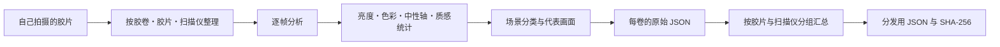

# 胶片配置文件

[文档首页](../README.md)

内置的扫描仪配置文件既不是下载来的 LUT，也不是只挂个名字的预设。 它们由项目作者自己拍摄、整理胶片扫描件，分析之后做成 JSON。

| 项目 | 当前值 |
|---|---:|
| 胶片种类默认值 | 27 |
| 创作风格 | 6 |
| 扫描仪配置文件 | 15 |
| 胶卷观测 | 25 |
| 图像观测 | 928 |
| 验证状态 | 全部 `realOnly` |

> [!NOTE]
> `928` 是各配置文件观测数之和，并不表示有 928 张不同的照片。

## 三类互不相同的资料

| 资料 | 格式 | 用途 | 数量 |
|---|---|---|---:|
| Film stock | Swift | Dmin/Dmax 与胶片种类默认值 | 27 |
| Look preset | JSON | 用户挑选的创作风格 | 6 |
| Scanner profile | JSON | 真实扫描中观察到的相对影调与色彩统计 | 15 |

27 个胶片名不等于 27 份色彩准确度配置文件。6 种风格也和扫描仪配置文件是两回事。下面只谈第三类。

## 当前内置内容

`Sources/Chromabase/ScannerProfiles/` 里有 15 份。

<details>
<summary>查看全部 15 份配置文件</summary>

| 扫描仪 | 胶片种类 | 胶片 | 胶卷观测 | 图像观测 | 状态 |
|---|---|---|---:|---:|---|
| NORITSU | color nega | Fuji C200 | 3 | 111 | `realOnly` |
| NORITSU | color nega | Kodak Ektar 100 | 2 | 76 | `realOnly` |
| NORITSU | color nega | Kodak Portra 160 | 1 | 37 | `realOnly` |
| NORITSU | color nega | Kodak Portra 400 | 2 | 75 | `realOnly` |
| NORITSU | color nega | Kodak Portra 800 | 1 | 38 | `realOnly` |
| NORITSU | color nega | Kodak Pro Image 100 | 1 | 37 | `realOnly` |
| NORITSU | color nega | Kodak UltraMax 400 | 1 | 38 | `realOnly` |
| NORITSU | color nega | Kodak Vision3 250D | 1 | 37 | `realOnly` |
| NORITSU | color nega | Kodak Vision3 50D | 1 | 38 | `realOnly` |
| NORITSU | color slide | Kodak Ektachrome 100 | 1 | 38 | `realOnly` |
| NORITSU | color slide | Kodak Ektachrome 100D | 5 | 181 | `realOnly` |
| SP-3000 | color nega | Kodak Ektar 100 | 2 | 76 | `realOnly` |
| SP-3000 | color nega | Kodak Portra 160 | 1 | 38 | `realOnly` |
| SP-3000 | color nega | Kodak Vision3 250D | 2 | 71 | `realOnly` |
| SP-3000 | color slide | Kodak Ektachrome 100D | 1 | 37 | `realOnly` |
| **合计** |  |  | **25** | **928** | **15 份 `realOnly`** |

</details>

25 和 928 是各配置文件分组观测值的合计。同一卷实体胶片或同一张照片，可能同时进入两个扫描仪分组。 它们不代表 25 卷不同胶卷或 928 张不同照片。

## 制作步骤



### 1. 拍摄与分类

原件按扫描仪、胶片种类、胶片名称和胶卷名称划分。分析之前先确认旋转和文件解析。 空文件或读不了的文件不计入数量。

### 2. 逐帧测量

每一帧测量以下内容。

- 亮度百分位与两端溢出
- 暗部・中间・亮部的通道关系
- 饱和度与色相分布
- 低饱和像素的 Lab 中性轴
- 梯度、锐度与颗粒参考值

这些都是场景观测。不会把某一张的曝光或被摄体，直接当成扫描仪的固定性质。

### 3. 场景分类

按亮度、对比度、饱和度和色相范围划分场景。记录各组的数量与分布，避免某一类场景带偏整份配置文件。

### 4. 代表画面

为了让人能回头查看原件，单独记录下面这些画面。

- 对比度最高的画面
- 最锐利的画面
- 颗粒参考值最高的画面
- 代表亮度与饱和度范围的画面

### 5. 胶卷与分组汇总

`scripts/compile_scanner_profiles.py` 把每卷的资料按胶片与扫描仪分组汇总。 不会把空区间粉饰成观测值 0，并会确认所有数值是否有限、样本数是否真实。

### 6. JSON 与哈希

最终文件包含 schema、ID、原件数量、原件路径、汇总统计、验证状态和 `profileHash`。 检查器会核对字段、数量、有限值、文件名与 ID、原件数量以及哈希。

## JSON 的样子

<details>
<summary>配置文件 JSON 示例</summary>

```json
{
  "schemaVersion": 2,
  "id": "noritsu__color-nega__kodak-portra-400",
  "displayName": "NORITSU · color nega · Kodak Portra 400",
  "scanner": "NORITSU",
  "kind": "color nega",
  "filmKey": "kodak portra 400",
  "validationStatus": "realOnly",
  "rollCount": 2,
  "imageCount": 75,
  "singleRollLimited": false,
  "sourceProfiles": [],
  "tone": {},
  "color": {},
  "neutralAxis": {},
  "neutralAxisBins": [],
  "hueResponse": [],
  "texture": {},
  "sceneBuckets": [],
  "coverageCandidates": [],
  "profileHash": "sha256:..."
}
```

</details>

## 主要条目

| 条目 | 内容 | 注意 |
|---|---|---|
| `tone` | 亮度分布与两端溢出 | 不把一张的曝光当成设备特性 |
| `color` | 暗部・中间・亮部的通道与饱和度 | 是观测分布，不是绝对色彩矩阵 |
| `neutralAxis` | 低饱和像素的 Lab `a*`、`b*` | 有些场景没有中性物体，因此一并记录样本数 |
| `hueResponse` | 各色相区间的饱和度变化与色相旋转 | 只有两台设备资料足够吻合时才做相对比较 |
| `texture` | 梯度、锐度、颗粒参考值 | 不直接当作设备的锐化数值 |
| `sceneBuckets` | 各场景的统计与代表画面 | 便于人回头核对来源 |

`HS` 目标里的亮度通道锐化，并不是从 `texture` 测出的设备常数，也不会重新生成颗粒。 `SP`、`MAIN`、`PRINT` 都不包含这项锐化。

## 证据状态

| 状态 | 含义 | 可用范围 |
|---|---|---|
| `draft` | 资料或 schema 尚未完成 | 不可内置、不可自动使用 |
| `realOnly` | 有真实扫描，但没有独立的基准素材 | 仅手动选择，不做准确度主张 |
| `pairedSmoke` | 用配对素材只确认了处理路径 | 不能作为质量证据 |
| `pairedValidated` | 通过校准与验证素材及回归检查 | 政策允许时可自动选择 |

目前 15 份全是 `realOnly`。可以确认它们来自真实素材的观测，但不能说它们能给出和设备一样的结果。

要谈设备准确度，还需要更多素材。

- 能确认是同一张实体画幅的 ID
- 与校准分开的验证素材
- 生成参考图像时的条件
- 扫描仪设置与操作者的选择
- 标板批次、照明与测量方法
- 逐张图像的合格标准

## 应用怎么使用

### 手动选择

目前不会仅凭型号名或文件信息自动选择。由用户自己挑 `HS` 或 `SP` 目标和配置文件。 自动匹配只允许 `pairedValidated`，因此不适用于当前内置内容。

### 两台扫描仪之间的相对差异

不会直接使用场景的绝对统计，而是有限度地使用两台设备对应分组之间的差异。

- 整理后的胶卷名称集合必须相同。
- 图像数量差异不超过 15%。
- 色相区间需两侧样本数都超过阈值。
- 方向翻转的数值不应用。
- 方向相反的 gain 之间的取值在对数域计算。
- 影调只在 Rec.709 伽马亮度上应用一次，并保留 Lab 的色彩分量。

原始配置文件里没有逐帧的 SHA-256。胶卷名相同，也不能证明配的是完全相同的画幅。

### 黑白与正片

黑白会去掉色彩分量，只用相对影调。正片不会把某一卷的绝对亮度搬到别的照片上。 不过 `HS` 和 `SP` 的基础风格在正片上会以一半强度生效，因此结果并不总是和 `MAIN` 相同。

### 质感

没有同一画幅的配对素材时，不会把 `texture` 当作设备专属的锐化或颗粒数值。 对焦、被摄体、JPEG 处理和冲印店操作者的选择，都混在这些数值里。

## 文件完整性

`ScannerProfileRegistry` 不会只打开 15 份里的一部分。

1. 读取清单 schema。
2. 确认所有文件存在，并核对 SHA-256。
3. 重新计算每份 JSON 的 `profileHash`。
4. 核对 ID、文件名、schema、状态、数量与有限值。
5. 只要有一项不符，就拒绝整套。
6. 只缓存全部对得上的只读快照。

导出记录里会留下实际使用的配置文件 ID 和 SHA-256。

## 检查命令

配置文件规格检查：

```bash
python3 scripts/validate_scanner_profiles.py \
  --mode profile-contract \
  --profiles Sources/Chromabase/ScannerProfiles
```

重新生成：

```bash
python3 scripts/compile_scanner_profiles.py \
  --source LUT_target/SOURCE \
  --out LUT_target/PROFILES \
  --resource-out Sources/Chromabase/ScannerProfiles
```

REAL/TARGET 质量检查：

```bash
python3 scripts/evaluate_profile_quality.py \
  --manifest LUT_target/quality/corpus-v1.json \
  --candidate-summary LUT_target/SOURCE/summary.json \
  --baseline-summary LUT_target/quality/accepted-summary-v1.json \
  --data-root LUT_target \
  --verify-files all \
  --report build/profile-quality-report.json
```

当前仓库没有能用于发布主张的 REAL/TARGET 清单和批准基准。 合成测试只确认检查代码的失败条件，并不证明配置文件的准确度。

## 参考资料

- [Kodak Professional Portra 400 technical data](https://www.kodakprofessional.com/sites/default/files/wysiwyg/pro/resources/e4050_portra_400.pdf)
- [darktable negadoctor](https://docs.darktable.org/usermanual/4.6/en/module-reference/processing-modules/negadoctor/)

配置文件里的数值不是从这些资料里取来的。 读它们只是为了确认一个背景：片基、场景影调和设备风格必须分开处理。 JSON 数值来自自己拍摄的原件和仓库里的分析代码。

## 代码与相关文档

- `Sources/Chromabase/ScannerProfiles/`
- `Sources/Chromabase/Profiles/ScannerProfile/`
- `Sources/Chromabase/Profiles/ScannerTargetGrade/`
- `scripts/compile_scanner_profiles.py`
- `scripts/validate_scanner_profiles.py`
- `scripts/evaluate_profile_quality.py`
- [扫描仪配置文件质量判定](../reference/PROFILE_QUALITY_GATE.md)
- [IT8 色彩检验](../reference/IT8_COLOR_VALIDATION.md)
- [色彩引擎](CHROMA_ENGINE.md)
