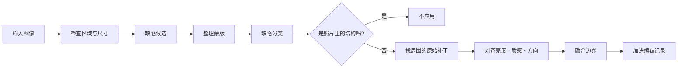

# GrainMend

[文档首页](../README.md)

GrainMend 修复胶片上的灰尘、针孔、划痕和乳剂损伤。结果不会直接写入原始文件，而是留成有顺序的编辑记录。

| 工具 | 看哪里 | 怎么修复 |
|---|---|---|
| 自动 | 整张照片 | 只保守地修复把握大的缺陷 |
| 引导 | 用户选的区域 | 连小点和淡缺陷也仔细检查 |
| 画笔 | 自己涂的位置 | 把周围的结构和质感接过来 |
| 仿制图章 | 自己选的源点 | 按固定偏移复制真实的原始像素 |
| IR | 扫描仪的红外通道 | 用 IR 找位置，用 RGB 还原像素 |

显影界面里有自动、引导、画笔、仿制图章。插件报告了功能时，IR 可以在扫描阶段打开。
扫描结束后，结果会进到同一个 GrainMend 图层列表里。

> [!CAUTION]
> GrainMend RGB 和硬件 IR 清洁不是一回事。GrainMend IR 也不是 Digital ICE、iSRD、SRDx 的实现
> 或者兼容模式。

## 难在哪里

胶片缺陷和照片里的结构，处在同样的像素上。

- 灰尘看着是小而不规则的亮斑或暗斑。
- 针孔可能是孤立的强点。
- 划痕又细又长，但电线、窗框、文字也差不多。
- 乳剂损伤会同时改变颜色和质感。
- 高分辨率下的胶片颗粒，和小缺陷是一个尺寸。

把高频整个抹掉，灰尘没了，颗粒和边缘也一起没了。GrainMend 把检测、分类、修复、保存分开处理。

## 处理顺序



检测蒙版和修复结果是分开放的。所以你可以确认蒙版、只应用一部分缺陷，或者把修复重新做一遍。

## 工具

### 自动

在整张照片里，只找把握大的缺陷。宁可漏掉小缺陷，也不误抹大结构。
它不会偷偷混进默认显影，得你自己运行，结果才会加上去。

### 引导

你选一个矩形区域，就只分析那里面和周边。
因为缺陷位置已经告诉它了，比起自动，它会更主动地去看小点、淡缺陷和密集缺陷。

为了让修复要用的周边像素不在区域边缘被切断，它读的范围比实际结果更宽。
当前的最大周边半径是 264 像素。

### 画笔

要修复的位置由你自己涂。它不是拿涂的颜色去盖。它在蒙版周边找合适的原始补丁，把结构和质感接过来。
找不到合适的补丁时，可以有限地走基于检测的路径。

### 仿制图章

`⌥` 点击选源点，然后在目标上画。它不用自动检测，而是保持两点之间的偏移，复制真实的像素。

编辑记录里存的是直径、硬度、坐标、偏移。旋转、翻转、裁剪之后，仍然能应用到同样的原始坐标上。
偏移对齐到整数像素，图像外面不应用。

### IR

只有插件给出真实的 IR 通道，并且确认过和 RGB 的尺寸、范围一致时才用。IR 是用来找缺陷位置的资料。
最终像素由和 RGB 相同的修复器生成。

## 怎么在 RGB 里找缺陷

### 和周围的差异

每张照片亮度都不一样，所以不用一个全局阈值。
看的是和周围亮度的差、局部方差和方向，据此做出亮灰尘和暗缺陷的候选。

### 整理蒙版

去掉孤立噪点，接上断开的缺陷，再把 8 方向相邻的像素并成一块。
大区域切成瓦片时，跨在边界上的块会在整图坐标里重新合起来。

### 分辨率差异

同样一粒灰尘，在 1200dpi 和 7200dpi 下的像素尺寸不一样。
有可信的分辨率信息时，按实际尺寸调整界限。没有的话，不去猜扫描仪型号，用保守的像素标准。

### 分类

每一块都会看这些值。

- 面积和边界框
- 长轴与短轴之比
- 水平、垂直、对角方向
- 线性度、密集度、周边对比
- 是否和周边边缘相连
- 与其他块的关系

结果分成灰尘、针孔、按方向的划痕、乳剂损伤、微小异物，并且带着置信度。

### 不要抹掉照片里的线

电线、栏杆、建筑边角、窗框、文字，不能当成划痕。
平行线、网格、边缘的连续性、贴着场景结构的线，都要单独检查。
自动会更用力地挡住误检，引导则会把"位置是用户选的"这一点也一起考虑。

## 修复

1. 在缺陷周边找不和蒙版重叠、结构又对得上的原始补丁。
2. 对齐原始补丁和目标之间低频的亮度、颜色差异。
3. 保住原始补丁的高频质感，把胶片颗粒带过去。
4. 长划痕先看两端接续的方向。
5. 在蒙版边缘，把原始像素和修复补丁柔和地混合。

强度是做好的修复补丁和原始像素之间的混合比例。

有些情况下，自动修复也没法知道原来是什么。
周边没有可用的质感，或者缺陷盖住了整个重要结构时，就需要画笔、仿制图章，或者另外的精细修整。

## IR 处理

### 输入条件

- 插件明确报告了 IR 功能。
- RGB 和 IR 属于同一个扫描会话。
- 两张图像的像素尺寸和预期范围一致。
- 文件能读，并且通过原始文件 ID 检查。

就算型号名上已知有 IR 功能，插件没报告，界面和请求里就不用。

### 对齐

因为光学系统和传感器读出的差别，RGB 和 IR 可能错开几个像素。先粗找，再细找，定下偏移。
会记下峰值的置信度，以及有没有顶到搜索边界。

置信度低，或者最优点卡在搜索的端点上，都不算成功。

### 减去场景纹样

胶片染料和密度，在 IR 里也可能显出一部分。
把红色通道的对数亮度分成 64 个区间，每个区间里去掉 IR 值上下各 10% 之后取平均。
空区间用相邻值插值，再用短的对称核平滑。
减掉这条非参数曲线来削弱场景纹样，同时让稀疏的暗灰尘不进入区间统计。

剩下的值换算成相对周边均值的对比度。
为了不让大缺陷抬高它自己周围的噪声基准，先把噪声输入在最小检测对比度处截断，再算自适应阈值。
片夹和胶片边缘那些连成片的暗部，从蒙版里去掉。

### 安全条件

- 蒙版异常大时不应用。
- 确认不了对齐时不应用。
- 银盐黑白不自动应用。
- 彩色正片和特殊乳剂，没有实测就不当作安全。

商用 IR 工具对普通黑白和 Kodachrome 也另有限制。

- [SilverFast: iSRD dust and scratch removal](https://www.silverfast.com/about-silverfast-why-scanning-basics-of-scanning/why-silverfast/silverfast-feature-highlights/isrd-dust-scratches-removal-eliminate-defects-with-infrared-channel/)

GrainMend IR 不是这些商用工具的复制，也不是它们的兼容模式。

## 编辑记录与保存

自动、引导、画笔、仿制图章、IR 共用一个有顺序的编辑列表。

每一条里存的值：

- ID 和种类
- 应用顺序
- 是否开启，以及强度
- 区域、蒙版、仿制源偏移
- 缺陷分类和诊断值
- 原始帧和编辑版本
- 修复补丁，或者重新生成所需要的值

前面的修复会改变后面的输入，所以列表的顺序也是编辑记录的一部分。

原始文件不做修改。GrainMend 记录存在应用管理的 sidecar 里。
用原始文件 SHA-256、编辑版本和记录指纹把输入绑在一起。
sidecar 不在或者坏了，就不把缓存当原始文件用。

GrainMend 缓存是为了快速显示和重新渲染的派生文件。
不在或者检查不通过时，从原始文件和编辑记录重新生成。
导出需要的结果做不出来时，不拿原始文件顶替，直接失败。

## 性能

- 小改动只重算缺陷和它周围的上下文。
- 大区域切成重叠的瓦片，并留出边界用的余量。
- 结果只从不重叠的瓦片中心收集。
- 同时处理的瓦片最多 4 个。
- `CleanedRawCanvas` 只复制改动过的矩形。
- 撤销用的副本，在真正改变之前共用存储。
- 内存不够时，清掉能重新生成的图像和修复补丁缓存。

实际耗时随分辨率、缺陷数量、区域大小和 Mac 而变。

以下是 2026-07-25 在 Mac14,3、arm64、内存 24 GiB、macOS 26.5 的 Release 构建上测得的值。

| 路径 | 输入 | 结果 |
|---|---|---:|
| 引导检测 | 1600×1600，25 粒灰尘 | 0.35 秒，检出 25 个 |
| 局部 ROI 检测 | 1600×1600 | 0.38 秒 |
| 引导密集压力 | 1280×960，8 张×3 次 | 中位 0.423 秒，p95 0.488 秒，最大 0.526 秒 |
| IR 检测 | 6000×4000，24MP | 1.042 秒，内存峰值增长 249.2 MiB |

24 次密集压力测试里，缺陷位置的蒙版覆盖最低值是 99.80%，平均残差的最大值是 2.70/255。
这是合成输入上的回归测量，不保证在别的 Mac 或者真实胶片上的处理时间。

## 基准测试

`defect-bench` 能生成下面这些文件和数值。

- before、after、diff、mask
- 100% 裁切
- 检出数量和置信度
- 处理时间
- 有基准图像时的 PSNR 和绝对误差

```bash
swift run -c release negaflow defect-bench <input-dir> \
  --reference-dir <reference-dir> \
  --out <report-dir>
```

RGB 回归用的是 FILM-R v2 的损伤版与专家修复版共 44 对。

- DOI：<https://doi.org/10.6084/m9.figshare.21803304.v2>
- 许可：CC BY 4.0
- 对数：44
- 总大小：437,570,872 字节

2026-07-25 发布的自动路径，用了灵敏度 0.7 和过检安全线。
和上一版 3.0 基准相比，FILM-R 的 44 张里变好的从 11 张增加到 34 张，变差的从 33 张减少到 6 张。
平均 PSNR 变化从 -1.688 dB 变成
+0.466 dB，最差的例子从 -18.952 dB 变成 -1.338 dB。加权的变差像素从 0.792% 降到 0.017%。

自动遇到高密度候选时会停止应用，并提示改用引导。
这条安全线不适用于由用户圈定范围的引导、自己涂的画笔、仿制图章和 IR。
就算结果变好了，仍有 6 张的 PSNR 低于专家修复版。
这些数字不证明所有照片都会变好，不证明 RGB 和 IR 等同，也不证明真实扫描仪的 IR 质量。

完整表格和命令在 [GrainMend 实际扫描比较](../validation/GRAINMEND_CORPUS.md) 里。

按胶片区分的 IR 限制和对齐失败条件，整理在
[GrainMend IR 要避开的胶片](../reference/INFRARED_LIMITS.md) 里。

## 测试范围

- 8 方向连通和蒙版
- 形态学运算
- 灰尘、划痕、微小异物的检测
- 拒绝线和网格的误检
- 大区域的瓦片边界
- 按方向的划痕修复
- 周边质感和亮度的匹配
- 画笔蒙版
- 仿制图章的偏移、硬度、补丁合成
- IR 对齐、基准点、连通块、内存限制
- 原始阶段的应用和应用内编辑记录的渲染
- 连续添加和撤销
- 界面移动过程中的帧归属

有些性能测试要打开环境变量才会执行。测试文件存在，不等于在所有环境里都跑过。

## 名称与商标

`GrainMend` 是 negaflow 自己的功能名。

- `Digital ICE` 可能是 Eastman Kodak Company 或相关权利人的商标。
- `iSRD`、`SRDx`、`SilverFast` 是 LaserSoft Imaging 的商标。
- 这些名称只用于技术比较和产品识别。
- GrainMend 不主张与第三方技术有合作、兼容或等同关系。

## 代码位置

- `Sources/Chromabase/DefectRemoval/`
- `Sources/negaflowApp/Features/Defects/`
- `Sources/negaflowApp/Features/Develop/Inspector/Tools/DefectControlsSection.swift`
- `Sources/negaflowCLI/Commands/CLI+DefectBenchCommand.swift`
- `Tests/ChromabaseTests/Defect*.swift`
- `Tests/negaflowAppTests/Defect*.swift`
- `Config/defect-corpus-film-r-v2.json`
- `scripts/defect-corpus/`
