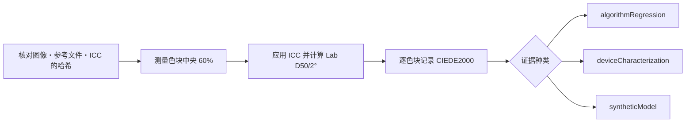

# IT8 色彩检验

[文档首页](../README.md)

不会靠看屏幕来判定色彩准确度合格。
把 IT8 图像和对应其物理标板的参考文件固定成一对，逐个色块记录数值。

> [!IMPORTANT]
> 公开的 IT8 素材能确认检验器和色彩计算是否回退，但证明不了真实扫描仪或彩色负片的准确度。
> 判定设备需要经过确认的物理标板，以及在该设备上的实测。

## 证据种类

| 名称 | 能确认什么 | 不能确认什么 |
|---|---|---|
| `algorithmRegression` | 文件解析、ICC 转换、色块区域、Lab、CIEDE2000 计算 | 真实扫描仪的准确度 |
| `deviceCharacterization` | 经确认的物理标板与真实设备实测 | 其他标板或设备的准确度 |
| `syntheticModel` | 独立合成模型的数学往返 | 真实胶片或设备的准确度 |

`deviceCharacterization` 需要物理标板的厂商、材质、序列号和批次信息。
只要有一项与参考文件的表头不同，就不做评估。

IT8.7/1 和 ISO 12641-1 的透射标板面向正片透射原稿。
这些结果说明不了彩色负片的橙色片基、染料干扰、C-41 偏差，也说明不了 NORITSU/FUJI 的输出准确度。
那些主张需要同一张彩色负片经两条路径处理的配对素材，以及独立的验证集合。

## 公开的回归检查素材

FADGI/OpenDICE 的下面两个文件作为一对使用。

- 指南：<https://www.digitizationguidelines.gov/guidelines/digitize-OpenDice.html>
- 图像：<https://www.digitizationguidelines.gov/guidelines/OpenDICE/IT8-7.1.tif>
  - SHA-256：`c62ee73f26390a2ad90e7e28280cbd1efb4f18834425bb7112ff1f8016832ffd`
  - 尺寸：`6255 x 4170`
  - 格式：16-bit RGB，内嵌 `Adobe RGB (1998)`
- 参考文件：<https://www.digitizationguidelines.gov/guidelines/OpenDICE/Profile_IT8-7.1.txt>
  - SHA-256：`19337b85f213eb4397e91c91298201f421ef3ca33b0ef6da3d752a0880491840`
  - 色块：从 `A1` 到 `L22` 的 264 个 Lab 值
  - 第 16 列：density

由于尚未确认再分发权限，这些文件不放进仓库，也不放进应用。
请自行下载，并在 [示例清单](../../reference/IT8_FADGI_OPENDICE.example.json)里指向它们。
该示例的等级是 `algorithmRegression`。只把名字改成 `deviceCharacterization`，检验器会拒绝。

```bash
swift run negaflow it8-bench docs/reference/IT8_FADGI_OPENDICE.example.json \
  --image /path/to/IT8-7.1.tif \
  --reference /path/to/Profile_IT8-7.1.txt \
  --out /path/to/it8-report.json
```

## 测量规则

- 图像、参考文件或所选 ICC 的 SHA-256 与清单不符时中止。
- 报告 v2 还会记录清单原文的 SHA-256。
- `A01` 和 `A1` 按同一坐标读取，原始 ID 保留在报告里。
- 以原分辨率的浮点读取 22 列 × 12 行色块的中央 60%。
- 色块顺序是行 `A`–`L`、列 `1`–`22`。
- 尊重内嵌 ICC。
- 按 linear sRGB D65 到 XYZ、Bradford D50 适应、Lab D50/2° 的顺序计算。
- 每个色块记录区域、像素数、RGB 均值与标准差、两端比例、非有限值数量、参考与实测 Lab、L/a/b 差值、CIEDE2000。
- median、p95、max 只是观测值，不是合格线。
- 不编造没有依据的平均阈值，`qualityDecision` 保持 `notEvaluated`。
- 用来拟合配置文件的标板，不会再拿去做独立验证。

### 物理标板信息

真实设备测量时，由操作者从标板标签上读取并填写下列信息。

<details>
<summary>测量信息示例</summary>

```json
{
  "measurement": {
    "samplerVersion": "center-mean-v1",
    "renderingIntent": "relativeColorimetric",
    "physicalTargetIdentity": {
      "manufacturer": "target label manufacturer",
      "material": "target label material",
      "serial": "target label serial",
      "batchMetadataKey": "PROD_DATE",
      "batchValue": "reference header production date"
    }
  }
}
```

</details>

`MANUFACTURER`、 `MATERIAL`、 `SERIAL` 以及批次表头（`BATCH`、 `BATCH_ID`、
`PROD_DATE` 之一）必须与参考文件逐字一致。
顶层的 `targetID` 要等于 `serial`，`batchID` 要等于 `batchValue`。

这份记录只能说明操作者填写的值与参考文件一致。
它既不从图像里识别标签，也不对操作者的输入做独立认证。
信息缺失时，不会拿最接近的日期或通用参考文件顶替。

参考文件里若有光源或观察者信息，会核对是否符合 D50/2° 的约定。发生矛盾就中止。
`measurement.renderingIntent` 目前无法直接固定 Core Image 的转换，
因此报告里写 `manifestDeclarationNotControlledByEvaluator`。

## `PRINT` 输出

IT8.7/1 面向输入设备。
打印输出需要用实测 `printer + paper + ink/chemistry + driver/process condition` 组合做出的 RGB
printer ICC 。

检查与应用顺序：

1. 确认 ICC 的大小、`prtr` 设备类别、`RGB ` 数据空间、Lab/XYZ PCS 以及 `acsp` 标识。
2. 确认 ColorSync 能做双向转换。
3. 选定时固定配置文件名、字节和 SHA-256。
4. 在 `MAIN` 工作图像和页面排布完成之后，只对最终输出应用一次。
5. 不对 `rawScanTIFF` 和 `-main-flat` 应用。
6. 配置文件缺失或不对时，在生成临时输出之前失败，不用 sRGB 顶替。

不主张当前的 Core Image 与 ColorSync 路径能在所有 macOS 上按位固定渲染意图和 black-point
compensation 。

## `MAIN` 合成色块回归

彩色负片的默认路径用 `shoulder-print-response-v4`。

```math
\log_{10}(P) =
y_{\mathrm{ceil}} -
\mathrm{amplitude}\,
\exp\left(-(\mathrm{rate}\,d)^{\mathrm{shape}}\right)
```

`d` 是扣掉 Dmin 后归一化的光学密度。系数不是保存好的预设，而是由下面四个基准点算出来的。

| 基准点 | 值 |
|---|---:|
| 片基黑点 | `0.001` |
| 中灰 | `0.18` |
| 实测最高密度处的白 | `0.70` |
| 反射光余量 | `0.90` |

在这条曲线上，`0D` 为 linear `0.001`，`0.6D` 为 `0.18`，`3D` 为 `0.882836683855`。
输出落在开区间内，所以正常范围的黑和白不会直接贴到 8-bit 的 `0/255`。

它不是根据场景直方图自动调整曝光的公式，也不代表某种胶片或某台设备的准确度。
公式见 [固定印相响应](PRINT_RESPONSE.md)。

`MainSyntheticIT8RoundTripTests` 先用反函数把 264 个参考色块变成负片，
再走完整的 `MAIN` 路径还原回来，并逐色块检查 Lab D50/2° 和 `DeltaE00`。
这属于 `syntheticModel` 回归。

## NORITSU/FUJI 相对风格回归

把含有从 `A1` 到 `L22` 共 264 个 Lab D50 色块的参考文件用 SHA-256 固定。
把每个色块转成合成负片后，`MAIN`、`NORITSU`、`FUJI` 三条路径各跑两次。

```bash
swift run negaflow scanner-relative-it8-bench \
  /path/to/Profile_IT8-7.1.txt \
  --sha256 sha256:19337b85f213eb4397e91c91298201f421ef3ca33b0ef6da3d752a0880491840 \
  --out /path/to/scanner-relative-it8-report.json
```

报告里包含逐色块的 RGB 与 Lab、相对参考的 `DeltaE00`、各目标之间的相对 `DeltaE00`，
以及溢出和非有限值的标记。中性灰阶的单调性看 `A16...L16` 密度列。

转到 linear sRGB 后落在 0...1 之外的颜色，无法精确做成合成负片，因此限制到可显示范围。
所以大范围的统计只是观测值，不是合格标准。

证据等级永远是 `syntheticModel`，判定永远是 `notEvaluated`。
配置文件清单或任一文件的 SHA-256 只要不对就中止。
真实设备的准确度需要同一张物理负片在两台设备上的扫描，以及独立的验证素材。

并没有从参考文件表头确认 D50/2°。把 Lab 按 D50/2° 读取是这套基准自身的约定，
因此 `colorimetryInterpretationProvenance` 是 `benchmarkContractNotVerifiedFromReferenceHeader`
。

`shoulder-print-response-v4` 之前的结果，不会当作当前算法的结果重复使用。

## 测量流程


