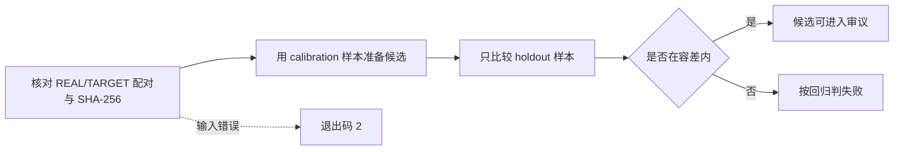

# 扫描仪配置文件质量判定

[文档首页](../README.md)

`scripts/evaluate_profile_quality.py` 用来检查扫描仪配置文件的改动有没有比已批准的基准更差。 它比较由 `LUT_target/analyze_lut_target.py` 生成的两份 `SOURCE/summary.json`，并且只用没参与调参的验证样本来做判定。

这个工具不会替你定义“好的颜色”。哪些数值该降、哪些该升、允许变化多少，都要由人写进素材清单。 不提供默认的合格值。

目前仓库里没有 REAL/TARGET 图像配对。 因此既没有真实的素材清单，也没有批准基准和真实设备上的合格结果。合成测试只验证检查器本身的代码。

> [!WARNING]
> 仅凭当前仓库无法批准扫描仪的色彩准确度。真正的发布判定需要固定的 REAL/TARGET 配对、未用于调参的验证样本，以及由人设定的容差。

## 应用目前如何使用这些配置文件

只有当用户自己选择 `NORITSU` 或 `FUJI` 目标时，才能使用内置 `realOnly` 组里的有限相对差异。

需要满足：

- 胶片种类和胶片名称相同。
- 整理后的原始胶卷名称集合相同。
- 图像数量差异不超过 15%。

原始配置文件里没有逐帧 ID 或 SHA-256。胶卷名相同，并不能证明配的是完全相同的画幅。 因此不能说结果与真实设备一致。

应用规则：

- 两组中方向相反的值不应用。
- 黑白会去掉所有色彩分量，只保留相对影调。
- 没有对应胶卷的反转片配置文件，不应用 NORITSU/FUJI 的相对校正。
- 没有同一位置的配对素材时，不应用扫描仪质感或锐化。
- 影调只在 Rec.709 伽马亮度上应用一次，并保留 Lab 的 `a*`、`b*`。
- 色彩 gain 在对数域插值，保持方向相反的基准点之间的关系。
- 只要文件或清单的 SHA-256 有一项不符，就拒绝整套配置文件。

## 厂商资料能确认到哪一步

- [Fujifilm Frontier 570/SP-3000 指南](https://www.photolabdigital.com/fuji_frontier570_en%5B1%5D.pdf) 公开了 area CCD、Hyper-tone、Hyper-sharpness 等功能名称，但没有公开传递函数和设置值。
- [Noritsu HS-1800 产品信息](https://www.noritsu.eu/hardware/noritsu-film-scanner.html) 公开了支持格式、分辨率和处理量，但没有给出固定的色彩传递函数。
- [Noritsu 专利 US 7,589,863](https://patents.google.com/patent/US7589863/en) 描述了迷你冲扩店里由操作者选择密度、层次和锐化的流程。

这些资料说明处理会随场景和操作者变化，并不会提供复刻 HS-1800 或 SP-3000 的固定常数。 negaflow 不会从产品名去猜这些值。

## 素材清单 schema v1

清单和它固定的输入素材放在一起，例如 `LUT_target/quality/corpus-v1.json`。 路径以清单文件所在位置为基准；给了 `--data-root` 时，就以该路径为基准。

<details>
<summary>素材清单示例</summary>

```json
{
  "schemaVersion": 1,
  "corpusVersion": "scanner-corpus-2026-07-10.1",
  "acceptedBaselineSHA256": "sha256:<64 lowercase hex>",
  "cases": [
    {
      "role": "calibration",
      "stem": "NORITSU/color nega/Portra 400/calibration-01",
      "real": {
        "path": "REAL/NORITSU/color nega/Portra 400/calibration-01.tif",
        "sha256": "sha256:<64 lowercase hex>"
      },
      "target": {
        "path": "TARGET/NORITSU/color nega/Portra 400/calibration-01.tif",
        "sha256": "sha256:<64 lowercase hex>"
      }
    },
    {
      "role": "holdout",
      "stem": "NORITSU/color nega/Portra 400/holdout-01",
      "real": {
        "path": "REAL/NORITSU/color nega/Portra 400/holdout-01.tif",
        "sha256": "sha256:<64 lowercase hex>"
      },
      "target": {
        "path": "TARGET/NORITSU/color nega/Portra 400/holdout-01.tif",
        "sha256": "sha256:<64 lowercase hex>"
      }
    }
  ],
  "metrics": [
    {
      "name": "mean_delta_e2000",
      "direction": "lowerIsBetter",
      "allowedRegression": 0.0
    },
    {
      "name": "similarity_score_0_100",
      "direction": "higherIsBetter",
      "allowedRegression": 0.0
    },
    {
      "name": "neutral_a_shift",
      "direction": "absoluteLowerIsBetter",
      "allowedRegression": 0.0
    }
  ]
}
```

</details>

示例里的 `0.0` 不是推荐值。请按实际的测量方法和发布策略来定义条目与容差。

## 清单规则

- `schemaVersion` 必须正好是 `1`。
- 不认识的版本和字段一律拒绝。
- `corpusVersion` 指向固定的素材选择与划分方式。
- `acceptedBaselineSHA256` 固定已批准 `summary.json` 的确切字节。
- 每个样本要么是 `calibration`，要么是 `holdout`。
- 名称不能重复。
- 素材不能为空，两种角色各至少要有一个。
- REAL 与 TARGET 文件都用 `sha256:<64 lowercase hex>` 固定。
- 指标名称不能重复。
- `allowedRegression` 必须是不小于 0 的有限数，不接受布尔值。
- 方向只接受 `lowerIsBetter`、`higherIsBetter`、`absoluteLowerIsBetter`。

`absoluteLowerIsBetter` 比较的是距离 0 的绝对值，只在 0 是经过审议的基准时使用。

## 准备候选与批准基准

```bash
python3 LUT_target/analyze_lut_target.py
```

批准发布之前，把候选的整份 `SOURCE/summary.json` 保存为下一个批准基准文件。 在候选通过审议之前，不覆盖已有的批准文件。 把批准文件的确切 SHA-256 填进 `acceptedBaselineSHA256`。

候选与基准的摘要里，清单中列出的样本必须各出现恰好一次。 缺失、重复、处理失败，或出现清单之外的样本，都属于输入错误。

`calibration` 样本可以用于拟合配置文件，但不参与判定。`holdout` 样本不参与调参和挑选。 验证数值按样本逐个比较，因此不能用平均改善掩盖某一张变差。



## 运行

<details open>
<summary>质量检查命令</summary>

```bash
python3 scripts/evaluate_profile_quality.py \
  --manifest LUT_target/quality/corpus-v1.json \
  --candidate-summary LUT_target/SOURCE/summary.json \
  --baseline-summary LUT_target/quality/accepted-summary-v1.json \
  --data-root LUT_target \
  --verify-files all \
  --report build/profile-quality-report.json
```

</details>

文件校验模式：

| 值 | 行为 | 能否作为发布依据 |
|---|---|---|
| `all` | 校验所有 REAL/TARGET 文件的路径和 SHA-256 | 能 |
| `holdout` | 只校验验证用文件 | 用于快速排查 |
| `none` | 不校验图像文件 | 不能 |

默认是 `all`。 报告里记录所用模式、清单与摘要文件的哈希、文件校验结果，以及验证样本逐个的比较和计数。 stdout 和 `--report` 文件写入同一份 JSON，文件保存是原子的。

退出码：

- `0`：输入正确，且没有超出容差的变差
- `1`：输入正确，但至少一项验证数值超出允许范围
- `2`：schema、素材、哈希、路径或指标有误或缺失

## 检查器的测试

```bash
python3 -m unittest scripts/tests/test_evaluate_profile_quality.py
```

测试用临时合成文件覆盖正常比较、变差、哈希变化、错误的 schema 与数值、重复・缺失・失败的样本，以及空素材。 它不能证明真实扫描仪输出的质量。
