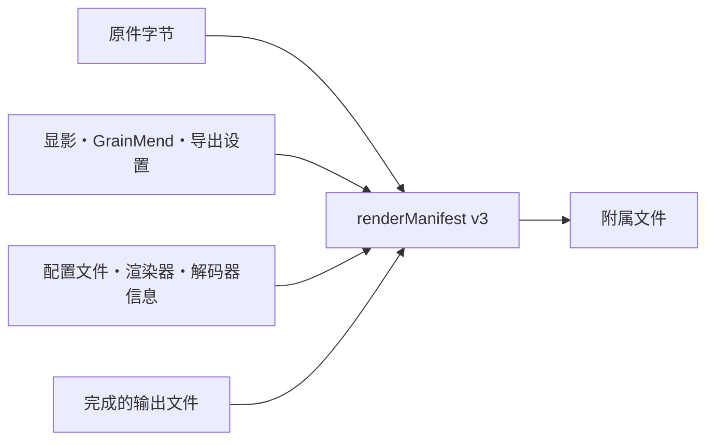

# 渲染记录

[文档首页](../README.md)

附属文件里的 `renderManifest` 用 SHA-256 把原件、编辑值和最终文件连起来，不记录文件路径。

> [!IMPORTANT]
> `renderManifest` 记录的是文件和设置之间的哈希关系。这里没有数字签名，也没有证书，所以不叫
> C2PA Content Credentials。

v3 里有这些值：

- 原件字节数、SHA-256 和算法名 `sha-256`
- 实际用的渲染输入类型
- GrainMend 缓存文件或内存输入的确认范围
- 显影、GrainMend、导出设置的 SHA-256
- 扫描仪配置文件的 SHA-256
- 解码器来源和色彩引擎渲染器版本
- 最终文件的 SHA-256、字节数、像素尺寸和格式

编码器写完文件后，会用 ImageIO 再打开一次确认像素尺寸，并对整个文件计算哈希，之后才写附属文件。
v3 检查没通过，就不会作为完成的输出组公开。

## GrainMend 输入

- `cleanedMemory`：内存里的像素没有标准哈希，所以确认范围记成 `sourceAndDevelopRecipe`。
GrainMend 编辑记录的 SHA-256 一定会写进去。
- `cleanedFile`：GrainMend 缓存文件整体和编辑记录都计算哈希。

以前的 v1 和 v2 文件照样能读。当时没有的输出哈希或 GrainMend 记录哈希，不会事后靠猜补上。

## 和 C2PA 的区别

这里没有数字签名、证书、信任链，也没有内嵌 claim store，所以不叫 C2PA Content Credentials。
C2PA 的 hard binding 和处理历史思路、 PREMIS 的完整性思路都参考过，
但写进去的只有能核对的 SHA-256。

参考：

- [C2PA Content Credentials 2.2](https://spec.c2pa.org/specifications/specifications/2.2/specs/C2PA_Specification.html)
- [C2PA hard-binding guidance](https://spec.c2pa.org/specifications/specifications/2.4/guidance/Guidance.html)
- [PREMIS preservation metadata](https://www.loc.gov/standards/premis/)
- [Apple Image I/O orientation and image properties](https://developer.apple.com/documentation/imageio/cgimagepropertyorientation)
