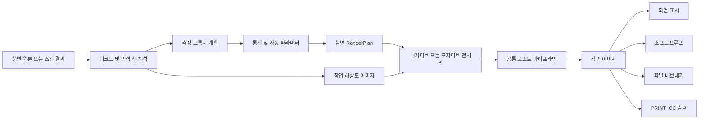
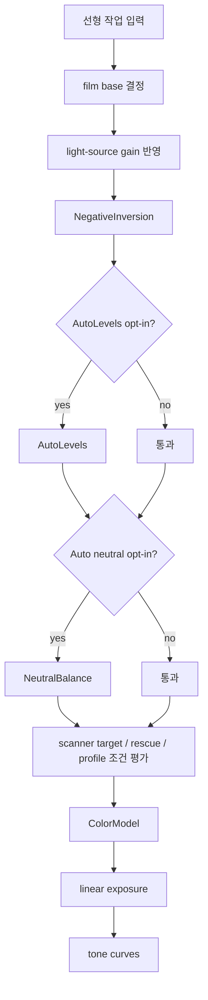
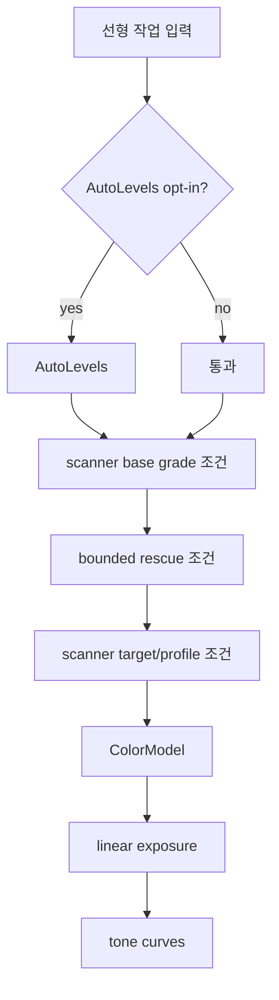

# Windows 렌더 파이프라인 구조

상태: 1차 기준선 확정  
최종 코드 대조: 2026-08-04  
대상: native Windows Negaflow 렌더 오케스트레이션  
기준 코드:

- `Sources/Chromabase/Engine/ChromabaseEngine.swift`
- `Sources/Chromabase/Engine/ChromabaseEngine+NegativePipeline.swift`
- `Sources/Chromabase/Engine/ChromabaseEngine+PositivePipeline.swift`
- `Sources/Chromabase/Engine/ChromabaseEngine+PostPipeline.swift`
- `Sources/Chromabase/Digital/DigitalFilmLook.swift`
- `Sources/Chromabase/Adjustments/FilmEmulation.swift`
- `Sources/Chromabase/Adjustments/FilmScanDenoise.swift`
- `Sources/Chromabase/Engine/ChromabaseMetalKernels.swift`
- `Sources/Chromabase/Export/ExportEngine.swift`
- `Sources/Chromabase/Export/SoftProof.swift`
- `Sources/Chromabase/Imaging/ImageTransform.swift`

이 문서는 macOS 구현을 단순히 호출 순서로 옮기는 문서가 아니다. 현재 제품의 비파괴
현상 의미를 보존하면서 Windows에서 실행 가능한 렌더 계획, 측정 계획, 출력 계획의
경계를 정한다.

---

## 1. 결론

Windows 파이프라인은 다음 세 평면으로 분리한다.

1. **측정·제어 평면**
   - 프록시나 원본에서 통계를 구한다.
   - 자동 파라미터를 결정한다.
   - 결정된 값을 불변 `RenderPlan`에 고정한다.
2. **작업 렌더 평면**
   - 네거티브 또는 포지티브 전처리를 수행한다.
   - 공통 포스트 파이프라인을 적용한다.
   - 넓은 범위의 선형 부동소수 작업 이미지를 유지한다.
3. **표시·출력 평면**
   - 화면 표시, 소프트프루프, 파일 내보내기, PRINT 출력을 각각 명시적으로 처리한다.
   - gamut mapping, 출력 ICC 변환, 최종 양자화는 이 경계에서만 수행한다.

핵심 결정은 다음과 같다.

- 렌더 오케스트레이션은 **순서가 있는 조건부 스테이지 체인**이다.
- 그러나 각 스테이지 내부에는 blur, mask, blend, guided filter, repair처럼 실제
  **DAG인 하위 그래프**가 있다.
- 따라서 “파이프라인 전체는 선형이며 DAG가 필요 없다”는 이전 결론은 폐기한다.
- 반대로 임의 노드 편집기가 필요한 것도 아니다. 제품이 실제 사용하는 제한된 노드와
  의존성을 표현하는 **작고 명시적인 내부 렌더 계획**이면 충분하다.
- 커널 개수나 예상 디스패치 수를 성능의 대리값으로 쓰지 않는다.
- D3D11 + Direct2D를 범용 기준선으로 두고, reduction·복잡한 공간 연산은
  DirectCompute 또는 CPU를 선택한다.
- D3D12, DXC/SM6, CUDA는 기준선이 아니다.
- 프리뷰와 최종 내보내기는 같은 현상 수학과 같은 파라미터 스냅샷을 사용한다.
  차이는 명시된 해상도, 표시 변환, 출력 인코딩뿐이어야 한다.

---

## 2. 이전 문서에서 폐기하는 가정

다음 문장은 구현 근거가 부족하거나 사실과 달라서 더 이상 설계 기준으로 사용하지 않는다.

| 폐기하는 가정 | 이유 |
|---|---|
| 전체 파이프라인은 분기 없는 선형 체인이다 | 조건부 라우팅뿐 아니라 여러 스테이지 내부에 fan-out/fan-in이 있다 |
| 단일 입력 HLSL은 모두 한 디스패치로 융합된다 | Direct2D shader linking 조건, effect graph, format, precision, transforms에 따라 달라진다 |
| 31개 중 특정 개수는 항상 융합 가능하다 | 개별 커널의 pointwise 성질과 실행 그래프의 linkability는 같은 개념이 아니다 |
| 전형적인 현상은 고정 6~8 디스패치다 | 옵션, 입력 종류, 드라이버, D2D 최적화, 타일 계획에 따라 실제 pass 수가 달라진다 |
| 융합하면 정밀도 문제가 사라진다 | 융합되지 않는 경계, resource format, effect output precision, 출력 변환이 여전히 중요하다 |
| 측정은 항상 축소본에서 한 번이면 된다 | 측정마다 정확도·ROI·해상도 계약이 다르며 전체 해상도 확인이 필요한 경로도 있다 |

새 원칙은 간단하다.

> 그래프 모양, 링크된 셰이더 수, 중간 surface 수, 메모리 traffic은 대표 시나리오를 실제로
> 캡처해서 기록한다. 코드 모양만 보고 고정 숫자를 약속하지 않는다.

---

## 3. 최상위 데이터 흐름



`RenderPlan`은 원본을 소유하거나 변경하지 않는다. 다음을 가리키는 불변 스냅샷이다.

- source identity와 source revision
- develop recipe revision
- 입력 색 해석 결과
- 측정 결과와 해당 측정의 provenance
- 활성 스테이지와 고정된 파라미터
- 작업 해상도와 요청 ROI
- 품질 tier
- 출력 목적
- 취소·stale-result 판정을 위한 session/revision identity

프리뷰 슬라이더를 움직일 때 매 프레임 자동 측정을 새로 시작하면 안 된다. 측정 입력에
영향을 주는 파라미터가 바뀌었을 때만 관련 측정 key를 무효화한다.

---

## 4. 입력과 디코드 경계

렌더 그래프 앞에는 명시적인 입력 계약이 있다.

### 4.1 입력 계약

- 디코드 성공 여부
- 픽셀 폭·높이와 orientation
- 채널 수와 alpha 의미
- 정수/부동소수 sample type과 bit depth
- embedded ICC 또는 명시적인 untagged 정책
- 스캔인지 디지털 카메라 원본인지
- negative/positive film type
- scanner provenance와 scanner profile evidence
- IR plane 유무와 정렬 상태

잘못되거나 모순되는 입력은 렌더 graph에 넣기 전에 실패시킨다. Windows 포트가 모델명이나
확장자만 보고 scanner 특성, 색공간, IR 지원을 추측해서는 안 된다.

### 4.2 원본 불변성

- source file은 읽기 전용으로 취급한다.
- 디코드 cache, proxy, thumbnail, cleaned raw는 app-owned cache에 둔다.
- develop recipe와 defect recipe는 원본과 별도 저장한다.
- `rawScanTIFF`는 현상 결과가 아니라 원 스캔 보존 목적의 별도 출력 경로다.

`rawScanTIFF`가 현상 그래프를 우회하는 현재 동작을 Windows에서도 명시적으로 유지한다.
일반 export와 같은 경로에 넣었다가 우연히 현상 스테이지가 적용되는 구조를 금지한다.

---

## 5. 측정·제어 평면

렌더링과 자동 측정을 한 그래프의 암묵적인 side effect로 섞지 않는다.

### 5.1 측정 결과의 역할

현재 코드에서 다음 종류의 결정이 이미지 통계에 의존한다.

- film base와 채널별 밀도 범위
- auto levels percentile
- neutral balance
- rescue grade의 제한된 색 편향 판단
- tone curve bands와 luminance percentile
- scanner target/profile 적용에 필요한 조건
- defect detection threshold와 구조 분석

각 측정은 다음 key로 캐시한다.

```text
MeasurementKey =
  sourceIdentity
  + sourceContentRevision
  + measurementKind
  + measurementAlgorithmVersion
  + measurementInputParameters
  + ROI
  + proxySpecification
```

UI revision만 key에 넣으면 같은 원본에 대한 캐시 재사용이 불가능하고, 반대로 recipe 전체를
무시하면 입력 의미가 달라진 측정을 재사용할 수 있다. 측정 종류별 최소 영향 필드를 명시한다.

### 5.2 프록시 정책

프록시는 성능 수단이지 결과 정의가 아니다.

- 측정 알고리즘마다 허용 가능한 축소 방식과 최소 치수를 정의한다.
- orientation과 crop을 측정 전에 적용하는지 알고리즘별로 고정한다.
- film base sample처럼 사용자 ROI 의미가 중요한 측정은 정확한 좌표 변환을 기록한다.
- histogram bin, percentile, NaN/Inf 처리, alpha 제외 규칙을 고정한다.
- CPU와 GPU 측정이 서로 다른 결정을 내리지 않도록 허용 오차와 tie-break를 정한다.
- 프록시 결과가 confidence gate를 통과하지 못하면 더 큰 proxy나 CPU 참조 경로로 재측정한다.

### 5.3 실행 백엔드

측정은 다음 순서로 선택한다.

1. 작은 프록시와 충분히 빠른 작업은 CPU 기준 구현
2. 큰 histogram/reduction이 병목이고 D3D11 compute capability가 검증되면 DirectCompute
3. GPU 결과는 CPU oracle과 corpus 비교를 통과해야 함
4. device loss나 capability 부족에서는 CPU로 동일한 결정을 재현

독립적인 D3D12 queue를 기준선으로 요구하지 않는다. D3D11/Direct2D와 resource를 공유할 수
있는 DirectCompute가 먼저이며, 추가 interop 비용이 이득보다 큰지는 측정한다.

세부 계약은 [../03-measurement/histogram-and-statistics.md](../03-measurement/histogram-and-statistics.md)에 둔다.

---

## 6. 네거티브 전처리

다음은 현재 macOS 코드의 의미 순서다. Windows가 이름만 비슷한 다른 룩으로 대체해서는 안 된다.



### 6.1 film base 결정

지원되는 근거는 현재 제품 의미와 일치해야 한다.

- 사용자가 지정한 manual base
- 검증된 preset/profile base
- 측정된 automatic base
- scanner/light-source metadata가 있는 경우의 보정

근거가 없는 scanner model 추정값을 삽입하지 않는다. 실패 또는 낮은 confidence는 UI에
드러내고 manual 선택으로 이어져야 한다.

### 6.2 NegativeInversion

- 단순 `1 - RGB`가 아니다.
- Dmin 정규화, 채널 범위, 현재 print-response 수학을 보존한다.
- 중간값은 음수와 1 초과를 가질 수 있다.
- 이 단계 직후 임의 clamp를 넣지 않는다.
- macOS 구현의 수식과 상수를 C++ scalar oracle로 먼저 고정한다.

### 6.3 자동 보정은 opt-in

제품 기본값은 수동 현상이다.

- AutoLevels는 명시적으로 켠 경우만 적용한다.
- auto neutral도 명시적으로 켠 경우만 적용한다.
- Windows에서 “보기 좋아 보이는 기본값”을 이유로 자동 보정을 상시 적용하지 않는다.
- 자동 결과는 recipe에 결정값 또는 재현 가능한 measurement provenance로 남긴다.

### 6.4 scanner 경로

scanner target, rescue, scanner profile은 무조건 연속 적용되는 프리셋 묶음이 아니다.

- scanner evidence
- profile validity
- current target
- rescue 조건

을 평가해 활성 graph를 만든다. 상호 배타적이거나 조건적인 관계를 단일 거대 셰이더의
숨은 branch로만 두지 않는다. 활성화 이유를 diagnostic capture에 남긴다.

### 6.5 색과 톤

- `ColorModel`
- linear exposure `2^stops`
- basic/parametric tone curves

순서를 보존한다. exposure를 감마 인코딩 공간의 단순 채널 곱으로 바꾸거나, tone curve를
출력 ICC 이후에 적용하는 것은 동등하지 않다.

---

## 7. 포지티브 전처리

포지티브 스캔과 디지털 입력은 네거티브 inversion을 거치지 않는다.



포지티브 경로에서도 scanner grade는 scanner evidence가 있을 때만 적용한다. 일반 이미지에
scanner 룩이 유입되는 fallback을 만들지 않는다.

`MAIN`과 `PRINT`는 별도 작업 룩이 아니다. 현재 제품 계약은 완성된 MAIN 작업 이미지 뒤의
출력 경계에서 검증된 printer-class RGB ICC를 적용하는 것이다. 따라서 PRINT 선택만으로
포지티브 base grade를 중복 적용해서는 안 된다.

---

## 8. 공통 포스트 파이프라인

현재 의미 순서는 다음과 같다.

1. `PointCurveStage`
2. `ColorMixerStage`
3. `ColorGradingStage`
4. `CalibrationStage`
5. source 분기
   - digital source: `DigitalFilmLook`
   - film scan: `FilmEmulationStage`
6. 조건부 `SoftwareDefectRemoval`
7. 조건부 `FilmScanDenoise`
8. local dodge/burn masks
9. `TextureStage`
10. B&W 변환과 조건부 scanner tint
11. `BWToningStage`
12. `ImageTransformStage`

스테이지 순서는 이미지 의미의 일부다. 성능 최적화로 순서를 바꾸려면 교환 가능성에 대한
수학적 증명과 golden corpus가 모두 필요하다.

### 8.1 디지털과 필름의 상호 배타적 라우팅

디지털 source는 이미 필름을 거친 스캔이 아니므로 `DigitalFilmLook`의 물리적 시뮬레이션을
사용할 수 있다. 현재 디지털 경로의 의미 순서는 다음과 같다.

```text
scene reconstruct
→ linear-light halation
→ film develop response
→ film color response
→ color preset
→ density-dependent grain
→ acutance
→ original과 최종 blend
```

필름 스캔에 이 전체 경로를 다시 적용하면 필름 특성을 중복 시뮬레이션한다. 필름 스캔은
`FilmEmulationStage` 경로를 사용한다. Windows 라우터는 `isDigitalSource`를 추측하지 않고
catalog/import metadata와 사용자의 명시적 상태를 따른다.

### 8.2 결함 제거

결함 제거는 단일 point kernel이 아니다.

- RGB software detection
- optional IR plane registration 및 spectral 판단
- dust/speck/scratch 구조 분석
- component mask
- repair와 texture reconstruction
- 사용자 수동 defect recipe

가 함께 작동할 수 있다. 이 영역을 Direct2D effect 한 개로 축약한다고 가정하지 않는다.
CPU와 GPU의 역할을 단계별로 나누고, 자동 결과가 사용자 수동 보정을 덮어쓰지 않도록 한다.

RGB 기반 software defect removal을 hardware IR/Digital ICE와 동등하다고 표시하지 않는다.

### 8.3 FilmScanDenoise

guided filter 계열은 여러 중간 이미지와 fan-in을 가진다.

- guide/source statistics
- coefficient images
- filtered coefficients
- reconstruction/application

따라서 개별 `gf*` HLSL 함수가 pointwise여도 전체 스테이지는 pointwise 체인이 아니다.
ROI는 필터 반경에 따른 apron을 포함해야 하며, 타일 경계 회귀 테스트가 필수다.

### 8.4 local dodge/burn

- mask와 image가 별도 입력이다.
- mask coordinate와 image transform coordinate를 명확히 맞춘다.
- stale mask rasterization 결과를 새 recipe revision에 적용하지 않는다.
- zoom/pan용 표시 mask와 최종 렌더 mask의 품질 차이는 명시한다.

### 8.5 TextureStage

현재 구현은 단순 sharpen만이 아니다.

- sharpness / unsharp mask
- grain
- clarity의 blur/mix
- halation의 luminance mask, blur, warm transform, screen blend
- vignette의 radial gradient와 blend

이 때문에 “TextureStage 1회”를 “GPU pass 1회”로 해석할 수 없다. 활성 옵션별 실제 effect
graph와 intermediate surface를 캡처한다.

### 8.6 B&W와 transform

- 흑백 변환은 공통 색 현상 뒤에 적용한다.
- scanner tint와 B&W toning은 조건에 따라 그 뒤에 적용한다.
- crop/rotate/flip/perspective를 포함하는 `ImageTransformStage`는 현재 post pipeline의 마지막이다.
- 표시 coordinate, defect coordinate, export pixel coordinate 사이의 변환을 한 곳에서 정의한다.

---

## 9. 실제 하위 그래프 유형

Windows 구현이 지원해야 하는 그래프 모양은 제한적이지만 하나가 아니다.

| 유형 | 예 | fan-out/fan-in | 후보 실행 |
|---|---|---:|---|
| 단일 point transform | tone, color grade, calibration | 낮음 | D2D transform/linking 또는 CPU SIMD |
| 다중 입력 point combine | source + graded, source + mask | 있음 | D2D complex input 또는 compute |
| 1D/3D LUT branch | film/color preset | 있음 | D2D LUT/3D texture/CPU LUT |
| blur → combine | scanner chroma, clarity, halation | 있음 | D2D Gaussian blur + custom effect |
| mask → blur → blend | digital halation, vignette | 있음 | D2D graph 또는 compute |
| guided filter | film scan denoise | 큼 | DirectCompute/CPU 우선 검토 |
| detect → components → repair | defect removal | 큼 | CPU + compute 혼합 |
| reduction → scalar params | histogram/auto | 결과가 제어 평면으로 이동 | CPU 또는 DirectCompute |
| transform/resize | crop, rotate, Lanczos export | 좌표 의존 | D2D/WIC/CPU 품질 검증 |

이 표가 내부 graph API의 최소 요구사항이다. 범용 compositor나 공개 plugin node API는 1차
Windows 범위가 아니다.

---

## 10. `RenderPlan`과 노드 계약

구체적인 C++ 이름은 spike 결과에 따라 달라질 수 있지만 의미 계약은 고정한다.

### 10.1 계획 생성

```text
DevelopParameters + SourceMetadata + Measurements + OutputIntent
    → validate
    → normalize
    → resolve conditional stages
    → freeze parameter blocks
    → build RenderPlan
```

계획 생성은 다음을 금지한다.

- 렌더 중 숨은 자동 측정
- device/vendor에 따라 제품 파라미터 변경
- unsupported ICC/profile을 조용히 sRGB로 대체
- missing scanner evidence를 generic scanner profile로 대체
- invalid NaN/Inf를 clamp만 하고 진행

### 10.2 노드 최소 필드

각 노드는 다음 정보를 가진다.

- stable semantic node type
- algorithm version
- immutable parameter block
- input edge 목록
- pixel domain과 alpha contract
- required input/output precision
- ROI mapping 함수
- apron 또는 full-frame 요구
- backend eligibility
- deterministic/fallback contract
- diagnostic label

### 10.3 graph compile

graph compile 단계는 제품 의미를 바꾸지 않는 범위에서만 최적화한다.

- disabled identity stage 제거
- 안전성이 입증된 인접 point transform linking
- 동일 불변 resource 재사용
- 서로 같은 blur 요청의 공유 가능성 검사
- ROI propagation
- transient resource lifetime 계산
- backend 경계와 readback/upload 비용 계산

다음 최적화는 자동으로 허용하지 않는다.

- 비선형 연산 순서 교환
- 색공간 경계 이동
- 중간 precision 강등
- 서로 다른 algorithm version의 cache 공유
- preview용 근사 결과를 export에 재사용

---

## 11. Direct2D와 DirectCompute의 역할

### 11.1 Direct2D가 잘 맞는 영역

- 2D image effect graph
- Gaussian blur, transform, color matrix 같은 검증된 built-in effect
- custom pixel shader effect
- display composition과 DirectComposition/WinUI surface 연결
- 일부 인접 point transform의 shader linking

### 11.2 DirectCompute가 필요한 후보

- 대용량 histogram/reduction
- guided filter
- morphology와 connected-component 전처리
- 타일 친화적인 복잡 공간 연산
- Direct2D graph로 만들었을 때 intermediate traffic이 지나치게 큰 단계

DirectCompute 사용은 D3D11 resource 공유 비용까지 포함해 측정한다. compute가 존재한다는 이유로
모든 image stage를 compute로 다시 쓰지 않는다.

### 11.3 CPU가 우선인 영역

- 작은 프록시 측정
- control-heavy 알고리즘
- component 분석과 sparse repair
- GPU upload보다 계산이 싼 작은 이미지
- unsupported capability 또는 device-loss fallback
- scalar oracle와 correctness reference

x64 Intel/AMD와 ARM64 모두 동일한 scalar 기준을 가진다. SIMD는 선택적 가속이며 결과 의미를
정의하지 않는다.

### 11.4 CUDA의 위치

CUDA는 NVIDIA 전용 선택적 실험 tier다.

- 필수 기능을 CUDA에만 구현하지 않는다.
- Intel, AMD, Qualcomm 시스템에서 기능 차이가 없어야 한다.
- CUDA artifact를 기본 설치에 강제하지 않는다.
- D3D11/CPU 대비 end-to-end 이득이 큰 특정 batch workload만 후보로 삼는다.
- driver/runtime 배포와 라이선스 검토가 끝나기 전 제품 의존성을 만들지 않는다.

---

## 12. shader linking은 최적화이지 계약이 아니다

Direct2D의 shader linking은 인접한 pixel shader transform을 runtime에 연결해 intermediate
surface를 줄일 수 있다. 하지만 다음 조건에 의존한다.

- 해당 effect가 linking용 export shader를 제공하는가
- graph에서 단순 입력으로 연결되는가
- 중간 format/precision 요구가 호환되는가
- transform/compute/built-in effect가 경계를 만들지 않는가
- runtime과 driver가 해당 graph를 실제로 어떻게 compile하는가

따라서 문서에 “31개 중 N개를 항상 융합한다”고 쓰지 않는다.

각 custom effect는 필요할 때 다음 두 artifact를 가진다.

1. 독립 실행용 full shader bytecode
2. linking용 export function bytecode

실제 linked pass와 intermediate surface 수는 PIX, debug instrumentation, representative graph
capture로 확인한다. 자세한 조건은 [shader-linking.md](shader-linking.md)에 둔다.

---

## 13. 작업 정밀도와 clipping 경계

### 13.1 작업 이미지

현재 제품 수학은 다음을 요구한다.

- 최소 float32 계산 의미
- 음수 보존
- 1 초과 highlight 보존
- NaN/Inf의 명시적 검출
- premultiplied/unpremultiplied alpha 계약
- 색공간과 전달함수의 명시적 상태

GPU register가 float32라는 사실만으로 충분하지 않다. effect 사이에 materialize되는 surface의
format과 D2D output precision 설정이 작업 범위를 보존해야 한다.

### 13.2 clamp 위치

clamp는 알고리즘이 명시적으로 요구하는 경우 또는 출력 encoding 경계에만 둔다.

- inversion 직후 임의 clamp 금지
- tone 전에 display range clamp 금지
- ICC transform 전에 근거 없는 0...1 clamp 금지
- 8-bit/16-bit encoding 시 정해진 quantization과 dither 적용

세부 내용은 [precision-and-clipping.md](precision-and-clipping.md)에 둔다.

---

## 14. ROI, 타일, apron

### 14.1 ROI 전파

각 노드는 output ROI에 필요한 input ROI를 계산한다.

| 노드 종류 | input ROI |
|---|---|
| point transform | output ROI와 동일 |
| fixed-radius filter | output ROI + radius/apron |
| transform | inverse-mapped ROI + sampling footprint |
| global statistic | 정의에 따라 full image 또는 명시된 measurement ROI |
| connected/global structure | full image 또는 별도 coarse global pass |
| LUT/color transform | output ROI와 동일 |

### 14.2 타일 원칙

- 고정 1024×1024 같은 값을 제품 계약으로 삼지 않는다.
- device memory budget, image size, filter radius, format, queue pressure에 따라 결정한다.
- 큰 apron 때문에 중복 계산이 과도하면 stage boundary나 타일 크기를 바꾼다.
- global analysis와 local render를 분리한다.
- 타일 순서가 결과를 바꾸지 않아야 한다.
- 경계 조건은 clamp/mirror/transparent 중 알고리즘별로 고정한다.

### 14.3 seam 검증

각 공간 스테이지에 대해 다음을 비교한다.

- full-frame reference
- 여러 tile size
- 홀수 폭·높이
- 필터 반경보다 작은 이미지
- crop edge
- rotated/transformed edge
- ARM64와 x64 CPU
- Intel/AMD/NVIDIA/Qualcomm GPU 가능 범위

차이 image와 seam-band metric을 artifact로 남긴다.

---

## 15. 프리뷰와 export 동등성

### 15.1 공유해야 하는 것

- recipe normalization
- measurements와 provenance
- stage order
- 활성 조건
- color math
- LUT/profile versions
- random seed derivation
- defect recipe semantics
- output-intent 전까지의 작업 이미지 의미

### 15.2 달라도 되는 것

명시적인 품질 tier만 다를 수 있다.

- 작업 해상도
- viewport ROI
- 일부 고비용 분석의 proxy 크기
- display용 resize
- interactive scheduling priority
- 화면 표시 ICC 경계

프리뷰 전용 룩, 프리뷰에서만 빠지는 색 단계, export에서만 자동 보정되는 숨은 규칙은 금지한다.

### 15.3 random texture

grain과 dither는 재현 가능한 seed contract를 가진다.

```text
seed = hash(source identity, recipe revision, algorithm version, user seed)
```

tile origin과 absolute pixel coordinate를 사용해 타일 순서나 thread scheduling이 texture를
바꾸지 않게 한다. macOS `CIRandomGenerator`의 bit-identical 복제가 불가능하거나 불필요한 경우
시각적/통계적 동등성 기준을 별도로 정하되, 같은 Windows recipe의 반복 실행은 결정적이어야 한다.

---

## 16. 출력 평면

작업 렌더가 끝났다고 파일이나 화면이 완성된 것은 아니다.

### 16.1 화면 표시

- 작업 이미지를 현재 monitor profile에 맞춘다.
- SDR/HDR surface 선택과 transfer function을 명시한다.
- WinUI control overlay와 image surface의 색 일관성을 확인한다.
- monitor 변경, profile 변경, DPI 변경 시 display transform cache를 무효화한다.

### 16.2 소프트프루프

- 유효한 RGB 출력 ICC만 사용한다.
- rendering intent와 black-point compensation 정책을 고정한다.
- paper/black simulation은 profile tag 근거가 있을 때만 제공한다.
- gamut warning은 working image를 파괴하지 않는 overlay다.

### 16.3 일반 내보내기

현재 의미 순서는 다음을 기준으로 한다.

```text
completed working image
→ requested resize
→ output sharpening
→ output color transform
→ bit-depth-specific dither/quantization
→ format encode
```

format마다 가능한 bit depth, alpha, ICC embedding, metadata, compression을 검증한다.

### 16.4 PRINT

- PRINT는 별도 working look이 아니다.
- 완성된 MAIN 이미지에 검증된 printer-class RGB ICC를 적용하는 출력 목적이다.
- ICC가 없거나 잘못되었으면 눈에 보이게 실패한다.
- generic printer profile로 조용히 대체하지 않는다.

### 16.5 raw scan TIFF

- develop graph 우회
- 입력과 출력 경로 동일 금지
- 보존용 metadata와 bit depth 계약 유지
- PRINT ICC 요구와 분리

---

## 17. 캐시와 무효화

### 17.1 캐시 계층

| 계층 | 예 | key 필수 요소 |
|---|---|---|
| decode cache | source tiles | file identity, content revision, decoder version |
| measurement cache | histogram, film base | measurement key 전체 |
| plan cache | normalized recipe graph | recipe hash, algorithm versions, capability class |
| shader/effect cache | D2D effect, bytecode | shader hash, device identity, feature level |
| intermediate cache | expensive stage output | source, recipe prefix hash, resolution, ROI, precision |
| display cache | monitor transformed bitmap | working result, monitor profile, display mode |

### 17.2 prefix invalidation

슬라이더 하나가 바뀌면 그보다 앞선 결과까지 모두 폐기할 필요는 없다. 다만 prefix cache는
stage order와 algorithm version을 포함해야 한다.

예:

- 출력 JPEG quality 변경: 작업 렌더 재실행 불필요
- output ICC 변경: 작업 렌더 재실행 불필요, 출력 경계부터 재실행
- vignette 변경: TextureStage 이전 결과 재사용 가능
- film base 변경: 네거티브 전처리 이후 전부 무효
- crop 변경: measurement ROI 의미와 mask coordinates를 각각 검사
- source relink/content 변경: 모든 파생 결과 무효

### 17.3 stale result 차단

비동기 완료 직전에 다음을 다시 확인한다.

- frame identity
- source content revision
- recipe revision
- render session identity
- requested output purpose

일치하지 않으면 결과를 UI, cache, export 파일에 적용하지 않는다.

---

## 18. 스케줄링

### 18.1 우선순위

1. 현재 viewport interactive render
2. 사용자에게 곧 보일 인접 tile/prefetch
3. thumbnail/measurement background work
4. export job
5. maintenance/cache cleanup

사용자가 명시적으로 export를 시작했더라도 UI가 완전히 멈추지 않도록 queue와 memory budget을
분리한다. 반대로 interactive 작업이 batch export를 무기한 starvation시키지 않게 fairness를 둔다.

### 18.2 취소

- CPU 작업은 cooperative cancellation point를 둔다.
- 제출된 GPU work를 항상 즉시 취소할 수 있다고 가정하지 않는다.
- 취소된 GPU 결과는 revision gate에서 폐기한다.
- temp export는 완료 전 최종 경로로 원자 교체하지 않는다.
- device loss는 현재 graph를 실패시키고 capability 재탐색 후 안전하게 재시도한다.

---

## 19. 대표 시나리오 그래프

고정 pass 수 대신 다음 시나리오별 graph를 캡처한다.

| ID | 입력/목적 | 활성 핵심 단계 |
|---|---|---|
| R01 | color negative, manual MAIN | inversion, manual color/tone, film emulation, transform |
| R02 | color negative, auto opt-in | R01 + measurements/auto levels/neutral |
| R03 | scanner negative + profile | R01 + scanner target/profile |
| R04 | positive film | positive path + film emulation |
| R05 | digital source, film look | positive path + DigitalFilmLook |
| R06 | B&W negative | negative path + grayscale/tint/toning |
| R07 | denoise maximum | film scan + guided filter graph |
| R08 | software defects | detection/repair + post pipeline |
| R09 | IR defects | IR registration/detection/repair + post pipeline |
| R10 | local masks | multiple dodge/burn masks |
| R11 | all TextureStage options | clarity, grain, halation, vignette, sharpen |
| R12 | viewport preview | cropped ROI, interactive tier, monitor display |
| R13 | 16-bit TIFF export | full image, output profile, 16-bit encode |
| R14 | JPEG export | resize, sharpen, output transform, 8-bit/dither/encode |
| R15 | PRINT export | MAIN working result + printer RGB ICC |
| R16 | rawScanTIFF | develop bypass |

각 시나리오에서 기록할 값:

- graph node/edge 목록
- 활성 조건과 이유
- CPU/D2D/compute backend 배치
- linked shader group 수
- materialized intermediate 수와 format
- upload/readback 횟수와 bytes
- transient peak memory
- tile size와 apron overhead
- measurement time
- first preview latency
- steady-state slider latency
- full export time
- device-lost/fallback 여부

---

## 20. correctness gate

### 20.1 scalar oracle

핵심 수학은 platform-neutral C++ scalar reference로 고정한다.

- negative inversion
- exposure
- tone curves
- color model
- LUT interpolation
- gamut soft clip
- B&W toning
- dither seed/quantization
- ROI coordinate math

### 20.2 비교 수준

| 범주 | 판정 |
|---|---|
| 구조/라우팅 | 활성 스테이지와 순서가 정확히 같아야 함 |
| metadata/profile | exact match 또는 명시적 canonicalization |
| scalar CPU | 정한 float tolerance 내 수치 비교 |
| GPU point math | per-channel error 및 outlier 비율 |
| spatial filters | 전체 오차 + edge/seam band metric |
| grain/texture | deterministic replay + 통계/시각 기준 |
| ICC output | profile/intent별 color patch와 roundtrip 검증 |
| export | dimensions, bit depth, ICC, metadata, alpha, hash/visual metric |

한 장의 “보기 좋은” 샘플만으로 통과시키지 않는다.

### 20.3 corpus 축

- under/overexposed negatives
- dense orange mask와 약한 mask
- color negative, slide, B&W
- scanner profile 유/무
- digital RAW/raster
- wide-gamut saturated patches
- negative and >1 intermediate stress
- NaN/Inf/corrupt pixel metadata
- tiny, odd-sized, very large images
- dust/scratch/IR misregistration cases
- portrait, foliage, fine grain, text/line patterns

---

## 21. 성능 gate

성능은 결과 품질을 낮춰 얻지 않는다.

### 21.1 측정 장치군

- Intel x64 integrated GPU
- AMD x64 integrated/discrete GPU
- NVIDIA x64 discrete GPU
- Qualcomm ARM64 GPU
- ARM64 CPU-only 또는 WARP/기능 제한 환경
- Intel/AMD x64 CPU fallback

### 21.2 지표

- first usable preview
- warm slider update p50/p95
- pan/zoom tile latency
- 24 MP, 45 MP, large scan export throughput
- batch export throughput
- peak working set
- GPU dedicated/shared memory peak
- PCIe/shared-memory traffic
- shader compile/load time
- device loss recovery time
- CPU fallback slowdown ratio

### 21.3 통과 원칙

- 벤더별 기능 동등성이 먼저다.
- CUDA가 빨라도 기준 기능은 D3D11/CPU에 남는다.
- GPU 사용 때문에 작은 preview가 CPU보다 느리면 CPU를 선택한다.
- quality/bit depth/ICC/DPI를 낮춘 수치는 공식 성능 결과가 아니다.
- 대표 사용자의 실제 loaded photo와 large virtual batch를 모두 측정한다.

---

## 22. 실패 처리

| 실패 | 동작 |
|---|---|
| shader load/reflection 실패 | 해당 backend 비활성화, 진단 기록, 검증된 fallback |
| unsupported precision | 품질을 낮추지 말고 CPU 또는 검증된 대체 경로 |
| device removed/reset | current GPU plan 실패, device 재생성, stale 결과 폐기 |
| out of GPU memory | 작은 tile 또는 CPU fallback; 결과 의미 유지 |
| corrupt ICC | export/PRINT 명시 실패; silent sRGB 금지 |
| measurement confidence 부족 | 더 높은 품질 재측정 또는 manual 요구 |
| corrupt source/decoder failure | 해당 frame 명시 실패; 원본 불변 |
| cancellation | temp artifact 정리, final path 미변경 |
| revision mismatch | 결과 폐기, 새 요청 유지 |

fallback은 성공처럼 숨기지 않는다. diagnostics와 지원 로그에 어떤 backend와 이유가
선택되었는지 남긴다.

---

## 23. 단계별 구현 순서

### Phase 0 — 의미 고정

- 현재 macOS stage order와 조건을 machine-readable inventory로 동결
- representative recipes와 golden artifacts 생성
- scalar oracle 작성
- intermediate domain/precision 문서화

### Phase 1 — 최소 working render

- decode된 raster 입력
- negative/positive core math
- 기본 color/tone/post
- CPU reference와 D2D point effects
- 화면 표시와 기본 TIFF/PNG/JPEG output

### Phase 2 — graph와 공간 연산

- blur/mask/blend graph
- ROI propagation
- tile/apron
- shader linking 실측
- resource budget와 device loss

### Phase 3 — 고비용 기능

- DigitalFilmLook
- FilmScanDenoise
- defect detection/repair
- local masks
- TextureStage 전체

### Phase 4 — 색·출력

- monitor color
- soft proof
- printer ICC/PRINT
- format/bit-depth/metadata matrix
- batch export

### Phase 5 — 벤더 및 CPU 검증

- Intel/AMD/NVIDIA/Qualcomm
- x64/ARM64
- DirectCompute/CPU selector tuning
- optional CUDA evidence spike

각 phase는 기능 수가 아니라 correctness corpus, diagnostic capture, 성능 threshold가 통과해야
완료다.

---

## 24. 공식 자료

- [Direct2D custom effects](https://learn.microsoft.com/en-us/windows/win32/direct2d/custom-effects)
- [Direct2D effect shader linking](https://learn.microsoft.com/en-us/windows/win32/direct2d/effect-shader-linking)
- [Direct2D HLSL helpers](https://learn.microsoft.com/en-us/windows/win32/direct2d/hlsl-helpers)
- [`ID2D1EffectContext::LoadPixelShader`](https://learn.microsoft.com/en-us/windows/win32/api/d2d1effectauthor/nf-d2d1effectauthor-id2d1effectcontext-loadpixelshader)
- [Direct2D effect precision](https://learn.microsoft.com/en-us/windows/win32/direct2d/precision-and-clipping-in-effect-graphs)
- [Direct2D supported pixel formats and alpha modes](https://learn.microsoft.com/en-us/windows/win32/direct2d/supported-pixel-formats-and-alpha-modes)
- [Direct3D 11 device removed handling](https://learn.microsoft.com/en-us/windows/uwp/gaming/handling-device-lost-scenarios)
- [Direct3D 11 feature levels](https://learn.microsoft.com/en-us/windows/win32/direct3d11/overviews-direct3d-11-devices-downlevel-intro)
- [DirectCompute](https://learn.microsoft.com/en-us/windows/win32/direct3d11/direct3d-11-advanced-stages-compute-shader)

공식 문서는 API 가능성을 설명한다. Negaflow의 결과 동등성, 실제 link 여부, pass 수, 벤더별
성능은 별도 실측으로 입증해야 한다.

---

## 25. 관련 문서

- [direct2d-effects.md](direct2d-effects.md)
- [shader-linking.md](shader-linking.md)
- [precision-and-clipping.md](precision-and-clipping.md)
- [roi-and-invalidation.md](roi-and-invalidation.md)
- [../02-shaders/kernel-inventory.md](../02-shaders/kernel-inventory.md)
- [../02-shaders/metal-to-hlsl.md](../02-shaders/metal-to-hlsl.md)
- [../03-measurement/histogram-and-statistics.md](../03-measurement/histogram-and-statistics.md)
- [../04-color-management/color-pipeline.md](../04-color-management/color-pipeline.md)
- [../05-image-io/export-formats.md](../05-image-io/export-formats.md)
- [../06-large-images/image-source-tiling.md](../06-large-images/image-source-tiling.md)
- [../07-threading/multithreading-export.md](../07-threading/multithreading-export.md)
- [../12-performance/backend-selection.md](../12-performance/backend-selection.md)
- [../12-performance/gpu-vendor-portability.md](../12-performance/gpu-vendor-portability.md)
- [../16-cpu/simd-and-dispatch.md](../16-cpu/simd-and-dispatch.md)

---

## 26. 완료 조건

- [ ] negative/positive/digital/film routing이 코드와 golden recipe로 고정됨
- [ ] measurement와 render가 별도 계획으로 구현됨
- [ ] 작업 이미지의 색공간·alpha·precision이 모든 edge에 정의됨
- [ ] 대표 16개 시나리오 graph capture가 있음
- [ ] linked shader와 intermediate 수를 실제 캡처로 기록함
- [ ] ROI/tile seam corpus가 통과함
- [ ] preview/export stage semantics가 동일함
- [ ] RGB/IR defect 경로가 정직하게 구분됨
- [ ] PRINT가 MAIN 뒤 ICC 출력 경계로 구현됨
- [ ] rawScanTIFF가 develop graph를 우회함
- [ ] Intel/AMD/NVIDIA/Qualcomm 및 x64/ARM64 capability matrix가 통과함
- [ ] CPU fallback이 기능·색·해상도를 낮추지 않음
- [ ] device loss/OOM/cancel/stale result가 데이터 손상 없이 처리됨
- [ ] 성능 수치가 실제 사진과 large virtual batch에서 수집됨

이 체크리스트가 충족되기 전에는 “macOS 렌더 파이프라인과 동등하다”고 선언하지 않는다.
