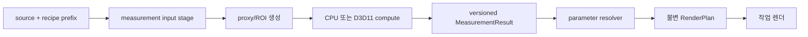

# 측정, 히스토그램, 통계 엔진

상태: 1차 기준선 확정  
최종 코드·공식 문서 대조: 2026-08-04  
대상: auto levels/tone/WB, tone-band, film base, Rescue, UI histogram, profile 평가

---

## 1. 결정

Windows Negaflow에는 하나의 범용 “히스토그램 효과”가 아니라 **용도별로 versioned된 측정
계약**이 필요하다.

- 측정 종류마다 입력 stage, 색 도메인, proxy, ROI, bin/percentile, alpha, 실패 정책을 고정한다.
- 작은 프록시 측정은 CPU를 기준선으로 한다.
- D3D11 DirectCompute는 full-resolution 또는 반복 측정에서 실측 이득이 있을 때만 사용한다.
- D3D12, 11on12, SM6, wave intrinsic은 기준선이 아니다.
- CUDA는 측정 기능의 필수 경로가 아니다.
- GPU 결과는 C++ CPU oracle과 같은 의사결정을 내야 한다.
- GPU 측정 결과가 CPU control plane에 필요한 경우 작은 결과 buffer readback을 정상 비용으로
  취급한다.
- Direct2D built-in Histogram effect는 제품 측정 계약을 대체하지 않는다.
- 자동 보정은 명시적 opt-in이며, 같은 중립 snapshot에서 반복하면 같은 절대 결과를 내야 한다.

측정 결과가 조금 달라지면 이후 셰이더의 모든 pixel이 달라질 수 있다. 따라서 최종 이미지
tolerance만 보는 대신 **측정 결과 자체와 자동 parameter 자체를 먼저 비교**한다.

---

## 2. 측정과 렌더의 경계



금지하는 구조:

```text
pixel shader가 렌더 중 global histogram을 숨게 읽음
GPU vendor에 따라 자동 parameter가 달라짐
viewport tile마다 전체 image 측정을 반복함
stale 측정 결과가 새 recipe에 적용됨
```

측정 input stage는 “원본”이라는 한 단어로 충분하지 않다. 예를 들어 Auto Tone은 대상 tone
slider를 0으로 만든 중립 현상본을 측정하고, film base는 반전 전 linear scan을 측정한다.

---

## 3. 현재 코드의 측정 inventory

다음 표는 2026-08-04 코드 기준이다. Windows 이식 전에 golden fixture와 algorithm version으로
고정한다.

| ID | 용도 | 현재 입력/프록시 | 통계 |
|---|---|---|---|
| M01 | Develop UI histogram | developed `NSImage`, 폭 256 sRGB RGBA8 | 64-bin RGB/luma, clip counts |
| M02 | Auto Tone/WB | neutral developed snapshot 최대 500px, 다시 long side 200 sRGB RGBA8 | 256 luma bins, 평균, saturation, neutral subset, Minkowski p=6 |
| M03 | Auto Levels | 현재 stage image, 폭 256 RGBA float | 채널별 p0.5/p99.9 기본 |
| M04 | parametric tone bands | current image, 폭 64...256 RGBA float, 4% inset | linear luma p10/p35/p65/p90 |
| M05 | Neutral Balance | current image, 폭 192 RGBA float | 채널별 median |
| M06 | film-base auto grid | 반전 전 image, 폭 32...256 linear RGBA float | robust components/median/MAD/percentile |
| M07 | film-base picker | integer-snapped local ROI 또는 snap window | 채널 median/connected base component |
| M08 | Rescue evidence | 폭 192 extended-linear RGBA float | Lab band median/MAD, deterministic holdout |
| M09 | scanner target/profile | profile별 stage와 patch/signature | percentile, Lab/DeltaE, measured profile contract |
| M10 | defect/IR | ROI/full frame, 알고리즘별 | percentile, component, density, spectral stats |
| M11 | scanner noise profile | 측정 target/ROI | luma/chroma noise statistics |

M01과 M02 모두 histogram을 사용하지만 같은 결과가 아니다. M01의 bin 수를 256으로 바꾸거나
M02를 display histogram cache로 대체하면 product behavior가 바뀐다.

---

## 4. 공통 `MeasurementSpec`

구체적인 C++ type 이름은 구현 때 달라질 수 있지만, 의미상 다음 필드가 필요하다.

```text
measurementKind
algorithmVersion
sourceIdentity
sourceContentRevision
inputStageID
inputRecipePrefixHash
inputColorDomain
ROI
orientation
proxySpecification
sampleFormat
alphaPolicy
channel/lumaDefinition
binDefinition
percentileDefinition
finiteValuePolicy
backendEligibility
qualityTier
```

결과:

```text
MeasurementResult
  kind/version
  key hash
  sample count
  statistics payload
  confidence/evidence
  backend
  numeric diagnostics
  elapsed time
```

결과 payload를 unversioned JSON dictionary로 넘기지 않는다. native/C# 경계에는 고정 ABI DTO와
schema version을 둔다.

---

## 5. UI histogram 계약

현재 Develop inspector histogram은 화면에 보이는 developed `NSImage`를 사용한다.

### 5.1 현재 수학

- source CG image를 폭 256으로 축소
- 높이는 aspect ratio 유지, 최소 1
- sRGB, premultiplied RGBA8 bitmap
- interpolation quality low
- alpha 0 pixel 제외
- RGB를 integer 연산으로 unpremultiply
- 64 bins
- luma는 `0.2126 R + 0.7152 G + 0.0722 B`, rounded integer
- channel/luma bin은 `value * 64 / 256`
- shadow clip은 channel code 0
- highlight clip은 channel code 255
- clip warning threshold는 `max(total × 0.002, 1)`보다 **클 때**
- chart 높이는 count/peak의 square root를 사용

### 5.2 Windows 결정

이 histogram은 UI feedback이므로 CPU 구현이 기준선이다.

- viewport/display-ready 8-bit image 또는 같은 의미의 dedicated proxy 사용
- 64-bin exact integer contract 유지
- C++ 또는 C# 중 하나에서 계산하되 한 구현만 production source of truth
- image/revision identity가 바뀌면 즉시 재계산
- old image object 주소 재사용 같은 identity 오류를 피하고 stable content/revision key 사용
- keyboard/drag tone-region interaction은 histogram 계산과 분리

### 5.3 갱신

- debounce는 빠른 slider drag 중 CPU 낭비를 줄일 수 있음
- 최종 settled revision은 반드시 계산
- stale result는 적용하지 않음
- histogram 실패 시 오래된 chart를 새 이미지 chart처럼 유지하지 않음

---

## 6. Auto Tone / Auto White Balance 계약

현재 auto는 AI 모델이 아니라 deterministic classical algorithm이다.

### 6.1 중립 snapshot

Auto Tone:

- exposure, contrast, density
- highlight, shadow, whites, blacks
- parametric tone curve
- vibrance, saturation, color depth

를 0으로 만든 snapshot을 렌더한다. base/profile/preset/geometry 등은 유지한다.

Auto WB:

- warmth와 tint만 0으로 만든 snapshot을 렌더한다.

현재 app은 이 snapshot을 최대 약 500px proxy로 준비한 뒤 `AutoAdjust.imageStats`가 다시 long side
200 sample로 줄인다. Windows에서는 double-resample을 기계적으로 복제하기 전에 golden parity와
한 번의 canonical proxy가 같은 결과를 내는지 비교한다.

### 6.2 현재 M02 통계

- long side 최대 200
- sRGB RGBA8
- 256-entry exact sRGB→linear decode LUT
- sRGB channel 평균
- sRGB luma 256-bin normalized histogram
- HSV-like saturation 평균
- neutral subset:
  - saturation ≤ 0.22
  - sRGB luma > 0.10 and < 0.90
  - 최소 `max(16, n/100)` sample
- neutral subset의 linear RGB 평균
- fallback용 linear Minkowski p=6
  - sRGB luma > 0.02 and < 0.99

### 6.3 Auto WB

- neutral pixel fraction ≥ 0.03이면 neutral linear 평균
- 아니면 Minkowski p=6
- 현재 `ColorModel`의 warmth/tint linear gain을 역산
- correction strength 0.85
- 절대 clamp ±0.60
- deadband 약 0.015
- 유효 sample이 없으면 0,0

Windows에서 gray-world 라이브러리 함수로 대체하지 않는다. 위 수식과 gate가 제품 의미다.

### 6.4 Auto Tone

M02의 256-bin normalized luma histogram을 사용한다.

현재 주요 percentile:

- p02, p08
- p10, p50, p90
- p97.5, p98, p99.5
- code 0/255 clip mass

이 값으로 current `ToneMapper` 수학을 역산해 다음 절대 parameter를 만든다.

- exposure
- whites/blacks
- highlights/shadows
- density
- contrast
- vibrance

중요한 behavior:

- exposure는 photometric mid 0.18 기준, 기본적으로 밝히는 방향
- 실질 high clipping ≥ 5%일 때만 감광 recovery
- auto exposure limit ±3 stops 범위 내 current rule
- 앞 parameter의 효과를 다음 percentile 예측에 반영
- 결과를 현재 값에 누적하지 않고 대상 parameter에 대입

같은 neutral snapshot에 auto를 여러 번 실행해도 같은 결과여야 한다.

---

## 7. Auto Levels 계약

### 7.1 현재 입력

- 현재 stage image
- width 256
- aspect-ratio height
- working space는 linear
- output sampling color space는 `sampleColorSpace` 또는 sRGB
- RGBA float

### 7.2 현재 통계

- 모든 sample의 R/G/B를 별도 배열로 수집
- 각 배열 정렬
- 기본 black percentile 0.005
- 기본 white tail 0.001, 즉 percentile 0.999
- 현재 index는 `Int(count * percentile)` 후 bounds clamp

### 7.3 적용 gate

- 최대 channel range가 0.04 미만이면 no-op
- 각 white가 0.95 초과이고 각 black이 0.05 미만이면 no-op
- channel별 scale/bias
- output white는 현재 measurement color-space 조건에 따라 0.70 또는 0.88 기본 경로
- output black 기본 0
- 최종 RGB clamp 0...1

Auto Levels의 최종 clamp는 알고리즘 의미다. core extended-range 정책을 이유로 제거하지 않는다.

### 7.4 CPU 구현

proxy sample 수는 보통 작다. 세 배열을 sort하는 CPU 구현으로 충분할 가능성이 높다.

- `std::nth_element` 최적화 후보
- 하지만 current sort/index behavior와 tie 결과를 먼저 복제
- target device에서 실제 latency 측정 후 변경

GPU histogram으로 대체하면 float 값의 exact order/percentile와 output domain을 다시 정의해야 하므로
1차 구현은 CPU가 더 안전하다.

---

## 8. parametric tone-band 측정

### 8.1 현재 proxy

- input extent를 integral로 snap
- width는 `max(64, min(256, extent.width))`
- aspect-ratio height
- linear-sRGB working/output
- RGBA float
- 각 축 4% inset, 최소 1 pixel

### 8.2 luma

```text
Y = 0.2126 R + 0.7152 G + 0.0722 B
```

sample을 sort하고 current percentile index는:

```text
floor((count - 1) × fraction)
```

결과는 0...1 clamp 후 p10/p35/p65/p90을 취한다.

### 8.3 band construction

- p35 ≥ p10 + 0.025
- p65 ≥ p35 + 0.025
- p90 ≥ p65 + 0.025
- shadow low = max(0, p10 - 0.020)
- highlight high = min(1, p90 + 0.030)

sample 실패 시 current fixed fallback band를 사용한다. Windows에서 fallback 사용을 diagnostic에
표시하고 silent normal measurement처럼 취급하지 않는다.

### 8.4 cache

parametric curve slider가 전부 identity면 measurement 자체가 필요 없다. 활성화된 경우 input stage/
recipe prefix가 같으면 band cache를 재사용한다.

---

## 9. Neutral Balance 측정

### 9.1 현재 proxy

- integral extent
- width 192
- aspect-ratio height
- working은 linear-sRGB
- output measurement space는 `sampleColorSpace` 또는 sRGB
- RGBA float

### 9.2 통계

- R/G/B 배열 분리
- 각 channel sort
- index `n/2` sample 사용

짝수 sample에서 이는 두 중앙값 평균이 아니라 upper middle이다. FilmBaseStatistics median과 의미가
다르므로 “median helper 하나로 통합”하면서 결과를 바꾸지 않는다.

### 9.3 gate/결과

- 각 median이 0.04...0.96 내부여야 함
- geometric mean target
- channel gamma 역산
- strength 기본 0.8
- gamma clamp 0.80...1.25
- 각 gamma가 1에서 0.01 이내면 no-op
- 32-dimension color cube 적용

측정 space와 적용 working space 경계를 정확히 유지한다.

---

## 10. film-base 자동 측정

film base는 네거티브 inversion 전체를 바꾸므로 일반 histogram보다 더 강한 provenance가 필요하다.

### 10.1 sample grid

- integral extent
- width `max(32, min(256, extent.width))`
- aspect-ratio height
- linear-sRGB RGBA float
- grid의 모든 pixel을 `(x,y,RGB)` sample로 보존
- luma는 현재 단순 `(R+G+B)/3`

### 10.2 robust statistics

현재 `FilmBaseStatistics`는:

- median luma
- MAD
- tolerance `max(MAD × 1.4826 × 3, 1e-4)`
- 충분한 coherent sample이 남지 않으면 원 sample fallback
- retained sample의 채널 median

을 사용한다.

짝수 median은 두 가운데 값의 평균이다. M05의 upper-middle과 다르다.

### 10.3 estimator

현재 estimator는 단순 border mean이 아니다.

- connected base component
- neutral/color-negative candidate rule
- coherent/bright mode
- percentiles
- border/strip fallback
- clipping/empty-backlight rejection
- diagnostics

가 포함된다. Windows에서 “상단 5% 평균” 같은 단순 구현으로 대체하지 않는다.

### 10.4 provenance

결과에는 최소 다음을 남긴다.

- auto/manual/preset source
- measurement algorithm version
- source content revision
- input profile/color domain
- grid dimensions
- retained/candidate count
- confidence/diagnostic reason
- measured RGB
- light-source adjustment

### 10.5 실패

confidence가 낮거나 유효 component가 없으면 임의 generic orange mask로 대체하지 않는다.

- valid persisted manual/preset 사용
- 사용자 picker 안내
- 또는 명시적 develop failure/limited state

중 제품 flow에 맞는 선택을 한다.

---

## 11. film-base picker

### 11.1 좌표

현재 입력은 normalized 0...1, y-down이다. Core Image y-up으로 변환한다. Windows canonical
coordinate가 y-down이어도 macOS sidecar import 의미를 정확히 보존한다.

### 11.2 snap path

- 짧은 변 × 0.12 local window
- side ≥ 48
- integer integral/intersection
- window 최소 32×32
- local grid + connected base component

### 11.3 fallback path

- 기본 region side = 짧은 변 × 0.01, 최소 3px
- integer boundary로 snap
- image bounds intersect
- RGB float sample
- finite sample만
- 채널별 upper-middle median
- final RGB 0...1 clamp

### 11.4 fractional ROI 교훈

현재 주석은 fractional Core Image area average가 image 밖 transparent pixel을 섞어 alpha/RGB를
희석한 실측 bug를 기록한다. Windows에서는:

- persisted float ROI
- oriented pixel rect
- integer measurement rect

변환을 한 함수에서 정의하고, out-of-bounds sample 포함 여부를 명시한다.

---

## 12. Rescue evidence 측정

Rescue는 창의적 expired look이 아니라 evidence-gated bounded correction이다.

### 12.1 current proxy

- integral extent
- width 192
- rounded aspect-ratio height
- origin normalization
- extended-linear sRGB float
- sample channel 모두 0.01 초과, 0.99 미만
- sRGB encode 후 luma/Lab/chroma 계산

### 12.2 band/evidence

- luminance band edges: 0.06, 0.20, 0.34, 0.48, 0.62, 0.76, 0.92
- low-chroma neutral population
- deterministic train/holdout split from `(x,y)`
- median Lab a/b
- MAD
- holdout agreement와 improvement
- tile spatial coverage
- 최소 eligible band 3
- 최소 covered tile 6
- maximum bounded drift

gate가 실패하면 exact input no-op다.

### 12.3 Windows 결정

- CPU 기준선
- grid가 작고 branch/filter/median이 많아 GPU 이득이 낮을 가능성이 큼
- deterministic coordinate split을 보존
- Lab conversion과 constants를 scalar oracle로 고정
- 결과에 evidence counts와 failure reason을 보존

---

## 13. profile, target, defect 통계

이 문서의 공통 infrastructure를 사용하되 M01~M08과 결과 schema를 섞지 않는다.

### 13.1 scanner target/profile

- physical target/patch geometry
- measured scanner provenance
- profile version
- patch median/robust statistics
- DeltaE metric/version
- holdout/acceptance threshold

를 결과에 포함한다. scanner 모델명만으로 측정 결과를 추정하지 않는다.

### 13.2 noise profile

- flat/neutral patch requirement
- signal level bands
- luma/chroma axis
- robust variance/MAD
- bit depth/resolution/exposure provenance

가 필요하다.

### 13.3 defect/IR

- IR percentile
- excluded pixel mask
- component density
- scratch response
- tile halo/core

가 좌표와 sample count를 포함해야 한다. IR이 없는 RGB 측정 결과를 IR evidence로 표시하지 않는다.

---

## 14. percentile와 median 정의

현재 코드에는 의도 또는 역사 때문에 여러 정의가 존재한다.

| 측정 | percentile index | even median |
|---|---|---|
| Auto Levels | `floor(n × p)` clamp | 해당 없음 |
| Tone bands | `floor((n-1) × p)` | 해당 없음 |
| FilmBaseStatistics percentile | `floor((n-1) × p)` | 두 가운데 평균 |
| Neutral Balance | 해당 없음 | upper middle `n/2` |
| FilmBasePicker fallback | 해당 없음 | upper middle `n/2` |
| Auto Tone hist | CDF가 p 이상인 첫 bin | 해당 없음 |

Windows port는 다음 중 하나를 선택해야 한다.

1. 현재 behavior를 algorithm별로 그대로 고정
2. 통일된 quantile 정의로 의도적 migration하고 macOS도 같이 변경

1차 Windows parity는 1번이다. 공통 helper 이름만 보고 의미를 통합하지 않는다.

각 spec에 다음을 적는다.

- sorted order
- inclusive/exclusive
- index formula
- interpolation
- empty/single/even behavior
- duplicate/tie
- fraction bounds

---

## 15. proxy 생성 계약

### 15.1 geometry

- orientation 적용 시점
- crop 적용 여부
- target width/long side
- target height rounding
- origin normalization
- interpolation filter
- 4% inset 같은 border exclusion

### 15.2 색

- source ICC 해석
- working linear domain
- measurement output domain
- sRGB encode/decode constants
- alpha/premultiply
- extended-value handling

### 15.3 sample selection

- all pixels
- alpha>0
- interior only
- ROI
- finite only
- clipping exclusion
- neutral/color gate

### 15.4 canonical resampler

macOS `CGContext.draw`, Core Image transform, Windows WIC scaler, Direct2D scale가 같은 pixel을 만들지
않을 수 있다. 측정 proxy resampler는 다음 중 하나로 고정한다.

- platform-neutral C++ CPU resampler
- 검증된 WIC/D2D mode + macOS golden tolerance

auto parameter threshold 근처에서 resampler 차이가 decision을 바꾸는지 corpus로 확인한다.

---

## 16. CPU-first 설계

### 16.1 이유

현재 주요 proxy는 폭 192~256 수준이다. 대략 수만 pixel이다.

- GPU resource 생성/upload/readback overhead가 계산보다 클 수 있음
- sort/median/branch-heavy logic은 CPU가 단순함
- 결과가 결국 CPU parameter resolver에 필요함
- x64/ARM64에서 쉽게 동일한 scalar oracle을 유지할 수 있음
- device loss와 driver 차이를 피함

따라서 M01~M08 1차 구현은 CPU가 기본이다.

### 16.2 SIMD

SIMD 후보:

- RGB/luma accumulation
- sRGB LUT/transfer
- saturation/chroma
- histogram binning의 thread-local bins
- finite/range filtering

median/sort와 component logic은 scalar/parallel CPU가 더 단순할 수 있다. SIMD 결과는 scalar
oracle과 decision parity를 통과해야 한다.

### 16.3 병렬화

- 작은 proxy는 단일 worker가 더 빠를 수 있음
- 큰 proxy만 row chunk
- thread-local histogram 후 deterministic merge
- global shared bin에 매 pixel atomic 금지
- task creation overhead 포함 benchmark

### 16.4 ARM64

- scalar baseline은 동일 C++
- NEON/ARM64 intrinsic은 선택적 path
- x64 AVX2/AVX-512만 필요한 algorithm 금지
- runtime dispatch와 test override 제공

---

## 17. D3D11 DirectCompute 후보

### 17.1 사용할 조건

- input이 이미 GPU에 있음
- 수백만 pixel의 full-resolution measurement가 실제 요구됨
- 같은 frame에서 반복 측정해 upload가 없음
- small result readback 비용보다 compute 이득이 큼
- Intel/AMD/NVIDIA/Qualcomm에서 correctness와 performance 통과

### 17.2 기준 기술

- D3D11 DirectCompute
- `cs_5_0`/DXBC 기준선
- build-time FXC
- `ID3D11DeviceContext::Dispatch`
- SRV input
- UAV intermediate/result
- staging/readback buffer
- explicit capability probe

D3D12, SM6 wave intrinsic, 11on12 wrapped resource를 요구하지 않는다.

### 17.3 histogram pattern

후보 구현:

1. group-local bins 초기화
2. thread가 assigned pixels를 읽어 local/shared bin 누적
3. group sync
4. group histogram을 global partial buffer에 기록
5. second reduction pass 또는 CPU가 partial bins merge

GPU global atomic 하나에 모든 pixel을 몰아넣지 않는다. distribution-dependent contention을
장치별로 측정한다.

### 17.4 result readback

측정 결과가 CPU auto resolver에 필요하면 readback을 피하는 것이 목표가 아니다.

- 256×4 counter
- sums/counts
- percentile candidate

같은 작은 payload만 staging으로 복사한다. full image readback을 피한다.

### 17.5 integer count

- per-bin counter width와 overflow
- maximum sample count
- partial merge overflow
- normalized float 변환 시점

을 고정한다. 100 MP, multi-frame batch, accumulated histogram을 32-bit 하나에 무조건 넣지 않는다.

---

## 18. Direct2D built-in Histogram 평가

공식 `CLSID_D2D1Histogram` contract:

- 기본 bins 256
- 선택 channel 하나
- input 값 0...1의 histogram
- 범위 밖 값 clamp
- straight bitmap pixel 기준
- color channel을 alpha로 나눔
- draw 이후 `FLOAT[]` property로 output 취득
- 각 float는 해당 bin의 element count
- DirectCompute 미지원 device에서는 effect 생성 실패

### 18.1 맞지 않는 이유

| Negaflow 요구 | built-in 차이 |
|---|---|
| UI 64-bin RGB+luma 한 번 | channel 하나, luma 별도 정의 필요 |
| Auto Tone exact sRGB RGBA8 contract | proxy/rounding/neutral/Minkowski가 없음 |
| Auto Levels float per-channel order statistics | [0,1] clamp histogram과 다름 |
| tone linear luma percentile | channel histogram이며 luma graph가 별도 |
| film base robust spatial component | 지원하지 않음 |
| Rescue median/MAD/holdout | 지원하지 않음 |

### 18.2 제한적 후보

간단한 display histogram spike에서 사용할 수는 있다. 하지만:

- 4 channel/luma graph cost
- draw + property readback
- exact bin/rounding parity
- alpha behavior
- CPU proxy 대비 latency

를 측정한 뒤 선택한다. 1차 기준선은 CPU다.

---

## 19. measurement cache

### 19.1 key

```text
source identity/content revision
measurement kind/version
input stage/prefix hash
ROI/orientation
proxy specification
color-domain/profile hash
algorithm parameters
```

GPU/CPU backend는 결과가 동등하면 semantic key에 반드시 포함할 필요가 없지만, diagnostics에는
남긴다. backend 차이가 tolerance를 넘는 상태에서는 같은 cache namespace를 공유하지 않는다.

### 19.2 invalidation 예

- output JPEG quality 변경: M02~M08 유지
- monitor profile 변경: display histogram M01은 display input 의미에 따라 갱신, film base 유지
- exposure slider 변경: current-view M01 갱신; neutral-snapshot M02 key는 clear-tone rule에 따라 재사용
- source content 변경: 전부 무효
- crop 변경: measurement별 crop 적용 policy에 따라 무효
- algorithm update: 해당 version 전부 무효
- manual film base 변경: auto result cache는 남길 수 있어도 active plan은 manual 사용

### 19.3 publication

- incomplete/canceled result를 cache에 publish하지 않음
- result validation 후 atomic publish
- failure reason은 짧은 negative cache TTL 후보
- corrupt disk cache는 재계산

---

## 20. 비동기 적용 안전

측정 task 시작 시:

```text
frameID
sourceRevision
recipeRevision
cleanedRawRevision
defectRecipeIdentity
measurementKey
sessionID
```

를 capture한다.

현재 auto code처럼 완료 직전에 소유권과 params/cleaned raw/defect identity를 다시 확인해야 한다.

- frame이 library에서 제거됨
- 사용자가 다른 사진으로 이동
- slider 변경
- cleaned raw 갱신
- defect recipe 변경
- undo/redo

중 old result가 새 상태에 적용되지 않게 한다.

측정 취소가 GPU dispatch를 즉시 중단하지 못해도 result gate에서 폐기한다.

---

## 21. 결정성과 tolerance

### 21.1 exact가 필요한 것

- bin count 합 = sample count
- UI integer binning
- sample inclusion/exclusion
- percentile index 선택
- train/holdout split
- cache key/version
- auto result의 branch/gate

### 21.2 tolerance가 가능한 것

- float accumulation
- Lab conversion의 미세 차이
- GPU reduction 순서
- resampler output

하지만 tolerance 차이가 threshold branch를 바꾸면 최종 decision은 exact parity를 요구한다.

### 21.3 threshold corpus

각 gate 바로 아래/같음/바로 위를 만든다.

- neutral fraction 0.03
- AutoLevels range 0.04
- white 0.95 / black 0.05
- clipping mass 0.002/0.05
- Rescue MAD/holdout/tile count
- gamma no-op 0.01

floating comparison의 `>`/`>=`를 정확히 보존한다.

---

## 22. 실패 정책

| 실패 | 동작 |
|---|---|
| invalid dimensions/empty proxy | measurement 실패 |
| color profile 해석 실패 | 해당 측정 실패; silent device RGB 금지 여부를 spec별 결정 |
| NaN/Inf sample | spec에 따라 제외 또는 전체 실패, count 기록 |
| sample 부족 | confidence 실패/no-op/fallback band를 algorithm별 적용 |
| GPU unsupported | CPU 실행 |
| GPU result parity 실패 | GPU measurement 비활성화 |
| readback/device loss | CPU 재실행 또는 요청 실패 |
| stale revision | 결과 폐기 |
| auto measurement 실패 | 기존 수동 parameter 유지 |
| film base 실패 | manual/preset 요구; generic 추측 금지 |

Auto 실패 시 원본/recipe를 자동으로 바꾸지 않는다.

---

## 23. correctness tests

### 23.1 proxy

- orientation 1~8
- fractional crop
- odd dimensions
- very wide/tall
- 1×N/N×1
- alpha 0/partial/1
- sRGB, linear-sRGB, embedded ICC, untagged
- negative and >1 float

### 23.2 statistics

- empty/single/even/odd arrays
- duplicates
- all same value
- exact bin edges
- code 0/255
- out-of-range
- NaN/Inf
- 32-bit count overflow simulation

### 23.3 product fixtures

- normal color negative
- dense/underexposed negative
- slide with compressed raw range
- B&W neutral base
- no visible film border
- perforation/backlight contamination
- dominant sunset/forest background
- neutral target
- expired-film evidence pass/fail
- thin scan-frame black border

### 23.4 cross-backend

- C++ scalar
- x64 SIMD
- ARM64 SIMD
- D3D11 compute if enabled
- current macOS golden

측정 payload, confidence, auto parameter, final rendered image 순서로 비교한다.

---

## 24. 성능 tests

### 지표

- proxy render time
- CPU measurement time
- GPU dispatch/readback time
- allocation bytes
- cache hit rate
- auto button end-to-end latency
- histogram update p50/p95
- cancellation waste
- simultaneous export 영향

### scenario

- cold first photo
- warm slider sequence
- rapid next/previous navigation
- 24/45/100 MP source
- 100-photo batch metadata/thumbnail activity
- Intel/AMD/NVIDIA/Qualcomm
- x64/ARM64

### 선택 기준

- M01~M08 CPU가 latency budget 안이면 GPU 구현을 추가하지 않는다.
- GPU는 end-to-end 이득이 있고 decision parity가 있을 때만 사용한다.
- 작은 proxy에서 thread pool overhead가 크면 단일 CPU worker를 사용한다.
- performance를 위해 sample size나 algorithm threshold를 조용히 바꾸지 않는다.

---

## 25. diagnostics

개발 capture:

```text
measurement kind/version
key hash
input stage/prefix hash
source/recipe revision
ROI/proxy dimensions
color domain/profile hash
sample/finite/excluded counts
histogram total
selected percentiles/medians
confidence/evidence
backend/device
timing
fallback reason
```

사용자 지원 로그에는 사진 pixel 배열을 기본 포함하지 않는다. 사용자가 명시적으로 진단 package를
내보낼 때도 개인정보와 원본 포함 여부를 별도 동의받는다.

---

## 26. 구현 순서

### Phase 0 — spec/golden

- M01~M11 algorithm version
- percentile/median 정의
- current macOS payload capture
- threshold corpus

### Phase 1 — C++ CPU

- canonical proxy
- histogram/percentile/median/MAD
- Auto Tone/WB/Levels parameter resolver
- x64/ARM64 scalar

### Phase 2 — product integration

- C ABI DTO
- async revision gate
- measurement cache
- UI histogram
- auto opt-in flow

### Phase 3 — film/profile

- film base grid/estimator/picker
- Rescue evidence
- scanner target/profile/noise
- defect/IR statistics

### Phase 4 — optional GPU

- full-resolution use-case benchmark
- D3D11 compute
- readback/capability/device-loss
- vendor matrix

---

## 27. 금지 사항

- 측정을 독립 D3D12/11on12 경로로 기준화하지 않는다.
- SM6 wave intrinsic을 필수로 만들지 않는다.
- CUDA-only histogram을 만들지 않는다.
- Direct2D Histogram을 모든 측정의 대체물로 사용하지 않는다.
- GPU 결과를 CPU로 읽으면 안 된다는 원칙을 만들지 않는다.
- 서로 다른 percentile/median 정의를 몰래 통합하지 않는다.
- display histogram을 Auto Tone input으로 재사용하지 않는다.
- Auto Tone/WB를 기본 자동 적용하지 않는다.
- film base 실패를 generic orange mask로 덮지 않는다.
- proxy resampler/color-space 차이를 “미미함”으로 가정하지 않는다.
- stale measurement를 새 recipe에 적용하지 않는다.
- sample size/bit depth를 낮춰 성능 수치를 만들지 않는다.

---

## 28. 공식 자료

- [Direct2D Histogram effect](https://learn.microsoft.com/en-us/windows/win32/direct2d/histogram)
- [DirectCompute overview](https://learn.microsoft.com/en-us/windows/win32/direct3d11/direct3d-11-advanced-stages-compute-shader)
- [DirectCompute resource types](https://learn.microsoft.com/en-us/windows/win32/direct3d11/direct3d-11-advanced-stages-cs-resources)
- [`ID3D11DeviceContext::Dispatch`](https://learn.microsoft.com/en-us/windows/win32/api/d3d11/nf-d3d11-id3d11devicecontext-dispatch)
- [Direct2D custom effects](https://learn.microsoft.com/en-us/windows/win32/direct2d/custom-effects)
- [WIC pixel format overview](https://learn.microsoft.com/en-us/windows/win32/wic/-wic-codec-native-pixel-formats-overview)

공식 자료는 Windows API capability의 근거다. M01~M11의 수학과 threshold는 현재 Negaflow 코드,
golden fixture, 명시적 algorithm version이 근거다.

---

## 29. 관련 문서

- [../01-render-engine/pipeline-shape.md](../01-render-engine/pipeline-shape.md)
- [../01-render-engine/precision-and-clipping.md](../01-render-engine/precision-and-clipping.md)
- [../01-render-engine/roi-and-invalidation.md](../01-render-engine/roi-and-invalidation.md)
- [../02-shaders/kernel-inventory.md](../02-shaders/kernel-inventory.md)
- [../04-color-management/color-pipeline.md](../04-color-management/color-pipeline.md)
- [../06-large-images/image-source-tiling.md](../06-large-images/image-source-tiling.md)
- [../07-threading/multithreading-export.md](../07-threading/multithreading-export.md)
- [../12-performance/backend-selection.md](../12-performance/backend-selection.md)
- [../16-cpu/simd-and-dispatch.md](../16-cpu/simd-and-dispatch.md)

---

## 30. 완료 조건

- [ ] M01~M11 각각 versioned measurement spec이 있음
- [ ] 현재 macOS payload/auto parameter golden이 있음
- [ ] percentile/median/tie/threshold 정의가 exact test로 고정됨
- [ ] proxy geometry/color/alpha가 corpus로 검증됨
- [ ] CPU scalar가 x64/ARM64에서 통과함
- [ ] optional SIMD가 scalar decision과 일치함
- [ ] auto 기능이 opt-in이고 반복 실행에 결정적임
- [ ] film base failure가 정직하게 처리됨
- [ ] stale async result가 적용되지 않음
- [ ] GPU가 있으면 D3D11 compute + CPU parity + vendor evidence가 있음
- [ ] UI histogram과 auto histogram이 서로 섞이지 않음
- [ ] actual photo와 threshold stress corpus가 통과함

이 조건 전에는 “Windows 자동 보정과 측정이 macOS와 동등하다”고 선언하지 않는다.
