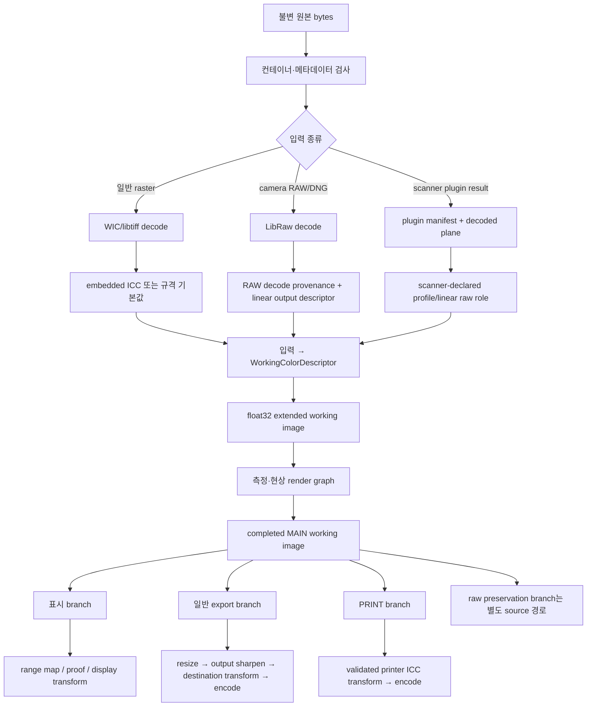

# Windows 색 관리 파이프라인

상태: 1차 구현 기준선 확정  
최종 코드 대조: 2026-08-04  
외부 자료 확인: 2026-08-04  
대상: Negaflow Native Windows x64·ARM64 색 관리, 표시, 소프트프루프, 내보내기, PRINT

기준 코드:

- `Sources/Chromabase/Engine/ChromabaseEngine.swift`
- `Sources/Chromabase/Adjustments/DisplayGamutMap.swift`
- `Sources/Chromabase/Export/SoftProof.swift`
- `Sources/Chromabase/Export/DestinationGamutWarning.swift`
- `Sources/Chromabase/Export/ICCOutputProfileSnapshot.swift`
- `Sources/Chromabase/Export/ExportEngine.swift`
- `Sources/Chromabase/Export/ExportOptions.swift`
- `Sources/Chromabase/Imaging/ImageLoader/ImageLoader.swift`
- `Sources/Chromabase/Imaging/ImageLoader/ImageLoader+ImageIO.swift`
- `Sources/Chromabase/Imaging/ImageLoader/ImageLoader+RAW.swift`
- `Sources/negaflowApp/Features/Develop/Pipeline/Renderer/DevelopFrameRenderer+Developed.swift`

이 문서는 “Core Image를 Direct2D로 치환한다”는 대응표가 아니다. 입력 프로파일 해석부터
내부 현상, 화면 표시, 소프트프루프, 색역 경고, 일반 내보내기, PRINT 출력까지 서로 다른
색 계약을 구분하고 Windows에서 재현하는 기준을 정한다.

---

## 1. 결론

Windows판은 색 처리를 다섯 경계로 분리한다.

1. **입력 해석 경계**
   - embedded ICC, 파일 규격 기본값, 명시적인 scanner-raw 역할을 판정한다.
   - 입력을 내부 작업공간으로 변환한다.
2. **현상 작업공간**
   - `linear sRGB/Rec.709 primaries + D65 + float32 extended range`를 사용한다.
   - 음수와 1 초과 값을 표시 또는 파일 출력 경계까지 보존한다.
3. **표시 경계**
   - 일반 SDR와 Windows Advanced Color를 별도 상태로 다룬다.
   - 내부 float32 작업공간과 FP16 scRGB swap chain을 같은 것으로 부르지 않는다.
4. **프루프·진단 경계**
   - 현재 macOS의 `profileOnly`, `paperAndBlackInk`, 실제 ICC gamut-check 의미를 보존한다.
   - 채널 clipping과 destination gamut warning을 합치지 않는다.
5. **파일·PRINT 출력 경계**
   - 일반 export 색공간과 측정 printer ICC를 분리한다.
   - 필요한 프로파일이 없거나 검증에 실패하면 명시적으로 실패한다.

색 변환 엔진의 소유권은 다음과 같다.

| 용도 | 기준 구현 | 가속 후보 | 필수 폴백 |
|---|---|---|---|
| 입력 ICC → 작업공간 | LittleCMS 2 float transform | D2D Color Management `BEST` | LittleCMS 2 |
| legacy SDR 작업공간 → monitor ICC | LittleCMS 2 | D2D `BEST` | LittleCMS 2 |
| Advanced Color 표시 | 앱의 작업공간 → scRGB 표현 + Windows DWM | D3D11/Direct2D | 보수적 sRGB 표시 |
| 일반 export ICC 변환 | LittleCMS 2 float transform | 검증 후 D2D `BEST` | LittleCMS 2 |
| PRINT printer ICC | LittleCMS 2 float transform | 검증 후 별도 후보 | LittleCMS 2 |
| 소프트프루프·색역 경고 | LittleCMS 2 proofing transform | 없음이 기준 | 실패를 표시하고 기능 비활성 |

중요한 원칙:

- Direct2D `QUALITY_NORMAL`은 확장 범위가 필요한 경로의 품질 폴백이 아니다.
- Windows의 자동 색 관리와 앱의 monitor ICC 변환을 동시에 적용하지 않는다.
- scRGB swap chain은 **표시 포맷**이며 내부 현상 작업공간의 저장 정밀도 계약이 아니다.
- 프로파일 정확도와 장치 정확도는 프로파일 검증 및 실측 없이는 주장하지 않는다.
- CUDA는 색 관리 기준 경로에 관여하지 않는다.

---

## 2. 이전 초안에서 폐기하는 주장

| 폐기하는 주장 | 교정 이유 |
|---|---|
| `extendedLinearSRGB`의 Windows 등가물이 scRGB이므로 scRGB를 작업공간으로 삼는다 | 프라이머리와 선형 특성은 유사하지만, 내부 float32 계산 계약과 FP16 DXGI 표시 계약은 정밀도·휘도 의미·수명주기가 다르다 |
| D2D `BEST` 미지원 시 `NORMAL`로 내린다 | Microsoft 문서상 `BEST`만 float precision과 ICC v4.3 extended range를 지원한다. 필요한 품질을 잃는 조용한 폴백이다 |
| `IDXGIOutput6`만으로 모든 Advanced Color 상태를 판별한다 | Advanced Color SDR와 일반 SDR가 모두 `RGB_FULL_G22_NONE_P709`로 보고될 수 있다 |
| Advanced Color에서도 monitor ICC를 앱이 항상 직접 적용한다 | Advanced Color 활성 시 Windows가 출력 장치 변환을 수행하므로 이중 변환 위험이 있다 |
| Windows DWM의 clipping이 사진용 gamut mapping을 대신한다 | Microsoft 문서는 out-of-gamut 값을 수치적으로 clip한다고 설명한다. 제품이 원하는 hue/luma 정책과 동일하지 않다 |
| 현재 macOS soft proof가 완전한 ICC proofing transform이다 | 현재 `SoftProof`는 출력 RGB 프로파일 선택과 `wtpt`/`bkpt` 기반 paper/black 선형 행렬을 결합한다 |
| `gamutSoftClip`이 device gamut mapping이다 | 이 커널은 extended linear RGB를 `[0,1]` 표시 범위로 접는 제품별 함수이며 특정 모니터·프린터 프로파일의 gamut을 모델링하지 않는다 |
| DeviceLink를 미리 만들면 항상 더 빠르다 | 프로파일·intent·BPC·포맷 조합별 cache 및 생성 비용을 포함한 측정 전에는 채택할 수 없다 |
| 현상 커널 수는 고정 21개다 | 현재 그래프는 옵션과 데이터에 따라 달라지며 커널 inventory는 별도 문서에서 코드로 추적한다 |

---

## 3. 용어와 색 표현 계약

### 3.1 내부 작업공간

문서와 ABI에서는 다음처럼 명시한다.

```text
WorkingColorDescriptor
  primaries        = sRGB / Rec.709
  whitePoint       = D65
  transfer         = linear
  sampleType       = IEEE 754 float32
  numericRange     = extended; negative and >1 values allowed
  alpha            = explicit straight/opaque contract per resource
  referenceLuma    = relative working-light value, not display nits
```

`linear sRGB`와 Rec.709는 같은 프라이머리와 D65를 쓰지만 transfer-function 이름을 섞지 않는다.
작업공간은 선형이며, 비디오용 Rec.709 OETF/EOTF를 적용하지 않는다.

내부 값 `1.0`은 제품 현상 수학의 상대 기준값이다. HDR 화면에서 80 nit를 뜻하는 scRGB의
표시 의미를 내부 계산에 역으로 주입하지 않는다.

### 3.2 scRGB 표시 계약

Windows의 일반 목적 Advanced Color 표시 후보는 다음이다.

```text
DXGI_FORMAT_R16G16B16A16_FLOAT
DXGI_COLOR_SPACE_RGB_FULL_G10_NONE_P709
flip-model swap chain
```

이는 16-bit float × RGBA, 즉 64 bits/pixel 프레젠테이션 surface다. 내부 RGBA32F는
128 bits/pixel이다. 두 포맷은 다음이 다르다.

| 항목 | 내부 작업 이미지 | scRGB swap chain |
|---|---|---|
| sample | float32 | float16 |
| 목적 | 현상·측정·출력 원본 | DWM에 전달하는 표시 |
| `1.0` 의미 | 상대 작업 기준 | HDR에서는 nominal 80 nit white, SDR Advanced Color에서는 display reference white |
| 수명 | render graph/cache | 현재 창·현재 display presentation |
| ICC | source/destination transform의 입출력 | content color-space tag로 OS에 의미 전달 |

FP16 정밀도가 내부 중간 결과를 저장하기에 충분하다는 결론으로 확대하지 않는다. FP16 전환은
표시 경계에서 한 번만 하며, banding·gradient·shadow·negative-value corpus를 검증한다.

### 3.3 profile, color space, encoding의 구분

- **profile**: 장치 또는 표준 색공간의 ICC 데이터와 변환 특성
- **working color space**: 현상 연산의 기준 프라이머리·white point·transfer·범위
- **pixel encoding**: float32, float16, UNORM8, UNORM16 등 메모리 표현
- **DXGI color-space tag**: DWM이 swap-chain 값을 해석하는 방법
- **display mode**: legacy SDR 또는 Advanced Color SDR/HDR
- **proof profile**: 화면에서 시뮬레이션할 출력 장치
- **output profile**: 내보낸 픽셀에 실제로 적용하고 파일에 포함할 destination profile

한 필드나 enum으로 이 여섯 개를 표현하지 않는다.

---

## 4. 현재 macOS 구현에서 보존할 사실

### 4.1 작업 이미지

`ChromabaseEngine`의 일반 현상은 `CGColorSpace.linearSRGB`를 작업 기준으로 사용하며 주석과
실행 경로 모두 32-bit float linear 처리를 전제한다. 포스트 파이프라인은 음수와 1 초과 값을
보존한다.

Windows 구현은 다음을 보존한다.

- negative/positive 처리 순서
- measurement sample domain
- 수치적으로 유효한 extended 값
- NaN/Inf 거부 또는 정규화 위치
- 표시용 range mapping을 현상 graph 안으로 끌어오지 않는 경계

### 4.2 화면 미리보기

현재 Develop 미리보기 순서는 다음이다.

```text
completed working image
  → DisplayGamutMap.apply
  → SoftProof.apply, if paperAndBlackInk
  → output color-space conversion
  → OutputDither
  → RGBA8 CGImage
```

soft proof가 꺼졌을 때 출력은 sRGB다. soft proof가 켜지면 선택한 RGB output profile이
`CGImage`의 출력 색공간이 된다. 썸네일은 항상 unproofed sRGB이며 `DisplayGamutMap`과
8-bit dither를 거친다.

Windows에서 그대로 보존할 것은 단계의 **제품 의미**다. Core Image가 ICC-tagged `CGImage`를
AppKit 화면으로 넘기는 구현 세부를 그대로 모방해서는 안 된다. Windows DirectX surface에는
임의 proof ICC를 붙여 DWM이 이해하도록 하는 일반 메커니즘이 없으므로 LittleCMS가 proof와
최종 display transform을 명시적으로 구성해야 한다.

### 4.3 PRINT

현재 PRINT의 핵심 계약은 다음이다.

- 완성된 MAIN working image 뒤에 출력 경계를 둔다.
- 별도 PRINT look을 working image에 삽입하지 않는다.
- printer device class(`prtr`)의 RGB ICC만 받는다.
- PCS는 Lab 또는 XYZ여야 한다.
- ICC bytes, 이름, SHA-256을 불변 snapshot으로 묶는다.
- 출력 직전에 hash와 transform 생성 가능성을 다시 검증한다.
- 필요한 ICC가 유효하지 않으면 원본 또는 sRGB로 조용히 대체하지 않는다.

CMYK printer profile 지원은 현재 제품 계약이 아니다. Windows 포트가 “LittleCMS가 가능하다”는
이유만으로 UI와 파일 출력을 CMYK까지 확장해서는 안 된다.

---

## 5. 전체 데이터 흐름



`rawScanTIFF`는 `M`에서 파생되는 출력이 아니다. 원 scan artifact 또는 결함 제거된 raw의
명시된 보존 경로이며 일반 현상 색 변환을 우회한다.

---

## 6. 입력 색 해석

### 6.1 판정 우선순위

입력 색은 다음 순서로 해석한다.

1. 신뢰 가능한 decode manifest가 명시한 pixel descriptor
2. 유효한 embedded ICC
3. 파일 규격이 정의한 기본 색 해석
4. 사용자가 또는 scanner plugin이 명시한 `linearScannerRaw` 역할
5. 위 어느 것도 없으면 모호한 입력으로 실패하거나 사용자 선택을 요구

bit depth만 보고 일반 파일을 linear scanner raw로 추측하지 않는다. 현재 macOS의 untagged
16-bit TIFF 정책은 실제 기존 제품 호환 규칙이지만, Windows에서는 source role과 provenance를
영속화해 추측 범위를 줄인다.

### 6.2 일반 raster

| 입력 | 해석 |
|---|---|
| ICC가 있는 JPEG/PNG/TIFF | profile bytes를 snapshot하고 LittleCMS로 작업공간 변환 |
| ICC 없는 PNG | PNG 규격의 sRGB 관련 chunk/default 정책을 WIC metadata와 원본 chunk로 검증 |
| ICC 없는 JPEG | 명시된 app import 정책에 따라 sRGB로 해석하고 provenance 기록 |
| ICC 없는 8-bit TIFF | 자동 linear 판정 금지; standard image 또는 사용자 지정 역할 |
| ICC 없는 16-bit+ TIFF | scanner/import context가 `linearScannerRaw`를 명시한 경우만 linear sRGB |
| HEIF/HEIC | ICC/NCLX와 WIC decoder 결과를 모두 검증; 미지원 descriptor는 명시적 실패 |

현재 macOS 코드의 “프로필 없는 16-bit+ TIFF는 scanner raw” 기본값은 기존 파일 호환 corpus에
포함한다. 그러나 Windows 신규 catalog에는 판정 결과를 `DecodeProvenance`로 저장해 재실행 시
달라지지 않게 한다.

### 6.3 camera RAW

macOS는 `CIRAWFilter`를 사용하고 기본 global tone curve를 끄기 위해 `boostAmount = 0`을
명시한다. Windows는 LibRaw 문서에 따른 대응 옵션을 사용하되 이름이 비슷한 옵션을 추측으로
매핑하지 않는다.

필수 provenance:

- decoder family와 정확한 version
- camera make/model과 raw format
- demosaic 알고리즘과 quality tier
- white-balance source
- exposure compensation
- highlight mode
- output bit/sample type
- output primaries·white point·transfer
- crop/orientation 적용 여부
- embedded profile 또는 matrix source

macOS RAW와 Windows LibRaw가 같은 픽셀을 자동으로 만들 것이라고 기대하지 않는다. 실제 camera
RAW corpus로 기준 이미지를 만들고 ΔE, luminance, clipping, geometry를 별도로 비교한다.

### 6.4 scanner plugin 입력

scanner plugin은 다음을 manifest로 반환해야 한다.

```text
pixelFormat
bitsPerSample
channelOrder
alphaMeaning
transferFunction
colorPrimaries/profileSnapshot
orientation
validPixelRect
stride
IRPlaneDescriptor, if present
scannerIdentity and driver/plugin versions
```

호스트가 모델명으로 ICC, gamma, channel order를 추정하지 않는다. 프로파일이 플러그인 라이선스
경계 안에 있어야 한다면 bytes 또는 immutable artifact 경로를 명시적 결과로 전달하고, 호스트는
hash를 계산해 catalog와 render manifest에 기록한다.

---

## 7. 입력 → 작업공간 변환

### 7.1 기준 경로

LittleCMS float transform이 참조 구현이다.

```text
source profile/descriptor
  → source float pixels
  → LittleCMS transform
  → linear sRGB D65 float32
  → finite-value validation
  → working texture/buffer upload
```

transform 생성과 픽셀 실행을 분리한다. transform cache key는 최소 다음을 포함한다.

```text
sourceProfileSHA256
destinationProfileSHA256 or WorkingColorDescriptorVersion
inputPixelFormat
outputPixelFormat
renderingIntent
blackPointCompensation
proofProfileSHA256, if any
proofIntent, if any
LittleCMSVersion
NegaflowColorPolicyVersion
```

### 7.2 D2D 가속 후보

Direct2D Color Management effect는 ICC v4.3 변환을 제공하며 다음 조건에서만 가속 후보가 된다.

- feature level 10_0 이상
- `D2D1_BUFFER_PRECISION_32BPC_FLOAT` 지원
- `D2D1_COLORMANAGEMENT_QUALITY_BEST` 사용
- effect creation뿐 아니라 실제 draw probe 성공
- 지원되는 1/3/4-channel profile
- LittleCMS 참조 corpus와 허용 오차 통과
- Intel, AMD, NVIDIA, Qualcomm, WARP에서 결과·실패 동작 확인

지원되지 않는 quality를 요청하면 effect 생성 시점이 아니라 draw 시점에 실패할 수 있다.
따라서 capability flag만 보고 경로를 확정하지 않고 작은 실제 변환을 실행한다.

다음은 금지한다.

```text
BEST draw failure → NORMAL retry → 사용자에게 성공 보고
```

허용되는 전환은 다음이다.

```text
BEST draw failure → 해당 transform/device accelerated capability 폐기
                  → LittleCMS float transform 재실행
                  → 진단 event 기록
```

---

## 8. 현상 작업공간의 수치 규칙

- 현상 중간값은 기본 RGBA32F 또는 명시된 float32 buffer다.
- 음수와 1 초과 값은 유효할 수 있다.
- NaN/Inf는 유효한 extended color가 아니다.
- alpha가 없는 사진 source는 불투명 1.0으로 명시한다.
- premultiplied/straight alpha 변환은 effect 경계마다 기록한다.
- color kernel이 alpha를 사진 채널처럼 수정하지 않게 한다.
- `UNORM` intermediate로 내려가는 지점은 출력 양자화 경계 외에는 별도 승인과 corpus가 필요하다.
- 자동 측정은 표시 ICC, monitor profile, HDR white level의 영향을 받지 않는다.
- 동일 recipe의 preview와 export는 같은 working math와 measurement snapshot을 사용한다.

작업공간 descriptor는 shader constant가 아니라 render plan의 versioned field다. 이를 통해 cache가
색 정책 변경 뒤 잘못 재사용되는 것을 방지한다.

---

## 9. `DisplayGamutMap`의 정확한 의미

현재 `gamutSoftClip`은 특정 장치의 ICC gamut mapping이 아니다. extended linear RGB 값을
per-channel hard clip 대신 luma와 hue를 가능한 한 보존하며 `[0,1]`로 접는 **표시 범위 매핑**이다.

Windows 이름은 다음처럼 오해가 적어야 한다.

```text
DisplayRangeMap::ToneSafeUnitRGB
```

필수 규칙:

- 일반 working image와 export master에는 적용하지 않는다.
- 8-bit SDR preview와 thumbnail 경계에서 적용한다.
- 현재 `paperAndBlackInk` parity mode에서는 paper/black 행렬 전에 적용한다.
- `[0,1]` 입력에 대해서는 항등이어야 한다.
- profile-aware proofing 또는 printer output transform의 일반 전처리로 재사용하지 않는다.
- Advanced Color scRGB 표시에서 extended values를 유지할지 product mapping을 적용할지는 별도
  display policy로 결정한다. 단순히 모든 값을 unit range로 접으면 Advanced Color 이점을 잃는다.

Advanced Color 경로의 기본 정책 후보:

1. 현재 SDR UI parity가 우선인 mode에서는 macOS와 같은 range map을 사용한다.
2. 향후 WCG/HDR-aware preview mode에서는 output/display volume에 맞춘 별도 mapping을 사용한다.
3. 두 mode는 cache key, screenshot baseline, UI 표시에서 구분한다.

기존 macOS의 모양을 몰래 바꾸지 않기 위해 v1 기본값은 1번이다. 2번은 별도 사용자 기능과
실측 승인을 거치기 전에는 “더 정확한 기본값”으로 대체하지 않는다.

---

## 10. 디스플레이 상태 모델

표시 경로는 최소 다음 상태를 가진다.

```text
DisplayPipelineMode
  LegacySdrExplicitIcc
  AdvancedColorScRgb
  ConservativeSrgbFallback
```

### 10.1 Legacy SDR explicit ICC

Advanced Color가 활성화되지 않은 전통 SDR 환경에서는 Windows가 앱 surface를 자동으로
monitor ICC에 맞춰주지 않는다. 앱이 다음을 수행한다.

```text
working image
  → product display-range mapping
  → optional soft-proof simulation
  → monitor ICC transform
  → display-coded swap-chain pixels
```

monitor profile이 없다는 Windows convention을 무조건 오류로 취급하지 않는다. legacy mode에서
profile API가 실제로 no profile을 반환하면 sRGB display assumption을 명시적으로 기록한다.

XAML UI는 sRGB 의미를 유지하고, 사진 canvas만 명시적으로 monitor-coded output을 만들 수 있도록
composition surface를 분리한다. 사진과 UI를 한 ICC 변환에 넣지 않는다.

### 10.2 Advanced Color scRGB

Advanced Color가 활성화된 환경에서는 앱이 monitor ICC로 직접 변환하지 않는다.

```text
working image
  → product-specific mapping/proof
  → scRGB FP16 encoding
  → SetColorSpace1(RGB_FULL_G10_NONE_P709)
  → DWM canonical composition
  → Windows display transform
```

Windows는 display profile 또는 EDID/DisplayID 정보를 사용해 장치 출력으로 변환한다. 앱이 다시
monitor ICC를 적용하면 이중 색 관리가 된다.

운영체제의 gamut 처리는 out-of-gamut 수치 clipping일 수 있다. Negaflow가 더 정교한 mapping을
원하면 scRGB surface에 기록하기 전에 자체 정책을 적용해야 한다.

### 10.3 Conservative sRGB fallback

상태 판정이 불가능하거나 swap-chain color-space 설정이 실패하면 다음처럼 동작한다.

- standard BGRA8 sRGB surface를 사용한다.
- macOS 기본 SDR preview에 대응하는 display-range map과 dither를 적용한다.
- wide-gamut/HDR 표시를 성공했다고 표시하지 않는다.
- export와 PRINT 품질은 영향을 받지 않으며 CPU LittleCMS 경로를 유지한다.
- 진단 정보에 fallback 원인을 남긴다.

이 경로는 색이 없는 화면이나 앱 종료보다 안전한 표시 폴백이지, wide-gamut 검증 완료 경로가 아니다.

---

## 11. Advanced Color 판정과 모니터 추적

### 11.1 DXGI 한계

`IDXGIOutput6::GetDesc1`의 `ColorSpace`는 HDR 활성 상태를 식별하는 데 유용하지만 다음 한계가 있다.

- 일반 SDR와 Advanced Color SDR 모두 `DXGI_COLOR_SPACE_RGB_FULL_G22_NONE_P709`일 수 있다.
- 지원하지만 현재 비활성인 Advanced Color 종류를 알려주지 않는다.
- 창이 여러 모니터에 걸치면 하나의 주 대상만 선택해야 한다.

따라서 `ColorSpace == G22/P709`를 곧바로 “legacy SDR”로 단정하지 않는다.

### 11.2 runtime capability resolver

현재 API 하한 후보가 Windows 11 24H2 build 26100이므로 다음 정보를 결합하는 spike를 수행한다.
이 API 하한 후보는 Stable 시점의 고객 지원 OS 목록과 별도로 관리한다.

- `IDXGIOutput6::GetDesc1`
- 현재 Win32/WinUI 3 창에서 사용할 수 있는 Advanced Color 정보 API
- adapter LUID와 source ID
- swap-chain `CheckColorSpaceSupport`
- 실제 `SetColorSpace1` 결과
- FP16 present probe
- 현재 display mode 변경 event

Win32 desktop에서 Advanced Color SDR를 안정적으로 구분하는 API 경로는 구현 spike의 필수
완료 조건이다. API가 제공되지 않거나 신뢰할 수 없으면 무리하게 추정하지 않고 sRGB fallback을
사용한다.

### 11.3 profile API

display default profile을 조회할 때 다음을 구분한다.

- `ColorProfileGetDisplayDefault`
  - adapter LUID, source ID, profile type, subtype을 받는다.
  - 현재 문서상 ICC type만 지원한다.
  - 반환 문자열은 `LocalFree`로 해제한다.
  - 최소 지원 client는 Windows 10 build 20348로 문서화되어 있다.
- `WcsGetDefaultColorProfile`
  - Advanced Color profile을 지원하지 않는 한계가 있다.
  - legacy 경로 또는 비교 진단 외에는 신규 기준 API로 쓰지 않는다.

SDR association은 `STANDARD`, HDR association은 `EXTENDED` subtype 의미를 가진다. 그러나
Advanced Color-aware 표시에서는 profile을 직접 변환 대상으로 쓰기보다 content를 정확히 tag하고
Windows에 장치 변환을 맡기는 것이 Microsoft 권고다.

### 11.4 창 이동과 hot-plug

다음 event에서 display binding을 재평가한다.

- 창 이동·크기 변경 종료
- `WM_DISPLAYCHANGE`
- DPI 변경
- monitor hot-plug
- HDR/Advanced Color 설정 변경
- adapter/output enumeration invalidation
- resume from sleep
- device removed/recreated

DXGI factory의 enumeration snapshot을 무기한 캐시하지 않는다. `IDXGIFactory1::IsCurrent`를 확인하고
stale이면 factory/output을 다시 만든다. `GetContainingOutput` 결과를 영구 보관하지 않고 창과
output rectangle의 교차 또는 documented main-output 규칙으로 선택한다.

display가 바뀌는 동안 이미 제출된 렌더는 `DisplayBindingRevision`을 검사한 뒤에만 적용한다.
이전 모니터 profile로 만든 surface가 새 모니터에 잠시 표시되지 않게 한다.

---

## 12. swap chain과 presentation

### 12.1 공통

- DXGI flip model을 사용한다.
- WinUI 3 `SwapChainPanel` 연결은 canvas interop 문서의 수명주기를 따른다.
- resize가 0×0이면 buffer를 만들지 않는다.
- `CheckColorSpaceSupport` 뒤 `SetColorSpace1`을 호출한다.
- swap-chain color-space tag를 resource format만 보고 암묵적으로 가정하지 않는다.
- display binding, format, color-space tag를 하나의 immutable presentation configuration으로 묶는다.

### 12.2 Advanced Color surface

```text
format     = DXGI_FORMAT_R16G16B16A16_FLOAT
colorSpace = DXGI_COLOR_SPACE_RGB_FULL_G10_NONE_P709
swapEffect = FLIP_DISCARD or validated FLIP_SEQUENTIAL
```

FP16은 BGRA8보다 bandwidth와 memory를 두 배 사용한다. 화면 전체가 아닌 사진 canvas의 실제
필요 영역, damage, scaling policy를 계측한다. UI chrome까지 무조건 FP16 offscreen에 합성하지 않는다.

### 12.3 SDR white

HDR에서 scRGB `1.0`은 nominal 80 nit white다. WinUI/XAML의 SDR UI와 직접 합성하거나 SDR 사진의
의도된 white를 시스템 설정에 맞추려면 현재 SDR white level을 조회해 `SDRWhiteNits / 80` 배율을
고려한다.

그러나 이 배율은 내부 현상 이미지에 적용하지 않는다. presentation transform에만 적용하며,
다음 corpus를 비교한다.

- white patch와 18% gray
- UI white와 canvas white의 상대 밝기
- HDR on/off
- 서로 다른 Windows SDR content brightness 설정
- 창을 SDR/HDR display 사이로 이동

Advanced Color SDR에서는 `1.0`의 의미가 display reference white이므로 HDR 규칙을 그대로 적용하지
않는다.

### 12.4 HDR10/PQ

`R10G10B10A2_UNORM + RGB_FULL_G2084_NONE_P2020`은 현재 Negaflow 기준 경로가 아니다.

- 현재 제품은 SDR 필름 현상과 출력 parity가 기준이다.
- PQ는 absolute luminance와 tone mapping 정책이 필요하다.
- alpha blending 및 XAML composition 제약이 늘어난다.
- general-purpose 앱에는 Microsoft도 FP16 scRGB 조합을 권장한다.

향후 HDR export 또는 absolute-luminance preview가 제품 요구가 될 때 별도 설계한다.

---

## 13. 소프트프루프

### 13.1 현재 제품 mode

| mode | 현재 의미 | Windows parity |
|---|---|---|
| disabled | 일반 sRGB/현재 display 표시 | 해당 display pipeline 사용 |
| `profileOnly` | 선택 RGB output profile로 출력 색공간 변환 | proof profile을 거쳐 최종 display target으로 변환 |
| `paperAndBlackInk` | `wtpt`/`bkpt`로 paper white와 black을 선형 시뮬레이션한 뒤 profile 출력 | 같은 matrix semantics + proof/display transform |

현재 `paperAndBlackInk` 수학은 다음이다.

```text
whiteRGB = normalized ICC wtpt against D50, bounded by current product rules
blackRGB = normalized ICC bkpt against D50, bounded by current product rules
scale    = max(0, whiteRGB - blackRGB)
output   = input * scale + blackRGB
```

이는 종이·잉크의 완전한 분광 모델이나 모든 ICC proofing intent를 구현한 것이 아니다. Windows가
LittleCMS `cmsCreateProofingTransform`을 도입한다고 해서 기존 결과를 조용히 교체하지 않는다.

### 13.2 두 단계 구현

1. **Parity mode**
   - 현재 macOS의 display-range map, `wtpt`/`bkpt` matrix, RGB proof profile 의미를 재현한다.
   - macOS golden corpus와 perceptual/absolute difference를 측정한다.
2. **ICC accurate proof mode 후보**
   - LittleCMS proofing transform, proof intent, BPC, gamut check를 사용한다.
   - 현재 mode와 다른 결과를 내면 versioned opt-in 기능으로 제공한다.
   - 측정 없이 기존 mode를 “부정확”으로 폐기하지 않는다.

### 13.3 transform 구성

Windows surface 자체에 proof ICC metadata를 붙이는 대신 CPU에서 다음 의미의 transform을 만든다.

```text
working/source profile
  → proof/output device simulation
  → final display target
```

legacy SDR에서는 final target이 monitor ICC다. Advanced Color에서는 final app target을 scRGB로
표현하고 OS가 physical display transform을 수행한다. 한 pixel이 proof profile로 encode된 상태를
scRGB로 잘못 tag하지 않는다.

### 13.4 프로파일 제한

현재 UI가 받아들이는 custom proof profile은 다음을 만족해야 한다.

- 유효한 ICC header/tag table
- RGB model
- output-capable transform
- 작업공간과 양방향 또는 필요한 방향 transform 생성 가능
- immutable bytes snapshot과 hash

지원되지 않는 CMYK proof profile을 UI에서 선택 가능하게 보이게 하지 않는다. 향후 CMYK proof를
추가할 때 UI, transform, gamut warning, export semantics를 함께 확장한다.

---

## 14. Destination gamut warning

현재 macOS 구현은 channel clipping이나 RGB 차이 근사가 아니라 ColorSync의 실제 gamut-check
transform을 사용한다. Windows도 같은 의미를 LittleCMS proofing/gamut-check 기능으로 구현한다.

### 14.1 별도 진단 유지

| 진단 | 묻는 질문 |
|---|---|
| channel clipping overlay | 작업 RGB 값이 제품의 highlight/shadow 기준을 넘었는가 |
| destination gamut warning | 선택한 출력 ICC가 해당 색을 재현할 수 있는가 |

두 overlay가 같은 픽셀을 표시할 수도 있지만 이유가 다르다. 하나의 “빨간 경고” 계산으로 합치지
않고 접근성 이름과 도움말도 구분한다.

### 14.2 parity 조건

macOS 판정 경로에는 다음 세부가 있다.

- source는 linear sRGB profile이다.
- destination은 선택 custom/built-in RGB output ICC다.
- relative colorimetric intent와 BPC를 사용한다.
- best-quality transform을 요구한다.
- 판정용 source는 RGBA8로 materialize한다.
- 정확한 0/255를 1/254로 한 LSB 안쪽 이동해 boundary rounding 거짓 경고를 줄인다.
- 이 조정은 판정 buffer만 바꾸며 표시·export pixel은 바꾸지 않는다.
- 1-bit gamut mask를 red alpha overlay로 만든다.
- transform cache capacity는 현재 8이며 lock으로 실행을 직렬화한다.

LittleCMS가 ColorSync와 같은 boundary rounding을 보인다고 가정하지 않는다. 다음 A/B를 수행한다.

1. 0, 1, primary, secondary, gray-ramp, near-boundary patch 생성
2. 동일 ICC 조합에서 macOS ColorSync mask와 Windows LittleCMS mask 비교
3. 1/254 adjustment 유무를 각각 측정
4. false-positive/false-negative를 profile별로 기록
5. 필요한 경우 Windows-specific decision-buffer policy를 versioning

overlay의 색과 alpha는 macOS UI parity corpus에서 맞춘다. 표시 scaling과 image transform 뒤에도
mask 좌표가 원본과 정확히 일치해야 한다.

### 14.3 실패 동작

transform 생성이나 실행이 실패하면 “경고 없음”으로 반환하지 않는다.

- overlay를 표시하지 않는다.
- UI에 destination gamut warning을 계산할 수 없음을 나타낸다.
- profile hash와 reason code를 진단 로그에 남긴다.
- develop 결과와 export recipe는 변경하지 않는다.

---

## 15. 일반 내보내기 색 관리

현재 지원 색공간은 다음 세 가지다.

- sRGB
- Display P3
- Adobe RGB (1998)

기본값은 sRGB다. Windows에서도 이름, 기본값, 저장 값, embedded profile 의미를 유지한다.

### 15.1 순서

```text
completed working image
  → requested resize, downscale only
  → output sharpening
  → destination color transform
  → output bit-depth quantization/dither policy
  → encoder
  → embedded destination ICC + metadata
```

output sharpening이 어느 색 도메인에서 정의되는지는 macOS golden corpus와 현재 커널 입력을 근거로
고정한다. destination transform 후로 임의 이동하지 않는다.

### 15.2 포맷

| 포맷 | 색 규칙 |
|---|---|
| JPEG | 8-bit destination-encoded RGB, destination ICC embed |
| PNG 8 | destination-encoded RGB, dither, profile/chunks 보존 |
| PNG 16 | destination-encoded RGB, 16-bit, 8-bit dither 미적용 |
| TIFF 8 | destination-encoded RGB, dither, ICC embed |
| TIFF 16 | destination-encoded RGB, 16-bit, ICC embed |
| Raw TIFF | 일반 destination transform/PRINT profile 금지, raw descriptor 보존 |

WIC encoder가 실제 ICC bytes와 bit depth를 유지하는지 encoder별로 읽기-되읽기 검증한다. API 호출이
성공했다는 사실만으로 profile embedding 성공을 주장하지 않는다.

### 15.3 rendering intent 미확정 항목

현재 일반 export는 Core Graphics/Core Image의 output color-space 변환에 의존하고 명시적인 intent를
모든 경로에서 저장하지 않는다. 따라서 Windows 기본 intent를 임의로 `perceptual` 또는 `relative`
로 정해 parity 완료라고 해서는 안 된다.

결정 절차:

1. macOS에서 표준·matrix·CLUT profile corpus를 각 export space로 출력
2. embedded profile, pixel values, ColorSync behavior를 기록
3. LittleCMS intents/BPC 조합과 비교
4. 가장 가까운 명시적 정책을 선택
5. `ColorPolicyVersion`과 render manifest에 저장

결정 전 임시 구현은 테스트 전용이어야 하며 release gate를 통과할 수 없다.

### 15.4 preview/export 동등성

preview는 display-referred이고 export는 destination-referred이므로 최종 픽셀이 같을 필요는 없다.
동등해야 하는 것은 다음이다.

- 같은 source decode
- 같은 working pipeline
- 같은 measurement snapshot
- 같은 recipe
- 명시적 출력 경계 전까지 같은 float 결과

preview screenshot을 export file의 pixel oracle로 사용하지 않는다. export file을 다시 색 관리해 같은
monitor에 표시했을 때의 시각적 결과를 비교한다.

---

## 16. PRINT ICC 출력

### 16.1 snapshot

Windows의 `OutputProfileSnapshot`은 최소 다음을 가진다.

```text
displayName
profileBytes
sha256
declaredLength
deviceClass
dataColorSpace
PCS
profileVersion
validationPolicyVersion
```

path는 snapshot identity가 아니다. 렌더 도중 파일이 바뀌거나 네트워크/removable drive가 사라져도
동일 bytes를 써야 한다. catalog와 batch checkpoint에는 bytes를 직접 중복 저장할지 content-addressed
blob으로 저장할지 persistence 문서의 정책을 따른다.

### 16.2 검증

현재 제품 parity를 위한 필수 검증:

- 최소 ICC header 크기
- header declared length와 snapshot byte count 일치
- signature `acsp`
- device class `prtr`
- data color space `RGB `
- PCS `Lab ` 또는 `XYZ `
- tag count/offset/size 산술 overflow 없음
- tag 범위가 profile bytes 안에 있음
- LittleCMS open 성공
- working → printer transform 생성 성공
- printer → working 또는 제품이 요구하는 역변환 생성 성공
- 저장된 SHA-256과 현재 bytes 일치

검증은 선택 시점, catalog 복원 시점, render 직전에 적용한다. 비용이 큰 transform probe는 hash 기반
cache를 사용할 수 있지만, bytes/hash 결박은 매 출력에서 확인한다.

### 16.3 실패 불변식

- PRINT target에 필요한 profile이 없으면 export 실패
- invalid profile이면 export 실패
- hash mismatch이면 export 실패
- transform 실패이면 export 실패
- sRGB, monitor profile, source profile로 조용히 대체 금지
- MAIN flat master paired export는 별도 일반 export 계약에 따라 생성 가능하되 PRINT 파일 성공으로
  가장하지 않음

### 16.4 device accuracy 주장

ICC header가 유효하고 transform이 생성된다는 사실은 printer/paper/ink 조합이 정확하다는 증거가
아니다. 다음이 있어야 device-accurate라고 부를 수 있다.

- 정확한 printer, paper, ink, driver setting 조합
- profile provenance
- measured chart와 측정 장비 정보
- rendering intent/BPC
- driver color-management off/on 상태
- holdout measurement
- viewing condition

그 전에는 “선택 ICC를 적용한 출력”이라고만 표현한다.

---

## 17. ICC profile 보안과 신뢰 경계

ICC는 외부에서 가져오는 비신뢰 binary다. LittleCMS가 profile을 열어준다는 사실만으로 애플리케이션
정책 검증을 생략하지 않는다.

### 17.1 parsing 전 검증

- 파일 또는 IPC 길이를 먼저 확인한다.
- declared profile length를 bounded integer로 읽는다.
- tag count × entry size 산술 overflow를 확인한다.
- 각 offset + size overflow와 전체 범위를 확인한다.
- overlapping tags는 ICC 규격상 허용되는 공유인지 parser 정책으로 확인한다.
- 필요한 signature/class/color-space/PCS를 확인한다.
- path traversal이나 symbolic-link 교체가 profile snapshot을 바꾸지 못하게 bytes를 먼저 복사한다.
- archive/compressed container에서 profile을 자동 실행하거나 확장하지 않는다.

최대 허용 profile 크기는 실제 printer/display profile corpus와 메모리 예산을 조사해 별도 결정한다.
LittleCMS 2.19가 4GB profile을 지원한다는 사실은 desktop 앱이 4GB를 받아야 한다는 뜻이 아니다.
결정 전에는 “무제한”으로 구현하지 않고 release blocker로 둔다.

### 17.2 LittleCMS error handling

- global stderr나 process abort에 의존하지 않는다.
- context별 error handler로 reason code를 수집한다.
- profile 내용, 사용자 경로, 개인정보를 일반 telemetry에 남기지 않는다.
- transform creation failure를 recoverable typed error로 변환한다.
- corrupted profile fuzz corpus를 x64/ARM64, Debug/Release, ASan 가능한 CI에서 실행한다.
- dependency update 시 upstream security notes와 CVE를 확인한다.

### 17.3 plugin 경계

scanner plugin이 ICC를 반환하면 host가 다시 검증한다. plugin trust나 서명이 valid profile의 증거는
아니다. 반대로 invalid profile 때문에 plugin process 전체가 host를 종료시키지 못하게 한다.

---

## 18. cache, thread, 수명주기

### 18.1 profile cache

profile bytes는 SHA-256을 identity로 사용한다. display profile은 추가로 다음을 key에 포함한다.

```text
adapterLuid
sourceId
profileSubtype
profileHash
displayBindingRevision
```

같은 path의 내용이 바뀌면 새 hash와 새 transform이다.

### 18.2 transform cache

- bounded LRU
- creation은 중복 억제
- 실행 thread-safety를 API 계약으로 확인
- 필요하면 transform별 lock 또는 thread-local clone
- profile/context/transform 파괴 순서를 명시
- device loss는 CPU transform을 무효화하지 않음
- display binding 변경은 display-target transform만 무효화
- color policy version 변경은 관련 모든 transform과 render cache 무효화

현재 macOS gamut cache의 capacity 8은 parity 관찰값이지 Windows 전체 transform cache의 자동
정답이 아니다. memory trace와 profile switching scenario로 결정한다.

### 18.3 비동기 stale 결과

display/proof transform이 background에서 완성돼도 적용 직전에 다음을 확인한다.

- frame identity
- recipe revision
- soft-proof settings revision
- destination profile hash
- display binding revision
- render session ID

하나라도 다르면 결과를 버린다. 사용자가 soft proof를 끈 뒤 늦게 완료된 proof image가 다시
나타나서는 안 된다.

---

## 19. CPU/GPU 선택 정책

### CPU 우선

- profile validation
- transform creation
- small preview/profile probe
- soft-proof/gamut mask 참조 계산
- export/PRINT fallback 및 headless CLI
- deterministic parity oracle

### GPU 후보

- 큰 화면 preview의 반복 ICC transform
- 충분히 큰 export batch에서 D2D `BEST`가 CPU보다 실제로 빠른 경우
- scRGB encoding/presentation

GPU를 택하는 조건:

```text
T_gpu = upload/interoperability + transform + synchronization + readback/encode handoff
T_cpu = decode-side CPU transform + upload/encode handoff
```

kernel time만 비교하지 않는다. WIC decode와 encoder가 CPU memory를 요구한다면 GPU 왕복이 총시간을
늘릴 수 있다.

CUDA는 다음 이유로 이 계층의 우선순위가 아니다.

- ICC transform은 LittleCMS와 D2D로 이미 cross-vendor 경로가 있다.
- NVIDIA 한정 path는 Intel/AMD/Qualcomm 지원을 개선하지 않는다.
- D3D11 texture와 CUDA interop, synchronization, 배포 비용이 생긴다.
- color transform의 정확도 기준이 vendor별로 갈라질 위험이 있다.

---

## 20. 오류와 사용자 표면

| 오류 | UI 동작 | 데이터 동작 |
|---|---|---|
| embedded profile invalid | import 실패 또는 사용자에게 해석 선택 요청 | 원본 불변, catalog에 성공 프레임 추가 금지 |
| display profile unavailable in legacy mode | sRGB assumption과 제한을 진단에 표시 | recipe/export 불변 |
| Advanced Color 판정 실패 | conservative sRGB 표시 | export/PRINT unaffected |
| D2D `BEST` draw 실패 | CPU LittleCMS로 재렌더 | quality downgrade 금지 |
| proof profile invalid | soft proof 비활성 + 오류 표시 | working image 불변 |
| gamut transform 실패 | overlay unavailable 표시 | “0 warnings”로 저장 금지 |
| PRINT profile hash mismatch | 해당 파일 export 실패 | 기존 파일 원자적 보존 |
| encoder profile embed 실패 | export 실패 | profile 없는 성공 파일 금지 |
| display 이동 중 stale render | 결과 폐기 후 새 display로 재렌더 | catalog 불변 |

오류 문자열은 엔진 reason code와 현지화 UI message를 분리한다. profile path 전체나 binary 내용을
telemetry에 기록하지 않는다.

---

## 21. ABI 데이터 모델

다음은 의미 예시이며 C ABI layout은 interop 문서에서 고정한다.

```text
ColorProfileSnapshot
  bytesHandle
  byteCount
  sha256[32]
  profileClass
  dataColorSpace
  pcs
  validationPolicyVersion

ColorTransformRequest
  sourceProfileId
  destinationProfileId
  proofProfileId
  inputFormat
  outputFormat
  renderingIntent
  proofIntent
  blackPointCompensation
  gamutCheck
  colorPolicyVersion

DisplayBinding
  adapterLuid
  sourceId
  outputRect
  mode
  dxgiColorSpace
  sdrWhiteLevel
  profileSnapshotId
  revision
```

C#에 `cmsHPROFILE`, `cmsHTRANSFORM`, `ID2D1Effect*`, `IDXGIOutput*`를 노출하지 않는다. native engine이
수명과 thread affinity를 소유한다.

---

## 22. 테스트 전략

### 22.1 profile corpus

- sRGB matrix profile
- Display P3
- Adobe RGB (1998)
- ICC v2와 v4 RGB profiles
- matrix/TRC와 CLUT profiles
- printer-class RGB Lab PCS
- printer-class RGB XYZ PCS
- input-only, output-only, display profiles
- 의도적으로 truncated/overflow/invalid signature profiles
- tag overlap/shared-tag cases
- 매우 큰 합법 profile 후보

실제 third-party profile은 license와 redistribution 권리를 확인하고, 불가능하면 CI에서 생성 가능한
synthetic fixtures와 hash-only local corpus를 구분한다.

### 22.2 pixel corpus

- black/white/18% gray ramps
- near-zero negative values
- 1 초과 highlights
- saturated primaries/secondaries
- skin, sky, foliage, neon
- smooth 16-bit gradients
- alpha edges
- NaN/Inf injection
- out-of-gamut patches near profile boundary
- real film scans and imported camera RAW

### 22.3 비교 지표

- working-space float absolute/relative error
- Lab ΔE2000 after common reference conversion
- luminance percentile difference
- clipped pixel count
- gamut warning mask intersection/union
- gradient banding and monotonicity
- embedded ICC SHA-256
- round-trip decode profile identity
- preview/export common-boundary hash 또는 tolerant metric

단일 max-error 숫자로 모든 색 품질을 승인하지 않는다. matrix transform, CLUT transform, proof mask,
display screenshot, encoded file마다 허용 기준을 따로 둔다.

### 22.4 Windows matrix

| 축 | 필수 표본 |
|---|---|
| CPU | Intel x64, AMD x64, Qualcomm ARM64 |
| GPU | Intel, AMD, NVIDIA, Qualcomm, WARP |
| display | sRGB SDR, calibrated wide-gamut SDR, Advanced Color SDR, HDR |
| topology | 단일, 서로 다른 색공간의 dual monitor, 창 걸침 |
| OS | 승인된 API 하한 image와 Stable 시점에 지원 중인 Windows 11 release |
| scaling | 100%, 150%, 200%, mixed-DPI |
| mode switch | HDR/Advanced Color on/off, sleep/resume, hot-plug |

WARP는 transform logic과 fallback 진단에는 유용하지만 physical monitor color accuracy 증거가 아니다.

### 22.5 실측

화면 정확도 최종 gate에는 색도계/분광측색계와 다음 정보가 필요하다.

- display model/serial category
- calibration state와 profile hash
- white luminance, black level, white point
- ambient/viewing condition
- GPU driver/version
- Windows Advanced Color/HDR setting
- test patch source values와 expected XYZ/Lab
- repeatability와 instrument uncertainty

스크린샷만으로 display ICC 정확도를 승인하지 않는다.

---

## 23. 구현 단계와 gate

### Phase C0 — CPU color oracle

- LittleCMS 2 고정 버전·license·triplet 구성
- profile snapshot/validation
- built-in working/output profiles
- float input/output transform
- x64/ARM64 CLI corpus

완료 gate:

- invalid profile corpus가 crash 없이 typed failure
- standard profile transforms가 macOS reference와 합의된 오차 통과
- export round-trip에서 destination ICC 확인

### Phase C1 — SDR 표시 parity

- current macOS display-range map
- current soft-proof parity mode
- sRGB display fallback
- legacy monitor ICC path
- thumbnail/unproofed rule

완료 gate:

- 동일 monitor에서 macOS/Windows visual corpus 비교
- soft-proof on/off stale-result 없음
- multi-monitor profile 전환

### Phase C2 — Advanced Color

- runtime mode resolver
- FP16 scRGB flip-model surface
- correct `SetColorSpace1`
- SDR white handling
- HDR/Advanced Color transition

완료 gate:

- Advanced Color SDR 판정 또는 보수적 fallback의 실제 증거
- HDR on/off에서 UI/canvas white relationship 검증
- 모니터 이동 중 double-management 없음

### Phase C3 — D2D acceleration

- `QUALITY_BEST` capability + draw probe
- LittleCMS parity corpus
- device-loss fallback
- end-to-end performance measurement

완료 gate:

- 모든 필수 GPU vendor에서 품질 gate
- 실패 시 CPU로 같은 요청 완료
- total latency 또는 throughput 순이득

### Phase C4 — PRINT와 destination gamut

- immutable printer profile snapshot
- proof/gamut transform
- batch checkpoint/profile hash
- real print measurement workflow

완료 gate:

- invalid/missing/mutated profile의 visible failure
- macOS gamut mask parity corpus
- 실제 printer/paper/ink 측정은 지원 주장과 별도 evidence로 기록

---

## 24. 금지 사항

- 내부 float32 working image를 scRGB FP16이라고 부르지 않는다.
- swap-chain DXGI tag를 ICC profile 대체물로 일반화하지 않는다.
- Advanced Color와 manual monitor ICC를 동시에 적용하지 않는다.
- `QUALITY_BEST` 실패를 `NORMAL` 성공으로 숨기지 않는다.
- DWM numeric clipping을 사진용 gamut mapping이라고 부르지 않는다.
- display range map을 printer ICC 앞에 무조건 적용하지 않는다.
- profile path만 저장하고 render 시 mutable 파일을 다시 읽지 않는다.
- PRINT ICC가 없을 때 sRGB로 출력하지 않는다.
- profile parse 성공만으로 장치 정확도를 주장하지 않는다.
- Windows와 macOS 결과가 육안상 비슷하다는 이유로 intent/BPC 차이를 무시하지 않는다.
- WARP 결과를 Intel/AMD/NVIDIA/Qualcomm physical GPU 검증으로 대체하지 않는다.
- NVIDIA 전용 CUDA path를 색 관리 기능의 유일 경로로 만들지 않는다.

---

## 25. 아직 열려 있는 결정

| ID | 질문 | 결정에 필요한 증거 |
|---|---|---|
| COLOR-OPEN-01 | WinUI 3 desktop에서 Advanced Color SDR active 상태를 가장 신뢰성 있게 판별하는 API 조합은 무엇인가 | 승인된 API 하한 image와 Stable 시점 지원 Windows 11 실제 장치 spike, Microsoft API contract |
| COLOR-OPEN-02 | 일반 export의 명시적 rendering intent/BPC 기본값은 무엇인가 | macOS ColorSync output corpus와 LittleCMS 조합 비교 |
| COLOR-OPEN-03 | Advanced Color 기본 preview도 current unit-range mapping을 유지할 것인가 | macOS parity와 WCG benefit을 분리한 product decision·실측 |
| COLOR-OPEN-04 | 허용할 ICC 최대 byte 크기는 얼마인가 | 실제 display/printer profile corpus, memory/security budget |
| COLOR-OPEN-05 | D2D `BEST`를 어느 transform 종류에 활성화할 것인가 | vendor별 parity와 end-to-end benchmark |
| COLOR-OPEN-06 | accurate ICC proof mode를 current parity mode와 함께 제공할 것인가 | 사용자 가치, macOS 동시 변경 여부, 측정 corpus |
| COLOR-OPEN-07 | legacy monitor transform surface와 XAML UI composition을 어떤 exact topology로 구성할 것인가 | `SwapChainPanel` spike, mixed-DPI/multi-monitor validation |

열린 결정을 구현자가 임의 default로 닫지 않는다. 결정 등록부에 근거와 날짜를 남긴다.

---

## 26. 공식 자료

Microsoft:

- [Color management effect](https://learn.microsoft.com/en-us/windows/win32/direct2d/color-management)
- [Use DirectX with Advanced Color on high/standard dynamic range displays](https://learn.microsoft.com/en-us/windows/win32/direct3darticles/high-dynamic-range)
- [ICC profile behavior with Advanced Color](https://learn.microsoft.com/en-us/windows/win32/wcs/advanced-color-icc-profiles)
- [ColorProfileGetDisplayDefault](https://learn.microsoft.com/en-us/windows/win32/api/icm/nf-icm-colorprofilegetdisplaydefault)
- [Profile Management Functions](https://learn.microsoft.com/en-us/windows/win32/wcs/profile-management-functions)

LittleCMS:

- [Little CMS repository](https://github.com/mm2/Little-CMS)
- [Little CMS 2.19.1 release](https://github.com/mm2/Little-CMS/releases/tag/lcms2.19.1)
- [Little CMS license](https://github.com/mm2/Little-CMS/blob/master/LICENSE)
- [Little CMS project description and ICC conformance](https://github.com/mm2/Little-CMS/blob/master/README.md)

Microsoft 문서에서 이번 설계에 직접 반영한 사실:

- D2D `QUALITY_BEST`는 feature level 10_0+와 floating-point buffer를 요구한다.
- `BEST`는 float precision과 ICC v4.3 extended range를 지원한다.
- 미지원 quality는 creation이 아니라 draw에서 실패할 수 있다.
- Advanced Color의 일반 목적 swap chain은 FP16 scRGB 조합이 권장된다.
- standard SDR에서 FP16 scRGB의 `[0,1]` 밖 값은 down-conversion 중 clip될 수 있다.
- Advanced Color SDR와 일반 SDR는 `IDXGIOutput6` 값만으로 구분되지 않을 수 있다.
- Advanced Color-aware 앱은 content를 올바르게 tag하고 display ICC 직접 의존을 줄여야 한다.
- display ICC compatibility helper는 사용자 설정이며 앱이 programmatically 켤 수 없다.

---

## 27. 관련 문서

- [LittleCMS 통합](lcms2.md)
- [렌더 파이프라인 구조](../01-render-engine/pipeline-shape.md)
- [정밀도와 clipping](../01-render-engine/precision-and-clipping.md)
- [Direct2D effect](../01-render-engine/direct2d-effects.md)
- [GPU backend 선택](../12-performance/backend-selection.md)
- [이미지 I/O와 export 포맷](../05-image-io/export-formats.md)
- [Export UI parity](../08-ui/surfaces/export.md)
- [Print UI parity](../08-ui/surfaces/print.md)
- [catalog와 storage](../14-persistence/catalog-and-storage.md)
- [결정 등록부](../00-overview/decision-register.md)

---

## 28. 완료 정의

이 문서가 구현 완료를 의미하지 않는다. Windows 색 관리가 완료됐다고 말하려면 다음이 모두
증명되어야 한다.

- x64·ARM64 LittleCMS float reference 경로
- embedded/untagged/scanner/RAW 입력별 재현 가능한 provenance
- internal float32 extended-range 보존
- legacy SDR와 Advanced Color의 double-management 없는 전환
- WinUI 3 canvas와 UI의 올바른 composition
- current macOS soft-proof와 destination-gamut parity
- sRGB/Display P3/Adobe RGB export profile embedding
- printer-class RGB ICC snapshot·hash·fail-closed PRINT
- Intel/AMD/NVIDIA/Qualcomm/WARP fallback matrix
- multi-monitor, HDR on/off, hot-plug, device loss
- 실제 display/print 측정의 evidence boundary

하나라도 없으면 부분 구현 또는 미검증 상태로 기록한다.
