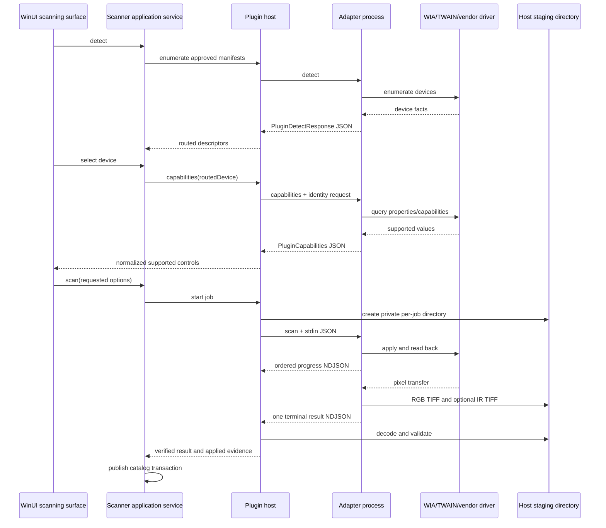

# Windows scanner plugin 아키텍처

기준일: 2026-08-04  
결정 상태: Windows 구현 기준선  
대상: WinUI 3 host, WIA/TWAIN/SANE/vendor scanner adapter  
코드 근거:

- `Sources/ScannerKit/Plugins/ScannerPluginManifest.swift`
- `Sources/ScannerKit/Plugins/ScannerPluginHost.swift`
- `Sources/ScannerKit/Plugins/ScannerPluginTrustStore.swift`
- `Sources/ScannerKit/Backends/External/`
- `Sources/ScannerKit/Domain/ScanOptions.swift`
- `Tests/ScannerKitTests/ScannerPluginProtocolV2Tests.swift`
- `Tests/ScannerKitTests/ExternalScannerProcessTests.swift`

관련 문서:

- [wire protocol](protocol-contract.md)
- [plugin security and lifecycle](plugin-security-and-lifecycle.md)
- [WIA and TWAIN adapters](twain-wia.md)
- [hardware validation matrix](hardware-validation-matrix.md)
- [scanning surface](../08-ui/surfaces/scanning.md)
- [product invariants](../99-plan/product-invariants.md)

## 1. 결론

Windows판도 scanner driver나 scanner SDK를 `Negaflow.exe`에 link하거나 load하지 않습니다.
모든 scanner 구현은 별도 실행 파일이며, host와는 JSON/NDJSON 제어 메시지와 host가 만든
staging file로만 통신합니다.

```text
Negaflow.exe (WinUI 3, x64 또는 ARM64)
    |
    | child process + stdin JSON + stdout NDJSON + staging files
    |
    +-- negaflow-scanner-wia.exe          x64 / ARM64
    +-- negaflow-scanner-twain-x64.exe    x64
    +-- negaflow-scanner-twain-x86.exe    x86
    +-- negaflow-scanner-sane.exe         별도 GPL 배포물
    +-- vendor-specific adapter           필요할 때 별도 배포물
```

이 경계의 목적은 하나가 아닙니다.

- SANE와 본체의 source/build/link/distribution 경계를 유지합니다.
- TWAIN Data Source와 adapter의 bitness를 일치시킵니다.
- vendor COM/DLL crash와 hang을 본체에서 격리합니다.
- scanner별 capability 협상을 하나의 제품 계약으로 정규화합니다.
- scan timeout, cancellation, output validation, provenance를 host가 일관되게 소유합니다.
- app의 x64/ARM64 네이티브 목표와 x86 legacy scanner 호환을 분리합니다.

다만 **프로세스 경계만으로 라이선스 결론이 자동 확정되지는 않습니다.** 결합 방식, 배포 묶음,
프로토콜의 독립성, 플러그인의 라이선스와 소스 제공 의무를 배포물마다 법률 검토해야 합니다.
이 문서는 법률 자문이 아닙니다.

## 2. 현재 macOS 구현에서 그대로 보존할 계약

현재 코드는 이미 외부 scanner를 특정 구현이 아닌 계약으로 다룹니다.

| 현재 사실 | Windows 보존 방식 |
|---|---|
| `ScannerBackend`가 장치 구현을 추상화 | C# application service 뒤에 native plugin host 배치 |
| external ID가 `plugin:<pluginId>:<deviceId>` | 동일 문자열 계약 유지 |
| manifest schema는 정확히 1 | Windows에서도 모르는 schema를 추측하지 않고 거부 |
| protocol field가 없으면 v1 | legacy decode 호환 유지 |
| protocol v2는 request ID와 ordered events 사용 | 동일 UUID와 엄격 증가 sequence 검증 |
| capability가 보고한 control만 UI에 노출 | WinUI surface도 동일 truth 사용 |
| capability token은 host가 해석하지 않음 | 같은 routed device의 다음 scan에 그대로 반환 |
| v2 result는 applied options를 증명 | 요청, echo, artifact를 함께 검증 |
| v1 적용값은 unknown legacy일 수 있음 | 요청값을 적용 증거로 복사하지 않음 |
| result image는 file로 전달 | 큰 pixel payload를 stdout으로 보내지 않음 |
| Mock은 명시적 개발/데모 backend | production discovery 실패 시 fallback 금지 |

Windows판의 목표는 Swift 타입을 문자 그대로 복제하는 것이 아니라 이 의미를 ABI와 언어에
상관없이 보존하는 것입니다.

## 3. 책임 경계

### 3.1 WinUI application

application layer가 소유하는 것:

- scanner surface와 접근성
- 선택된 device, requested options, job state
- 사용자 승인 UX와 plugin diagnostics
- library/catalog publication
- preview에서 선택한 ROI
- cancellation intent
- 앱 종료와 window lifecycle

application layer가 소유하지 않는 것:

- WIA COM object
- TWAIN DSM/Data Source handle
- SANE handle
- vendor DLL
- scanner transfer buffer
- plugin 내부 option names

### 3.2 Scanner plugin host

host는 별도 native component로 두되 `Negaflow.exe` process 안에서 동작할 수 있습니다. host가
소유하는 것은 scanner implementation이 아니라 process boundary입니다.

- manifest discovery와 schema validation
- path, file identity, hash, signature, approval validation
- executable architecture 확인
- command line과 environment 생성
- stdin/stdout/stderr pipe
- output byte limits
- command별 timeout
- Job Object와 process tree cleanup
- v1/v2 decode 및 protocol state machine
- host-owned staging directory
- output artifact decode/metadata validation
- atomic publication 직전 결과 반환

host는 plugin stdout을 UI 문자열처럼 신뢰하지 않습니다. 모든 값은 typed contract로 decode한 뒤
범위, identity, request ownership을 다시 검사합니다.

### 3.3 Adapter process

adapter가 소유하는 것:

- WIA/TWAIN/SANE/vendor API의 thread model
- 장치 enumeration
- capability query와 원시 capability snapshot
- 요청 option을 backend property로 설정
- backend가 실제 적용한 값 read-back
- scan transfer와 progress
- TIFF/IR artifact 생성
- backend-specific error를 stable error category로 정규화
- device reset/close

adapter는 Negaflow catalog, UI, develop recipe, export pipeline을 알면 안 됩니다.

### 3.4 OS와 vendor driver

OS 또는 vendor layer에서 발생한 사실을 adapter가 추정으로 보완하면 안 됩니다.

- USB enumeration은 acquisition 성공이 아닙니다.
- WIA item 발견은 film mode, 16-bit, IR 지원 증거가 아닙니다.
- TWAIN Data Source 발견은 headless scan 성공 증거가 아닙니다.
- model name은 resolution, ROI, IR, multi-exposure capability가 아닙니다.
- returned artifact의 header가 요청과 다르면 요청보다 artifact/read-back이 우선이며, v2 exact
  contract를 만족하지 못하면 job을 실패시킵니다.

## 4. 프로세스와 데이터 흐름



Pixel data는 pipe로 보내지 않습니다. 제어 스트림이 작아야 timeout, parsing, memory bound를 독립적으로
유지할 수 있습니다. scan artifact는 host가 사전에 만든 경로에 기록하고, host가 다시 열어 검증합니다.

## 5. Adapter 구성

### 5.1 1차 대상

| executable | target | 역할 | 제품 상태 |
|---|---|---|---|
| `negaflow-scanner-wia-x64.exe` | x64 | WIA 2.0 baseline | 대상 장치 실측 전 provisional |
| `negaflow-scanner-wia-arm64.exe` | ARM64 | native WIA | ARM64 driver가 있는 장치만 |
| `negaflow-scanner-twain-x64.exe` | x64 | 64-bit DSM/DS | 대상 DS 실측 필요 |
| `negaflow-scanner-twain-x86.exe` | x86 | legacy 32-bit DSM/DS | x64/ARM64 OS별 실측 필요 |

### 5.2 선택 대상

- GPL SANE adapter: 별도 저장소, 별도 installer, 별도 notices/source route
- eSCL/TWAIN Direct adapter: network scanner target이 생긴 뒤 검토
- vendor SDK adapter: 공개 WIA/TWAIN에서 제품 계약을 충족하지 못하고 재배포 권리가 명확할 때만
- simulator: explicit developer/demo install에서만

### 5.3 금지

- `Negaflow.exe`가 WIA/TWAIN/SANE/vendor DLL을 직접 load
- 하나의 adapter가 x86과 x64 Data Source를 동시에 in-process load
- plugin을 GPU/image engine ABI에 연결
- plugin이 app catalog를 직접 쓰기
- driver detection 실패를 Mock device로 대체
- model table로 capability를 발명

## 6. 설치와 발견

Windows 1차 user-scope root:

```text
%LOCALAPPDATA%\Negaflow\ScannerPlugins\<plugin-id>\
    manifest.json
    <adapter>.exe
    adapter-owned DLLs
    LICENSES\
```

선택 가능한 machine-scope official root:

```text
%ProgramFiles%\Negaflow Scanner Plugins\<plugin-id>\
```

두 root를 동시에 지원한다면 다음 순서를 고정합니다.

1. 정책으로 허용된 machine-scope signed plugin
2. 사용자가 설치하고 별도로 승인한 user-scope plugin
3. developer override는 개발 build 또는 명시적 diagnostic mode에서만

동일 ID 충돌은 조용히 섞지 않습니다. winner와 shadowed install을 diagnostics에 기록하고,
publisher가 다른 동일 ID는 conflict로 표시합니다. Windows path 비교는 case-insensitive canonical
comparison을 사용합니다.

### 6.1 manifest

현재 호환 기준:

```json
{
  "schemaVersion": 1,
  "protocolVersion": 2,
  "id": "negaflow.scanner.wia",
  "name": "Negaflow WIA Scanner",
  "executable": "negaflow-scanner-wia-x64.exe",
  "kind": "scanner",
  "license": "Apache-2.0",
  "homepage": "https://example.invalid/",
  "pluginVersion": "1.0.0"
}
```

`protocolVersion`이 없으면 v1입니다. v2 adapter는 값을 명시합니다. manifest에 새 필드를 추가해도
schema 1 decoder가 무시할 수 있다는 사실을 version negotiation으로 오해하면 안 됩니다. 의미가
바뀌거나 필수 검증이 추가되면 schema/protocol version을 올립니다.

### 6.2 plugin ID

현재 코드 규칙:

- UTF-8 1~64 bytes
- 첫 byte는 ASCII letter 또는 digit
- 이후 허용 byte는 ASCII letter, digit, `-`, `.`, `_`
- `:` 금지
- whitespace, path separator, control character, non-ASCII 금지

Windows에서 추가할 규칙:

- case-folded ID uniqueness
- trailing dot/space가 생기는 이름 금지
- `CON`, `PRN`, `AUX`, `NUL`, `COM1`~`COM9`, `LPT1`~`LPT9` 등
  DOS device name 금지
- directory name과 manifest ID exact canonical match

### 6.3 executable path

- manifest directory 상대 경로만 허용합니다.
- absolute path, drive-relative path, UNC path, device namespace path를 거부합니다.
- `.`, `..`, empty component를 거부합니다.
- path 전체 component에서 reparse point 정책을 검사합니다.
- final resolved file이 manifest installation root 안인지 handle 기반 final path로 확인합니다.
- executable은 regular PE image여야 하며 예상 machine type과 adapter declaration이 일치해야 합니다.

세부 ACL, file identity, signature, TOCTOU 규칙은
[plugin security and lifecycle](plugin-security-and-lifecycle.md)에 둡니다.

## 7. Routed device identity

외부 device ID는 다음 형식을 유지합니다.

```text
plugin:<plugin-id>:<adapter-device-id>
```

host가 prefix를 붙이고 벗깁니다. adapter는 다른 plugin ID를 포함한 routed ID를 받지 않습니다.

device ID 요구:

- detect 응답 내에서 중복 금지
- 비어 있지 않아야 함
- 단일 adapter 실행 중 안정적이어야 함
- USB path만으로 영구 identity라고 주장하지 않음
- serial이 없으면 reconnect 뒤 ID가 달라질 수 있음을 명시

`PluginDevice`의 현재 필드:

- `id`, `displayName`, `vendor`, `model`
- `connectionType`
- `usbVendorID`, `usbProductID`
- `serialNumber`
- `verifiedStatus`
- `driverVersion`

`verifiedStatus`는 adapter가 임의로 마케팅하는 badge가 아닙니다.

- `verified`: 그 개별 hardware/driver/OS/adapter 조합에서 physical matrix 통과
- `compatibleTarget`: contract상 후보이나 개별 장치 미검증
- `experimental`: 일부 route만 검증

알 수 없는 값은 verified로 승격하지 않습니다.

## 8. Capability가 UI의 유일한 truth

host는 다음 capability를 정규화합니다.

- resolutions
- color modes
- bit depths
- source and transparency modes
- preview
- transparency
- infrared
- multi-exposure
- scan area와 positioned scan area
- brightness, contrast, hardware exposure ranges
- minimum/maximum area와 unit
- output formats
- disabled reasons
- opaque capability token

UI 규칙:

- capability가 true가 아니면 control을 기능하는 것처럼 보이지 않습니다.
- range/list가 유효하지 않으면 control을 숨기거나 이유를 표시합니다.
- positioned area는 origin X/Y와 width/height range가 모두 있어야 합니다.
- unit을 decode하지 못하면 scan area 지원을 끕니다.
- disabled reason은 진단 문자열이지 capability를 뒤집는 권한이 아닙니다.
- capability refresh 전 값을 다른 device에 재사용하지 않습니다.

detect를 다시 실행하면 cached capability token을 폐기합니다. token은 plugin과 device가 만든 opaque
snapshot이며 host, UI, telemetry가 내용을 parse하면 안 됩니다.

## 9. Scan transaction

하나의 scan은 다음 단계로 실행합니다.

1. routed scanner ownership 확인
2. plugin manifest/protocol/trust identity 재검증
3. 해당 device의 최신 capability snapshot 확인
4. 요청 option을 capability와 product invariant에 대조
5. final path가 없고 app-owned 위치인지 확인
6. final path와 같은 volume에 private staging directory 생성
7. unpredictable staged RGB path 생성
8. v2이면 request UUID 생성 또는 app UUID 사용
9. `scan` child process 실행
10. stdin으로 one-shot request JSON 전송 후 write end 닫기
11. stdout NDJSON과 stderr를 동시에 drain
12. progress를 request/session ownership 확인 뒤 UI에 전달
13. 정확히 하나의 terminal event 수집
14. process exit, protocol, output path, artifact를 모두 검증
15. RGB와 IR을 final destination으로 commit
16. verified evidence와 함께 catalog publication layer에 반환
17. 실패/취소 시 uncommitted staging을 제거

### 9.1 commit 순서

RGB와 IR 두 파일이 필요한 경우 partial publication을 피해야 합니다.

- 둘 다 staged 상태에서 검증합니다.
- IR destination conflict를 먼저 확인합니다.
- IR과 RGB move 중 하나가 실패하면 이미 이동한 app-owned file을 transaction cleanup 대상으로 추적합니다.
- catalog에는 두 파일 commit이 끝난 뒤에만 record를 생성합니다.
- source publication과 catalog write가 별도 transaction이라면 crash recovery journal을 둡니다.

Windows에서는 같은 volume의 rename이 전제되도록 staging을 final directory tree 안에 둡니다. network,
FAT/exFAT, cloud-sync folder에서 동일 의미가 보장되는지는 별도 filesystem test가 필요합니다.

## 10. Protocol v1과 v2

### 10.1 v1

v1은 기존 compatibility route입니다.

- request에 `protocolVersion`, `requestID`를 넣지 않습니다.
- progress/result event에도 두 필드와 sequence가 없을 수 있습니다.
- result가 보고한 valid resolution/bit depth는 operational value로 사용할 수 있습니다.
- 실제 applied options 전체는 증명할 수 없습니다.
- evidence는 `unknownLegacy(protocolVersion: 1)`입니다.

v1에서 요청 option을 result evidence로 복사하지 않습니다. v1 plugin을 지원하는 것과 결과 provenance가
완전하다고 말하는 것은 다른 일입니다.

### 10.2 v2

v2는 Windows 신규 adapter의 필수 target입니다.

- 모든 event에 protocol version, request ID, strictly increasing sequence 필요
- exactly one terminal `result` 또는 `error`
- terminal 이후 byte/event 금지
- result에 complete `appliedOptions` 필요
- optional applied field도 key를 포함하고 null을 명시
- requested/applied/result/artifact 일관성 검증
- RGB는 host 지정 staging path의 TIFF
- IR은 요청했을 때만, staging 안에서, RGB와 같은 dimensions

정확한 wire는 [protocol contract](protocol-contract.md)를 따릅니다.

### 10.3 CLI envelope와 plugin wire를 혼동하지 않기

현재 `ScannerCLIEnvelope`의
`schema = "negaflow.scanner-cli"` 구조는 Negaflow CLI 출력용 타입입니다. 현재
`ExternalScannerBackend`가 plugin의 detect/capabilities 응답을 이 envelope로 decode하지 않습니다.

- plugin `detect`: `PluginDetectResponse` raw JSON
- plugin `capabilities`: `PluginCapabilities` raw JSON
- plugin `scan`: `PluginScanEvent` NDJSON
- Negaflow CLI command 출력: `ScannerCLIEnvelope<Payload>`

Windows 구현에서 둘을 합치면 기존 plugin 호환이 깨집니다. protocol v3에서 envelope를 도입하려면
별도 negotiation과 migration fixture가 필요합니다.

## 11. Process lifecycle

명령별 초기 wall-time ceiling 후보는 현재 macOS 값을 출발점으로 사용합니다.

| command | 현재 ceiling | 의미 |
|---|---:|---|
| detect | 90 s | slow USB enumeration 포함 |
| capabilities | 180 s | device open과 property query 포함 |
| scan | 7,200 s | 고해상도 multi-pass film scan 포함 |
| other | 60 s | 알 수 없는 command 방어 |

이 숫자는 Windows 최종값이 아닙니다. 대상 hardware p95/p99와 warm/cold route를 측정해 조정합니다.
너무 짧은 timeout으로 USB transfer 중 process를 죽이면 device/driver가 반쯤 열린 상태로 남을 수
있습니다.

기본 output budget 출발점:

- stdout: 4 MiB
- stderr: 1 MiB

scan progress가 긴 job에서 4 MiB를 넘지 않도록 adapter가 event 빈도를 제한합니다. host는 byte,
line length, event count를 모두 제한해야 합니다. stdout/stderr는 동시에 drain하여 pipe deadlock을
막습니다.

취소:

1. host cancellation token set
2. adapter별 graceful cancel 신호 또는 control channel 사용
3. bounded grace period 동안 exit/pipe drain
4. timeout 후 Job Object terminate
5. process tree exit 확인
6. staged artifacts cleanup
7. device가 다음 detect/open에 실패하면 recoverable busy state 표시

단순 `TerminateProcess`만 호출하고 완료를 기다리지 않으면 다음 scan과 cleanup이 경합합니다.

## 12. Threading

host:

- UI thread에서 process wait, pipe read, hashing, image decode 금지
- 하나의 backend instance는 동시에 한 process만 실행
- 서로 다른 plugin/device concurrency는 정책과 hardware evidence로 제한
- process exit와 마지막 pipe callback 사이 race를 막고 drain 완료 후 terminal 판단

WIA adapter:

- COM apartment를 adapter가 명시적으로 소유
- interface를 apartment 밖으로 raw pointer 전달하지 않음
- transfer callback에서 stdout write를 blocking하지 않도록 bounded queue 사용

TWAIN adapter:

- DSM/DS state와 message loop를 한 owner thread에 고정
- host cancellation thread가 DSM state를 직접 조작하지 않음
- state owner가 cancellation을 받아 legal unwind sequence 실행

스레딩 공통 정책은 [multithreading export](../07-threading/multithreading-export.md)의 process/IO
domain 원칙과 맞춥니다.

## 13. Error model

제품에 필요한 stable category:

- plugin not installed
- approval required
- identity changed
- manifest/protocol unsupported
- architecture unavailable
- device not found/disconnected
- device busy
- permission denied
- capability changed/stale token
- unsupported requested option
- warming up/user intervention
- transfer failed
- timeout
- cancelled
- protocol violation
- invalid artifact
- publication conflict
- plugin crashed

adapter의 HRESULT/TWAIN condition code/SANE status는 diagnostics에 보존하되 UI의 primary message를
그 숫자로 대체하지 않습니다. 사용자 재시도 가능성과 data safety를 stable category로 판단합니다.

error event가 왔더라도 process exit code, trailing events, staged files를 확인합니다. exit code 0만으로
성공하지 않고, result event만으로도 성공하지 않습니다.

## 14. Artifact contract

v2 RGB artifact:

- host가 지정한 exact staged path
- regular file
- reparse point 아님
- non-empty
- decodable TIFF
- positive width/height
- result width/height와 일치
- applied bit depth와 decoded bits per component 일치
- color mode와 decoded color model 일치

IR artifact:

- IR requested와 applied가 true일 때 필수
- requested가 false이면 존재/flag를 거부
- v2는 host staging root 안
- regular, non-empty, decodable
- RGB와 dimensions 일치
- IR 자체 bit depth/color model/profile 의미는 protocol v3 후보로 별도 명시 필요

Windows WIC가 TIFF를 decode할 수 있다는 사실만으로 pixel semantics가 증명되지는 않습니다.
orientation, samples per pixel, photometric interpretation, planar layout, alpha, ICC, sample format,
endianness와 strip/tile decode는 [libtiff](../05-image-io/libtiff.md) 기준으로 추가 검증합니다.

## 15. Trust와 사용자 승인

현재 identity tuple:

- plugin ID
- plugin version
- manifest SHA-256
- executable SHA-256

Windows에서는 여기에 검증 결과로 다음을 저장할 수 있습니다.

- Authenticode signer certificate thumbprint/public key identity
- package/installer provenance
- executable file ID와 volume serial
- architecture
- approval timestamp

승인은 ID 문자열이 아니라 exact identity에 부여합니다. manifest 또는 executable byte가 바뀌면
`identityChanged`이며 재승인이 필요합니다. official update 정책으로 자동 승계를 허용할 경우에도
같은 publisher chain, signed update manifest, version monotonicity, rollback policy가 모두 필요합니다.

trust store가 corrupt하거나 읽히지 않으면 fail closed합니다. trust store를 empty store로 간주하여
승인 기록을 덮어쓰지 않습니다.

## 16. Packaging 경계

main app package와 scanner plugin package는 독립 release unit입니다.

각 plugin package가 가져야 할 것:

- executable과 private dependencies
- manifest
- code signature
- version
- SBOM
- license/notice
- source offer 또는 corresponding source route가 필요한 경우 그 절차
- supported architecture와 OS
- supported hardware/driver matrix
- uninstall/rollback metadata

금지:

- SANE binary를 main MSIX에 숨겨 함께 배포하고 “process라서 별도”라고 주장
- vendor DLL을 재배포 권리 확인 없이 plugin installer에 포함
- system-installed TWAIN DSM을 무조건 덮어쓰기
- plugin update가 main app update와 원자적이라고 가정

MSIX/external-location/unpackaged 선택은 [MSIX signing](../11-distribution/msix-signing.md)과
deployment 문서에서 결정합니다.

## 17. Logging과 privacy

기본 diagnostics:

- plugin ID/version/hash prefix
- signer status
- adapter architecture
- command와 duration
- request ID
- event sequence count
- stable device ID hash
- capability field names와 counts
- output byte counts와 dimensions
- timeout/cancel/exit status
- stable error category와 backend-native code

기본 로그에서 제외:

- image pixels
- full local paths
- scanner serial 원문
- capability token 원문
- ICC bytes
- raw stdout/stderr 전체
- user name과 environment dump

사용자가 diagnostic bundle 생성을 명시한 경우에도 secret/environment allowlist와 path redaction을
적용합니다.

## 18. Test 계층

### 18.1 Host unit tests

- manifest version exact acceptance
- plugin ID grammar와 Windows reserved names
- duplicate ID/case collision
- path traversal/UNC/device path/reparse rejection
- ACL/effective access validation
- hash/signature/identity change
- corrupt trust store fail-closed
- architecture routing

### 18.2 Protocol conformance

- v1 omitted fields 유지
- v2 request ID round trip
- strictly increasing sequence
- duplicate/missing terminal
- event after terminal
- unknown event type
- invalid UTF-8
- stdout/stderr/line/event bounds
- every applied option mismatch
- TIFF type/dimensions/depth/color contradiction
- IR request/path/dimensions contradiction
- cancellation and fast terminal/exit race

### 18.3 Adapter virtual tests

- fake WIA property graph
- fake TWAIN DSM/DS state machine
- capability container normalization
- property set/read-back mismatch
- transfer callbacks
- hung driver simulation
- process crash and Job Object cleanup

### 18.4 Physical hardware

virtual fixture와 driver enumeration은 hardware support 증거가 아닙니다. 실제 장치는
[hardware validation matrix](hardware-validation-matrix.md)의 format, ROI, depth, IR, repeatability,
cancel/reconnect gate를 통과해야 합니다.

## 19. 구현 순서

### Phase S0 - contract freeze

- 현재 Swift wire fixture를 language-neutral JSON corpus로 추출
- v1/v2 schema와 negative fixture 작성
- Windows host decoder가 같은 pass/fail 결과를 내는지 확인

### Phase S1 - secure process host

- discovery, trust, `CreateProcessW`, pipes, Job Object
- fake adapter만 사용
- timeout/cancel/output limits

### Phase S2 - artifact transaction

- staging, TIFF validation, RGB/IR commit
- crash cleanup과 path attack tests

### Phase S3 - WIA spike

- x64/ARM64 enumeration
- film item/property dump
- set/read-back와 16-bit TIFF transfer
- target hardware matrix

### Phase S4 - TWAIN spike

- x64 DSM/DS
- x86 helper
- headless state machine
- target hardware matrix

### Phase S5 - product integration

- WinUI surface
- approval UX
- catalog publication
- accessibility/localization

### Phase S6 - optional adapters

- SANE 별도 배포
- vendor SDK
- network protocols

## 20. Release gate

scanner 기능을 Windows 지원으로 표시하려면 다음이 모두 필요합니다.

- protocol conformance corpus pass
- secure launch/path/ACL/signature tests pass
- cancel/timeout/process-tree cleanup pass
- artifact transaction crash tests pass
- 해당 adapter architecture package signed
- license/SBOM/notices 검토
- 실제 hardware/driver/OS 조합 matrix pass
- advertised film formats의 preview/full ROI evidence
- reported/applied/artifact provenance 일치
- main app이 scanner 없이 import/develop/export를 완전히 수행
- production에서 implicit Mock fallback 없음

## 21. 공식 근거

- [WIA architecture overview](https://learn.microsoft.com/en-us/windows-hardware/drivers/image/wia-architecture-overview)
- [WIA film scanner flow](https://learn.microsoft.com/en-us/windows-hardware/drivers/image/basic-scanning-for-film-scanners)
- [WIA transfer constants](https://learn.microsoft.com/en-us/windows-hardware/drivers/image/wia-transfer-constants)
- [TWAIN DSM repository](https://github.com/twain/twain-dsm)
- [TWAIN DSM releases](https://github.com/twain/twain-dsm/releases)
- [TWAIN 2.5 specification](https://twain.org/wp-content/uploads/2021/11/TWAIN-2.5-Specification.pdf)
- [CreateProcessW](https://learn.microsoft.com/en-us/windows/win32/api/processthreadsapi/nf-processthreadsapi-createprocessw)
- [Job Objects](https://learn.microsoft.com/en-us/windows/win32/procthread/job-objects)
- [AuthzAccessCheck](https://learn.microsoft.com/en-us/windows/win32/api/authz/nf-authz-authzaccesscheck)
- [Reparse points](https://learn.microsoft.com/en-us/windows/win32/fileio/reparse-points)

## 22. 미확정 항목

- target scanner별 WIA와 TWAIN 실제 feature delta
- Windows ARM64에서 x86 TWAIN adapter와 vendor USB driver의 실동작
- IR plane의 bit depth/color model을 v2보다 강하게 고정할 protocol v3 필요성
- user-scope와 machine-scope plugin root를 동시에 출시할지
- signed official plugin update의 approval 자동 승계 정책
- packaged app에서 external plugin launch와 update를 어떤 distribution channel로 묶을지
- driver-specific recovery 전에 graceful cancel이 필요한 최소 시간

이 항목은 구현 convenience로 닫지 않고 spike와 physical evidence로 닫습니다.
