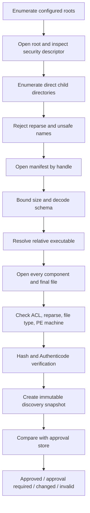

# Windows scanner plugin 보안과 수명주기

기준일: 2026-08-04  
상태: 구현 전 security baseline  
범위: discovery, approval, launch, pipes, process tree, staging, update, revocation  
비범위: plugin 내부 WIA/TWAIN correctness, 법률 자문

관련 문서:

- [plugin architecture](plugin-architecture.md)
- [protocol contract](protocol-contract.md)
- [MSIX and signing](../11-distribution/msix-signing.md)
- [product invariants](../99-plan/product-invariants.md)

공식 근거:

- [CreateProcessW](https://learn.microsoft.com/en-us/windows/win32/api/processthreadsapi/nf-processthreadsapi-createprocessw)
- [UpdateProcThreadAttribute](https://learn.microsoft.com/en-us/windows/win32/api/processthreadsapi/nf-processthreadsapi-updateprocthreadattribute)
- [Job Objects](https://learn.microsoft.com/en-us/windows/win32/procthread/job-objects)
- [JOB_OBJECT_LIMIT_KILL_ON_JOB_CLOSE](https://learn.microsoft.com/en-us/windows/win32/api/winnt/ns-winnt-jobobject_basic_limit_information)
- [AuthzAccessCheck](https://learn.microsoft.com/en-us/windows/win32/api/authz/nf-authz-authzaccesscheck)
- [How access checks work](https://learn.microsoft.com/en-us/windows/win32/secauthz/how-dacls-control-access-to-an-object)
- [Reparse points](https://learn.microsoft.com/en-us/windows/win32/fileio/reparse-points)
- [Dynamic-link library security](https://learn.microsoft.com/en-us/windows/win32/dlls/dynamic-link-library-security)
- [WinVerifyTrust](https://learn.microsoft.com/en-us/windows/win32/api/wintrust/nf-wintrust-winverifytrust)
- [GetFileInformationByHandle](https://learn.microsoft.com/en-us/windows/win32/api/fileapi/nf-fileapi-getfileinformationbyhandle)

## 1. 보안 결론

Scanner plugin은 신뢰하지 않는 데이터 parser인 동시에 사용자가 승인해 실행하는 native code입니다.
기본 Win32 child process는 sandbox가 아니며 host와 같은 사용자 권한으로 실행됩니다.

따라서 보안 목표를 정확히 나눕니다.

### 이 설계가 제공하려는 것

- 승인하지 않은 plugin의 자동 실행 방지
- 승인 뒤 binary/manifest 교체 감지
- path traversal, link/reparse, broad-writable installation 차단
- command injection과 DLL search 위험 축소
- stdout/stderr memory exhaustion 제한
- crash/hang/process tree 격리
- host-owned output path와 artifact validation
- update/revocation auditability
- WIA/TWAIN/SANE code가 main process에 load되지 않음

### 이 설계만으로 제공하지 못하는 것

- 승인한 악성 plugin이 사용자 파일을 읽지 못하게 하는 sandbox
- process boundary만으로 확정되는 라이선스 비결합 판단
- compromised 사용자 계정에서의 보호
- compromised administrator/kernel/driver에서의 보호
- Authenticode 서명만으로 publisher의 선의 보장
- hash check만으로 runtime-loaded DLL 전체의 무결성 보장
- vendor driver의 kernel safety

사용자 승인 화면에는 “이 plugin은 사용자 계정 권한으로 실행됩니다”를 명확히 표시합니다.

## 2. Threat model

### 2.1 보호 자산

- Negaflow catalog와 original scan files
- plugin approval store
- 사용자의 이미지와 metadata
- application credentials/environment
- final output path
- scanner device state
- app availability
- publisher/update chain

### 2.2 공격자와 결함

- 다운로드 후 변조된 plugin
- 다른 local user가 쓸 수 있는 install directory
- manifest가 외부 executable을 가리키는 path traversal
- reparse point, junction, symlink, mount point
- hard-link 또는 path replacement race
- malicious/buggy plugin의 unbounded output
- hung plugin 또는 descendant process
- command-line quoting ambiguity
- DLL preloading/binary planting
- forged device capability/result
- staging 밖 output 또는 pre-existing file overwrite
- trust store corruption
- signed but revoked/expired/compromised publisher
- plugin update와 app update 불일치
- x86 legacy process의 낮은 memory ceiling

### 2.3 trust boundary

```text
untrusted manifest bytes
untrusted executable bytes until verified/approved
untrusted stdout/stderr
untrusted output files
untrusted device/driver reports
trusted host policy and app-owned catalog transaction
```

“signed”와 “trusted”는 같은 상태가 아닙니다. signature validity, allowed publisher, exact hash,
user approval을 별도 상태로 저장합니다.

## 3. Installation profiles

### 3.1 user-scope

```text
%LOCALAPPDATA%\Negaflow\ScannerPlugins\<plugin-id>\
```

장점:

- elevation 없이 설치/제거
- 현재 macOS user Application Support 모델과 가깝게 대응
- 사용자별 approval/update

위험:

- 현재 사용자는 directory와 binary를 바꿀 수 있음
- 다른 process가 같은 사용자 token을 탈취하면 보호 불가
- 다운로드/install tool이 ACL을 잘못 만들 수 있음

### 3.2 machine-scope official

```text
%ProgramFiles%\Negaflow Scanner Plugins\<plugin-id>\
```

장점:

- 일반 사용자가 install bytes를 수정하지 못하는 기본 ACL
- signed installer/update와 결합하기 쉬움
- 조직 배포에 적합

위험:

- installer/update에 elevation 필요
- machine-wide plugin이 여러 app version과 호환되어야 함
- vendor DLL 재배포 권리와 rollback 관리가 더 중요

### 3.3 개발 override

`NEGAFLOW_PLUGINS_DIR`는 현재 macOS test isolation에 사용됩니다. Windows에서는 다음 중 하나로
제한합니다.

- Debug build only
- command-line diagnostic mode with persistent warning
- developer settings에서 explicit enable

production startup이 ambient environment variable 하나로 arbitrary executable root를 자동 신뢰하면
안 됩니다. override root도 path/ACL/hash/approval 검사를 통과해야 합니다.

## 4. Discovery pipeline



각 단계가 실패하면 그 entry만 제외하고 reason을 diagnostics에 남깁니다. corrupt root를 empty clean
root로 간주해 approval을 삭제하지 않습니다.

## 5. Path rules

### 5.1 plugin ID and directory

- ID는 protocol grammar를 통과해야 합니다.
- Windows ordinal case-insensitive comparison으로 unique해야 합니다.
- directory basename과 manifest ID가 canonical match해야 합니다.
- trailing dot/space 금지
- DOS device name 금지
- NT namespace prefix 금지

### 5.2 executable manifest value

금지:

- absolute drive path: `C:\...`
- drive-relative path: `C:tool.exe`
- UNC path: `\\server\share`
- NT device path: `\\?\`, `\\.\`
- root-relative path
- `.`, `..`
- empty segment
- alternate data stream colon
- NUL/control character
- wildcard

초기 버전은 executable filename 한 component만 허용하는 것이 가장 단순합니다. private DLL/resource
subdirectories가 필요해도 executable 자체를 nested path로 둘 이유가 확인되기 전에는 확장하지 않습니다.

### 5.3 canonicalization만 믿지 않기

`GetFullPathNameW`나 문자열 prefix 비교는 lexical normalization일 뿐 filesystem identity 증거가
아닙니다. 다음을 handle로 확인합니다.

- component별 object type
- reparse attribute/tag
- final path
- volume identity
- file ID
- link count
- security descriptor
- size/timestamps

path comparison과 object identity comparison을 분리합니다.

## 6. Reparse point와 link 방어

### 6.1 component walk

root부터 final executable까지 각 component를 `CreateFileW`로 엽니다.

- directory는 `FILE_FLAG_BACKUP_SEMANTICS`
- link 자체 조사에는 `FILE_FLAG_OPEN_REPARSE_POINT`
- `FILE_ATTRIBUTE_REPARSE_POINT`가 있으면 기본 거부
- mount point/junction/symlink/cloud placeholder를 자동 추종하지 않음

허용할 reparse tag allowlist는 1차 구현에서 비워 둡니다. OneDrive placeholder 같은 user convenience를
지원해야 한다면 별도 threat model과 offline availability test 뒤에 추가합니다.

### 6.2 final path

opened handle에서 `GetFinalPathNameByHandleW`를 얻고 configured root handle과 동일 volume/root
relationship인지 확인합니다. 문자열이 root로 시작한다는 사실만으로 충분하지 않으므로 file ID와
component handles를 함께 사용합니다.

### 6.3 hard links

hard link는 reparse point가 아닙니다. user-scope executable에서 link count가 1보다 크면 기본 거부하는
정책을 검토합니다. machine-scope signed install에서는 installer manifest의 expected file ID/hash와
대조합니다.

link count 하나만으로 안전을 증명하지 않습니다. content hash와 write-sharing lock이 같이 필요합니다.

## 7. ACL과 ownership

### 7.1 단순 ACE 문자열 검사가 부족한 이유

“Everyone allow ACE가 있는가”만 보는 검사는 틀릴 수 있습니다.

- deny와 allow ACE 순서
- group membership
- deny-only SID
- inherited ACE
- owner의 implicit 권리
- generic rights mapping
- callback/conditional ACE
- null DACL
- integrity level

Microsoft의 access check는 security descriptor와 access token을 함께 평가합니다. 따라서
`AuthzAccessCheck` 또는 `AccessCheck` 기반 effective access와 엄격한 install ACL profile을
결합합니다.

### 7.2 fail-closed conditions

- security descriptor를 읽지 못함
- null DACL
- owner/DACL 정보 없음
- unexpected broad write grant
- root, plugin directory, manifest, executable 중 하나라도 policy 불일치
- trust store parent가 unsafe

### 7.3 user-scope ACL profile

허용 주체 후보:

- current user SID
- `SYSTEM`
- `BUILTIN\Administrators`

다른 principal의 write, delete, write-DAC, write-owner 권한은 금지합니다. read/execute 허용 여부는
privacy와 deployment 정책으로 별도 결정합니다.

current user가 write 가능한 것은 user-scope 설치의 본질입니다. 따라서 승인 뒤 변조를 막는 핵심은
ACL만이 아니라 launch 직전 identity revalidation입니다.

### 7.4 machine-scope ACL profile

일반 medium-integrity user token에 대해 다음 effective access가 없어야 합니다.

- file data write/append
- create child
- delete/delete child
- change permissions
- take ownership

publisher installer/admin update path만 write를 가져야 합니다. Program Files라는 path 이름만 보고
안전하다고 가정하지 않고 실제 descriptor를 검사합니다.

### 7.5 effective-access test

구현 spike에서:

- exact security descriptor snapshot
- current token
- representative standard-user restricted token
- broad groups
- generic mapping for files/directories

에 대해 `AuthzAccessCheck` 결과를 test합니다. ACL evaluator를 자체 구현하지 않습니다. 동시에
allowlist profile에서 벗어난 conditional/custom ACE는 복잡한 해석을 시도하지 않고 거부하는 편이
안전합니다.

## 8. Manifest read

- regular file
- no reparse point
- size 1...256 KiB
- read through held handle
- UTF-8 JSON
- exact supported schema/protocol
- non-empty name/executable
- kind scanner

manifest hash는 decoder가 재직렬화한 JSON이 아니라 **원본 bytes 전체**의 SHA-256입니다. whitespace
변경도 identity change입니다.

unknown JSON key는 현재 Codable behavior상 무시될 수 있습니다. Windows decoder도 compatibility를
유지하되 unknown keys를 diagnostics에 기록할 수 있습니다. required semantics가 바뀌면 schema를
올립니다.

## 9. Executable validation

### 9.1 file type

- disk file
- non-empty
- no directory/device/pipe
- no reparse
- expected PE image
- PE headers and section bounds structurally valid
- machine type matches declared adapter package
- unreasonable file size rejected by policy

### 9.2 whole-file hash

SHA-256은 opened handle로 stream합니다. path를 다시 열어 hash하지 않습니다.

identity:

```text
plugin ID
plugin version
manifest SHA-256
executable SHA-256
```

Windows extension:

```text
volume serial + file ID
PE machine
signature status
signer identity
```

### 9.3 Authenticode

`WinVerifyTrust`로 signature chain/policy를 검증합니다.

상태를 분리합니다.

- unsigned
- signature valid but publisher unapproved
- valid allowed publisher
- expired
- revoked
- chain unavailable/offline
- invalid/tampered
- policy error

offline revocation result를 valid로 조용히 승격하지 않습니다. release channel은 online/offline policy와
cache behavior를 명시해야 합니다.

embedded Authenticode signature가 PE file의 모든 byte 의미를 동일하게 보호한다고 단순화하지 않습니다.
whole-file SHA-256 identity를 같이 유지합니다.

### 9.4 signer pinning

certificate leaf thumbprint만 영구 pin하면 정상 certificate renewal이 identity change가 됩니다. 후보:

- approved publisher subject + public key identity
- signed update metadata의 allowed certificate rotation
- exact binary hash approval

초기 third-party plugin은 exact binary approval이 가장 보수적입니다. official plugin만 controlled
publisher update 승계를 검토합니다.

## 10. Approval store

### 10.1 states

- `approved`
- `approvalRequired`
- `identityChanged`
- `invalidIdentity`
- `storeUnavailable`
- Windows 추가 후보: `signatureInvalid`, `publisherBlocked`, `revoked`

### 10.2 record

```json
{
  "version": 1,
  "records": [
    {
      "identity": {
        "pluginID": "negaflow.scanner.wia",
        "pluginVersion": "1.0.0",
        "manifestSHA256": "...",
        "executableSHA256": "..."
      },
      "publisher": {
        "status": "valid",
        "keyIdentity": "..."
      },
      "approvedAt": "2026-08-04T00:00:00Z"
    }
  ]
}
```

현재 macOS store는 version 1, 최대 1 MiB, unique IDs, valid lowercase SHA-256, atomic write와 read-back
검증을 사용합니다. Windows도 같은 fail-closed 의미를 유지합니다.

### 10.3 store protection

- app data의 dedicated directory
- user-only DACL
- no reparse
- bounded size
- atomic replacement
- flush/read-back/decode/byte equality
- optional DPAPI는 confidentiality가 필요한 secret이 없으므로 핵심 요구가 아님
- tamper detection을 위해 app-owned signature/MAC를 추가해도 key가 같은 user context에 있어
  same-user attacker 방어는 제한적

store가 corrupt하면 empty로 덮어쓰지 않습니다. diagnostics와 recovery UX를 제공합니다.

### 10.4 approval UX

표시:

- plugin name과 ID
- version
- publisher/signature 상태
- install location
- architecture
- license declaration
- hash prefix
- network/driver/device access 설명
- update 시 재승인 정책

승인 버튼은 device detect를 자동 시작하지 않습니다. 승인과 실행을 분리하면 사용자가 예상하지 않은
device access를 막을 수 있습니다.

## 11. Discovery-to-launch race

### 11.1 문제

```text
discover path -> hash -> approve -> later launch path
```

사이에 file/path가 교체될 수 있습니다. path 문자열과 이전 hash만 저장하고 launch 시 재검증하지 않으면
다른 bytes를 실행합니다.

### 11.2 minimum defense

launch 직전:

1. root/directory/manifest/executable handles 다시 open
2. ACL/reparse/type 다시 확인
3. manifest bytes 다시 read/hash/decode
4. executable bytes 다시 hash
5. signature 다시 verify
6. file ID와 discovery snapshot 비교
7. approval record exact match
8. 그 뒤에만 launch

### 11.3 handle sharing

verification handle은 최소한 write/delete replacement를 막는 sharing policy로 유지합니다.

- write sharing 허용하지 않음
- delete sharing 허용하지 않음
- CreateProcess가 image를 open할 수 있는 read/execute sharing은 Windows spike로 확인
- parent directory handles도 rename/reparse race를 줄이도록 유지할지 검증

### 11.4 남는 한계

`CreateProcessW`는 “이미 검증한 executable file handle에서 직접 실행”하는 API가 아닙니다. path를
다시 해석합니다. 따라서:

- immutable installer-owned directory
- held non-write/non-delete handles
- explicit application path
- launch 직후 process image path/file identity 확인
- exact signature/hash

를 결합합니다.

이 조합을 “TOCTOU 완전 제거”라고 부르지 않습니다. 실제 Windows filesystem race harness로 증명할
범위와 남는 한계를 문서화합니다.

## 12. CreateProcess profile

### 12.1 explicit application

`CreateProcessW`의 `lpApplicationName`에 fully qualified validated path를 넘깁니다. null로 두고
command line 첫 token에서 executable을 찾게 하지 않습니다. Microsoft 문서가 설명하는
`C:\Program.exe` ambiguity를 피합니다.

### 12.2 command line

- executable path는 application parameter로 별도 전달
- arguments는 Windows quoting algorithm으로 encode
- command은 allowlisted literal: detect/capabilities/scan
- device ID는 command line에서 length/control/quote validation
- scan options는 stdin JSON
- shell, `cmd.exe`, PowerShell을 거치지 않음

### 12.3 creation flags

후보:

- `CREATE_UNICODE_ENVIRONMENT`
- `CREATE_NO_WINDOW`
- `EXTENDED_STARTUPINFO_PRESENT`
- `CREATE_SUSPENDED`

`CREATE_SUSPENDED`로 만든 뒤 Job Object에 assign하고 pipe/limits를 완성한 뒤 primary thread를
resume합니다. assign 실패 시 resume하지 않고 process를 종료합니다.

### 12.4 current directory

validated plugin install directory 또는 adapter가 요구하는 signed resource root로 고정합니다.
사용자가 연 import/export directory를 current directory로 사용하지 않습니다.

## 13. Environment

부모 environment 전체를 상속하지 않습니다.

allowlist 후보:

- `SystemRoot`
- `WINDIR`
- locale 관련 최소 변수
- adapter 전용 private temp path
- 필요성이 실측된 user-profile 값

기본 제외:

- auth token
- cloud credential
- development injection variables
- `NEGAFLOW_PLUGINS_DIR`
- arbitrary `PATH`
- toolchain variables
- dump/log destination overrides

Windows environment block은 Unicode, NUL-terminated, case-insensitive key uniqueness, 정렬 요구를
맞춥니다. 각 adapter의 WIA/TWAIN vendor dependency가 어떤 environment를 실제 요구하는지 test합니다.

## 14. Handle inheritance와 pipes

### 14.1 only intended handles

`STARTUPINFOEX`와 `PROC_THREAD_ATTRIBUTE_HANDLE_LIST`로 child가 받을 handles를 제한합니다.

- stdin read
- stdout write
- stderr write

그 외 host handle은 상속하지 않습니다. `bInheritHandles = TRUE`가 필요하더라도 allowlist 밖
handles가 inheritable하지 않은지 확인합니다.

### 14.2 pipe ownership

launch 직후 parent가 child-side pipe handles를 닫습니다. 그렇지 않으면 EOF가 영원히 오지 않을 수
있습니다.

host는 stdout/stderr를 동시에 읽습니다. stderr buffer가 가득 차서 child가 block되고 host가 stdout
result만 기다리는 deadlock을 막습니다.

### 14.3 overlapped IO

Windows host는 overlapped named/anonymous pipe design을 spike합니다. 요구 결과:

- cancellation 가능한 read
- process exit와 final bytes drain
- bounded memory
- invalid UTF-8 split handling
- no UI-thread blocking

## 15. Job Object

각 command process를 dedicated Job Object에 넣습니다.

minimum:

- `JOB_OBJECT_LIMIT_KILL_ON_JOB_CLOSE`
- breakaway 허용하지 않음
- host crash/close 시 descendants 종료
- process/IO accounting 수집

optional measured limits:

- active process count
- job memory
- per-process memory
- CPU rate/time

x86 scanner가 큰 transfer에서 address-space pressure를 받는다고 무작정 memory limit으로 죽이지
않습니다. physical scan peak를 측정해 한도를 정합니다.

Windows 8+ nested jobs는 가능하지만 packaged host 또는 debugger가 이미 job 안에 둘 수 있습니다.
실행 환경별 `IsProcessInJob`, assignment, nesting behavior를 test합니다.

## 16. Process mitigations

compiler/linker baseline:

- DEP/NX
- ASLR/high entropy where architecture supports
- CFG
- stack protections
- signed release binary

`PROC_THREAD_ATTRIBUTE_MITIGATION_POLICY` 후보는 adapter별 compatibility test가 필요합니다.

주의:

- “Microsoft-signed binary only”는 vendor scanner DLL/DSM을 차단할 수 있음
- extension-point disable은 legacy vendor component를 깨뜨릴 수 있음
- dynamic-code prohibition은 runtime component를 깨뜨릴 수 있음
- child-process restriction은 vendor helper를 사용하는 driver를 깨뜨릴 수 있음

강한 mitigation을 일괄 활성화하고 장치가 안 되면 끄는 방식이 아니라, WIA/TWAIN adapter와 target
driver matrix에서 기능/보안 tradeoff를 기록합니다.

## 17. DLL loading

### 17.1 threat

relative `LoadLibrary`와 current directory/PATH search는 binary planting 위험이 있습니다.

### 17.2 adapter requirements

adapter가 process 시작 직후:

- `SetDefaultDllDirectories`로 safe search order 설정
- system DLL은 System32 search 사용
- private signed DLL directory를 명시적으로 추가
- 직접 load하는 DLL은 `LoadLibraryEx`와 fully qualified path/search flags 사용
- user working directory와 `PATH`에 의존하지 않음

TWAIN DSM:

- expected architecture의 DSM만 open
- system/vendor installed DSM의 exact path와 signature/version diagnostics
- plugin-shipped DSM이면 license/notice와 private path 고정
- 다른 application의 DSM을 덮어쓰지 않음

vendor Data Source가 자기 의존성을 insecure하게 load할 가능성은 adapter가 완전히 통제하지 못합니다.
Process Monitor와 DLL load audit로 target driver를 검사합니다.

## 18. WIA/TWAIN privilege

adapter는 기본적으로 medium integrity, non-elevated로 실행합니다.

금지:

- scanner가 안 보인다는 이유로 app/plugin 전체를 administrator로 재실행
- UAC credential을 plugin에 전달
- LocalSystem service를 편의상 추가
- driver install 권한과 scan acquisition 권한을 혼동

driver 설치는 별도 installer/admin workflow입니다. normal scanning이 elevation을 요구하는 장치는
지원 대상에서 제외하거나 vendor installer/ACL 문제로 분류합니다.

AppContainer/restricted token은 장기 hardening 후보지만 WIA/TWAIN/USB/vendor COM compatibility를
실측하기 전 기본값으로 약속하지 않습니다.

## 19. Staging directory

### 19.1 creation

- final output과 같은 volume/tree
- cryptographically unpredictable job name
- existing directory reuse 금지
- current user와 required system principal만 접근
- no inherited broad write ACL
- no reparse
- path length와 filesystem capability 확인

### 19.2 adapter access

adapter가 같은 user token이면 staging 외 다른 사용자 파일에도 기술적으로 접근할 수 있습니다.
staging path 제한은 protocol correctness/data publication 경계이지 sandbox가 아닙니다.

### 19.3 result open

host:

- exact expected RGB path
- v2 IR containment
- `OPEN_REPARSE_POINT` inspection
- regular file
- link count/file ID
- no alternate streams policy
- size bound before decode
- decode bomb defenses
- width/height/depth/color validation

image decoder를 main UI thread에서 실행하지 않습니다. untrusted TIFF parser crash boundary를 별도
worker process로 둘지는 image I/O threat model에서 결정합니다.

### 19.4 publication

- pre-existing destination이면 fail
- replace-existing 금지
- validated staged handles를 commit 직전 재확인
- move 뒤 final handle identity/hash 확인
- catalog write 전 RGB/IR commit 완료
- crash recovery journal 또는 orphan scan cleanup

## 20. Resource limits

### 20.1 process

- command wall timeout
- termination grace
- one active command per backend instance
- Job Object accounting
- optional memory/process count limit

### 20.2 control streams

- stdout total 4 MiB baseline
- stderr total 1 MiB baseline
- line/event/string/depth bounds 추가
- progress rate limiting

### 20.3 files

size limit은 requested ROI, DPI, bit depth, channel count로 계산한 plausible upper bound를 사용합니다.
고정 “몇 GB” 하나만 사용하지 않습니다.

```text
expected pixels ~= ceil(width_mm / 25.4 * dpi)
                * ceil(height_mm / 25.4 * dpi)

plausible bytes = pixels * channels * bytes_per_sample
                 + bounded container overhead
```

integer overflow를 먼저 검사합니다. compressed TIFF의 file size가 작아도 decoded dimensions가
비정상적으로 크면 거부합니다.

## 21. Cancellation

상태:

1. cancellation requested
2. adapter graceful cancel requested
3. device API cancel/unwind
4. process exit wait
5. grace expired
6. Job Object terminate
7. pipes drain/close
8. staging cleanup
9. backend idle

WIA:

- transfer callback/cancel API route
- pending IO cancellation

TWAIN:

- owner thread가 current state에서 legal reset/disable/close
- cancellation thread가 DSM을 직접 call하지 않음

force kill 뒤 scanner가 busy로 남을 수 있습니다. 다음 detect/capabilities를 즉시 반복 폭주하지 않고
backoff와 user guidance를 제공합니다.

## 22. Update

### 22.1 two-phase install

1. 새 version을 temp install directory에 배치
2. all files hash/signature/license manifest 검증
3. self-test
4. final versioned directory로 atomic activation
5. discovery refresh
6. approval policy 평가

running executable directory를 in-place overwrite하지 않습니다.

### 22.2 approval inheritance

third-party default:

- any manifest/executable hash change -> approval required

official controlled channel 후보:

- same allowed publisher key
- valid signed update metadata
- monotonic version
- package manifest/hash match
- not revoked
- policy allows automatic update

plugin ID와 signer name 문자열만 같다고 approval을 승계하지 않습니다.

### 22.3 compatibility

app update가 protocol support 범위를 바꾸기 전에 installed plugin inventory를 검사합니다.

- old app/new plugin
- new app/old plugin
- rollback app/plugin pair
- trust store schema
- staged jobs

를 test합니다.

## 23. Rollback

- 이전 signed version directory를 bounded count로 보존
- crash-loop/health failure를 감지해 자동 비활성화 가능
- rollback도 signature/hash/approval policy 통과
- security revocation 대상 version으로 자동 rollback 금지
- catalog/source files는 plugin rollback과 분리

scan 중 plugin update/rollback을 시작하지 않습니다. active job가 끝나거나 명시적으로 취소된 뒤
activation합니다.

## 24. Revocation과 quarantine

revocation source:

- publisher certificate revoked
- known malicious hash
- protocol vulnerability
- crash/hang threshold
- user revoke
- enterprise policy

동작:

- 새 process launch 차단
- active job는 위험도에 따라 graceful stop 또는 immediate terminate
- plugin files를 임의 삭제하지 않고 disabled/quarantine state
- reason, source, timestamp 기록
- user가 catalog/original scan을 잃지 않음
- re-enable에는 explicit action과 policy gate

quarantine은 antivirus product를 흉내 내지 않습니다. OS security product가 file을 quarantine한 경우
그 상태를 복구하려 하지 않습니다.

## 25. Uninstall

순서:

1. new jobs 차단
2. active process 종료 확인
3. approval record revoke
4. plugin activation pointer 제거
5. installer-owned files 제거
6. user logs/cache는 정책에 따라 별도 선택

제거하지 않는 것:

- scans/originals
- catalog
- develop recipes
- exports
- 다른 plugin의 DSM/vendor shared component

shared vendor driver를 plugin uninstaller가 제거하지 않습니다.

## 26. Crash recovery

startup audit:

- orphan Job Object process는 일반적으로 host close로 종료되어야 함
- stale per-job staging directory
- partial RGB/IR final pair
- pending publication journal
- plugin activation temp directory
- corrupt approval store

자동 삭제 전에 app-owned marker, directory identity, age, active job reference를 확인합니다. broad
recursive cleanup을 하지 않습니다.

## 27. Logging

기록:

- command, request ID, plugin ID/version
- path classification, not full sensitive path by default
- hash prefix
- signer status/key identity
- PE architecture
- ACL policy result
- reparse/file ID result
- launch flags and Job Object assignment
- bytes/events/duration/exit
- cancellation phase
- artifact dimensions/type
- stable error code

기본 제외:

- pixels
- capability token
- full serial
- environment values
- command stdin
- raw stderr containing user paths
- certificate private data

diagnostic export는 redaction test를 거칩니다.

## 28. Security test matrix

### 28.1 filesystem

- root symlink/junction
- child reparse
- executable symlink
- hard link
- path replaced between discovery/approval/launch
- parent directory renamed
- alternate data stream
- UNC/device/drive-relative path
- case collision
- trailing dot/space
- reserved device name
- null/broad/custom DACL
- inherited write permission

### 28.2 process

- application name with spaces
- quote/backslash device ID
- hostile environment
- inheritable secret handle
- child spawns descendant
- host crash
- plugin ignores graceful cancel
- plugin fills stderr while stdout waits
- result then immediate exit
- invalid UTF-8 split across reads
- output limit violation

### 28.3 signature/update

- unsigned
- valid unknown publisher
- tampered signed file
- expired/revoked/offline chain
- certificate rotation
- downgrade
- manifest/binary version mismatch
- update during scan
- rollback to revoked hash

### 28.4 artifact

- outside staging
- reparse/hard-link output
- existing destination
- zero byte
- huge dimensions
- malformed TIFF
- RGB/IR mismatch
- file changed after validation
- partial commit/crash

## 29. Release security gate

- threat model review complete
- installer ACL evidence
- filesystem race harness pass
- signature and revocation policy documented
- exact approval behavior UX-reviewed
- `CreateProcessW` explicit application path
- handle inheritance audit
- Job Object descendants test
- DLL load Process Monitor audit for each target adapter
- timeout/cancel physical device recovery test
- staging/artifact fuzz tests
- update/rollback/revocation drill
- SBOM and license review
- no elevation in normal scan
- no implicit plugin execution after install

## 30. 남은 결정

- user-scope unsigned plugin을 허용할지, explicit developer mode로만 둘지
- official plugin signer rotation policy
- revocation check의 offline UX
- executable hard link count >1을 항상 거부할지
- AppContainer/restricted token feasibility
- target TWAIN Data Source와 호환되는 mitigation set
- TIFF validation을 별도 sandbox worker로 옮길지
- v1 external IR path를 Windows에서 지원할지
- machine/user root precedence와 publisher conflict UX

결정 전에는 보안 기능을 지원한다고 과장하지 않고, 가장 보수적인 fail-closed route를 기본으로 둡니다.
