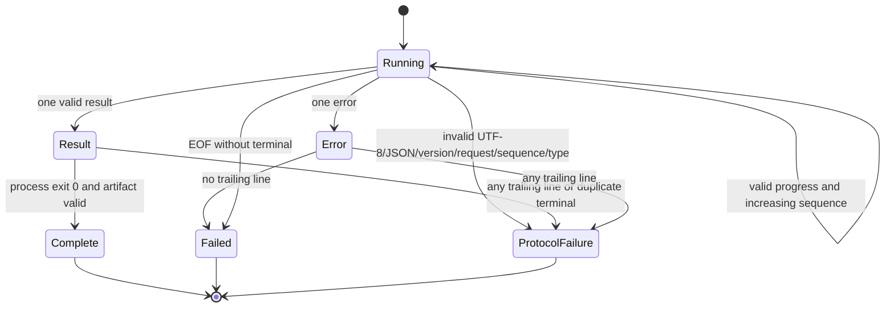

# Scanner plugin wire protocol 계약

기준일: 2026-08-04  
상태: macOS 구현에서 추출한 Windows 호환 명세  
범위: manifest schema 1, scan protocol 1과 2  
비범위: WIA/TWAIN 내부 API, installer, UI layout

코드 근거:

- `Sources/ScannerKit/Plugins/ScannerPluginManifest.swift`
- `Sources/ScannerKit/Backends/External/Backend/ExternalScannerBackend.swift`
- `Sources/ScannerKit/Backends/External/Backend/ExternalScannerBackend+Scan.swift`
- `Sources/ScannerKit/Backends/External/Backend/ScanEventSink.swift`
- `Sources/ScannerKit/Backends/External/Backend/ExternalScannerBackend+Options.swift`
- `Sources/ScannerKit/Backends/External/Backend/ExternalScannerBackend+Artifacts.swift`
- `Sources/ScannerKit/Backends/External/Process/LineBuffer.swift`
- `Sources/ScannerKit/Domain/ScanOptions.swift`
- `Tests/ScannerKitTests/ScannerPluginProtocolV2Tests.swift`

관련 문서:

- [plugin architecture](plugin-architecture.md)
- [plugin security and lifecycle](plugin-security-and-lifecycle.md)
- [hardware validation matrix](hardware-validation-matrix.md)

## 1. 이 문서의 규범

키워드 의미:

- **필수**: 위반하면 host가 요청 또는 결과를 거부해야 합니다.
- **금지**: 보내거나 수용하면 안 됩니다.
- **호환**: 기존 v1 plugin 때문에 유지하지만 새 adapter가 목표로 삼으면 안 됩니다.
- **권장**: v2 wire를 깨지 않는 운용 규칙입니다.
- **v3 후보**: 현재 wire에 넣으면 호환이 깨질 수 있어 차기 protocol에서 결정합니다.

Windows 신규 adapter는 manifest `protocolVersion: 2`를 사용합니다. v1은 기존 plugin 호환용입니다.

## 2. Transport

### 2.1 process 호출

| operation | argv | stdin | stdout | stderr |
|---|---|---|---|---|
| detect | `detect` | 없음 | one JSON document | diagnostics bytes |
| capabilities | `capabilities <deviceID>` | optional one JSON document | one JSON document | diagnostics bytes |
| scan | `scan` | one JSON document | newline-delimited JSON events | diagnostics bytes |

stdin JSON 뒤에는 추가 request frame을 보내지 않습니다. host는 write를 끝내고 pipe를 닫습니다. 하나의
process는 하나의 command만 처리하고 종료합니다.

### 2.2 encoding

- JSON text encoding은 UTF-8입니다.
- scan stdout의 각 event는 LF(`0x0A`)로 구분합니다.
- 마지막 event 뒤 LF는 권장하지만 host는 EOF의 non-empty final bytes도 한 줄로 처리합니다.
- invalid UTF-8 scan line은 protocol failure입니다.
- stdout에 BOM, banner, log, progress text를 섞지 않습니다.
- human diagnostics는 stderr에 씁니다.
- binary image data는 stdout/stderr에 쓰지 않습니다.

### 2.3 현재 byte limits

현재 macOS host의 기본 누적 상한:

| stream | limit |
|---|---:|
| stdout | 4 MiB |
| stderr | 1 MiB |

상한은 command lifetime 전체 누적 bytes입니다. plugin은 많은 작은 progress event도 총합을 넘기지
않아야 합니다.

Windows host 추가 방어:

- per-line byte limit
- maximum event count
- maximum JSON nesting depth
- maximum string length
- maximum array/map item count

이 추가 상한의 수치는 conformance corpus와 physical scan duration을 측정해 고정합니다. 기존 v2
plugin이 4 MiB 안에서 정상 동작하는 범위를 임의로 더 좁히지 않습니다.

### 2.4 exit semantics

성공 조건은 다음의 AND입니다.

- process launch 성공
- timeout/cancellation 없음
- stdout/stderr budget 위반 없음
- protocol parse/state validation 성공
- exit status 0
- command별 required response 존재
- scan artifact validation 성공

exit status 0만으로 성공하지 않습니다. valid result가 있어도 non-zero exit이면 실패합니다. error event가
있으면 exit status와 무관하게 실패입니다.

## 3. Manifest contract

```json
{
  "schemaVersion": 1,
  "protocolVersion": 2,
  "id": "negaflow.scanner.wia",
  "name": "Negaflow WIA Scanner",
  "executable": "negaflow-scanner-wia-x64.exe",
  "kind": "scanner",
  "license": "Apache-2.0",
  "homepage": "https://example.invalid/",
  "pluginVersion": "1.0.0"
}
```

### 3.1 fields

| field | type | required on wire | semantics |
|---|---|---:|---|
| `schemaVersion` | integer | yes | 현재 exact 1 |
| `protocolVersion` | integer | no | absent = 1, supported 1...2 |
| `id` | string | yes | plugin routing ID |
| `name` | string | yes | non-empty display name |
| `executable` | string | yes | non-empty relative path |
| `kind` | string/null | no | absent/null은 scanner, 다른 값 거부 |
| `license` | string/null | no | declaration, 법적 검증 대체 아님 |
| `homepage` | string/null | no | informational |
| `pluginVersion` | string/null | no | identity/update display |

### 3.2 exact version behavior

- `schemaVersion != 1`: discovery 거부
- `protocolVersion` absent 또는 null: v1
- `protocolVersion == 1`: v1
- `protocolVersion == 2`: v2
- 그 외: discovery 거부

host는 future version을 “가장 가까운 버전”으로 낮추지 않습니다.

### 3.3 ID grammar

```text
byte length: 1...64 UTF-8 bytes
first byte:  ASCII A-Z / a-z / 0-9
remaining:   ASCII A-Z / a-z / 0-9 / - / . / _
```

`:`는 `plugin:<pluginID>:<deviceID>` delimiter라서 금지입니다. Windows reserved name과
case-insensitive collision 검사는 host security profile에 추가합니다.

## 4. 중요한 분리: plugin wire와 Negaflow CLI envelope

현재 repository에는 다음 타입도 있습니다.

```json
{
  "schema": "negaflow.scanner-cli",
  "schemaVersion": 1,
  "command": "detect",
  "status": "ok",
  "payload": {},
  "error": null
}
```

이것은 `ScannerCLIEnvelope<Payload>`이며 Negaflow CLI 출력 형식입니다. 현재 external plugin host
wire가 아닙니다.

현재 실제 plugin response:

- detect: raw `PluginDetectResponse`
- capabilities: raw `PluginCapabilities`
- scan: raw `PluginScanEvent` NDJSON

Windows port가 detect/capabilities에 CLI envelope를 요구하면 기존 contract와 호환되지 않습니다.
envelope 통합은 v3 migration으로만 검토합니다.

## 5. Detect

### 5.1 request

```text
argv[1] = "detect"
stdin = closed, no payload
```

### 5.2 response

```json
{
  "devices": [
    {
      "id": "wia:{stable-adapter-id}",
      "displayName": "Scanner display name",
      "vendor": "Vendor",
      "model": "Model",
      "connectionType": "usb",
      "usbVendorID": "04b8",
      "usbProductID": "0151",
      "serialNumber": null,
      "verifiedStatus": "compatibleTarget",
      "driverVersion": "1.2.3"
    }
  ]
}
```

### 5.3 `PluginDevice`

| field | type |
|---|---|
| `id` | string |
| `displayName` | string |
| `vendor` | string |
| `model` | string |
| `connectionType` | string/null |
| `usbVendorID` | string/null |
| `usbProductID` | string/null |
| `serialNumber` | string/null |
| `verifiedStatus` | string/null |
| `driverVersion` | string/null |

Swift synthesized decoder 기준으로 non-optional 네 필드는 필수입니다. Windows host도 같은 의미를
유지합니다.

정규화:

- host는 ID 앞에 `plugin:<pluginID>:`를 붙입니다.
- 같은 detect response 안의 중복 routed ID는 첫 항목만 남기는 현재 동작이 있습니다.
- Windows 구현 목표는 duplicate를 diagnostics에 기록하고 plugin defect로 취급하는 것입니다.
- unknown `connectionType`은 현재 `usb` fallback입니다.
- unknown/absent `verifiedStatus`는 현재 `compatibleTarget` fallback입니다.
- absent `driverVersion`은 현재 plugin name fallback입니다.

마지막 세 fallback은 acquisition evidence가 아닙니다. Windows diagnostics에는 raw/normalized 값을
구분해서 남깁니다.

### 5.4 detect가 증명하지 않는 것

- device open 가능
- film/transparency source
- selectable DPI
- 16-bit transfer
- IR
- multi-exposure
- exact ROI
- color correction off
- physical hardware 검증

## 6. Capabilities

### 6.1 request

command line:

```text
capabilities <internal-device-id>
```

host가 직전 detect descriptor를 가지고 있으면 stdin에 다음 JSON을 보냅니다.

```json
{
  "deviceID": "wia:{internal-id}",
  "vendor": "Vendor",
  "model": "Model"
}
```

detect cache가 없으면 현재 host는 stdin을 생략할 수 있습니다. 신규 v2 adapter는 command-line
device ID만으로도 query할 수 있어야 하며, identity payload가 있으면 reconnect/model disambiguation에
사용합니다. vendor/model을 security identity로 사용하면 안 됩니다.

### 6.2 response

```json
{
  "resolutionsDPI": [1200, 2400, 3600],
  "modes": ["color", "gray"],
  "bitDepths": [8, 16],
  "sourceModes": ["Transparency"],
  "transparencyModes": ["Color Negative", "Slide"],
  "supportsPreview": true,
  "supportsTransparency": true,
  "supportsInfrared": false,
  "supportsMultiExposure": false,
  "supportsScanArea": true,
  "supportsPositionedScanArea": true,
  "brightnessRange": {
    "minimum": -100,
    "maximum": 100,
    "step": 1
  },
  "contrastRange": null,
  "hardwareExposureRange": null,
  "scanOriginXRange": {
    "minimum": 0,
    "maximum": 200,
    "step": 0.01
  },
  "scanOriginYRange": {
    "minimum": 0,
    "maximum": 250,
    "step": 0.01
  },
  "scanWidthRange": {
    "minimum": 1,
    "maximum": 200,
    "step": 0.01
  },
  "scanHeightRange": {
    "minimum": 1,
    "maximum": 250,
    "step": 0.01
  },
  "disabledReasons": {
    "infrared": "Driver did not report an infrared source"
  },
  "minScanAreaWidthMM": 1,
  "minScanAreaHeightMM": 1,
  "minScanAreaOriginXMM": 0,
  "minScanAreaOriginYMM": 0,
  "maxScanAreaWidthMM": 200,
  "maxScanAreaHeightMM": 250,
  "maxScanAreaOriginXMM": 0,
  "maxScanAreaOriginYMM": 0,
  "scanAreaUnit": "millimeter",
  "outputFormats": ["tiff"],
  "capabilityToken": "opaque-adapter-snapshot"
}
```

### 6.3 required fields

현재 synthesized decoder에서 필수:

- `resolutionsDPI`
- `modes`
- `bitDepths`

나머지는 optional입니다. absent boolean은 false로 normalize합니다.

### 6.4 enum values

`modes`의 recognized values:

- `color`
- `gray`
- `lineart`
- `infrared`

`bitDepths`의 recognized values:

- `8`
- `16`

`scanAreaUnit`:

- `millimeter`
- `inch`
- `pixel`

unknown mode/depth는 dropped됩니다. unknown scan area unit이면 scan area 지원이 false로
normalize됩니다.

### 6.5 positioned area gate

`supportsPositionedScanArea`가 true가 되려면 모두 필요합니다.

- normalized `supportsScanArea == true`
- raw `supportsPositionedScanArea == true`
- `scanOriginXRange`
- `scanOriginYRange`
- `scanWidthRange`
- `scanHeightRange`

boolean 하나만으로 origin control을 노출하지 않습니다.

### 6.6 capability token

- v2 capabilities에서 받은 non-empty token만 host cache에 둡니다.
- key는 routed scanner ID입니다.
- detect를 다시 하면 모든 token을 지웁니다.
- v1에서는 cache하지 않습니다.
- v2 scan request에 같은 device token을 그대로 넣습니다.
- host는 decode, log, mutate, compare 의미를 알지 못합니다.

adapter가 token을 stale로 판정하면 stable capability-changed error를 내고 host가 capabilities를
refresh하게 합니다.

## 7. Scan request

### 7.1 v2 example

```json
{
  "protocolVersion": 2,
  "requestID": "7A91B43D-90F8-41E2-B71D-04D17CD9E03B",
  "deviceID": "wia:{internal-id}",
  "resolutionDPI": 3600,
  "bitDepth": 16,
  "colorMode": "color",
  "filmType": "colorNegative",
  "preview": false,
  "multiExposure": false,
  "infrared": false,
  "brightnessAdjustment": null,
  "contrastAdjustment": null,
  "scanArea": {
    "originXMM": 0,
    "originYMM": 0,
    "widthMM": 36,
    "heightMM": 24
  },
  "hardwareExposureTime": null,
  "outputRawTIFF": true,
  "capabilityToken": "opaque-adapter-snapshot",
  "outputPath": "C:\\...\\.negaflow-scan-uuid\\frame.tiff"
}
```

### 7.2 fields

| field | v1 | v2 | semantics |
|---|---:|---:|---|
| `protocolVersion` | omitted | 2 | scan protocol |
| `requestID` | omitted | UUID | job correlation |
| `deviceID` | required | required | adapter internal ID |
| `resolutionDPI` | required | required | 0 means preview |
| `bitDepth` | required | required | 8 or 16 |
| `colorMode` | required | required | enum string |
| `filmType` | required | required | enum string |
| `preview` | required | required | requested route |
| `multiExposure` | required | required | capability-gated |
| `infrared` | required | required | capability/film-gated |
| `brightnessAdjustment` | optional/null | optional/null | backend normalized value |
| `contrastAdjustment` | optional/null | optional/null | backend normalized value |
| `scanArea` | optional type, host sends | host sends | millimeter coordinates |
| `hardwareExposureTime` | optional/null | optional/null | unit is adapter capability contract |
| `outputRawTIFF` | optional type, host sends | host sends | desired raw TIFF behavior |
| `capabilityToken` | omitted | optional/null | opaque snapshot |
| `outputPath` | required | required | exact host staging path |

### 7.3 film type

recognized values:

- `colorNegative`
- `colorPositive`
- `bwNegative`
- `bwPositive`

### 7.4 preview

현재 product convention:

- preview request는 `preview: true`
- `resolutionDPI: 0`
- 일반 preview helper는 8-bit color, IR off, `outputRawTIFF: false`

adapter가 실제 backend에서 0 DPI를 설정하라는 뜻이 아닙니다. adapter가 capability에 따라 preview
route를 선택하되 result applied resolution은 protocol convention상 0이어야 합니다. 실제 acquisition
DPI를 provenance에 추가해야 한다면 v3 field가 필요합니다.

### 7.5 output path

adapter:

- exact path에 새 파일을 생성합니다.
- parent directory 밖으로 redirect하지 않습니다.
- 기존 파일을 overwrite하지 않습니다.
- temp extension을 임의로 바꾸지 않습니다.
- stdout result의 `path`에 같은 path를 반환합니다.
- successful terminal event 전에 handle을 flush/close합니다.

Windows host는 case-folded string 비교만으로 보안을 결론내지 않고 opened handle의 final path/file
identity를 검증합니다.

## 8. Scan event stream

공통 shape:

```json
{
  "type": "progress",
  "protocolVersion": 2,
  "requestID": "7A91B43D-90F8-41E2-B71D-04D17CD9E03B",
  "sequence": 0,
  "phase": "scanningRGB",
  "fraction": 0.5,
  "message": "Scanning"
}
```

`PluginScanEvent` fields:

- `type`
- `protocolVersion`
- `requestID`
- `sequence`
- `phase`
- `fraction`
- `message`
- `width`
- `height`
- `path`
- `resolutionDPI`
- `bitDepth`
- `irPath`
- `hasInfrared`
- `warnings`
- `appliedOptions`

### 8.1 v2 event identity

모든 v2 event에 필수:

- `protocolVersion == 2`
- `requestID == request.requestID`
- `sequence` present

`sequence`는 `UInt64`이며 직전 값보다 엄격히 커야 합니다. 현재 host는 첫 sequence가 0일 것을
강제하지 않습니다. 신규 adapter는 0부터 1씩 증가시키는 것을 권장하지만, host conformance는
“present and strictly increasing”이 정확한 v2 규칙입니다.

### 8.2 event types

허용:

- `progress`
- `result`
- `error`

v2 unknown type은 protocol failure입니다. v1 unknown type은 현재 무시되는 compatibility behavior가
있습니다.

### 8.3 progress

recognized phases:

- `idle`
- `connecting`
- `warmingLamp`
- `ready`
- `previewScanning`
- `waitingForFilmHolder`
- `scanningRGB`
- `scanningIR`
- `processingNegative`
- `renderingLook`
- `exporting`
- `complete`
- `scannerBusy`
- `disconnected`
- `error`
- `backendFallbackActive`

현재 host는 unknown/missing phase를 `scanningRGB`로 normalize하고, missing message를 empty string으로
만듭니다. 현재 sink는 fraction의 finite 또는 0...1 범위를 검증하지 않습니다.

Windows compatibility:

- unknown phase의 current fallback을 유지하되 diagnostics에 protocol warning 기록
- non-finite JSON number는 parser가 거부
- fraction <0 또는 >1은 UI에 그대로 적용하지 않고 clamp/indeterminate 정책 사용
- v3에서 phase/fraction strict validation 여부 결정

`backendFallbackActive`가 Mock fallback을 허용하는 뜻은 아닙니다. adapter 내부에서 명시적으로
보고한 상태일 뿐이며 product policy가 허용한 route만 사용합니다.

### 8.4 terminal result

```json
{
  "type": "result",
  "protocolVersion": 2,
  "requestID": "7A91B43D-90F8-41E2-B71D-04D17CD9E03B",
  "sequence": 8,
  "width": 5102,
  "height": 3401,
  "path": "C:\\...\\frame.tiff",
  "resolutionDPI": 3600,
  "bitDepth": 16,
  "hasInfrared": false,
  "irPath": null,
  "warnings": [],
  "appliedOptions": {
    "deviceID": "wia:{internal-id}",
    "resolutionDPI": 3600,
    "bitDepth": 16,
    "colorMode": "color",
    "filmType": "colorNegative",
    "scanArea": {
      "originXMM": 0,
      "originYMM": 0,
      "widthMM": 36,
      "heightMM": 24
    },
    "infrared": false,
    "multiExposure": false,
    "hardwareExposureTime": null,
    "brightnessAdjustment": null,
    "contrastAdjustment": null,
    "outputRawTIFF": true
  }
}
```

v2 stream에는 정확히 하나의 terminal event가 있어야 합니다. result 뒤 같은 result, error, progress,
unknown line 모두 failure입니다.

### 8.5 terminal error

```json
{
  "type": "error",
  "protocolVersion": 2,
  "requestID": "7A91B43D-90F8-41E2-B71D-04D17CD9E03B",
  "sequence": 8,
  "message": "Scanner disconnected"
}
```

empty/whitespace message도 성공이 아니라 generic plugin scan error입니다. error 뒤 event는
protocol failure입니다. adapter는 가능하면 stable code를 전달해야 하지만 현재 event schema에는
error code field가 없습니다. v3 후보입니다.

## 9. `appliedOptions`

### 9.1 required keys

v2 result에 모두 필요:

- `deviceID`
- `resolutionDPI`
- `bitDepth`
- `colorMode`
- `filmType`
- `scanArea`
- `infrared`
- `multiExposure`
- `hardwareExposureTime`
- `brightnessAdjustment`
- `contrastAdjustment`
- `outputRawTIFF`

`hardwareExposureTime`, `brightnessAdjustment`, `contrastAdjustment`은 값이 optional이지만 **key는
필수**입니다. 미적용이면 JSON `null`을 씁니다. key omission은 decode failure입니다.

### 9.2 value validity

- device ID non-empty and request device exact match
- full scan resolution > 0
- preview resolution == 0
- bit depth is 8 or 16
- color mode recognized
- film type recognized
- scan origin finite and >= 0
- scan width/height finite and > 0
- hardware exposure null or > 0
- brightness/contrast null or finite

### 9.3 request-to-applied match

exact match:

- device ID
- resolution
- bit depth
- color mode
- film type
- infrared
- multi-exposure
- hardware exposure
- brightness
- contrast
- output raw TIFF

scan area:

- origin X exact
- origin Y exact
- width exact
- `abs(requestedHeight - appliedHeight) < 1 mm`

현재 height-only sub-millimeter allowance는 backend의 scan-height alignment 우회 때문에 존재합니다.
1 mm 이상 차이, shifted origin, widened ROI는 실패입니다. floating-point wire 값의 exact comparison은
새 adapter가 request 값을 단위 변환 후 다시 만들지 말고 원본 contract 값과 read-back evidence를
명확히 관리해야 함을 뜻합니다.

backend가 다른 값을 적용해야 한다면 조용히 echo하지 않고 요청을 unsupported로 실패시킵니다.

### 9.4 result-to-applied match

필수:

- `result.resolutionDPI == applied.resolutionDPI`
- `result.bitDepth == applied.bitDepth`
- `result.hasInfrared == applied.infrared`

### 9.5 applied evidence의 의미

v2 verified는 “adapter가 JSON을 echo했다”만 뜻하지 않습니다.

```text
requested wire
    == appliedOptions
    == result metadata
    == decoded artifact facts
```

host의 검증을 모두 통과한 뒤에만 `AppliedScanOptionsEvidence.verified`입니다.

## 10. RGB artifact validation

### 10.1 all versions

- result path present
- normalized path equals host expected staged path
- file exists
- regular file
- symbolic link/reparse point 아님
- size > 0
- image container open 가능
- first image decode 가능
- positive width, height, bits per component
- small thumbnail decode도 성공

### 10.2 v2 additional

- container type TIFF
- result width/height present and > 0
- result width/height == decoded width/height
- decoded bits per component == applied bit depth
- applied color `color` -> decoded RGB model
- applied `gray`, `lineart`, `infrared` -> decoded monochrome model

Windows에서는 WIC와 libtiff 양쪽으로 container/header/decode 검증을 교차할지 spike합니다. WIC가
decode했다고 profile/sample semantics를 자동 신뢰하지 않습니다.

## 11. IR artifact validation

### 11.1 IR not requested

다음을 모두 금지:

- `irPath` present
- `hasInfrared == true`
- `appliedOptions.infrared == true`

### 11.2 IR requested

- `irPath` 필수
- `hasInfrared != false`
- v2 path는 host staging directory 안
- regular, non-link, non-empty, decodable image
- IR width/height == RGB width/height

현재 v2는 IR artifact의 TIFF type, bits per component, monochrome model을 RGB만큼 강하게 검사하지
않습니다. Windows port에서 같은 v2를 더 엄격히 거부하면 cross-platform acceptance가 달라질 수
있습니다. 다음을 v3 필드/규칙으로 명시하는 것이 안전합니다.

- IR sample type
- bit depth
- channel count
- geometric registration
- pixel orientation
- profile/linear meaning
- RGB/IR transform relation

### 11.3 v1 legacy exception

v1은 IR path가 host staging 밖이어도 현재 허용합니다. compatibility일 뿐 새 adapter가 따라야 할
설계가 아닙니다. Windows v1 support를 제공할 경우 path 보안과 cleanup 한계를 UI/diagnostics에
표시하고, v2 migration을 우선합니다.

## 12. v1 behavior

### 12.1 request

`protocolVersion`과 `requestID` key를 **생략**합니다. null을 넣는 것이 아닙니다. capability token도
전송하지 않습니다.

### 12.2 events

- version/request/sequence가 없어도 됨
- invalid JSON line은 현재 무시될 수 있음
- unknown event type은 현재 무시됨
- duplicate result는 실패
- result가 없으면 실패
- result path/artifact는 검증
- IR request/result contract는 검증

### 12.3 provenance

v1 result의 valid report:

- full resolution은 positive integer
- preview resolution은 exactly 0
- bit depth는 8 또는 16

valid report가 있으면 operational resolution/bit depth에 사용합니다. missing/invalid이면 requested
value를 operational fallback으로 쓸 수 있지만 다음은 null로 둡니다.

- `reportedResolution`
- `reportedBitDepth`

그리고:

```text
appliedOptionsEvidence = unknownLegacy(protocolVersion: 1)
```

요청 fallback은 실제 적용 증거가 아닙니다.

## 13. State machine

### 13.1 v2



protocol failure가 확인되면 non-exiting plugin을 timeout까지 방치하지 않고 stop path를 요청합니다.

### 13.2 completion ordering

process termination callback과 final pipe readability callback은 순서가 고정되지 않습니다. host는:

1. 새 callback 등록을 닫고
2. in-flight reader가 끝날 때까지 기다리고
3. 현재 도착한 bytes를 non-blocking drain하고
4. final partial line을 flush한 뒤
5. terminal state를 판정합니다.

마지막 result를 빠르게 쓰고 즉시 exit하는 plugin을 놓치면 안 됩니다.

## 14. Timeout and cancellation

현재 wall-time policy:

- detect 90 seconds
- capabilities 180 seconds
- scan 7,200 seconds
- fallback 60 seconds

grace period:

- detect/capabilities 2 seconds
- scan 5 seconds
- fallback 1 second

Windows adapter에는 graceful cancel control을 별도 설계할 수 있지만 stdout protocol event와 섞지
않습니다. 최소 요구:

- user cancellation이 host task에 반영
- adapter device cancellation attempt
- bounded grace
- Job Object process tree termination
- pipe drain/close
- staging cleanup
- completion wait 뒤 다음 job 허용

## 15. Error normalization

현재 scan error event는 message만 가집니다. Windows implementation은 내부적으로 다음 구조를
유지하되 wire v2에는 안전한 message만 보냅니다.

```text
stable category
backend kind
native code
retryable
requires user intervention
device may need reopen
safe localized message key
diagnostic detail
```

v3 후보:

```json
{
  "type": "error",
  "protocolVersion": 3,
  "requestID": "...",
  "sequence": 4,
  "error": {
    "code": "deviceBusy",
    "message": "Scanner is busy",
    "retryable": true,
    "nativeDomain": "WIA",
    "nativeCode": "0x80210006"
  }
}
```

v2에 이 shape를 무단 요구하지 않습니다.

## 16. Compatibility fixture corpus

language-neutral fixture directory 제안:

```text
scanner-protocol-fixtures/
    manifest/
        valid-v1.json
        valid-v2.json
        unsupported-schema.json
        invalid-id.json
    detect/
        empty.json
        one-device.json
        duplicate-device-id.json
    capabilities/
        minimal.json
        full.json
        invalid-unit.json
        incomplete-positioned-area.json
    scan-v1/
        valid.ndjson
        invalid-report-fallback.ndjson
        external-ir.ndjson
    scan-v2/
        valid.ndjson
        preview.ndjson
        missing-version.ndjson
        wrong-request-id.ndjson
        missing-sequence.ndjson
        duplicate-sequence.ndjson
        event-after-result.ndjson
        missing-applied-key.ndjson
        changed-option.ndjson
        invalid-tiff.ndjson
        outside-ir-path.ndjson
    artifacts/
        rgb-8.tiff
        rgb-16.tiff
        gray-16.tiff
        wrong-depth.tiff
        wrong-size-ir.tiff
```

Swift host와 Windows host가 각 fixture에 같은 accept/reject class를 내야 합니다.

## 17. Required conformance cases

### 17.1 manifest

- exact schema/protocol versions
- absent protocol -> v1
- future protocol rejected
- colon/leading punctuation/non-ASCII/65-byte ID rejected
- empty name/executable rejected

### 17.2 v1

- version/request keys omitted
- valid reported values separate from fallback
- exactly one result
- missing/zero/non-regular/undecodable/unexpected raw path
- requested/unrequested IR combinations

### 17.3 v2 stream

- generated and caller-provided UUID
- version/request match on every event
- sequence present and strictly increasing
- duplicate result
- progress/error after result
- progress after error
- unknown type
- invalid UTF-8
- total stdout/stderr overflow
- protocol violation stops hung child

### 17.4 applied values

- each scalar mismatch
- missing optional key versus explicit null
- invalid depth/mode/film type
- preview/full resolution mismatch
- invalid scan area
- sub-millimeter height allowance
- shifted origin/width/height >=1 mm rejection
- result/applied mismatch

### 17.5 artifacts

- TIFF requirement
- width/height match
- depth match
- RGB/monochrome model match
- IR path containment
- RGB/IR dimension match
- pre-existing final destination
- cancel cleanup
- fast terminal/exit race

## 18. Fuzzing

Windows host fuzz targets:

- manifest JSON decoder
- device/capability JSON decoder
- NDJSON line splitter
- event decoder
- UUID and UInt64 boundaries
- deeply nested/large JSON
- invalid UTF-8 boundaries split across pipe reads
- path normalization
- Windows drive, UNC, NT object, ADS, trailing dot/space cases
- TIFF metadata parser

Fuzzer가 executable을 실제 launch할 필요는 없습니다. parser/state machine/artifact validator를 pure
test surface로 분리합니다.

## 19. Protocol evolution

v3가 필요한 변화:

- detect/capabilities envelope와 request correlation
- structured error code
- explicit cancellation/control channel
- IR artifact semantics
- actual backend acquisition DPI for preview
- scanner input ICC/profile bytes or digest contract
- frame manifest and per-file hashes
- limits/capability schema negotiation
- multiple output frames

v3 migration 원칙:

1. manifest가 exact protocol 3을 선언
2. host가 1...3을 명시 지원
3. v1/v2 fixtures 유지
4. v3 adapter가 v2 event를 섞지 않음
5. downgrade는 adapter manifest가 별도 executable/entry를 제공할 때만
6. unknown field tolerance와 required field semantics를 schema로 고정

## 20. Windows port acceptance gate

- C++/C# decoder가 Swift fixture 결과와 일치
- v1 omitted-vs-null serialization 일치
- UUID format/case 차이가 value comparison을 깨지 않음
- `UInt64` sequence overflow를 안전하게 거부
- JSON number를 locale-independent parse
- Windows path 비교가 protocol equality와 security identity를 구분
- stdout/stderr 동시 drain
- exit/final-line race 재현 test pass
- timeout/cancel 후 child와 descendant가 남지 않음
- untrusted output이 final catalog path를 선택하지 못함
- v2 verified evidence가 artifact 검증 전 생성되지 않음

## 21. 알려진 현재 한계

- detect/capabilities response 자체에는 schema/version/request ID가 없습니다.
- event error에 stable code가 없습니다.
- progress fraction strict range가 wire에서 강제되지 않습니다.
- first sequence가 0인지 강제하지 않습니다.
- IR artifact semantics가 RGB보다 약합니다.
- scan area height에만 1 mm 미만 tolerance가 있습니다.
- v1 external IR path compatibility는 Windows path threat model과 충돌합니다.
- capability token의 maximum length가 별도 field limit으로 고정되지 않았습니다.

이 한계를 Windows host가 추측으로 메우지 않습니다. v2 compatibility layer와 v3 proposal을 분리합니다.
