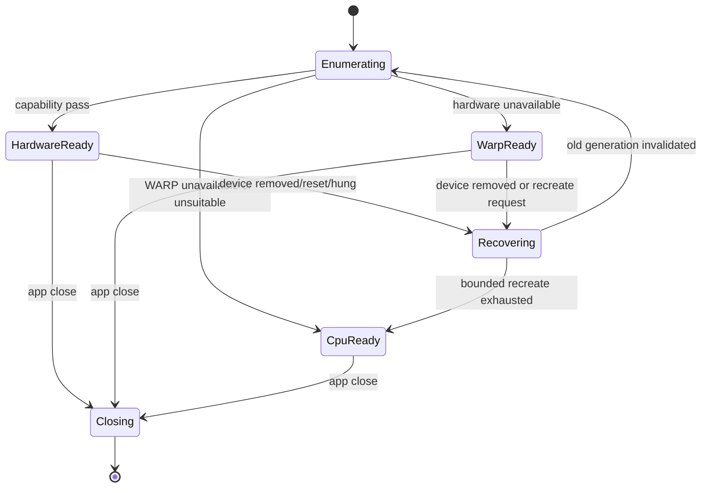
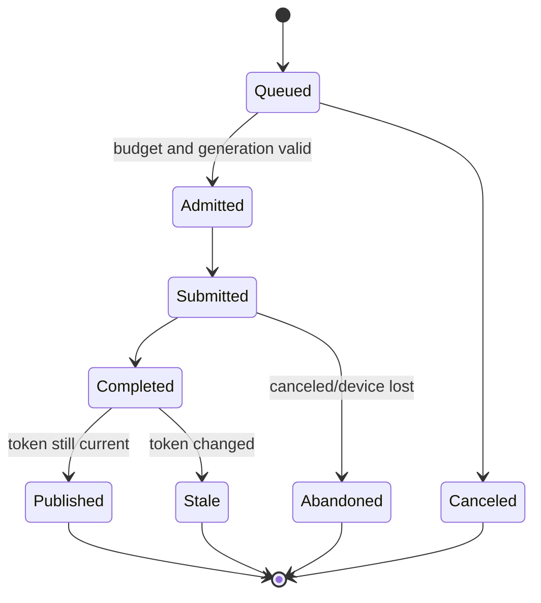

# Windows 렌더·성능 실패 모드와 복구 계약

> 상태: Windows 구현 전 위험 등록부·fault-injection 기준  
> 기준일: 2026-08-04  
> macOS source 기준: `9be909c43edd7e04ba98cdc9d6a0c688739e343e`  
> 적용 범위: D3D11, Direct2D, DirectCompute, WARP, CPU SIMD, WinUI 3 canvas, export

## 0. 결론

Windows판의 성능 실패는 단순히 “GPU가 느리다”로 묶지 않는다. 같은 증상이라도 adapter 선택,
video-memory budget, 숨은 Direct2D intermediate precision, 긴 dispatch, device removal, stale async
publish, 색 관리, 파일 publish 중 어느 계층에서 실패했는지에 따라 복구가 다르다.

이 문서의 기본 계약은 다음과 같다.

- 기능과 출력 의미는 Intel·AMD·NVIDIA·Qualcomm, WARP, x64·ARM64에서 같다.
- backend 전환은 품질 저하 기능이 아니다. 같은 recipe를 처음부터 다시 실행한다.
- GPU 일부 결과와 CPU 일부 결과를 조용히 섞어 성공으로 반환하지 않는다.
- preview와 export는 같은 stage 의미·parameter·color contract를 소비한다.
- device-dependent object는 한 `device_generation`에 속한다. 세대가 바뀌면 전부 폐기한다.
- UI에 publish하기 직전 `frame_id + recipe_revision + request_generation`을 다시 확인한다.
- GPU 성공 뒤 encoder·filesystem·catalog가 실패할 수 있다. render 성공을 export 성공으로 부르지 않는다.
- 오류 메시지는 vendor를 탓하는 문장이 아니라 실패 계층, 복구 선택, 보존된 상태를 설명한다.
- Windows TDR registry 변경, GPU 비활성화, 보안 기능 해제를 제품 해결책으로 안내하지 않는다.

현재 Windows 구현이 없으므로 아래 항목은 **검증된 Windows 결함 목록이 아니라 구현 전에 닫아야 할
failure contract**다. 실제 발생률과 성능 budget은 x64·ARM64 실기 matrix에서 측정한다.

---

## 1. macOS source에서 반드시 이어받을 방어

### 1.1 무거운 render context 재사용

`Sources/Chromabase/Engine/SamplingContextPool.swift`는 작은 read-back마다 `CIContext`를 다시 만들던
과거 경로가 GPU 자원 누적과 렌더 실패를 일으켰다고 기록한다. 현재는 working color space별 context를
lock으로 한 번 만들고 재사용하며 intermediate cache를 끈다.

Windows 등가 계약:

- adapter/device generation마다 D3D11 device, immediate-context owner, D2D device/context pool을 재사용
- frame·slider event마다 device, factory, shader, effect registration을 생성하지 않음
- display, sampling, export가 공유할 수 있는 immutable 자산과 공유하면 안 되는 mutable context를 구분
- working/output color contract가 다른 context를 단순 성능 이유로 합치지 않음
- device lost 때만 generation 전체를 교체하고 이전 COM pointer를 새 generation에 전달하지 않음

### 1.2 요청 조절과 동시 실행 제한

`DevelopController.swift`에는 다음 현재 계약이 있다.

- interactive develop 요청 throttle: `0.045`초
- 기본 동시 develop slot: `3`
- pending throttle/task 취소
- 취소 가능한 slot wait
- frame별 중복 현상 방지

Windows는 숫자를 무조건 복사하지 않는다. 다만 다음 의미는 보존한다.

- pointer event rate가 render submission rate를 결정하지 않음
- interactive latest-wins queue와 committed full-quality queue를 분리
- CPU core 수나 GPU queue 수만큼 무제한 frame을 동시에 현상하지 않음
- 취소된 요청은 slot, reservation, progress를 반드시 반환
- 45ms와 동시 3개는 baseline 관찰값이며 Windows P95 latency·memory 측정으로 조정

### 1.3 stale result 방어

`AppModel+TransformRendering.swift`는 interactive proxy와 settled full render를 나누고 다음을 재검사한다.

- task cancellation
- `transformRevision`
- `softProofConfigurationRevision`
- settle window 뒤 current transform
- 현재 frame이 소유한 cached base

Windows publication token 최소값:

```text
frame_id
source_identity
recipe_revision
transform_revision
proof_revision
request_generation
device_generation
surface_generation
```

GPU fence 완료는 publish 권리의 증거가 아니다. 위 token이 현재 state와 모두 일치해야 XAML bitmap,
swap-chain texture, thumbnail cache, export staging으로 승격한다.

### 1.4 export는 render보다 긴 transaction

`AppModel+Export.swift`는 destination reservation, source materialization, cleaned-raw identity,
source generation, artifact journal, catalog commit, read-back, rollback/blocked state를 분리한다.

Windows는 다음 완료 단계를 따로 기록한다.

```text
planned
source_ready
rendered_to_staging
encoded_and_flushed
published
catalog_committed
journal_completed
```

`rendered_to_staging` 이후의 실패를 GPU 실패로 기록하지 않는다. 반대로 파일이 생겼어도 catalog와
journal이 불명확하면 완전한 성공으로 표시하지 않는다.

---

## 2. 공통 분류와 심각도

| 등급 | 의미 | 출시 처리 |
|---|---|---|
| Blocker | 원본·recipe·catalog 손실, 잘못된 결과 성공 반환, 전 기능 경로 부재 | Stable 금지 |
| High | 일반 hardware에서 crash/hang, 반복 device lost, preview/export 눈에 보이는 불일치 | 해당 조합 지원 금지 또는 수정 |
| Medium | 복구 가능한 성능 급락, cache 재생성, 명확한 일시 오류 | known issue와 복구 UX 필요 |
| Low | 진단 부족, 일시적 animation hitch, 비핵심 최적화 미달 | 측정·backlog 가능 |

failure record 최소 필드:

```text
failure_id
severity
operation_id
frame_id_hash
request_generation
device_generation
backend
adapter_luid_hash
vendor_id / device_id
driver_version
feature_level
HRESULT_or_domain_code
stage_id
recovery_attempted
recovery_result
artifact_state
elapsed_ms
peak_budget_usage
```

사용자 파일명·절대 경로·사진 내용·ICC payload는 기본 진단 event에 넣지 않는다.

---

## 3. F-001 — OS preference와 다른 adapter 선택

**심각도:** High  
**표면:** startup, hybrid GPU, eGPU, 다중 모니터

### 실패

- 첫 enumerated adapter가 사용자가 기대한 adapter라고 가정
- 전용 VRAM이 가장 큰 adapter를 무조건 선택
- Microsoft Basic Render Driver를 hardware로 분류
- 저장한 ordinal `0`, `1`을 영속 identity로 사용
- 사용자가 Windows Graphics settings에서 선택한 preference를 앱 설정이 조용히 뒤집음

`IDXGIFactory6::EnumAdapterByGpuPreference`는 지정한 preference 순서로 adapter를 열거한다. 이는
“가장 큰 dedicated memory가 항상 정답”이라는 계약이 아니다. hybrid laptop에서는 render adapter와
display 연결 adapter가 다를 수 있다.

### 방어

1. 기본은 OS preference를 반영한 `UNSPECIFIED` 또는 승인된 product preference 순서로 열거한다.
2. 각 adapter에서 LUID, vendor/device/subsystem/revision, software flag, memory budget, feature/format을 query한다.
3. feature gate를 통과한 첫 adapter를 선택하고 선택 이유를 기록한다.
4. 사용자의 명시적 선택은 ordinal이 아니라 LUID+hardware identity hint로 저장한다.
5. 저장한 adapter가 사라지면 자동 정책으로 돌아가고 사용자에게 non-blocking 상태를 알린다.
6. 실제 display swap chain과 offscreen export가 다른 adapter를 쓸 필요가 있는지는 copy 비용을 측정한 뒤 결정한다.

### 금지

- “내장 GPU를 장치 관리자에서 끄세요”를 정상 해결책으로 안내
- vendor control panel registry를 앱이 수정
- adapter 이름 문자열에 `NVIDIA`, `AMD`, `Intel`이 있는지만 보고 기능 결정

### gate

- Intel+iGPU/NVIDIA, Intel+iGPU/AMD, AMD APU+dGPU, Qualcomm, eGPU 연결·분리
- monitor가 iGPU와 dGPU에 각각 연결된 desktop
- Windows graphics preference 변경 전후 clean restart
- 선택 adapter와 실제 device LUID 일치

---

## 4. F-002 — video memory를 물리 VRAM 숫자로만 판단

**심각도:** High  
**표면:** 50–100MP, panorama, multi-frame export, hybrid GPU

### 실패

`DedicatedVideoMemory`가 크다는 이유로 수십 장의 full-resolution texture와 cache를 계속 resident로
둔다. 다른 앱·Desktop Window Manager가 memory를 사용하면 process budget은 크게 바뀔 수 있다.
budget을 넘으면 allocation failure뿐 아니라 간헐적인 process stall이 나타날 수 있다.

### 방어

- `IDXGIAdapter3::QueryVideoMemoryInfo`의 current budget과 usage를 작업 admission에 사용
- `RegisterVideoMemoryBudgetChangeNotificationEvent`로 변화가 있을 때 cache budget 재평가
- local/non-local segment를 구분하고 UMA에서 dedicated VRAM식 공식을 쓰지 않음
- texture byte 추정은 width×height뿐 아니라 format, mip, row alignment, halo, transient, read-back을 포함
- hard limit 전에 soft watermark에서 derived cache를 LRU로 축소
- source/recipe와 재구성 가능한 cache를 구분해 recipe를 eviction하지 않음
- 한 job이 admission을 통과한 뒤에도 phase별 peak를 기록

### 복구

1. 새 interactive request admission 중단
2. 재구성 가능한 old-generation/hidden-frame cache eviction
3. tile size와 in-flight 수 축소
4. 현재 job을 시작부터 같은 backend 또는 CPU로 재시도
5. 반복 실패 시 사용자에게 memory pressure와 보존된 recipe를 설명

quality나 bit depth를 자동으로 낮추는 것은 복구가 아니다.

---

## 5. F-003 — preview와 export의 의미 분기

**심각도:** Blocker  
**표면:** Develop, Quick Export, 일반 Export, Print

### 실패

- preview 전용 수식과 export 전용 수식이 따로 진화
- preview가 proof/display transform을 baked한 cache를 export 입력으로 사용
- 축소 preview에서 측정한 histogram·film base를 full image 결과의 정본으로 사용
- CPU fallback에서 grain seed, border, clamp 순서가 달라짐
- output sharpening을 preview에는 적용하지 않거나 다른 scale로 적용

### 방어

하나의 canonical graph가 다음을 parameter로 받는다.

```text
source identity
recipe and algorithm version
render intent: interactive | settled | export | print
requested extent and scale
working/output/proof profile identity
backend capability plan
deterministic seed domain
```

render intent는 해상도·ROI·presentation destination을 바꿀 수 있지만 adjustment 의미나 stage 순서를
임의로 바꾸지 않는다. 의도된 차이는 baseline manifest와 tolerance에 기록한다.

### gate

- 동일 source/recipe의 settled preview와 full export를 동일 해상도로 비교
- hardware D3D11, WARP, CPU 결과의 absolute/relative/Delta E/edge tolerance
- 일반 Export·Quick Export·Print 경로 각각 검증
- proof/gamut/clipping overlay가 export 픽셀에 새지 않음

---

## 6. F-004 — Direct2D intermediate precision과 clipping drift

**심각도:** Blocker  
**표면:** extended-range linear pipeline, negative inversion, highlight, color matrix

Microsoft 문서상 Direct2D는 effect graph를 여러 구간으로 나눌 수 있고 intermediate texture의 위치를
보장하지 않는다. GPU capability와 Windows version에 따라 분할이 달라질 수 있다. 기본 precision에서
extended-range 값이 잘리면 shader가 모두 맞아도 결과가 달라진다.

### 방어

- device 생성 직후 `IsBufferPrecisionSupported(32BPC_FLOAT)`를 필수 capability로 확인하거나 명시적 대체 경로 결정
- `SetRenderingControls`와 effect/transform precision policy를 한 곳에서 적용
- clamp가 제품 의미인 stage만 명시적으로 clamp
- shader linking on/off가 수치 의미를 바꾸지 않는 corpus 유지
- premultiplied/unpremultiplied 영역을 구분해 `[0,1]` 범위 판단
- NaN/Inf/negative/extended highlight probe를 포함

### 잘못된 복구

- 특정 driver에서만 결과가 다르다는 이유로 tolerance를 크게 늘림
- preview target을 8-bit로 바꾸고 “화면에서는 티가 안 난다”고 종료
- 모든 stage 뒤 clamp를 넣어 film response를 바꿈

---

## 7. F-005 — ROI·halo·tile seam 오류

**심각도:** Blocker  
**표면:** blur, sharpen, halation, grain, defect removal, resampling

### 실패

- output tile과 같은 rect만 source에서 읽음
- transform/rotation 뒤 ROI를 반대 방향으로 mapping
- crop origin이 0이라는 가정
- edge tile의 row pitch와 logical width 혼동
- multi-pass blur의 누적 halo를 한 pass radius로 계산
- random grain seed가 tile origin·dispatch 순서에 따라 바뀜

### 방어

- 각 stage가 `required_input_rect(output_rect, parameters)`를 제공
- graph가 ROI를 역방향으로 합성하고 source bounds와 교차
- halo 산식, border mode, coordinate convention을 pipeline manifest에 고정
- full-frame reference와 다양한 tile shape를 pixel-wise 비교
- 1×N, N×1, odd dimension, non-zero origin, tiny crop, panorama 포함
- tile schedule을 바꿔도 deterministic stage 결과가 같음

seam을 blur로 숨기거나 crop을 1px 줄이는 것은 해결이 아니다.

---

## 8. F-006 — immediate context 동시 접근과 resource hazard

**심각도:** High  
**표면:** interactive render + export + histogram 동시 실행

D3D11 immediate context는 기본적으로 여러 thread가 동시에 호출하는 모델이 아니다.
`ID3D11Multithread` 보호를 켜면 공유는 가능하지만 호출별 overhead가 증가한다. thread-safe device와
single-owner context를 같은 것으로 취급하면 race나 불필요한 lock 비용이 생긴다.

### 기본 소유권

- device와 immutable shader/state object: generation scope shared
- immediate context: engine submission thread 한 곳에서 serialize
- deferred context: 실제 이득과 command-list 제약을 측정한 뒤 제한적으로 사용
- D2D device context: concurrent mutable 사용 금지, pool/owner 명시
- staging/read-back resource: fence/query와 lifetime token 결합

### hazard 방어

- 같은 resource를 SRV/UAV/RTV로 전환할 때 이전 binding을 명시적으로 해제
- CPU map 전 GPU completion과 usage flag 검증
- resource state를 wrapper의 추측만으로 관리하지 않고 debug layer warning을 gate로 사용
- cancellation이 command 실행을 되돌린다고 가정하지 않음; 결과 publish만 차단하고 resource lifetime 유지

### gate

- preview, histogram, thumbnail, batch export를 동시에 반복
- D3D debug layer error/warning allowlist 0을 기본으로 함
- Thread Sanitizer 등 macOS 증거를 Windows COM context safety 증거로 대체하지 않음

---

## 9. F-007 — device removed를 한 texture 실패로 처리

**심각도:** High  
**표면:** driver reset/update, eGPU 제거, sleep/wake, TDR

`ID3D11Device4::RegisterDeviceRemovedEvent`는 device removal을 비동기로 알릴 수 있고
`GetDeviceRemovedReason`으로 원인을 확인한다. device가 제거되면 그 device에서 파생된 context,
resource, D2D object, swap chain을 부분적으로 재사용하지 않는다.

### 복구 state machine

```text
healthy
  → removal_observed
  → submissions_stopped
  → old_generation_drained_or_abandoned
  → adapter_reenumerated
  → new_device_created
  → shaders_effects_recreated
  → canvas_reattached
  → visible_request_reissued
  → healthy
```

각 transition은 idempotent여야 한다. close와 device removal이 동시에 오면 close coordinator가 새 device
생성을 생략할 수 있지만, recipe/catalog 저장은 계속 독립적으로 완료한다.

### 복구 규칙

- `device_generation` 증가 전 old publish token 전부 무효화
- 동일 adapter 재생성은 한 번만 시도하고 실패하면 재열거
- hardware 재생성 실패 시 WARP/CPU로 완전한 request 재실행
- 현재 slider 값·selection·zoom·pan은 domain/UI state에서 복구
- partially encoded export는 staging에서 폐기하거나 journal recovery 대상으로 유지
- 반복 removal loop에는 bounded retry와 사용자 진단 제공

---

## 10. F-008 — TDR를 피하려고 OS를 바꿈

**심각도:** High  
**표면:** 100MP spatial effect, defect detection, statistics, batch export

### 실패

- 한 장 전체를 하나의 긴 compute dispatch로 제출
- 가장 빠른 개발 GPU에서만 dispatch budget 결정
- `TdrDelay` registry 변경을 설치 안내에 포함
- cancellation을 요청했는데 이미 제출된 수초 command 때문에 UI가 멈춤

### 방어

- 가장 느린 지원 GPU와 WARP에서 stage별 P95/P99 dispatch 시간 측정
- tile/stripe/iteration으로 bounded work submission
- queue 사이에 cancellation·device-removed 관찰 지점 제공
- watchdog budget보다 충분히 낮은 내부 maximum을 실측으로 고정
- 긴 CPU stage도 cooperative cancellation checkpoint 제공
- progress는 submitted가 아니라 completed work 기준

TDR threshold 자체는 product API가 아니다. 특정 registry 기본값에 가까이 맞추지 않는다.

---

## 11. F-009 — 완료된 과거 요청이 현재 UI를 덮음

**심각도:** High  
**표면:** 빠른 slider, frame 전환, crop, proof profile, canvas resize

### 대표 race

```text
request A(revision 10) starts
request B(revision 11) starts
B completes and publishes
A completes later
```

A의 GPU 실행을 취소하지 못했더라도 publish는 반드시 거부한다. `Task.IsCancellationRequested` 한 번만
확인하는 것으로 부족하다. 완료 직전 현재 frame ownership과 모든 revision을 비교한다.

### 방어

- request마다 immutable token snapshot
- completion queue에서 current state와 compare-and-publish
- cache key에 recipe/proof/transform/source/device generation 포함
- XAML element reference가 아니라 stable frame/surface ID로 전달
- frame 제거 후 completion은 no-op이되 reservation·resource는 회수

### gate

- 200회 연속 slider 입력과 즉시 frame 전환
- proof on/off·profile change 중 resize/device lost
- import/remove/relink와 thumbnail completion 교차
- stale publish counter가 예상 cancellation과 일치하며 화면에는 0건

---

## 12. F-010 — render resource 생성 폭증

**심각도:** High  
**표면:** slider drag, histogram, thumbnail build

macOS `SamplingContextPool`의 과거 결함이 직접 경고하는 항목이다.

### 생성하면 안 되는 단위

- pointer move마다 D3D device 또는 D2D factory
- tile마다 shader/effect registration
- histogram sample마다 read-back context와 staging heap
- frame마다 동일 ICC transform
- export item마다 immutable sampler/blend/rasterizer state

### 관측

- device/context/effect/shader/texture allocation counter
- generation별 live object count
- resize/drag 10분 뒤 steady-state working set
- debug layer live-object report
- COM release 뒤 GPU fence와 actual resident bytes

cache는 무제한 dictionary가 아니다. key, byte cost, owner generation, last use, eviction priority를 가진다.

---

## 13. F-011 — WARP·CPU fallback을 저품질 모드로 구현

**심각도:** Blocker  
**표면:** unsupported/removed GPU, Remote Desktop, CI, ARM64 edge device

### 금지

- fallback에서 조정 기능 제거
- 16/32-bit intermediate를 8-bit로 낮춤
- export DPI·JPEG quality·TIFF bit depth를 변경
- grain/halation/defect removal을 건너뜀
- 다른 color space나 clamp 순서를 사용
- 화면에는 CPU 결과, export에는 실패한 GPU의 partial 결과 사용

### 허용되는 차이

- 처리 시간
- tile size와 schedule
- 정의된 floating-point tolerance
- 사용자에게 표시되는 backend·진단 상태

WARP가 특정 필수 format/effect를 지원하지 않거나 지나치게 느리면 CPU가 완전한 최종 fallback이다.
WARP 존재만으로 CPU 구현을 생략하지 않는다.

---

## 14. F-012 — shader·effect artifact와 source drift

**심각도:** Blocker  
**표면:** 설치, architecture별 package, driver update 뒤 startup

HLSL을 오프라인 컴파일하면 OpenCL식 사용자별 긴 source compilation을 피할 수 있지만, 다른 실패가
생긴다.

- source와 DXBC가 다른 commit
- x64 package와 ARM64 package의 shader pack 차이
- effect registration GUID/version mismatch
- debug artifact가 release에 섞임
- compiler flag·macro·entry point가 manifest에서 빠짐
- cache가 driver/device generation을 잘못 재사용

### 방어

- baseline manifest에 source hash, compiler identity, flags, entry, target, DXBC hash 기록
- startup에서 required shader/effect inventory와 hash 검증
- architecture package 간 platform-neutral shader pack digest 비교
- runtime-generated cache는 재생성 가능하며 product artifact 정본이 아님
- cache corruption은 안전 삭제·재생성하고 recipe/catalog를 건드리지 않음

---

## 15. F-013 — color/display 변화와 render cache identity 불일치

**심각도:** Blocker  
**표면:** monitor 이동, ICC 변경, HDR/Advanced Color, sleep/resume, Remote Desktop

### 실패

- monitor A용 display transform을 monitor B에서 재사용
- display profile을 working/export transform에 섞음
- proof overlay가 thumbnail 또는 export cache에 baked
- ICC 파일 path만 key로 쓰고 content change를 놓침
- HDR mode change 뒤 swap-chain format/color space만 바꾸고 content rerender를 생략

### 방어

- working, source, proof, display, printer profile 역할을 분리
- profile content hash와 transform intent를 cache key에 포함
- window-monitor/profile/Advanced Color generation 변경 시 presentation cache만 정확히 무효화
- source-linear/recipe-derived cache는 display change로 불필요하게 폐기하지 않음
- preview와 export 비교는 display capture가 아니라 canonical pixel domain에서 수행

---

## 16. F-014 — swap chain·WinUI lifetime과 engine lifetime 혼동

**심각도:** High  
**표면:** navigation, window hide/show, resize, DPI, close

### 실패

- `SwapChainPanel` unload를 전체 engine device 종료로 처리
- old panel이 native swap chain reference를 계속 보유
- UI dispatcher가 닫힌 뒤 background completion이 attach/present
- zero-size/minimized surface에 계속 full-rate render
- resize마다 모든 source/recipe cache를 폐기

### 방어

- engine device generation과 surface generation 분리
- attach/detach는 UI thread에서 명시적 state machine으로 수행
- hidden/occluded/minimized surface는 presentation cadence를 낮추되 committed render를 잃지 않음
- resize/DPI는 presentation resource만 재생성하고 request token을 갱신
- close coordinator가 new publish를 막은 뒤 surface를 detach

`SwapChainPanel` 관련 문제를 Win2D를 쓰지 않는다는 이유만으로 회피했다고 보지 않는다. raw interop도
COM lifetime, panel affinity, device generation을 정확히 관리해야 한다.

---

## 17. F-015 — COM·managed lifetime 누수 또는 조기 해제

**심각도:** High  
**표면:** 장시간 편집, 창 반복, device recreate

### 위험

- C# event handler가 XAML surface와 native owner를 순환 참조
- finalizer timing에 GPU resource release를 의존
- `IDisposable` object가 in-flight GPU work 전에 해제
- COM wrapper를 thread 사이에 넘기며 apartment/owner 규칙 누락
- device lost 뒤 static cache가 old COM object를 붙잡음

### 방어

- native handle owner와 dispose 순서를 타입·문서·test로 고정
- deterministic close/dispose + finalizer는 마지막 안전망
- event subscription token을 owner lifetime에 맞춰 해제
- in-flight fence/query 완료 또는 generation abandon 뒤 resource release
- debug-layer live object report와 반복 attach/detach stress
- process 종료 때 0개만 강요하기보다 generation별 owner leak을 먼저 판별

---

## 18. F-016 — GPU 성공 후 encode·publish·catalog 실패

**심각도:** Blocker  
**표면:** Export, Quick Export, Print raster artifact

### 실패 원인

- WIC/LibTIFF encode 실패
- disk full, quota, permission, antivirus sharing violation
- OneDrive/SMB/removable volume disconnect
- destination collision, case-insensitive alias, reparse/hard-link race
- temp flush/rename 실패
- catalog commit 실패 또는 rollback 불명확

### 방어

- destination reservation과 source/destination identity preflight
- app-owned staging에 encode 후 flush/read-back/hash policy
- destination publish와 catalog acknowledgment를 journal로 연결
- retry가 같은 destination을 덮거나 duplicate event를 만들지 않게 transaction ID 사용
- indeterminate catalog 상태에서는 mutation을 차단하고 artifact와 recovery evidence 보존
- 사용자에게 render, encode, publish, catalog 중 실패 단계를 구분해 표시

GPU timer가 정상이어도 위 gate가 끝나기 전 progress를 100% success로 표시하지 않는다.

---

## 19. F-017 — batch 동시성으로 interactive UX와 system을 고갈

**심각도:** High  
**표면:** 다량 export, thumbnail rebuild, foreground edit 동시 실행

### 실패

- 논리 CPU 수만큼 full-resolution job 실행
- GPU queue depth를 무제한 늘림
- source decode, render, encode가 각자 최대 parallelism 사용
- foreground slider와 background batch가 같은 priority로 경쟁
- first-file preparation 동안 진행률이 0%에서 멈춘 것처럼 보임

### 방어

- decode/render/read-back/encode/publish 단계별 bounded queue
- memory budget을 통과한 job만 admission
- foreground interactive request에 latency reservation
- batch는 item 수가 아니라 weighted completed work로 progress
- preparation과 first completed item을 별도 phase로 표시
- cancellation은 새 admission을 막고 안전 지점까지 drain
- CPU x64/ARM64, UMA/discrete별 concurrency를 실측 profile로 결정

---

## 20. F-018 — thermal·battery 상태를 품질 변경 신호로 사용

**심각도:** Medium  
**표면:** laptop, Qualcomm ARM64, 장시간 batch

전원·thermal 상태가 바뀌면 같은 hardware도 sustained throughput이 크게 달라질 수 있다.

### 허용 정책

- background concurrency와 prefetch depth 감소
- idle presentation cadence 감소
- 사용자 선택에 따른 pause/continue
- 예상 시간 재계산

### 금지 정책

- 사용자가 모르게 output resolution·quality·bit depth 변경
- recipe effect 생략
- battery에서 다른 color/precision path 사용
- benchmark 결과에 power mode를 기록하지 않음

성능 보고에는 plugged/battery, Windows power mode, thermal stabilization, display, background load를
함께 기록한다.

---

## 21. F-019 — 진단이 없거나 진단이 privacy를 침해

**심각도:** Medium  

“GPU 오류” 한 줄로는 adapter, allocation, TDR, device removal, shader, effect, encode 실패를 구분할 수
없다. 반대로 support bundle에 사용자 사진 path와 metadata를 전부 넣는 것도 허용되지 않는다.

### 기본 진단

- OS build, app/build/baseline identity
- architecture와 native module machine
- adapter LUID hash, vendor/device ID, driver version, feature level
- D3D/D2D capability와 selected precision
- device generation, removal reason, recovery count
- current video-memory budget/usage의 bucketed 값
- stage duration, tile shape, queue depth, cancellation
- backend와 fallback 이유
- artifact transaction phase와 domain error

### opt-in 또는 제외

- 절대 source/export path
- 사진 filename, EXIF, thumbnail, pixel sample
- 사용자 이름, SID 원문, machine name
- ICC payload와 private scanner transcript

---

## 22. adapter·device·request 상태 머신



request별 상태:



`Abandoned`는 GPU command가 물리적으로 즉시 멈췄다는 뜻이 아니다. 결과를 더 이상 소비하지 않고
resource lifetime을 안전하게 정리한다는 뜻이다.

---

## 23. fault-injection matrix

| 주입 | 기대 결과 | 금지 결과 |
|---|---|---|
| startup hardware device creation 실패 | WARP/CPU로 완전한 기능, 원인 표시 | app startup 실패·가짜 성공 |
| shader/effect hash mismatch | startup gate 실패 또는 안전 software path | 다른 shader를 조용히 사용 |
| budget 급감 | cache eviction·admission 축소 | 품질·bit depth 하락 |
| allocation OOM | job 단위 재시도/CPU | partial frame publish |
| device removed during preview | old generation 폐기·현재 request 재발행 | 이전 texture 표시 |
| device removed during export | staging 처리·job 전체 재시작 | backend 혼합 파일 |
| eGPU unplug | 재열거·fallback | 저장한 ordinal crash |
| monitor/profile 이동 | presentation transform 재생성 | export cache 변형 |
| 200회 slider burst | latest revision만 publish | old result flash |
| frame remove 중 thumbnail 완료 | no-op + resource 회수 | 제거 frame 부활 |
| disk full after render | encode/publish failure | 100% 성공 표시 |
| catalog rollback failure | blocked + recovery evidence | 계속 mutation |
| app close during device recovery | 새 device 생성 생략 가능, journal drain | close hang·recipe 손실 |
| sleep/wake | current adapter/profile 재검사 | old COM object 무조건 재사용 |
| CPU fallback ARM64 | 동일 기능·허용 오차 | x64-only intrinsic crash |

각 주입은 한 번 성공으로 끝내지 않고 반복, 동시성, close/update 교차 시나리오를 포함한다.

---

## 24. 성능·정확성 gate

### correctness

- hardware/WARP/CPU에서 stage·final corpus tolerance 통과
- preview/export/print 의미 일치
- tile shape·schedule 변화에도 seam과 deterministic seed 일치
- stale result publish 0
- device recovery 뒤 recipe·selection·transform 보존
- debug layer error 0

### responsiveness

- slider input→visible P50/P95/P99
- request coalesced/canceled/published count
- first-preview와 settled-full 시간 분리
- resize, DPI, monitor 이동 중 frame pacing
- device recovery 동안 UI state와 progress 응답

### memory

- steady-state live device object
- 10분 slider/zoom/resize 뒤 working-set plateau
- 50MP·100MP·panorama peak budget usage
- cache eviction 후 재구성 결과
- x64 discrete와 ARM64/UMA 각각 측정

### sustained work

- 39장 일반/Quick Export와 toolbar/Output 진입 경로
- decode/render/encode/publish phase throughput
- foreground edit와 batch 동시 P95
- plugged/battery와 thermal steady state
- cancel, device lost, disk full, restart recovery

---

## 25. 구현 milestone 연결

| 실패군 | 최초로 닫을 milestone | release 재검증 |
|---|---|---|
| F-001/F-002 adapter·budget | M2, M7 | M16–M18 |
| F-003/F-004 수치 의미 | M3–M6 | M16–M18 |
| F-005 ROI·tile | M3, M7 | M16–M18 |
| F-006 context·hazard | M2–M7 | M16–M18 |
| F-007/F-008 device lost·TDR | M7–M8 | M16–M18 |
| F-009/F-010 stale·resource churn | M8–M14 | M16–M18 |
| F-011 fallback | M2–M7 | M16–M18 |
| F-012 shader artifact | M1–M3 | M17–M18 |
| F-013 color/display | M6, M8 | M16–M18 |
| F-014/F-015 surface·COM lifetime | M8 | M16–M18 |
| F-016 export transaction | M12–M13 | M16–M18 |
| F-017/F-018 throughput·power | M12, M16 | M18 |
| F-019 diagnostics | M2부터 | M17–M18 |

checklist가 있다는 사실은 실패 모드가 닫혔다는 증거가 아니다. 해당 milestone의 실제 Windows
artifact, test log, hardware identity와 failure-injection 결과가 있어야 한다.

---

## 26. 금지할 문제 해결 패턴

- device removal을 잡아 같은 COM object로 무한 재시도
- OOM이면 output 크기·quality를 몰래 낮춤
- TDR이면 registry 변경 안내
- hybrid GPU 문제면 iGPU 비활성화 안내
- 특정 vendor bug라고 단정하고 최소 재현·driver identity를 남기지 않음
- tolerance를 넓혀 backend 차이를 통과시킴
- preview screenshot만 보고 export 동등성 판정
- WARP test 통과를 Intel/AMD/NVIDIA/Qualcomm hardware 증거로 사용
- CI VM 통과를 physical ARM64 성능·thermal 증거로 사용
- render 성공을 파일 publish·catalog 성공으로 사용
- cancellation을 즉시 GPU work 중단으로 오해
- GC/finalizer에 native resource 정리를 맡김
- 모든 오류에 context/device/cache 전체 초기화
- 사용자 path·사진을 동의 없이 support bundle에 포함

---

## 27. 완료 정의

- [ ] F-001~F-019에 code owner와 test owner가 지정됨
- [ ] device, surface, request, export transaction generation이 서로 구분됨
- [ ] adapter identity와 OS preference 정책이 x64·ARM64에서 검증됨
- [ ] video-memory budget 변화에 admission/cache가 반응함
- [ ] Direct2D 32-bpc float precision gate와 대체 경로가 증명됨
- [ ] immediate context와 D2D context 소유권이 race 없이 검증됨
- [ ] ROI/halo/tile corpus가 full reference와 일치함
- [ ] preview/export/print와 hardware/WARP/CPU tolerance가 통과함
- [ ] device removed/TDR/eGPU/sleep fault injection이 state를 보존함
- [ ] stale completion이 UI·cache·export에 publish되지 않음
- [ ] 장시간 resource count와 working set이 안정됨
- [ ] render 뒤 encode/publish/catalog 실패가 journal로 복구됨
- [ ] x64 Intel/AMD CPU와 native ARM64 CPU fallback 기능이 완전함
- [ ] Intel·AMD·NVIDIA·Qualcomm physical GPU matrix가 있음
- [ ] 진단 bundle이 충분한 원인 정보와 privacy 경계를 모두 만족함

Windows source와 hardware evidence가 생기기 전에는 이 완료 정의를 통과했다고 표시하지 않는다.

---

## 28. 관련 문서

- [backend 선택](backend-selection.md)
- [GPU vendor 범용성](gpu-vendor-portability.md)
- [GPU 최적화](gpu-optimization.md)
- [profiling 도구](profiling-tools.md)
- [CI·시험](ci-and-testing.md)
- [대형 이미지와 tile](../06-large-images/image-source-tiling.md)
- [멀티스레드 export](../07-threading/multithreading-export.md)
- [Direct2D precision](../01-render-engine/precision-and-clipping.md)
- [canvas interop](../08-ui/swapchainpanel-canvas.md)
- [color pipeline](../04-color-management/color-pipeline.md)
- [catalog·storage](../14-persistence/catalog-and-storage.md)
- [제품 불변식](../99-plan/product-invariants.md)
- [열린 질문](../99-plan/open-questions.md)
- [spike checklist](../99-plan/spike-checklist.md)

## 29. 공식 근거

- [DXGI GPU preference](https://learn.microsoft.com/en-us/windows/win32/api/dxgi1_6/ne-dxgi1_6-dxgi_gpu_preference)
- [EnumAdapterByGpuPreference](https://learn.microsoft.com/en-us/windows/win32/api/dxgi1_6/nf-dxgi1_6-idxgifactory6-enumadapterbygpupreference)
- [DXGI 1.4 video-memory budget](https://learn.microsoft.com/en-us/windows/win32/direct3ddxgi/dxgi-1-4-improvements/)
- [RegisterVideoMemoryBudgetChangeNotificationEvent](https://learn.microsoft.com/en-us/windows/win32/api/dxgi1_4/nf-dxgi1_4-idxgiadapter3-registervideomemorybudgetchangenotificationevent)
- [Direct2D precision and clipping](https://learn.microsoft.com/en-us/windows/win32/direct2d/precision-and-clipping-in-effect-graphs)
- [ID3D11Multithread](https://learn.microsoft.com/en-us/windows/win32/api/d3d11_4/nn-d3d11_4-id3d11multithread)
- [RegisterDeviceRemovedEvent](https://learn.microsoft.com/en-us/windows/win32/api/d3d11_4/nf-d3d11_4-id3d11device4-registerdeviceremovedevent)
- [D3D11 device-removed handling](https://learn.microsoft.com/en-us/windows/uwp/gaming/handling-device-lost-scenarios)
- [Create a WARP device](https://learn.microsoft.com/en-us/windows/win32/direct3d11/overviews-direct3d-11-devices-create-warp)
- [Direct2D and Direct3D interoperation](https://learn.microsoft.com/en-us/windows/win32/direct2d/direct2d-and-direct3d-interoperation-overview)
